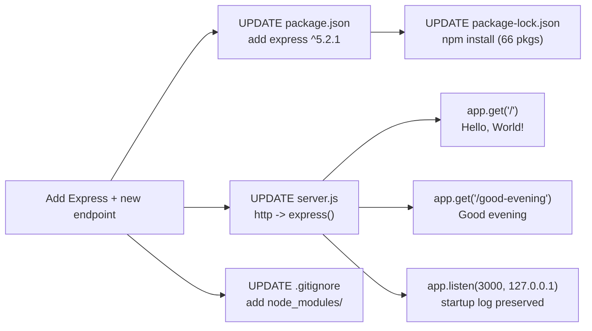

# Technical Specification

# 0. Agent Action Plan

## 0.1 Intent Clarification

This section restates the user's request in precise technical language, surfaces implicit requirements, and translates the intent into a concrete implementation strategy for the existing `hao-backprop-test` repository.

> **User Prompt (verbatim):** *"this is a tutorial of node js server hosting one endpoint that returns the response "Hello world". Could you add expressjs into the project and add another endpoint that return the response of "Good evening"?"*

### 0.1.1 Core Feature Objective

Based on the prompt, the Blitzy platform understands that the new feature requirement is to **introduce the Express.js web framework into the existing single-file Node.js HTTP server and add a second HTTP route that returns the plaintext body `Good evening`, while preserving the existing greeting endpoint's behavior.**

The repository today is a minimal, zero-dependency Node.js project whose canonical entry point, `server.js`, uses the built-in `http` module to respond to **every** request — regardless of method or path — with `200 OK`, `Content-Type: text/plain`, and the body `Hello, World!\n` [server.js:L1-L14]. There is no routing, no third-party framework, and no declared dependency [package.json:L1-L9].

The feature requirements, restated with enhanced clarity:

- **FR-A — Add Express.js as a project dependency.** Declare `express` in `package.json` and lock it (plus its transitive dependencies) in `package-lock.json`. The project currently declares zero dependencies [package.json:L1-L9], so this is the first dependency added.
- **FR-B — Re-platform the HTTP transport onto Express.** Replace the native `http.createServer(...)` construction in `server.js` [server.js:L1,L6-L10] with an Express application instance (`const app = express()`), preserving the existing hostname `127.0.0.1`, port `3000`, and the single startup `console.log` line [server.js:L3-L4,L12-L14].
- **FR-C — Preserve the existing greeting endpoint.** Expose the current greeting at the root route `GET /`. The existing implementation emits the byte-exact body `Hello, World!\n` [server.js:L9]; the user refers to this response as `"Hello world"`.
- **FR-D — Add a new "Good evening" endpoint.** Register a second route that returns the exact plaintext body `Good evening`.

**Implicit requirements and prerequisites detected:**

- Moving from the native `http` module to Express converts the server from **route-agnostic** (every path returns the same response, per F-002-RQ-004) to **explicit routing**. Paths other than the two registered routes will now return Express's default `404 Not Found` — a behavioral refinement validated during design (a request to an unregistered path returned `404`).
- `package-lock.json` (currently lockfile v3 with only the root self-reference [package-lock.json:L1-L13]) must be regenerated to include `express@5.2.1` plus its 65 transitive packages.
- A `node_modules/` directory will be created by `npm install`. The repository's `.gitignore` is currently empty [.gitignore], so `node_modules/` is not yet ignored and should be added to prevent dependencies from being committed.
- The `require('http')` import in `server.js` is replaced by `require('express')` [server.js:L1].

### 0.1.2 Special Instructions and Constraints

- **CRITICAL — User authorizes departure from the zero-dependency posture.** The technical specification documents a "zero-dependency posture must be preserved" constraint, but that constraint is scoped **exclusively** to the separate, *not-yet-implemented* `Response.txt` hardening remediation (features F-101 through F-106), which also forbids modifying `package.json`/`package-lock.json`/`README.md`. The user's explicit instruction to *"add expressjs into the project"* governs this task and deliberately overrides that prior characteristic (feature F-004, "Zero-Dependency Package Manifest"). Adding Express and editing the manifests is therefore **in scope and authorized**.
- **Maintain backward compatibility for the existing greeting.** The user describes the project as a working tutorial and does not request any change to the existing response. The default plan preserves the byte-exact body `Hello, World!\n` at `GET /` [server.js:L9].
- **Preserve runtime invariants.** Hostname `127.0.0.1`, port `3000`, and the startup log `Server running at http://127.0.0.1:3000/` are retained unchanged [server.js:L3-L4,L12-L14].
- **Follow the existing repository convention.** The repository is a flat, single-file server with CommonJS (`require`) syntax and no `src/` hierarchy. The feature is implemented in-place within `server.js` rather than introducing new module directories, consistent with the existing tutorial-scale structure.

**Preserved user examples (verbatim):**

- **User Example (existing response):** `"Hello world"`
- **User Example (new response):** `"Good evening"`

**Documented assumptions flagged for clarification:**

- **New endpoint path:** The user did not specify a URL path for the "Good evening" endpoint. This plan assumes `GET /good-evening` (kebab-case, RESTful). *Confirm if a different path is desired (e.g., `/evening`, `/goodevening`).*
- **Existing greeting wording vs. actual body:** The user's wording `"Hello world"` differs from the byte-exact implementation `Hello, World!\n` [server.js:L9], and the original requirement note `codebase_context (42).md` specified a `/hello` endpoint returning `"Hello world"`. The default plan preserves the current `/` behavior to avoid an unrequested change. *Confirm whether the root response should be normalized to `"Hello world"` and/or whether a `/hello` route should also be exposed.*
- **New endpoint body:** Implemented as the exact string `Good evening` (no trailing newline). *Optionally append `\n` to match the existing greeting's trailing-newline style.*

**Web search requirements:** No external research is strictly mandated by the user. Targeted verification of the current Express major version and Node.js compatibility was performed to ensure correct dependency pinning (see Section 0.2.2).

### 0.1.3 Technical Interpretation

These feature requirements translate to the following technical implementation strategy:

| Requirement | Technical Action |
|-------------|------------------|
| FR-A — Add Express | To add Express, we will **create** a `dependencies` block in `package.json` declaring `"express": "^5.2.1"` and **regenerate** `package-lock.json` via `npm install express`. |
| FR-B — Use Express | To use Express, we will **modify** `server.js`: replace `require('http')` with `require('express')`, instantiate `const app = express()`, and replace `http.createServer(...)` with route registrations. |
| FR-C — Preserve greeting | To preserve the greeting, we will **register** `app.get('/', ...)` returning the existing byte-exact body `Hello, World!\n`. |
| FR-D — New endpoint | To add the new endpoint, we will **register** `app.get('/good-evening', ...)` returning the body `Good evening` with `Content-Type: text/plain`. |
| Listener parity | To preserve runtime behavior, we will **retain** `app.listen(port, hostname, callback)` with the unchanged hostname, port, and startup log. |
| Repository hygiene | To keep the repository clean, we will **modify** the empty `.gitignore` to add `node_modules/`. |

The end-to-end intent-to-action flow:




## 0.2 Repository Scope Discovery

This section enumerates every file in the repository, classifies each against the feature, identifies integration points, and documents the research conducted to validate the approach.

### 0.2.1 Comprehensive File Analysis

The repository is a **flat, single-directory project** — all files reside at the root with no subfolders, no `src/` hierarchy, and no router/model/service/middleware/migration layers. The complete inventory and its classification against this feature:

| File | Role (per spec) | Disposition |
|------|-----------------|-------------|
| `server.js` | Canonical HTTP server entry point (native `http`, route-agnostic) [server.js:L1-L14] | **MODIFY** — core change |
| `package.json` | npm manifest; zero dependencies; `main: index.js` (file absent) [package.json:L1-L9] | **MODIFY** — add `express` dependency |
| `package-lock.json` | Lockfile v3; root self-reference only [package-lock.json:L1-L13] | **MODIFY** — regenerate via `npm install` |
| `.gitignore` | Empty file [.gitignore] | **MODIFY** — add `node_modules/` |
| `README.md` | Two-line project description [README.md:L1-L2] | **OPTIONAL MODIFY** — document endpoints |
| `Test.test..js` | Byte-identical duplicate of `server.js` (double-dot filename fixture, F-005) | **OUT OF SCOPE** — fixture |
| `!@#$%^&().js` | Byte-identical duplicate of `server.js` (special-char filename fixture, F-005) | **OUT OF SCOPE** — fixture |
| `QWYFFG…long_name…server.js` | Byte-identical duplicate of `server.js` (~258-char filename fixture, F-005) | **OUT OF SCOPE** — fixture |
| `phonenumber.csv` | Orphan data fixture, not imported by any code (F-006) | **OUT OF SCOPE** |
| `Response.txt` | Hardening remediation spec (F-101–F-106), not implemented | **OUT OF SCOPE** — separate initiative |
| `codebase_context (42).md` | Original requirement note (`/hello` → `"Hello world"`) | **REFERENCE** — informs routing decisions |
| `20250304165759.mp4`, `s1.png`, `defect_for_task_1.docx`, `tech_spec.pdf` | Non-source binary/document artifacts | **OUT OF SCOPE** |

The three duplicate `.js` files were confirmed byte-identical to `server.js` (each 14 lines). Their documented purpose is exercising tooling resilience against pathological filenames, and the specification states only `server.js` is the authoritative implementation reference. They are therefore left unchanged (see the flagged invariant tension in Section 0.6.2).

**Integration point discovery.** Because the repository has no application layering, the integration surface is intentionally small:

- **API endpoints / request handling:** `server.js` — the sole location of the HTTP listener and request handler [server.js:L6-L14]. This is the only file where routes are registered.
- **Dependency manifests:** `package.json` (dependency declaration) and `package-lock.json` (resolved lockfile).
- **Database models / migrations:** None exist; none required.
- **Service classes / controllers / handlers:** None exist beyond the inline `server.js` handler.
- **Middleware / interceptors / DI containers:** None exist; none required. (No `morgan`, `body-parser`, or custom middleware is needed for two static plaintext routes.)

### 0.2.2 Web Search Research Conducted

Research focused on validating the correct Express version and Node.js compatibility for accurate dependency pinning:

- **Express version / release status:** The current stable Express release is <cite index="9-2">version 5.2.1, last published roughly six months ago</cite>, and <cite index="6-1">Express.js published version 5.0 on October 15, 2024</cite>. This confirms pinning `express` at `^5.2.1`.
- **Node.js compatibility:** <cite index="6-7,6-20">Express.js 5.0 requires Node.js 18 or higher, so anyone still on older versions will need to upgrade</cite>, and <cite index="6-29">Node.js 22 support has been added to the CI testing matrix</cite>. The local runtime is Node v22.22.2, which is fully compatible.
- **Routing semantics (best practices for this feature type):** Express 5 changed path matching — <cite index="2-25,2-26">the release includes simplified patterns for common route patterns, and with the removal of regular expression semantics come other small but impactful changes to how you write routes</cite>, including <cite index="2-30,2-31">new reserved characters `(`, `)`, `[`, `]`, `?`, `+`, `&`, `!` reserved to leave room for future improvements and to prevent migration mistakes</cite>. The planned routes (`/` and `/good-evening`) are simple literal paths containing none of these reserved characters, so they are unaffected.
- **Installation method:** <cite index="6-8">To use Express.js 5.0, run `npm install express`</cite>, which writes the dependency to `package.json` and regenerates `package-lock.json`.

This research confirms the dependency choice; it does not alter the file scope.

### 0.2.3 New File Requirements

No new **hand-authored** source files, test files, or configuration files are required. The two-endpoint feature fits entirely within the existing single-file convention (`server.js`), consistent with the repository's flat, tutorial-scale structure.

- **New source files:** None. (The feature is implemented in-place in `server.js`. A separate `routes/` module is unnecessary at this scale and would diverge from the existing single-file pattern.)
- **New test files:** None required by the prompt. (The `test` script in `package.json` remains a placeholder; adding a test suite is out of scope unless requested.)
- **New configuration files:** None. (Hostname and port remain hardcoded literals as today [server.js:L3-L4]; no `.env` or config module is introduced.)
- **Generated (non-authored) artifacts:** `node_modules/**` is created by `npm install express`. These files are not authored by hand and should be excluded from version control via the `.gitignore` update.


## 0.3 Dependency Inventory

This feature introduces the project's **first** third-party dependency. The project currently declares zero dependencies [package.json:L1-L9] and its lockfile contains only the root self-reference [package-lock.json:L1-L13].

### 0.3.1 Public Package Additions

| Package | Registry | Version | Purpose |
|---------|----------|---------|---------|
| `express` | npm | `^5.2.1` | HTTP web framework providing the application factory (`express()`), HTTP-method routing (`app.get`), and response helpers. The single **direct** dependency added to `package.json`. |

**Transitive footprint (managed automatically in `package-lock.json`, not declared in `package.json`).** Installing `express@5.2.1` resolves to **66 packages total** (Express plus 65 transitive dependencies). Express 5.2.1 declares 28 direct dependencies, including:

| Transitive Package | Resolved Range | Role |
|--------------------|----------------|------|
| `router` | `^2.2.0` | Core routing engine backing `app.get` |
| `body-parser` | `^2.2.1` | Request body parsing (bundled; unused by these routes) |
| `finalhandler` | `^2.1.0` | Default response/404 handler |
| `send` / `serve-static` | `^1.1.0` / `^2.2.0` | Static file response helpers |
| `accepts` / `type-is` / `mime-types` | `^2.0.0` / `^2.0.1` / `^3.0.0` | Content negotiation and MIME resolution |
| `qs` | `^6.14.0` | Query-string parsing |
| `http-errors` / `statuses` | `^2.0.0` / `^2.0.1` | HTTP error construction and status text |
| `cookie` / `cookie-signature` | `^0.7.1` / `^1.2.1` | Cookie parsing/signing primitives |
| `debug` | `^4.4.0` | Internal diagnostic logging |

All versions above are the ranges declared by `express@5.2.1`; the exact resolved versions are pinned by npm when `package-lock.json` is regenerated. No version is a placeholder — `^5.2.1` is the verified current stable release (Section 0.2.2).

- **Updates to existing dependencies:** None — the project had none.
- **Removals:** None.
- **Net effect:** The project moves from **0 → 1** declared dependency, and `node_modules/` grows to 66 packages. This is the user-authorized departure from the previously-documented zero-dependency posture (feature F-004).

### 0.3.2 Import / Require Updates

The only source file that imports a module relevant to this change is `server.js`. No other file imports `http`, and no file `require()`s `server.js`, so there are **no ripple import updates** elsewhere.

| File | Old | New |
|------|-----|-----|
| `server.js` [server.js:L1] | `const http = require('http');` | `const express = require('express');` |

### 0.3.3 External Reference Updates

- **Build / manifest files:** `package.json` gains a `dependencies` block; `package-lock.json` is regenerated. These are detailed in Sections 0.4 and 0.5.
- **Ignore files:** `.gitignore` gains a `node_modules/` entry (currently empty [.gitignore]).
- **Configuration files (`**/*.config.*`, `**/*.json`):** No application config files exist or are introduced; the only JSON files touched are the two npm manifests.
- **Documentation (`**/*.md`):** `README.md` may optionally be updated to describe the new endpoints (see Section 0.5); no other Markdown files require changes.
- **CI/CD (`.github/workflows/*.yml`, etc.):** None exist; none introduced.


## 0.4 Integration Analysis

This section maps the exact points where the feature integrates with existing code and configuration.

### 0.4.1 Existing Code Touchpoints

**Direct modifications required:**

- **`server.js` — replace transport and add routing.** This is the single application touchpoint.
  - Line 1 [server.js:L1]: swap the `http` import for `express`.
  - Lines 6–10 [server.js:L6-L10]: replace `http.createServer((req, res) => { … })` with `const app = express();` followed by two route registrations — `app.get('/', …)` (preserving `Hello, World!\n`) and `app.get('/good-evening', …)` (returning `Good evening`).
  - Lines 12–14 [server.js:L12-L14]: change `server.listen(port, hostname, …)` to `app.listen(port, hostname, …)`; the `port` (`3000`), `hostname` (`127.0.0.1`), and startup `console.log` are preserved verbatim [server.js:L3-L4,L13].

- **`package.json` — register the dependency.** Add a `dependencies` object containing `"express": "^5.2.1"` [package.json:L1-L9]. No other field changes are required (the pre-existing `main: index.js` inconsistency and placeholder `test` script are out of scope).

- **`package-lock.json` — lock the resolved tree.** Regenerated by `npm install`; `lockfileVersion` remains `3` and the `packages` map expands from the single root entry [package-lock.json:L6-L11] to include `express` and its 65 transitive dependencies.

- **`.gitignore` — exclude installed modules.** Append `node_modules/` to the currently empty file [.gitignore].

**Dependency injections / service registration:** Not applicable. The repository has no DI container, service registry, or `container.py`-style wiring — Express is instantiated directly in `server.js` (`const app = express()`).

**Database / schema updates:** Not applicable. No database, ORM, driver, migration directory, or schema file exists anywhere in the repository, and none is required for two static plaintext routes.

**Module exports / index registration:** Not applicable. `server.js` exports nothing and is executed directly via `node server.js`; there is no `index.js` (despite `package.json#main` referencing it [package.json:L1-L9]) and no module-export surface to update.

### 0.4.2 Behavioral Integration Notes

Replacing the native `http` listener with Express introduces two observable, validated behavioral changes that downstream agents must account for:

- **Explicit routing replaces route-agnostic behavior.** Today every path returns `Hello, World!\n` (F-002-RQ-004). After the change, only `/` and `/good-evening` return content; all other paths return Express's default `404 Not Found` (validated: an unregistered path returned `404`). This aligns with the user's mental model of discrete "endpoints."
- **Express adds a default `X-Powered-By: Express` response header** (observed during validation) that the native implementation did not emit. If exact header parity with the original is required, this can be suppressed with `app.disable('x-powered-by')`. The preserved `Content-Type: text/plain` and `200` status for `/` were confirmed intact.


## 0.5 Technical Implementation

This section provides the authoritative, file-by-file execution plan. Every file listed under "MODIFY" must be changed; no file is listed speculatively.

### 0.5.1 File-by-File Execution Plan

**Group 1 — Core feature file:**

- **MODIFY `server.js`** — Replace the native `http` server with an Express application exposing two routes (`/` and `/good-evening`) while preserving host, port, and startup logging [server.js:L1-L14].

**Group 2 — Dependency manifests:**

- **MODIFY `package.json`** — Add `"dependencies": { "express": "^5.2.1" }` [package.json:L1-L9].
- **MODIFY `package-lock.json`** — Regenerate via `npm install express` to lock the 66-package tree [package-lock.json:L1-L13].

**Group 3 — Repository hygiene and documentation:**

- **MODIFY `.gitignore`** — Add `node_modules/` [.gitignore].
- **MODIFY `README.md` (optional)** — Document the Express dependency and the two endpoints [README.md:L1-L2].
- **REFERENCE `codebase_context (42).md`** — Consulted (not modified) for the original `/hello` → `"Hello world"` intent.

There are **no CREATE** (hand-authored) and **no DELETE** operations. The only generated artifact is `node_modules/**` (produced by `npm install`).

### 0.5.2 Implementation Approach per File

- **`server.js`** — Establish the feature foundation. Import Express, instantiate the app, register the two GET routes, and start the listener with the existing host/port/log. To guarantee the existing response contract is preserved byte-for-byte, the root handler retains the `statusCode` / `setHeader` / `end` pattern (Express's response object supports these natively):

```javascript
const express = require('express');
const app = express();
app.get('/', (req, res) => { res.statusCode = 200; res.setHeader('Content-Type', 'text/plain'); res.end('Hello, World!\n'); });
app.get('/good-evening', (req, res) => { res.statusCode = 200; res.setHeader('Content-Type', 'text/plain'); res.end('Good evening'); });
```

  The `hostname`/`port` constants and `app.listen(port, hostname, () => console.log(...))` are carried over unchanged from [server.js:L3-L4,L12-L14]. (An idiomatic alternative, `res.type('text/plain').send(...)`, is acceptable but requires explicitly setting the content type because `res.send` of a string otherwise defaults to `text/html`.)

- **`package.json`** — Integrate with npm dependency resolution by adding the `dependencies` block. This is the declarative record that Express is now required at runtime.

- **`package-lock.json`** — Ensure reproducible installs by regenerating the lockfile so the full resolved tree (exact versions of Express and its 65 transitive packages) is pinned.

- **`.gitignore`** — Ensure repository hygiene so the newly created `node_modules/` directory is not committed.

- **`README.md` (optional)** — Document usage: note the `express` dependency and that the server now serves `GET /` (`Hello, World!`) and `GET /good-evening` (`Good evening`).

No file in this plan references a user-provided Figma URL, because none were provided.

### 0.5.3 User Interface and Design System Compliance

**Not applicable.** This feature is a headless backend HTTP server that returns `text/plain` responses; it has no graphical user interface, no front-end components, and no rendered views. The user's prompt specifies no component library or design system, and the repository contains no UI layer, theme files, or design tokens. Consequently, the **Design System Alignment Protocol does not apply**, no component/token mapping is produced, and no Figma assets are in scope.


## 0.6 Scope Boundaries

### 0.6.1 Exhaustively In Scope

The following files constitute the complete, exhaustive set of in-scope changes. Because the repository is flat, most changes are specific named files; only generated dependencies warrant a wildcard.

- **Core source:**
  - `server.js` — Express refactor + two route registrations [server.js:L1-L14].
- **Dependency manifests:**
  - `package.json` — `dependencies` block adding `express` [package.json:L1-L9].
  - `package-lock.json` — regenerated lockfile [package-lock.json:L1-L13].
- **Generated dependencies:**
  - `node_modules/**` — created by `npm install express` (66 packages); not committed.
- **Repository hygiene:**
  - `.gitignore` — add `node_modules/` [.gitignore].
- **Documentation (optional):**
  - `README.md` — feature/endpoint documentation [README.md:L1-L2].

### 0.6.2 Explicitly Out of Scope

- **Filename-edge-case fixtures** — `Test.test..js`, `!@#$%^&().js`, and the ~258-character `QWYFFG…server.js`. These are byte-identical duplicates of `server.js` maintained as filesystem/tooling fixtures (feature F-005), not active servers. They are left unchanged.
  - **Flagged invariant tension:** Feature F-005-RQ-001 documents that each duplicate "shall be byte-identical to `server.js`." Modifying `server.js` will break that byte-identical equality. The default decision is to **leave the fixtures unchanged**, since their value lies in their pathological filenames rather than behavioral parity. *If the byte-identical invariant must be preserved, the same Express edits would need to be applied to all three duplicates — confirm if required.*
- **Orphan and document artifacts** — `phonenumber.csv` (unused data fixture, F-006), `20250304165759.mp4`, `s1.png`, `defect_for_task_1.docx`, `tech_spec.pdf`. None are referenced by executable code.
- **The `Response.txt` hardening remediation** — Error-event handlers, `clientError` handling, graceful shutdown (`SIGTERM`/`SIGINT`), request-handler `try/catch`, `req`/`res` validation, and resource cleanup (features F-101–F-106). This is a separate, not-yet-implemented initiative and is not requested by the user.
- **Pre-existing manifest inconsistencies** — Correcting `package.json#main` (which points to a non-existent `index.js`) or replacing the placeholder `test` script. Not requested and not required by the feature.
- **Behavioral changes beyond the feature** — Changing the existing `/` response body, hostname, or port; adding authentication, TLS, configuration files, environment-variable support, logging libraries, or persistence. None exist today and none are requested.
- **Testing, linting, CI/CD, and containerization** — No test suite, linter config, CI pipeline, or `Dockerfile` is added.
- **Refactoring** — No restructuring into `src/`, `routes/`, or `controllers/` directories beyond the in-place Express integration.


## 0.7 Rules for Feature Addition

No formal implementation rules were supplied through the project's rules configuration (the rules set is empty). The following requirements are therefore derived directly from the user's prompt and the verified state of the repository, and must be honored during implementation:

- **Add Express as the framework.** Express.js must be added "into the project" — declared in `package.json`, locked in `package-lock.json`, and actually used to serve requests in `server.js` (not merely installed).
- **Preserve the existing greeting endpoint.** The existing greeting must remain reachable. The default plan keeps it at `GET /` returning the byte-exact body `Hello, World!\n` [server.js:L9]; the user refers to this response as `"Hello world"`.
- **Add the new endpoint with the exact response.** A new endpoint must return the response `Good evening` exactly as written by the user.
- **Maintain backward compatibility / runtime invariants.** Hostname `127.0.0.1`, port `3000`, the `text/plain` content type, and the startup log line must remain unchanged [server.js:L3-L4,L8,L12-L14].
- **Follow the existing repository convention.** Use CommonJS (`require`) syntax and keep the implementation in the single canonical `server.js` file, consistent with the repository's flat, tutorial-scale structure — do not introduce a module hierarchy unless requested.
- **Honor the precedence of the explicit instruction over the documented zero-dependency posture.** The user's request to add Express supersedes the prior "preserve zero dependencies" characteristic (which applied only to the separate, unimplemented `Response.txt` hardening). Adding the dependency is the intended, authorized outcome.
- **Keep the change minimal and scoped.** Do not bundle unrelated hardening, refactoring, testing, or metadata corrections into this feature (see Section 0.6.2).

**Performance / scalability and security considerations:** None are specified by the user. The feature adds two synchronous static-string routes with negligible overhead, and the server remains bound to the loopback interface (`127.0.0.1`), preserving the existing local-only exposure boundary [server.js:L3]. No new attack surface (auth, input parsing, persistence) is introduced by the two literal routes.


## 0.8 Attachments

**No attachments were provided with this request.** The `review_attachments` check returned no project attachments — there are no PDFs, images, or other uploaded files associated with this task.

**No Figma designs were provided.** No Figma frames, screens, or URLs accompany this request; consequently there are no design frames to map and the Design System Alignment Protocol does not apply (see Section 0.5.3).

All technical context for this plan was derived from the user's prompt and from direct inspection of the repository's source artifacts — principally `server.js`, `package.json`, `package-lock.json`, `.gitignore`, `README.md`, and the requirement note `codebase_context (42).md`.


