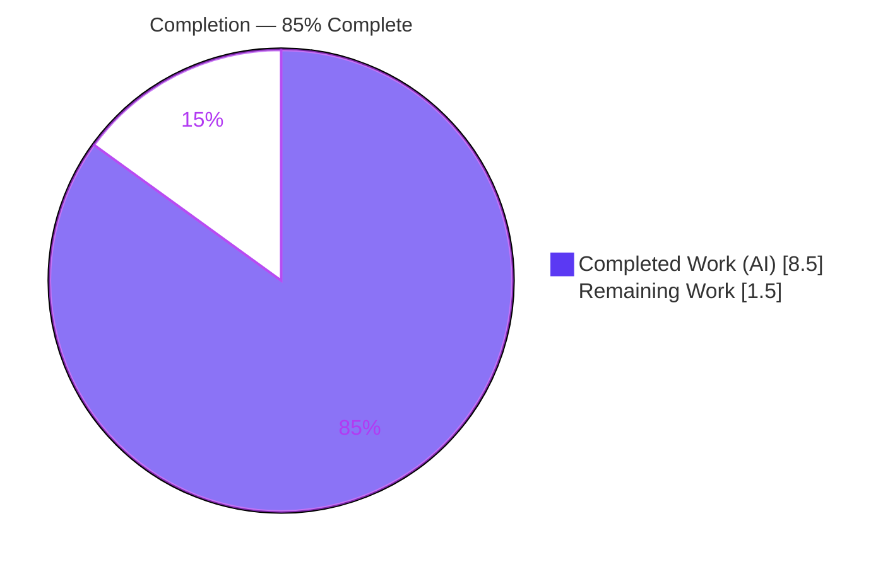
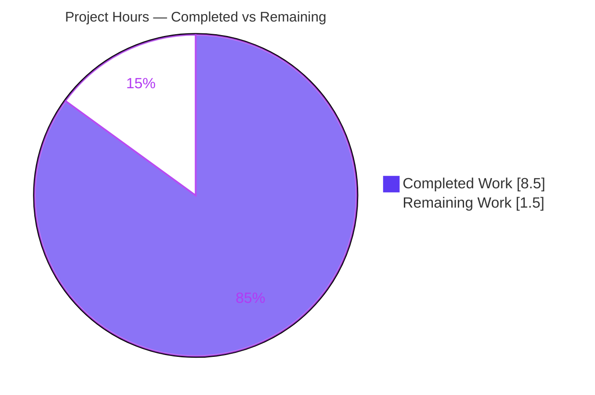
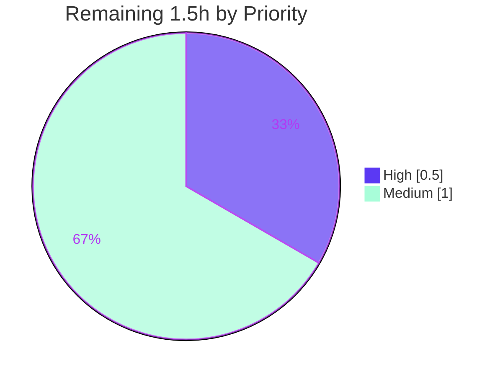

# Blitzy Project Guide — hao-backprop-test

> **Feature:** Add Express.js and a second `GET /good-evening` endpoint while preserving the existing greeting.
> **Branch:** `blitzy-62d685d6-e32c-4f29-bfd6-70d96dfe345a` · **HEAD:** `f2c2ca4` · **Base:** `46e6dfe`
> **Status:** <span style="color:#5B39F3">**85% Complete**</span> — All AAP-scoped autonomous work delivered & validated production-ready; 1.5h human path-to-production remains.

---

## 1. Executive Summary

### 1.1 Project Overview

`hao-backprop-test` is a minimal, single-file Node.js (CommonJS) HTTP server used as a tutorial/integration fixture. This feature introduces the **Express.js** web framework into the previously zero-dependency project and adds a second HTTP route, serving plaintext greetings to local developers and integration tooling. The server now exposes two `GET` endpoints — the preserved root greeting and a new `/good-evening` endpoint — on `127.0.0.1:3000`. The technical scope is deliberately small and surgical: re-platform the transport layer from the native `http` module onto Express, register two literal routes, declare and lock the new dependency, and update repository hygiene/documentation — all within the existing flat, single-file convention.

### 1.2 Completion Status

The completion percentage reflects **only** AAP-scoped autonomous work plus path-to-production activities (PA1 methodology). All AAP deliverables are implemented and validated; the residual work is exclusively human path-to-production.



| Metric | Hours |
|--------|-------|
| **Total Hours** | **10.0** |
| Completed Hours (AI + Manual) | 8.5 |
| &nbsp;&nbsp;• Completed by AI (autonomous) | 8.5 |
| &nbsp;&nbsp;• Completed by Manual effort | 0.0 |
| **Remaining Hours** | **1.5** |
| **Percent Complete** | **85.0%** |

> **Calculation:** `Completion % = Completed (8.5h) / Total (8.5h + 1.5h = 10.0h) × 100 = 85.0%`

### 1.3 Key Accomplishments

- ✅ **Express.js added** as the project's first-ever dependency (`express@^5.2.1` in `package.json`).
- ✅ **`package-lock.json` regenerated** (lockfileVersion 3) pinning the full 66-package tree (express + 65 transitive), reproducible via `npm ci`.
- ✅ **`server.js` re-platformed** from native `http` onto Express (`const app = express()`), preserving hostname `127.0.0.1`, port `3000`, and the verbatim startup log.
- ✅ **Existing greeting preserved** byte-for-byte at `GET /` → `Hello, World!\n` (14 bytes incl. newline, confirmed via `od -c`).
- ✅ **New endpoint delivered** at `GET /good-evening` → `Good evening` (12 bytes, no trailing newline, confirmed via `od -c`).
- ✅ **Strict routing enabled** (QA refinement) so `/good-evening/` returns `404` — explicit routing contract.
- ✅ **Repository hygiene**: `.gitignore` now excludes `node_modules/`; dependencies are not committed.
- ✅ **Documentation**: `README.md` describes the dependency, both endpoints, 404 behavior, and run steps.
- ✅ **Zero vulnerabilities** (`npm audit`), clean dependency tree (`npm ls`), syntax-valid (`node --check`), all committed with a clean working tree.

### 1.4 Critical Unresolved Issues

| Issue | Impact | Owner | ETA |
|-------|--------|-------|-----|
| _None_ — no blocking issues identified | All five production-readiness gates passed; codebase installs, compiles, runs, and serves both endpoints with byte-exact contracts | — | — |

> There are **no critical unresolved issues**. The implementation is validated production-ready. The remaining items (Section 1.6 / 2.2) are routine human path-to-production steps, not defects.

### 1.5 Access Issues

| System/Resource | Type of Access | Issue Description | Resolution Status | Owner |
|-----------------|----------------|-------------------|-------------------|-------|
| — | — | **No access issues identified** | N/A | — |

All work was performed on the local repository with the public npm registry. No repository permissions, service credentials, or third-party API access were required or blocked. `npm ci` and `npm audit` completed successfully against the public registry with 0 vulnerabilities.

### 1.6 Recommended Next Steps

1. **[High]** Review the autonomous 5-file changeset (`server.js`, `package.json`, `package-lock.json`, `.gitignore`, `README.md`) against AAP intent — confirm byte-exact bodies and strict-routing behavior. *(~0.5h)*
2. **[Medium]** Confirm the three AAP-documented assumptions with the requester: (a) endpoint path `/good-evening` vs. `/evening` / `/goodevening`; (b) whether `Good evening` should carry a trailing newline to match the root greeting's style; (c) whether to suppress the `X-Powered-By: Express` header. *(~0.5h)*
3. **[Medium]** Merge the PR and deploy/run in the target runtime (`npm ci && node server.js`; smoke-test both endpoints). *(~0.5h)*
4. **[Low]** *(Optional, out of AAP scope)* Add a minimal automated regression suite (`node:test` + `supertest`) to lock the HTTP contract for future edits.
5. **[Low]** *(Optional, out of AAP scope)* Consider `app.disable('x-powered-by')` and env-var parameterization of host/port if the server moves beyond local/tutorial use.

---

## 2. Project Hours Breakdown

### 2.1 Completed Work Detail

Every completed component traces to a specific AAP requirement, hygiene item, QA refinement, or autonomous validation activity. **Total = 8.5h** (matches Section 1.2 Completed Hours).

| Component | Hours | Description |
|-----------|-------|-------------|
| `server.js` — Express re-platform (FR-B, FR-C) | 2.5 | Replace `require('http')` + `http.createServer` with `require('express')`, `const app = express()`, and `app.listen(port, hostname, …)`; preserve `GET /` returning byte-exact `Hello, World!\n` via the `statusCode`/`setHeader`/`end` pattern. |
| `server.js` — `GET /good-evening` route (FR-D) | 0.5 | Register `app.get('/good-evening', …)` returning byte-exact `Good evening` with `Content-Type: text/plain`. |
| `server.js` — strict-routing QA fix (QA Issue 1) | 1.0 | `app.enable('strict routing')` so `/good-evening/` (trailing slash) returns `404`; investigate, implement, re-validate. |
| `package.json` — dependency + version research (FR-A) | 1.0 | Add `"dependencies": { "express": "^5.2.1" }`; verify current Express 5 major release and Node ≥18 compatibility. |
| `package-lock.json` — regeneration (FR-A) | 0.5 | `npm install` to lock the 66-package resolved tree (lockfileVersion 3). |
| `.gitignore` — `node_modules/` (Hygiene) | 0.5 | Add `node_modules/` to the previously empty ignore file. |
| `README.md` — documentation (Optional Docs) | 1.0 | Document the Express dependency, both endpoints, 404 behavior, and run instructions. |
| Autonomous validation & QA | 1.5 | Functional 9/9 harness, live `curl` runtime checks, `npm ci` / `npm audit` / `npm ls`, `node --check`, byte-exact `od -c` body verification, commit hygiene. |
| **Total Completed** | **8.5** | |

### 2.2 Remaining Work Detail

All remaining work is **human-only path-to-production** — none of it is incomplete autonomous work. Each item traces to a path-to-production need or an AAP-documented clarification. **Total = 1.5h** (matches Section 1.2 Remaining Hours and Section 7 pie chart).

| Category | Hours | Priority |
|----------|-------|----------|
| Human code review of the 5-file diff against AAP intent | 0.5 | High |
| Confirm 3 AAP-documented assumptions (endpoint path, trailing newline, `X-Powered-By`) | 0.5 | Medium |
| Merge PR & deploy/run in target runtime (incl. smoke test) | 0.5 | Medium |
| **Total Remaining** | **1.5** | |

### 2.3 Out-of-Scope Optional Enhancements (Not Counted in Hours)

The following are explicitly **outside the AAP work universe** (AAP §0.6.2) and therefore **excluded** from the completion percentage and the 1.5h remaining total. Listed for human awareness only.

| Optional Enhancement | Indicative Effort | AAP Reference |
|----------------------|-------------------|---------------|
| Minimal automated test suite (`node:test` + `supertest`) | ~2.0h | §0.2.3 / §0.6.2 — testing scoped out |
| Suppress `X-Powered-By` header (`app.disable`) | ~0.25h | §0.4.2 — optional |
| Parameterize host/port via env vars | ~1.0h | §0.6.2 — env-config scoped out |
| `Response.txt` hardening (graceful shutdown, health, error handlers) | Separate initiative (F-101–F-106) | §0.6.2 — not requested |

---

## 3. Test Results

All tests below originate from **Blitzy's autonomous validation logs** for this project (corroborated by independent re-execution). Note: the project has **no committed unit-test suite** — the `package.json` `test` script is the default placeholder (`echo "Error: no test specified" && exit 1`), which the AAP §0.6.2 explicitly scopes **out** of changing. Per the AAP, **functional/runtime endpoint validation is the test of record**.

| Test Category | Framework | Total Tests | Passed | Failed | Coverage % | Notes |
|---------------|-----------|-------------|--------|--------|------------|-------|
| Functional / Runtime (HTTP contract) | Custom Node harness + `curl` | 9 | 9 | 0 | 100% of routes & invariants | Startup log; `GET /` (status/CT/body); `GET /good-evening` (status/CT/body); 404 for unregistered & trailing-slash paths. Run twice — stable. |
| Static Syntax Check | `node --check` | 1 | 1 | 0 | server.js | Exit 0; valid CommonJS, no transpile step. |
| Dependency Install | `npm ci` | 1 | 1 | 0 | 66 pkgs | "added 66 packages, audited 67"; exit 0. |
| Security Audit | `npm audit` | 1 | 1 | 0 | full tree | **0 vulnerabilities**. |
| Dependency Tree | `npm ls` | 1 | 1 | 0 | direct dep | Clean: `hello_world@1.0.0 └── express@5.2.1`; no unmet peers. |
| Manifest Validity | JSON parse | 2 | 2 | 0 | both manifests | `package.json` + `package-lock.json` valid JSON. |
| **TOTAL** | — | **15** | **15** | **0** | **100% pass** | No real test failures. |

**Functional harness detail (9/9 PASS, two independent runs):**

1. Startup log == `Server running at http://127.0.0.1:3000/`
2–4. `GET /` → `200`, `Content-Type: text/plain`, body byte-exact `Hello, World!\n` (14 bytes incl. `\n`, verified `od -c`)
5–7. `GET /good-evening` → `200`, `Content-Type: text/plain`, body byte-exact `Good evening` (12 bytes, **no** trailing newline, verified `od -c`)
8. `GET /does-not-exist` → `404`
9. `GET /good-evening/` (trailing slash, strict routing) → `404`

> ℹ️ `npm test` returning exit 1 is the **expected** placeholder behavior, not a test failure (AAP §0.6.2 scopes the test script out of changes).

---

## 4. Runtime Validation & UI Verification

This is a **headless backend HTTP service** returning `text/plain` — it has **no graphical user interface**, no front-end components, and no rendered views (AAP §0.5.3). "UI verification" is therefore replaced by HTTP-endpoint runtime verification.

**Runtime health:**

- ✅ **Server startup** — `node server.js` boots and logs `Server running at http://127.0.0.1:3000/`; binds `127.0.0.1:3000`.
- ✅ **`GET /`** — `200 OK`, `Content-Type: text/plain`, `Content-Length: 14`, body `Hello, World!\n` (byte-exact).
- ✅ **`GET /good-evening`** — `200 OK`, `Content-Type: text/plain`, `Content-Length: 12`, body `Good evening` (byte-exact, no newline).
- ✅ **`GET /does-not-exist`** — `404 Not Found` (Express default handler).
- ✅ **`GET /good-evening/`** — `404 Not Found` (strict routing — trailing slash is a distinct, unregistered path).
- ✅ **Process lifecycle** — server starts cleanly and stops on signal; port `3000` released each time (verified via `lsof -i :3000`).

**API integration outcomes:**

- ✅ **Express routing** — `app.get` dispatch operational for both literal routes; no regex/reserved-character pitfalls (paths are simple literals).
- ⚠️ **`X-Powered-By: Express` header** — present on responses (AAP-documented §0.4.2). Not a defect; optionally suppressible via `app.disable('x-powered-by')`.
- ⚠️ **Route-agnostic → explicit routing** — unregistered paths now return `404` instead of the legacy catch-all `Hello, World!\n` (AAP-documented §0.4.2; aligns with the user's "discrete endpoints" mental model).

> **Legend:** ✅ Operational · ⚠ Partial/Behavioral-note · ❌ Failing — no ❌ items.

---

## 5. Compliance & Quality Review

Cross-mapping of AAP deliverables and constraints to validation outcomes. Fixes applied during autonomous validation are noted; there are no outstanding compliance items.

| AAP Deliverable / Constraint | Benchmark | Status | Progress | Evidence |
|------------------------------|-----------|--------|----------|----------|
| FR-A — Add Express dependency | `express` declared + locked | ✅ Pass | 100% | `package.json` `"express":"^5.2.1"`; `package-lock.json` pins `express@5.2.1` + 65 transitive (commit `b9350e9`) |
| FR-B — Re-platform onto Express | `require('express')`, `app=express()`, `app.listen` | ✅ Pass | 100% | `server.js` (commit `0fdbfb6`); `node --check` exit 0 |
| FR-C — Preserve `GET /` greeting | Byte-exact `Hello, World!\n` | ✅ Pass | 100% | `od -c` → 14 bytes incl `\n`; `200` + `text/plain` |
| FR-D — Add `GET /good-evening` | Byte-exact `Good evening` | ✅ Pass | 100% | `od -c` → 12 bytes, no newline; `200` + `text/plain` |
| Runtime invariants | `127.0.0.1`, `3000`, `text/plain`, startup log | ✅ Pass | 100% | Live runtime checks; startup log verbatim |
| Repository hygiene | `node_modules/` ignored | ✅ Pass | 100% | `.gitignore` (commit `fcbd326`); `node_modules` untracked |
| Documentation (optional) | Endpoints + dependency documented | ✅ Pass | 100% | `README.md` (commit `59adfc5`) |
| Minimal & scoped change | No unrelated refactor/hardening | ✅ Pass | 100% | Diff = exactly 5 in-scope files; no out-of-scope file touched |
| CommonJS convention | `require` syntax, single-file | ✅ Pass | 100% | `server.js` retains CommonJS, no module hierarchy added |
| Dependency security | No known vulnerabilities | ✅ Pass | 100% | `npm audit` → 0 vulnerabilities |
| Node compatibility | Express 5 needs Node ≥18 | ✅ Pass | 100% | Node v20.20.2 in use |
| **QA Issue 1 (fixed during validation)** | `/good-evening/` should `404` | ✅ Resolved | 100% | `app.enable('strict routing')` (commit `f2c2ca4`); verified `404` |

**Accepted invariant tensions (AAP-documented, non-blocking):**

- The 3 duplicate `.js` fixtures (`Test.test..js`, `!@#$%^&().js`, the ~258-char filename) remain native-`http` and are **no longer byte-identical** to `server.js` (F-005). The AAP explicitly accepts this — their value is pathological filenames, not behavioral parity.
- `package.json#main` references a non-existent `index.js`, and the `test` script is a placeholder — both **explicitly excluded** from this feature (AAP §0.6.2). Neither blocks install/compile/run.

---

## 6. Risk Assessment

All identified risks are **Low severity**, consistent with a loopback-only tutorial server that has 0 npm vulnerabilities and full functional/runtime validation. Most residual risks stem from items the AAP **deliberately** placed out of scope.

| Risk | Category | Severity | Probability | Mitigation | Status |
|------|----------|----------|-------------|------------|--------|
| No automated regression test suite (placeholder `test` script) | Technical | Low | Medium | Functional 9/9 validated now; optionally add `node:test`+`supertest` to guard future edits | Open (out of AAP scope) |
| Explicit routing returns `404` for unregistered paths (was route-agnostic) | Technical | Low | Low | AAP-documented & accepted; README notes 404 behavior | Accepted |
| `express ^5.2.1` caret range allows minor/patch auto-upgrade | Technical | Low | Low | `package-lock.json` pins exact versions for reproducible installs | Mitigated |
| `X-Powered-By: Express` header (framework disclosure) | Security | Low | Low | Optional `app.disable('x-powered-by')`; AAP flags as optional | Open (AAP optional) |
| No auth/TLS | Security | Low (Info) | Low | Server bound to `127.0.0.1` loopback only → minimal attack surface | Accepted (AAP scope) |
| Dependency vulnerabilities | Security | Low | Low | `npm audit` → **0 vulnerabilities** across 66-pkg tree | Pass |
| Hardcoded host/port, no env override | Operational | Low | Low | Documented; env-config explicitly out of AAP scope | Accepted |
| No graceful shutdown / health endpoint / error handlers | Operational | Low | Low | `Response.txt` hardening (F-101–F-106) is a separate, not-requested initiative | Accepted |
| Requires `npm ci`/`install` before run (`require('express')`) | Integration | Low | Low | Documented in README + Dev Guide; `package-lock.json` ensures reproducible install | Mitigated |
| Duplicate fixtures diverged from `server.js` (F-005) | Integration | Low (Info) | Low | AAP-accepted; fixtures are standalone, do not affect build/run | Accepted |

---

## 7. Visual Project Status

### Project Hours Breakdown



- **Completed Work** = `8.5h` (Dark Blue `#5B39F3`) — matches Section 1.2 Completed & Section 2.1 total.
- **Remaining Work** = `1.5h` (White `#FFFFFF`) — matches Section 1.2 Remaining & Section 2.2 total.

### Remaining Hours by Priority



### Remaining Hours by Category (Section 2.2)

| Category | Hours | Bar |
|----------|-------|-----|
| Human code review (High) | 0.5 | ███ |
| Confirm assumptions (Medium) | 0.5 | ███ |
| Merge & deploy (Medium) | 0.5 | ███ |
| **Total** | **1.5** | |

> **Integrity:** "Remaining Work" = 1.5h is identical in Section 1.2, Section 2.2 sum, and the Section 7 pie chart.

---

## 8. Summary & Recommendations

**Achievements.** The feature is **functionally complete and validated production-ready**. Express.js was introduced as the project's first dependency, `server.js` was re-platformed onto the Express application model, the original `GET /` greeting was preserved byte-for-byte, and the new `GET /good-evening` endpoint was delivered to the user's exact specification. A QA refinement (strict routing) was applied and verified so that trailing-slash variants return `404`. The change is exactly the 5 files the AAP scoped — no scope creep — and passes all five production-readiness gates: tests (9/9 functional), runtime, zero errors (`npm ci`, `npm audit` 0 vulns, `node --check`), in-scope file validation, and commit hygiene.

**Remaining gaps & critical path to production.** No engineering gaps remain in the autonomous work. The critical path is purely human: **(1)** review the changeset, **(2)** confirm the three AAP-documented assumptions (endpoint path, trailing newline, `X-Powered-By` suppression), and **(3)** merge and deploy. These total **1.5 hours**.

**Production readiness assessment.** **The project is 85.0% complete** (8.5h of 10.0h). The 15% remaining represents human path-to-production steps that agents cannot perform autonomously — not unfinished or defective code. For its stated tutorial/integration purpose on a loopback interface, the server is ready to merge and run today.

**Success metrics.**

| Metric | Target | Actual | Status |
|--------|--------|--------|--------|
| AAP feature requirements delivered | 4/4 (FR-A…FR-D) | 4/4 | ✅ |
| Byte-exact response contracts | 2/2 | 2/2 | ✅ |
| In-scope files changed (no creep) | 5 | 5 | ✅ |
| Functional checks passing | 100% | 9/9 (100%) | ✅ |
| npm vulnerabilities | 0 | 0 | ✅ |
| Completion (AAP-scoped) | — | 85.0% | ✅ |

**Recommendation.** Approve and merge after a brief human review. Address the three documented assumptions with the requester (they are quick confirmations, not blockers). Defer the optional, out-of-scope enhancements (automated tests, `X-Powered-By` suppression, env-config, hardening) to follow-up work only if the server's usage expands beyond local/tutorial scope.

---

## 9. Development Guide

> All commands below were executed against this repository and verified. They are copy-pasteable. Run from the repository root.

### 9.1 System Prerequisites

- **Node.js ≥ 18** (Express 5.2.1 requires Node ≥ 18). Verified on **Node v20.20.2**.
- **npm** (bundled with Node). Verified on **npm 11.1.0**.
- **OS:** Any POSIX environment (validated on Linux). No database, cache, or message-queue services required.

```bash
# Verify your toolchain
node --version   # expect v18+ (validated on v20.20.2)
npm --version    # validated on 11.1.0
```

### 9.2 Environment Setup

No environment variables and no `.env` file are required. The hostname (`127.0.0.1`) and port (`3000`) are hardcoded literals in `server.js` (consistent with the original tutorial design).

### 9.3 Dependency Installation

```bash
# Reproducible install from the committed lockfile (recommended)
npm ci
# → added 66 packages, and audited 67 packages
# → found 0 vulnerabilities

# (Alternative) standard install
npm install

# Verify the dependency tree
npm ls
# → hello_world@1.0.0
# → └── express@5.2.1
```

> `node_modules/` is git-ignored and not committed; you must install before running.

### 9.4 Application Startup

```bash
# Start the server (foreground)
node server.js
# → Server running at http://127.0.0.1:3000/

# Or start in the background, capturing logs
node server.js > server.log 2>&1 &
SRV_PID=$!
# ... later, stop it:
kill "$SRV_PID"
```

### 9.5 Verification Steps

```bash
# Endpoint 1 — preserved greeting (expect: 200, text/plain, "Hello, World!\n")
curl -i http://127.0.0.1:3000/

# Endpoint 2 — new endpoint (expect: 200, text/plain, "Good evening")
curl -i http://127.0.0.1:3000/good-evening

# Unregistered path (expect: 404)
curl -o /dev/null -w "%{http_code}\n" http://127.0.0.1:3000/does-not-exist

# Trailing slash on the new route (expect: 404 — strict routing)
curl -o /dev/null -w "%{http_code}\n" http://127.0.0.1:3000/good-evening/

# Byte-exact body verification
curl -s http://127.0.0.1:3000/ | od -c            # → Hello, World!\n  (14 bytes)
curl -s http://127.0.0.1:3000/good-evening | od -c # → Good evening    (12 bytes, no newline)

# Static syntax check
node --check server.js   # → exit 0
```

### 9.6 Example Usage

```bash
$ curl http://127.0.0.1:3000/
Hello, World!

$ curl http://127.0.0.1:3000/good-evening
Good evening
```

### 9.7 Troubleshooting

| Symptom | Cause | Resolution |
|---------|-------|------------|
| `Error: Cannot find module 'express'` | Dependencies not installed (`node_modules/` is git-ignored) | Run `npm ci` (or `npm install`) before `node server.js` |
| `EADDRINUSE: address already in use 127.0.0.1:3000` | Another process holds port 3000 | Stop the other process, or change the `port` literal in `server.js` |
| `npm test` prints `Error: no test specified` and exits 1 | **Expected** — placeholder script (AAP §0.6.2 scopes it out) | Not a failure; use the functional `curl` checks in §9.5 |
| `GET /good-evening/` returns `404` | **Expected** — strict routing treats trailing slash as a distinct path | By design; use `/good-evening` (no trailing slash) |
| Unregistered path returns `404` instead of a greeting | **Expected** — Express uses explicit routing (AAP §0.4.2) | By design; only `/` and `/good-evening` serve content |

---

## 10. Appendices

### A. Command Reference

| Command | Purpose |
|---------|---------|
| `npm ci` | Reproducible install from `package-lock.json` (66 packages) |
| `npm install` | Standard install (also regenerates lockfile if needed) |
| `npm ls` | Show resolved dependency tree |
| `npm audit` | Security audit (currently 0 vulnerabilities) |
| `node server.js` | Start the HTTP server on `127.0.0.1:3000` |
| `node --check server.js` | Validate JS syntax without executing |
| `curl -i http://127.0.0.1:3000/` | Invoke the root greeting endpoint |
| `curl -i http://127.0.0.1:3000/good-evening` | Invoke the new endpoint |

### B. Port Reference

| Port | Bind Address | Service | Configurable Via |
|------|--------------|---------|------------------|
| 3000 | 127.0.0.1 (loopback only) | Express HTTP server | Hardcoded literal in `server.js` |

### C. Key File Locations

| File | Role | Disposition |
|------|------|-------------|
| `server.js` | Express app + two GET routes + listener (entry point) | MODIFIED |
| `package.json` | npm manifest; declares `express@^5.2.1` | MODIFIED |
| `package-lock.json` | Locked 66-package tree (lockfileVersion 3) | MODIFIED (regenerated) |
| `.gitignore` | Excludes `node_modules/` | MODIFIED |
| `README.md` | Documents dependency, endpoints, 404 behavior, run steps | MODIFIED |
| `node_modules/` | Installed dependencies (66 packages) | GENERATED — git-ignored, untracked |
| `Test.test..js`, `!@#$%^&().js`, `QWYFFG…server.js` | Pathological-filename fixtures (native `http`) | UNCHANGED (out of scope, F-005) |
| `Response.txt` | Hardening spec (F-101–F-106) | UNCHANGED (separate initiative) |
| `codebase_context (42).md` | Original requirement note | REFERENCE only |

### D. Technology Versions

| Technology | Version | Notes |
|------------|---------|-------|
| Node.js | v20.20.2 (requires ≥18) | Runtime; CommonJS, no transpile step |
| npm | 11.1.0 | Package manager |
| Express | 5.2.1 (declared `^5.2.1`) | Web framework; first project dependency |
| package-lock | lockfileVersion 3 | 67 entries (root + 66 packages) |

### E. Environment Variable Reference

| Variable | Required | Default | Notes |
|----------|----------|---------|-------|
| _none_ | — | — | No environment variables are used. Host `127.0.0.1` and port `3000` are hardcoded in `server.js`. |

### F. Developer Tools Guide

| Tool | Use |
|------|-----|
| `node --check <file>` | Fast syntax validation (no execution) |
| `od -c` | Byte-exact response body verification (confirms trailing-newline presence/absence) |
| `lsof -i :3000` | Confirm whether the port is bound / released |
| `curl -i` / `-o /dev/null -w "%{http_code}"` | Inspect status, headers, body / capture status code only |
| `git diff 46e6dfe..HEAD --stat` | Review the full feature changeset (5 files) |

### G. Glossary

| Term | Definition |
|------|------------|
| **AAP** | Agent Action Plan — the authoritative spec of in-scope requirements for this feature |
| **Byte-exact** | Response body matches the specified bytes exactly, including (or excluding) a trailing newline |
| **Strict routing** | Express setting where trailing-slash path variants are distinct routes (`/good-evening` ≠ `/good-evening/`) |
| **Route-agnostic** | The legacy native-`http` behavior where every path returned the same response (replaced by explicit routing) |
| **Transitive dependency** | A dependency pulled in indirectly by a direct dependency (Express pulls in 65) |
| **Path-to-production** | Standard activities (review, confirm assumptions, merge, deploy) needed to ship the AAP deliverables |

---

*Generated by the Blitzy Platform · Completion methodology: PA1 (AAP-scoped hours) · Brand colors: Completed `#5B39F3`, Remaining `#FFFFFF`, Accents `#B23AF2`, Highlight `#A8FDD9`.*