# Technical Specification

# 1. Introduction

## 1.1 EXECUTIVE SUMMARY

### 1.1.1 Project Overview

The `hao-backprop-test` repository contains a minimal Node.js HTTP server application that functions as an integration test fixture. The repository's `README.md` identifies its purpose as a "test project for backprop integration," while the underlying npm package metadata describes it more generically as "Hello world in Node.js" (npm package name `hello_world`, version `1.0.0`, MIT licensed, authored by `hxu`). The system is implemented as a single 15-line CommonJS JavaScript file (`server.js`) that uses only Node.js's built-in `http` module — it has zero production dependencies, zero development dependencies, and zero external integrations.

The repository is deliberately trivial. Several artifacts indicate it functions as a test harness fixture rather than a product:

- Three byte-for-byte duplicates of `server.js` exist under unusual filenames (`Test.test..js`, `!@#$%^&().js`, and a 250+ character filename ending in `server.js`), exercising tooling resilience against edge-case file naming.
- A `phonenumber.csv` data file is present but is **not referenced by any executable code** — an orphaned fixture.
- No build pipeline, automated test suite, linter configuration, or CI/CD definition is present.
- The `package.json` declares `index.js` as the `main` entry point, yet no `index.js` exists in the repository.

### 1.1.2 Core Business Problem

The repository addresses the need for a **predictable, minimal Node.js workload** that downstream tooling — specifically the "backprop" integration referenced in `README.md` — can ingest, analyze, or process against a known baseline. By providing the smallest functional HTTP server (one route-agnostic responder, one port, one fixed response body, zero dependencies), the repository establishes a controlled input artifact whose runtime behavior is fully deterministic.

### 1.1.3 Key Stakeholders and Users

| Stakeholder | Role | Source of Evidence |
|-------------|------|--------------------|
| `hxu` | Repository author and maintainer | `package.json` author field |
| "backprop" integration | Downstream consumer of the repository | `README.md` |
| Original requester | Submitted natural-language ask for a `/hello` tutorial endpoint | `codebase_context (42).md` |
| Local HTTP clients | Direct consumers of the HTTP response (loopback only) | `server.js` binding to `127.0.0.1` |

The "backprop" entity referenced in the README is not further defined anywhere in the repository — no marketing copy, product description, user personas, or commercial documentation exists.

### 1.1.4 Expected Business Impact and Value Proposition

The repository's value derives from **simplicity and predictability**, not feature richness:

- **Reproducibility**: A zero-dependency posture eliminates version drift and supply-chain variability — running `npm install` adds no third-party packages because `package-lock.json` (lockfile v3) contains only the root package self-reference.
- **Behavioral determinism**: Every HTTP request — regardless of method, path, headers, or body — produces an identical `200 OK` / `text/plain` / `Hello, World!\n` response, simplifying golden-path validation for any tool exercising the server.
- **Edge-case coverage for tooling**: Files with special characters, double dots in basenames, and excessive name lengths exercise filesystem-handling robustness in any tool that scans, parses, or copies the repository.
- **Auditability**: The entire executable surface (15 lines of JavaScript) can be reviewed exhaustively in seconds.

## 1.2 SYSTEM OVERVIEW

### 1.2.1 Project Context

#### Business Context and Market Positioning

The project is **not positioned as a market-facing product**. No marketing materials, user personas, customer segments, pricing, or commercial terms exist in the repository. It is positioned internally as a test fixture for the "backprop" integration named in the README. The footprint — ten files at the repository root with no directory hierarchy and documentation limited to a two-line README — is consistent with an internal-only artifact.

#### Current System Limitations

A remediation specification (`Response.txt`) co-located in the repository documents **six identified production-readiness gaps** in the current `server.js` implementation:

| # | Gap | Production Risk if Unaddressed |
|---|-----|-------------------------------|
| 1 | No server-level `error` event handler | Process crashes on `EADDRINUSE` or `EACCES` |
| 2 | No graceful shutdown (no `SIGTERM`/`SIGINT` handlers) | In-flight requests lost on termination |
| 3 | No try/catch protection in the request handler | Uncaught exceptions crash the process |
| 4 | No `clientError` event handler | Malformed client requests crash the connection |
| 5 | No input validation of `req`/`res` objects | Implicit trust of framework-supplied inputs |
| 6 | No resource cleanup procedures | Sockets and handles not explicitly released |

In addition, the implementation diverges from the original natural-language requirement captured in `codebase_context (42).md`:

| Stated Requirement | Actual Implementation |
|--------------------|----------------------|
| A single endpoint at path `/hello` | No routing — every path returns the same response |
| Response body `"Hello world"` | Response body `"Hello, World!\n"` (comma, capitalized `W`, trailing newline) |
| "Tutorial project" framing | Repository named `hao-backprop-test` per README |

#### Integration with Existing Enterprise Landscape

The application has **no external integrations of any kind**. Its operational topology can be illustrated as follows:

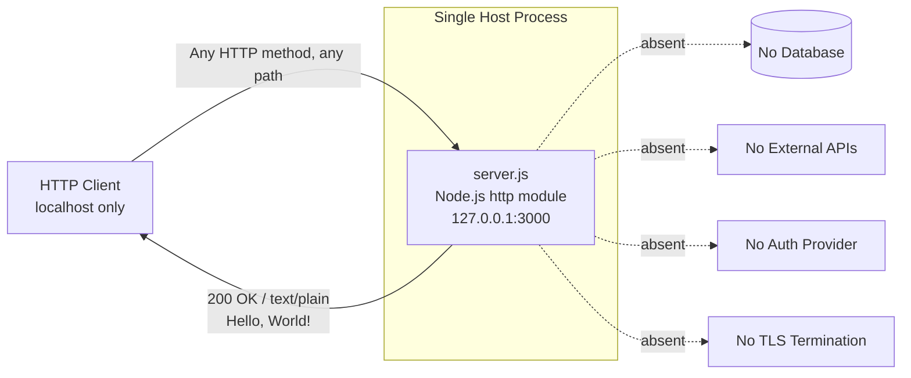

Concretely, the system **does not integrate with**:

- Databases (no driver imports, no connection strings)
- External REST or GraphQL APIs (no HTTP client code)
- Authentication or identity providers (no OAuth/OIDC/SAML libraries)
- Message brokers or queues
- Logging, metrics, or tracing platforms (no APM agent, no `/metrics` endpoint)
- TLS terminators or reverse proxies (the loopback binding precludes upstream proxying without additional infrastructure)

### 1.2.2 High-Level Description

#### Primary System Capabilities

The system implements exactly **one capability**: respond to every HTTP request received on `127.0.0.1:3000` with a fixed `200 OK` / `Content-Type: text/plain` / `Hello, World!\n` response, and emit a single startup message to standard output via `console.log`.

#### Major System Components

| Component | File | Responsibility |
|-----------|------|----------------|
| HTTP Server | `server.js` | Instantiates and starts the HTTP listener |
| Package Manifest | `package.json` | Declares npm metadata; zero declared dependencies |
| Dependency Lockfile | `package-lock.json` | npm lockfile v3 with root self-reference only |
| Project README | `README.md` | Two-line project description |
| Original Requirement | `codebase_context (42).md` | Captures the original natural-language ask |
| Remediation Specification | `Response.txt` | Documents production-readiness gaps and a hardening plan |
| Orphan Data Fixture | `phonenumber.csv` | 15-row CSV; not referenced by executable code |
| Filename Edge Cases | `Test.test..js`, `!@#$%^&().js`, long-name `.js` file | Byte-identical duplicates of `server.js` exercising filesystem tooling |

#### Core Technical Approach

The technical approach is deliberately **minimalist**:

- **Language**: JavaScript using CommonJS module syntax (`require()`).
- **Runtime**: Node.js (no version pinned via an `engines` field in `package.json`).
- **HTTP transport**: Node.js's built-in `http` module — no Express, Koa, Fastify, NestJS, or any third-party framework.
- **Configuration model**: None. Hostname (`127.0.0.1`) and port (`3000`) are hardcoded as `const` declarations; no `process.env` reads, no `.env` files, no configuration modules.
- **Module structure**: A single executable file with no exports, no internal modules, no separation between transport, business logic, or persistence layers.
- **Persistence**: None.
- **Concurrency model**: Standard Node.js event-loop callbacks; no Promises, async/await, streams, or worker threads in user code.

### 1.2.3 Success Criteria

Because the repository contains no formal business case, no service level agreements, and no published acceptance criteria, success criteria are derived from the observable purpose of the artifact.

#### Measurable Objectives

| Objective | Measurement | Target |
|-----------|-------------|--------|
| HTTP server starts successfully | `server.listen` callback fires; startup log emitted | 100% of launches on a free port 3000 |
| Server responds to local HTTP requests | HTTP 200 returned to `curl http://127.0.0.1:3000/` | 100% of requests |
| Response body matches implementation | Body exactly equals `Hello, World!\n` | Byte-exact match |
| Zero-dependency footprint preserved | `npm install` adds no `node_modules` packages | 0 third-party packages installed |

#### Critical Success Factors

- **Port 3000 availability** on the host — the application has no fallback port selection and no retry logic on bind failure.
- **Loopback interface availability** — binding to `127.0.0.1` requires a functional loopback adapter.
- **Node.js runtime presence** — the only system prerequisite; no other runtime, package manager, or service is required to execute `node server.js`.

#### Key Performance Indicators (KPIs)

The repository does not define formal KPIs. The implicit performance profile is constrained only by the underlying Node.js `http` module's capabilities; the application itself introduces no business-logic latency because no work is performed in the request handler beyond setting two response properties and writing a fixed string.

## 1.3 SCOPE

### 1.3.1 In-Scope Elements

#### Core Features and Functionalities

The features actually implemented in the codebase — and therefore in scope for this specification — are:

| Capability | Implementation Location | Notes |
|------------|------------------------|-------|
| HTTP server creation | `server.js` via `http.createServer()` | Built-in module only |
| Loopback binding on port 3000 | `server.js` via `server.listen(3000, '127.0.0.1', …)` | Hardcoded values |
| Fixed plaintext response | `server.js` request handler | Identical for every request |
| Startup log message | `server.js` listener callback | Single `console.log` to stdout |

The single supported user workflow is:

1. Operator runs `node server.js` (or any of the three byte-identical duplicate files) on a host where port 3000 is free.
2. The process binds to `127.0.0.1:3000` and logs `Server running at http://127.0.0.1:3000/` to standard output.
3. Any HTTP client on the same host issues any HTTP request, with any method, to any path on port 3000.
4. The server returns `200 OK` with `Content-Type: text/plain` and body `Hello, World!\n`.
5. The process continues running until externally terminated (no graceful shutdown is implemented).

#### Implementation Boundaries

| Boundary Dimension | Scope |
|--------------------|-------|
| System boundary | A single Node.js process on a single host |
| Network boundary | Loopback adapter only (`127.0.0.1`) — not externally accessible |
| User groups | Local HTTP clients on the host machine |
| Geographic / market coverage | Not applicable — no network-facing deployment |
| Data domains | None — no persistent or transient business data is processed |
| Operating system | Any platform supporting Node.js (no OS-specific code paths) |

### 1.3.2 Out-of-Scope Elements

#### Explicitly Excluded Features and Capabilities

The following capabilities are **verified absent** from the codebase and are not within the scope of the current implementation:

| Category | Excluded Capability | Verification |
|----------|---------------------|--------------|
| Routing | URL path discrimination (e.g., distinguishing `/hello` from other paths) | No URL inspection in handler |
| Routing | HTTP method routing (GET/POST/PUT/DELETE differentiation) | No `req.method` inspection |
| Request processing | Body parsing (JSON, form-encoded, multipart) | No body listeners or parsers |
| Request processing | Query-string parsing | No URL parsing |
| Request processing | Header inspection or validation | No header reads |
| Configuration | Environment variable consumption | No `process.env` reads |
| Configuration | Configuration files (`.env`, JSON, YAML) | No configuration file reads |
| Resilience | Server `error` event handler | Documented gap in `Response.txt` |
| Resilience | Graceful shutdown via SIGTERM/SIGINT | Documented gap in `Response.txt` |
| Resilience | Request-handler exception protection | Documented gap in `Response.txt` |
| Resilience | `clientError` handling | Documented gap in `Response.txt` |
| Security | Authentication (any scheme) | No authentication middleware |
| Security | Authorization / access control | No access-control logic |
| Security | TLS / HTTPS | Plain HTTP only |
| Security | Input validation or sanitization | No validation code |
| Persistence | Database connectivity | No database drivers imported |
| Persistence | File I/O beyond stdout logging | No `fs` module usage |
| Integration | Message-queue producers or consumers | No queue clients |
| Integration | Outbound API clients | No HTTP client code |
| Integration | WebSocket support | No WebSocket libraries |
| Observability | Structured logging | Only one `console.log` on startup |
| Observability | Metrics emission (Prometheus, StatsD, OpenTelemetry) | No instrumentation |
| Observability | Distributed tracing | No tracing libraries |
| Observability | Health-check endpoints | No dedicated routes |
| Lifecycle | Clustering / multi-process orchestration | Single process only |
| Lifecycle | Process management (PM2, systemd) | No process-manager configuration |
| Tooling | Automated tests | `test` script is a placeholder that exits with error |
| Tooling | Linting / formatting | No `.eslintrc`, `.prettierrc`, or similar |
| Tooling | Containerization | No `Dockerfile`, `docker-compose.yml`, or Kubernetes manifests |
| Tooling | CI/CD pipelines | No `.github/` directory or CI configuration |
| Tooling | Type checking | No `tsconfig.json`; JavaScript only |
| Data | Loading of `phonenumber.csv` | File is orphaned — not imported by any executable code |
| Entry | `index.js` referenced as `package.json#main` | File does not exist in the repository |

#### Future Phase Considerations

The `Response.txt` artifact outlines a future remediation phase that would address the six documented production-readiness gaps without expanding the application's surface area. That proposed phase is explicitly constrained to:

- **Hardening only** — adding error handlers, signal handlers, try/catch wrapping, `clientError` handling, request/response object validation, and resource cleanup.
- **No metadata changes** — `package.json`, `package-lock.json`, and `README.md` are not to be modified.
- **No new dependencies** — the zero-dependency posture must be preserved.
- **No behavioral changes** — port (`3000`), hostname (`127.0.0.1`), and response content (`Hello, World!\n`) must remain unchanged.

That hardening is described in the remediation specification but is **not currently implemented** in the executable code.

#### Integration Points Not Covered

No integration points are currently active or planned within the repository's scope. The system does not expose, consume, or proxy any third-party interface. Any future integration work would constitute a new phase outside the boundaries described here.

#### Unsupported Use Cases

The following use cases are explicitly **not supported** by the current implementation:

- Production deployment of any kind — the loopback binding precludes external network exposure without additional infrastructure (e.g., a reverse proxy or NAT layer), which is itself outside scope.
- Multi-tenant request handling — every request receives the identical response regardless of caller identity.
- Stateful interactions — no session, cookie, or state-tracking facility exists.
- Content negotiation — `text/plain` is the only response media type; `Accept` headers are ignored.
- Internationalization or localization — the response body is fixed ASCII English.
- API versioning or backward compatibility guarantees — no versioning scheme or API contract is published.
- Use of the `phonenumber.csv` fixture by the running application — the file is present in the repository for unspecified external purposes but is not consumed by `server.js`.

### 1.3.3 References

#### Files Examined

- `README.md` — Source of the repository name (`hao-backprop-test`) and the stated purpose ("test project for backprop integration").
- `package.json` — npm metadata: package name `hello_world`, version `1.0.0`, MIT license, author `hxu`, `main: index.js`, no `dependencies` field, no `devDependencies` field, placeholder `test` script.
- `package-lock.json` — npm lockfile v3 confirming a zero-dependency tree (only the root package self-reference under `packages[""]`).
- `server.js` — The canonical 15-line HTTP server entry point; source of all observed runtime behavior, hostname (`127.0.0.1`), port (`3000`), and response content (`Hello, World!\n`).
- `Test.test..js` — Byte-identical duplicate of `server.js`; edge-case filename containing a double dot.
- `!@#$%^&().js` — Byte-identical duplicate of `server.js`; edge-case filename containing special characters.
- `QWYFFGHGHFDDJFDame_!@#$%^&(){}long_name_…server.js` — Byte-identical duplicate of `server.js`; edge-case filename of extreme length.
- `codebase_context (42).md` — Original natural-language requirement specifying a Node.js tutorial project with a `/hello` endpoint returning `"Hello world"`.
- `phonenumber.csv` — Fifteen-row data fixture with `message,phonenumber` schema using synthetic `+111111112xx` numbers; not referenced by any executable code (orphaned).
- `Response.txt` — JSON-wrapped Markdown technical specification ("Agent Action Plan") documenting six production-readiness gaps in `server.js` and prescribing a hardening remediation plan with explicit exclusions (no metadata, port, hostname, response-content, or dependency changes permitted).

#### Folders Examined

- Repository root (depth: 0) — All ten files reside at the root; the repository contains no subdirectories. The flat structure was confirmed by direct enumeration rather than depth-limited search.

# 2. Product Requirements

This section catalogs every feature observable in the `hao-backprop-test` repository, organized into three evidence-based classes:

1. **Implemented Features (F-001 – F-006)** — code paths active in the canonical `server.js` and confirmed runtime artifacts.
2. **Proposed Hardening Features (F-101 – F-106)** — capabilities specified in `Response.txt` (the "Agent Action Plan") but **not yet present** in executable code.
3. **Unimplemented Original Requirements (F-201)** — capabilities requested in `codebase_context (42).md` that the current implementation does not satisfy.

Because the repository contains no formal product backlog, ticketing system, roadmap, or test suite, all priority labels and status values are **inferred from observable evidence** (e.g., a capability is "Critical" because it is the sole runtime behavior). For broader context regarding system boundaries, see Section 1.2 (System Overview) and Section 1.3 (Scope).

## 2.1 FEATURE CATALOG OVERVIEW

### 2.1.1 Feature Classes and Status Distribution

The repository's surface area is intentionally minimal. Six implemented features, six proposed hardening features, and one unmet original requirement comprise the complete inventory.

| Feature Class | Count | Source of Truth |
|---------------|-------|-----------------|
| Implemented | 6 | `server.js` and root-level artifacts |
| Proposed (Hardening) | 6 | `Response.txt` Agent Action Plan |
| Unimplemented (Original Ask) | 1 | `codebase_context (42).md` |

### 2.1.2 Master Feature Inventory

| Feature ID | Feature Name | Category | Status |
|------------|--------------|----------|--------|
| F-001 | HTTP Server Listener Lifecycle | Network Transport / Process Lifecycle | Completed |
| F-002 | Fixed Plaintext Response Generation | Request/Response Handling | Completed |
| F-003 | Startup Console Logging | Observability (Minimal) | Completed |
| F-004 | Zero-Dependency Package Manifest | Build / Distribution Metadata | Completed (with `main` inconsistency) |
| F-005 | Filesystem Edge-Case Filename Fixtures | Test Fixture / Tooling Resilience | Completed |
| F-006 | Orphan Data Fixture (`phonenumber.csv`) | Static Data Fixture | Present (Unused) |
| F-101 | Server-Level `error` Event Handler | Resilience | Proposed |
| F-102 | Graceful Shutdown on SIGTERM/SIGINT | Lifecycle / Resilience | Proposed |
| F-103 | Request-Handler Exception Protection | Resilience | Proposed |
| F-104 | `clientError` Event Handler | Resilience | Proposed |
| F-105 | Request/Response Object Input Validation | Resilience / Defensive Programming | Proposed |
| F-106 | Resource Cleanup on Shutdown | Lifecycle | Proposed |
| F-201 | Path-Based `/hello` Routing with `"Hello world"` Body | Routing / Original Requirement | Not Implemented |

## 2.2 IMPLEMENTED FEATURES

### 2.2.1 F-001: HTTP Server Listener Lifecycle

#### 2.2.1.1 Feature Metadata

| Property | Value |
|----------|-------|
| Unique ID | F-001 |
| Feature Name | HTTP Server Listener Lifecycle |
| Feature Category | Network Transport / Process Lifecycle |
| Priority Level | Critical (inferred — sole runtime capability) |
| Status | Completed |

#### 2.2.1.2 Description

- **Overview**: Instantiates a Node.js HTTP server via `http.createServer()` and binds it to the loopback interface on a fixed TCP port. The listener remains active for the lifetime of the process; no graceful shutdown path exists.
- **Business Value**: Establishes the deterministic, network-reachable surface that downstream "backprop" integration tooling targets. Without this listener, the repository has no executable behavior.
- **User Benefits**: Operators can launch the fixture with a single `node server.js` invocation and obtain a predictable, externally observable artifact (a listening TCP socket on `127.0.0.1:3000`).
- **Technical Context**: Implemented in `server.js` using Node.js's built-in `http` module exclusively. Hostname (`'127.0.0.1'`) and port (`3000`) are declared as `const` literals; no environment variables, configuration files, or runtime overrides are consulted.

#### 2.2.1.3 Dependencies

| Dependency Type | Detail |
|-----------------|--------|
| Prerequisite Features | None (foundational) |
| System Dependencies | Node.js runtime (no `engines` constraint); `http` core module |
| External Dependencies | None — zero npm packages declared in `package.json` |
| Integration Requirements | Free TCP port 3000 on the host; functional loopback adapter |

#### 2.2.1.4 Functional Requirements

| Requirement ID | Description | Priority | Complexity |
|----------------|-------------|----------|------------|
| F-001-RQ-001 | Server SHALL bind to host `127.0.0.1` | Must-Have | Low |
| F-001-RQ-002 | Server SHALL bind to TCP port `3000` | Must-Have | Low |
| F-001-RQ-003 | Server SHALL invoke the listen callback exactly once on successful bind | Must-Have | Low |
| F-001-RQ-004 | Process SHALL remain running until externally terminated | Must-Have | Low |

**F-001-RQ-001 — Loopback Bind**

| Attribute | Specification |
|-----------|---------------|
| Acceptance Criteria | `netstat`/`ss` shows process listening on `127.0.0.1:3000` (not `0.0.0.0`) |
| Input Parameters | None — hostname is a hardcoded literal |
| Output / Response | TCP listener socket open on loopback |
| Performance Criteria | Bind completes synchronously within Node.js startup |
| Data Requirements | None |
| Business Rules | Loopback binding is the implicit security boundary (precludes external access) |
| Data Validation | Not applicable (no inputs) |
| Security Requirements | Loopback-only exposure (no TLS, no auth — see Section 1.3.2) |
| Compliance Requirements | None documented |

**F-001-RQ-002 — Fixed Port**

| Attribute | Specification |
|-----------|---------------|
| Acceptance Criteria | Listener bound to port `3000`; no fallback port logic exists |
| Input Parameters | None — port is a hardcoded literal |
| Output / Response | Listener accepts TCP connections on `:3000` |
| Performance Criteria | N/A — bind is one-time at startup |
| Data Requirements | None |
| Business Rules | Port collisions are unrecovered — see F-101 (proposed remediation) |
| Data Validation | None |
| Security Requirements | None beyond loopback restriction |
| Compliance Requirements | None |

### 2.2.2 F-002: Fixed Plaintext Response Generation

#### 2.2.2.1 Feature Metadata

| Property | Value |
|----------|-------|
| Unique ID | F-002 |
| Feature Name | Fixed Plaintext Response Generation |
| Feature Category | Request/Response Handling |
| Priority Level | Critical (inferred — the response is the product) |
| Status | Completed |

#### 2.2.2.2 Description

- **Overview**: For every incoming HTTP request — regardless of method, path, headers, or body — the request handler sets `res.statusCode = 200`, sets the `Content-Type` header to `text/plain`, and ends the response with the exact body `Hello, World!\n`.
- **Business Value**: Provides a byte-deterministic response that downstream tooling can use as a golden baseline for behavioral assertions.
- **User Benefits**: Any HTTP client can validate connectivity to the fixture with a single request; no protocol negotiation, authentication, or payload preparation is required.
- **Technical Context**: The request handler does not inspect `req.method`, `req.url`, `req.headers`, or the request body. The handler is synchronous and performs exactly three operations: status assignment, header setting, and response termination with a fixed string.

#### 2.2.2.3 Dependencies

| Dependency Type | Detail |
|-----------------|--------|
| Prerequisite Features | F-001 (the listener must be active to receive requests) |
| System Dependencies | Node.js `http` module's `IncomingMessage` and `ServerResponse` objects |
| External Dependencies | None |
| Integration Requirements | None |

#### 2.2.2.4 Functional Requirements

| Requirement ID | Description | Priority | Complexity |
|----------------|-------------|----------|------------|
| F-002-RQ-001 | Response status code SHALL be `200` for every request | Must-Have | Low |
| F-002-RQ-002 | `Content-Type` header SHALL equal `text/plain` | Must-Have | Low |
| F-002-RQ-003 | Response body SHALL be the exact string `Hello, World!\n` | Must-Have | Low |
| F-002-RQ-004 | Handler SHALL be route-agnostic and method-agnostic | Must-Have | Low |

**F-002-RQ-003 — Byte-Exact Response Body**

| Attribute | Specification |
|-----------|---------------|
| Acceptance Criteria | Response body equals `Hello, World!\n` byte-for-byte (comma after `Hello`, capital `W`, trailing LF) |
| Input Parameters | Any `IncomingMessage` — content is ignored |
| Output / Response | Plaintext body of exactly 14 bytes |
| Performance Criteria | Synchronous write; no business-logic latency introduced by handler |
| Data Requirements | None — body is a literal string in source |
| Business Rules | Body MUST NOT vary per request; idempotency is required |
| Data Validation | None on request side |
| Security Requirements | No data is read from the request, eliminating injection vectors at the handler level |
| Compliance Requirements | None |

**F-002-RQ-004 — Route-Agnostic Handler**

| Attribute | Specification |
|-----------|---------------|
| Acceptance Criteria | Requests to `/`, `/hello`, `/anything`, with any method, yield identical response |
| Input Parameters | `req` object passed by `http` module |
| Output / Response | Identical 200/text-plain response regardless of input |
| Performance Criteria | N/A — no inspection branching |
| Data Requirements | None |
| Business Rules | No URL parsing, no method dispatch, no header reading is permitted in handler |
| Data Validation | None |
| Security Requirements | Absence of input parsing reduces attack surface but precludes any access control |
| Compliance Requirements | None |

### 2.2.3 F-003: Startup Console Logging

#### 2.2.3.1 Feature Metadata

| Property | Value |
|----------|-------|
| Unique ID | F-003 |
| Feature Name | Startup Console Logging |
| Feature Category | Observability (Minimal) |
| Priority Level | Low (inferred — informational only) |
| Status | Completed |

#### 2.2.3.2 Description

- **Overview**: Upon successful bind, the listener callback emits exactly one line — `Server running at http://127.0.0.1:3000/` — to standard output via `console.log`.
- **Business Value**: Provides a positive signal that the fixture is ready for use, supporting orchestration scripts that wait for the startup string before issuing test requests.
- **User Benefits**: Visual confirmation that the server is reachable at the printed URL.
- **Technical Context**: This is the **only** logging emitted by the application. There are no per-request logs, no error logs, no structured logging libraries, no log levels, and no log routing — see Section 1.3.2 for the explicit observability exclusions.

#### 2.2.3.3 Dependencies

| Dependency Type | Detail |
|-----------------|--------|
| Prerequisite Features | F-001 (logging fires from `server.listen` callback) |
| System Dependencies | Node.js `console` global |
| External Dependencies | None |
| Integration Requirements | Standard output stream attached to the process |

#### 2.2.3.4 Functional Requirements

| Requirement ID | Description | Priority | Complexity |
|----------------|-------------|----------|------------|
| F-003-RQ-001 | A single startup line SHALL be written to stdout on successful bind | Must-Have | Low |
| F-003-RQ-002 | The startup message SHALL include the bound hostname and port | Should-Have | Low |

**F-003-RQ-001 — Single Startup Line**

| Attribute | Specification |
|-----------|---------------|
| Acceptance Criteria | Exactly one line beginning with `Server running at` appears on stdout post-bind |
| Input Parameters | None |
| Output / Response | One `console.log` write |
| Performance Criteria | N/A |
| Data Requirements | Hostname and port literals from `server.js` |
| Business Rules | No per-request, error, or shutdown logs are emitted |
| Data Validation | None |
| Security Requirements | Message contains no sensitive data (no secrets, no PII) |
| Compliance Requirements | None |

### 2.2.4 F-004: Zero-Dependency Package Manifest

#### 2.2.4.1 Feature Metadata

| Property | Value |
|----------|-------|
| Unique ID | F-004 |
| Feature Name | Zero-Dependency Package Manifest |
| Feature Category | Build / Distribution Metadata |
| Priority Level | High (inferred — preservation is a stated scope constraint per Section 1.3.2) |
| Status | Completed (with documented `main` inconsistency) |

#### 2.2.4.2 Description

- **Overview**: `package.json` declares the npm package `hello_world` v1.0.0, MIT licensed, authored by `hxu`, with no `dependencies` field and no `devDependencies` field. `package-lock.json` (lockfile v3) contains only the root self-reference, confirming the empty dependency tree.
- **Business Value**: Eliminates supply-chain variability — `npm install` adds no third-party packages, ensuring perfectly reproducible installations.
- **User Benefits**: Bootstrap time approaches zero; no transitive vulnerability surface exists.
- **Technical Context**: The `main` field points to `index.js`, but no `index.js` file exists in the repository — see Section 1.1.1. The `test` script is a placeholder that emits `Error: no test specified` and exits with status 1 by design.

#### 2.2.4.3 Dependencies

| Dependency Type | Detail |
|-----------------|--------|
| Prerequisite Features | None |
| System Dependencies | npm CLI (only for inspection; no install needed) |
| External Dependencies | None |
| Integration Requirements | None |

#### 2.2.4.4 Functional Requirements

| Requirement ID | Description | Priority | Complexity |
|----------------|-------------|----------|------------|
| F-004-RQ-001 | `dependencies` field SHALL be absent or empty | Must-Have | Low |
| F-004-RQ-002 | `devDependencies` field SHALL be absent or empty | Must-Have | Low |
| F-004-RQ-003 | License SHALL be MIT | Must-Have | Low |
| F-004-RQ-004 | Lockfile SHALL declare lockfile v3 with no dependency nodes | Must-Have | Low |

**F-004-RQ-001 / RQ-002 — Zero Dependencies**

| Attribute | Specification |
|-----------|---------------|
| Acceptance Criteria | `npm install` produces no `node_modules/<package>` directories beyond bookkeeping |
| Input Parameters | `package.json` contents |
| Output / Response | Empty dependency tree |
| Performance Criteria | Install completes near-instantly |
| Data Requirements | None |
| Business Rules | Per Section 1.3.2 hardening constraints, zero-dependency posture MUST be preserved |
| Data Validation | None |
| Security Requirements | No transitive vulnerabilities possible |
| Compliance Requirements | MIT license terms |

### 2.2.5 F-005: Filesystem Edge-Case Filename Fixtures

#### 2.2.5.1 Feature Metadata

| Property | Value |
|----------|-------|
| Unique ID | F-005 |
| Feature Name | Filesystem Edge-Case Filename Fixtures |
| Feature Category | Test Fixture / Tooling Resilience |
| Priority Level | Medium (inferred — intentional fixture for tooling validation) |
| Status | Completed |

#### 2.2.5.2 Description

- **Overview**: Three files at the repository root are byte-for-byte duplicates of `server.js` but use deliberately challenging filenames: `Test.test..js` (double dot in basename), `!@#$%^&().js` (shell-special characters), and a JavaScript file with an approximately 258-character name. Per Section 1.1.1, these exercise "tooling resilience against edge-case file naming."
- **Business Value**: Provides a built-in fixture so any tool that ingests this repository — scanners, copiers, parsers, archivers — can validate its handling of pathological filenames against a known-good corpus.
- **User Benefits**: Single-repository basis for verifying filesystem robustness; no need to construct edge cases externally.
- **Technical Context**: All three files contain the identical 15-line CommonJS server implementation. Any one of them functions as an executable entry point identical to `server.js`.

#### 2.2.5.3 Dependencies

| Dependency Type | Detail |
|-----------------|--------|
| Prerequisite Features | F-001, F-002, F-003 (the shared implementation under duplication) |
| System Dependencies | A filesystem that permits the special characters used |
| External Dependencies | None |
| Integration Requirements | None |

#### 2.2.5.4 Functional Requirements

| Requirement ID | Description | Priority | Complexity |
|----------------|-------------|----------|------------|
| F-005-RQ-001 | Each duplicate SHALL be byte-identical to `server.js` | Must-Have | Low |
| F-005-RQ-002 | Filename set SHALL cover double-dot, special-character, and long-name cases | Must-Have | Low |

**F-005-RQ-001 — Byte-Identical Duplicates**

| Attribute | Specification |
|-----------|---------------|
| Acceptance Criteria | `diff` between any duplicate and `server.js` returns zero differences |
| Input Parameters | File contents on disk |
| Output / Response | N/A — static artifacts |
| Performance Criteria | N/A |
| Data Requirements | 15-line server source verbatim |
| Business Rules | Only the canonical `server.js` is the authoritative implementation reference |
| Data Validation | Byte-for-byte equality |
| Security Requirements | None |
| Compliance Requirements | None |

### 2.2.6 F-006: Orphan Data Fixture

#### 2.2.6.1 Feature Metadata

| Property | Value |
|----------|-------|
| Unique ID | F-006 |
| Feature Name | Orphan Data Fixture (`phonenumber.csv`) |
| Feature Category | Static Data Fixture |
| Priority Level | Low (inferred — unused at runtime) |
| Status | Present but Unused |

#### 2.2.6.2 Description

- **Overview**: `phonenumber.csv` is a 16-line file (one header plus 15 data rows) with schema `message,phonenumber`. Synthetic numbers occupy the `+111111112xx` range (e.g., `+11111111201` through `+11111111223`). Sample messages include short conversational phrases.
- **Business Value**: Provides a non-executable artifact that may be consumed by external tooling (e.g., data scanners) without altering server runtime behavior.
- **User Benefits**: External tools that scan repositories for tabular data fixtures have a sample to ingest.
- **Technical Context**: The file is **not referenced by any executable code** — neither `server.js` nor any of its duplicates imports the file. See Section 1.3.2 ("Loading of `phonenumber.csv` — File is orphaned").

#### 2.2.6.3 Dependencies

| Dependency Type | Detail |
|-----------------|--------|
| Prerequisite Features | None |
| System Dependencies | None at runtime |
| External Dependencies | None |
| Integration Requirements | None |

#### 2.2.6.4 Functional Requirements

| Requirement ID | Description | Priority | Complexity |
|----------------|-------------|----------|------------|
| F-006-RQ-001 | File SHALL contain the `message,phonenumber` header | Must-Have | Low |
| F-006-RQ-002 | File SHALL NOT be required by any executable code | Must-Have | Low |

**F-006-RQ-002 — Runtime Independence**

| Attribute | Specification |
|-----------|---------------|
| Acceptance Criteria | Removing `phonenumber.csv` does not affect server startup or response behavior |
| Input Parameters | N/A |
| Output / Response | N/A |
| Performance Criteria | N/A — file is never read by application |
| Data Requirements | 15 synthetic data rows |
| Business Rules | Data is synthetic; contains no real PII |
| Data Validation | None |
| Security Requirements | None |
| Compliance Requirements | None |

## 2.3 PROPOSED HARDENING FEATURES (NOT IMPLEMENTED)

The six features in this subsection are documented in `Response.txt` as proposed remediations for the production-readiness gaps enumerated in Section 1.2.1. They are **not present** in the current `server.js` — the file remains 15 lines without any of these capabilities. They are catalogued here for completeness and traceability.

### 2.3.1 F-101: Server-Level `error` Event Handler

#### 2.3.1.1 Feature Metadata

| Property | Value |
|----------|-------|
| Unique ID | F-101 |
| Feature Name | Server-Level `error` Event Handler |
| Feature Category | Resilience |
| Priority Level | High (per Response.txt remediation priority) |
| Status | Proposed |

#### 2.3.1.2 Description

- **Overview**: Registers `server.on('error', (error) => { ... process.exit(1); })` to capture bind-time failures such as `EADDRINUSE`, `EACCES`, and `ENOTFOUND`, log a diagnostic line, and exit with a non-zero status.
- **Business Value**: Replaces the current behavior in which the process crashes with an unhandled error event, with a deterministic, observable failure path.
- **User Benefits**: Operators see an actionable log line on bind failure instead of a stack trace.
- **Technical Context**: Documented as "Change #2" in `Response.txt`. Constrained to use only Node.js built-ins — no logging library may be added (see Section 2.3.7).

#### 2.3.1.3 Dependencies

| Dependency Type | Detail |
|-----------------|--------|
| Prerequisite Features | F-001 (handler is attached to the listener) |
| System Dependencies | Node.js `process.exit` |
| External Dependencies | None |
| Integration Requirements | None |

#### 2.3.1.4 Functional Requirements

| Requirement ID | Description | Priority | Complexity |
|----------------|-------------|----------|------------|
| F-101-RQ-001 | Handler SHALL catch `EADDRINUSE`, `EACCES`, `ENOTFOUND` | Must-Have | Low |
| F-101-RQ-002 | Process SHALL exit with code 1 after logging the error | Must-Have | Low |

### 2.3.2 F-102: Graceful Shutdown on SIGTERM/SIGINT

#### 2.3.2.1 Feature Metadata

| Property | Value |
|----------|-------|
| Unique ID | F-102 |
| Feature Name | Graceful Shutdown on SIGTERM/SIGINT |
| Feature Category | Lifecycle / Resilience |
| Priority Level | High (per Response.txt) |
| Status | Proposed |

#### 2.3.2.2 Description

- **Overview**: Introduces a `gracefulShutdown(signal)` function invoked from `process.on('SIGTERM', ...)` and `process.on('SIGINT', ...)` handlers; calls `server.close()` and enforces a 10-second force-exit timeout if connections do not drain.
- **Business Value**: Prevents in-flight request loss during orchestrator-driven termination (e.g., Kubernetes `SIGTERM`) and on operator `Ctrl+C`.
- **User Benefits**: Cleaner restart cycles and predictable termination semantics.
- **Technical Context**: Documented as "Change #4" and "Change #5" in `Response.txt`. Must not introduce dependencies.

#### 2.3.2.3 Dependencies

| Dependency Type | Detail |
|-----------------|--------|
| Prerequisite Features | F-001; F-106 (cleanup hook is invoked inside the close callback) |
| System Dependencies | Node.js `process` global; `server.close()` API |
| External Dependencies | None |
| Integration Requirements | Orchestrator must send SIGTERM (typical container runtime behavior) |

#### 2.3.2.4 Functional Requirements

| Requirement ID | Description | Priority | Complexity |
|----------------|-------------|----------|------------|
| F-102-RQ-001 | Handlers SHALL be registered for both SIGTERM and SIGINT | Must-Have | Low |
| F-102-RQ-002 | `server.close()` SHALL be invoked exactly once per signal | Must-Have | Medium |
| F-102-RQ-003 | A 10-second force-exit timeout SHALL be enforced | Must-Have | Medium |

### 2.3.3 F-103: Request-Handler Exception Protection

#### 2.3.3.1 Feature Metadata

| Property | Value |
|----------|-------|
| Unique ID | F-103 |
| Feature Name | Request-Handler Exception Protection |
| Feature Category | Resilience |
| Priority Level | High (per Response.txt) |
| Status | Proposed |

#### 2.3.3.2 Description

- **Overview**: Wraps the request handler body in `try/catch`; on exception, checks `res.headersSent` and emits a `500 Internal Server Error` response when safe.
- **Business Value**: Prevents process crashes from synchronous exceptions in the handler.
- **User Benefits**: Server remains up across pathological client interactions.
- **Technical Context**: Despite F-002's trivial handler body, the proposal mandates defensive wrapping as future-proofing.

#### 2.3.3.3 Dependencies

| Dependency Type | Detail |
|-----------------|--------|
| Prerequisite Features | F-002 |
| System Dependencies | Node.js `ServerResponse.headersSent` |
| External Dependencies | None |
| Integration Requirements | None |

#### 2.3.3.4 Functional Requirements

| Requirement ID | Description | Priority | Complexity |
|----------------|-------------|----------|------------|
| F-103-RQ-001 | Handler body SHALL be enclosed in `try/catch` | Must-Have | Low |
| F-103-RQ-002 | A 500 response SHALL be emitted only if `headersSent === false` | Must-Have | Medium |

### 2.3.4 F-104: `clientError` Event Handler

#### 2.3.4.1 Feature Metadata

| Property | Value |
|----------|-------|
| Unique ID | F-104 |
| Feature Name | `clientError` Event Handler |
| Feature Category | Resilience |
| Priority Level | Medium (per Response.txt) |
| Status | Proposed |

#### 2.3.4.2 Description

- **Overview**: Registers `server.on('clientError', (error, socket) => { socket.end('HTTP/1.1 400 Bad Request\r\n\r\n'); })` to short-circuit malformed HTTP requests without crashing the socket-level handler.
- **Business Value**: Survives protocol violations sent by buggy clients or hostile scanners.
- **User Benefits**: Malformed-request resilience without listener interruption.
- **Technical Context**: Documented as "Change #3" in `Response.txt`.

#### 2.3.4.3 Dependencies

| Dependency Type | Detail |
|-----------------|--------|
| Prerequisite Features | F-001 |
| System Dependencies | Node.js `clientError` event semantics |
| External Dependencies | None |
| Integration Requirements | None |

#### 2.3.4.4 Functional Requirements

| Requirement ID | Description | Priority | Complexity |
|----------------|-------------|----------|------------|
| F-104-RQ-001 | A `clientError` listener SHALL be registered | Must-Have | Low |
| F-104-RQ-002 | Listener SHALL terminate the socket with a `400 Bad Request` status line | Must-Have | Low |

### 2.3.5 F-105: Request/Response Object Input Validation

#### 2.3.5.1 Feature Metadata

| Property | Value |
|----------|-------|
| Unique ID | F-105 |
| Feature Name | Request/Response Object Input Validation |
| Feature Category | Defensive Programming |
| Priority Level | Low (per Response.txt) |
| Status | Proposed |

#### 2.3.5.2 Description

- **Overview**: Inserts `if (!req || !res) { return; }` at the top of the request handler.
- **Business Value**: Catches the theoretical edge case where the `http` module hands the handler an undefined argument.
- **User Benefits**: Marginal — protects against an unlikely framework contract violation.
- **Technical Context**: Treated as defensive programming; not driven by an observed defect.

#### 2.3.5.3 Dependencies

| Dependency Type | Detail |
|-----------------|--------|
| Prerequisite Features | F-002 |
| System Dependencies | None |
| External Dependencies | None |
| Integration Requirements | None |

#### 2.3.5.4 Functional Requirements

| Requirement ID | Description | Priority | Complexity |
|----------------|-------------|----------|------------|
| F-105-RQ-001 | Handler SHALL return early if `req` or `res` is falsy | Should-Have | Low |

### 2.3.6 F-106: Resource Cleanup on Shutdown

#### 2.3.6.1 Feature Metadata

| Property | Value |
|----------|-------|
| Unique ID | F-106 |
| Feature Name | Resource Cleanup on Shutdown |
| Feature Category | Lifecycle |
| Priority Level | Low (per Response.txt — placeholder) |
| Status | Proposed |

#### 2.3.6.2 Description

- **Overview**: Documents a cleanup hook within the `gracefulShutdown` callback for releasing sockets, file handles, or future external connections. In the current proposed plan, this is a comment placeholder because the application owns no such resources.
- **Business Value**: Establishes a structural location for future cleanup logic without committing to specific cleanup actions.
- **User Benefits**: Forward-compatible shutdown semantics.
- **Technical Context**: Coupled tightly to F-102 — both are introduced together by Response.txt.

#### 2.3.6.3 Dependencies

| Dependency Type | Detail |
|-----------------|--------|
| Prerequisite Features | F-102 |
| System Dependencies | None |
| External Dependencies | None |
| Integration Requirements | None |

#### 2.3.6.4 Functional Requirements

| Requirement ID | Description | Priority | Complexity |
|----------------|-------------|----------|------------|
| F-106-RQ-001 | Cleanup hook SHALL execute within the `server.close()` callback | Could-Have | Low |

### 2.3.7 Hardening Scope Constraints

`Response.txt` Section "0.5 Scope Boundaries" explicitly forbids the following changes during hardening. These constraints govern all features F-101 through F-106:

| Constraint | Detail |
|------------|--------|
| Metadata immutability | `package.json`, `package-lock.json`, `README.md` MUST NOT be modified |
| Behavioral immutability | Port `3000`, hostname `127.0.0.1`, response body `Hello, World!\n` MUST be preserved |
| Dependency immutability | No npm packages may be added (preserves F-004) |
| Surface immutability | No new routes, authentication, HTTPS/TLS, clustering, health endpoints, or metrics may be introduced |

## 2.4 UNIMPLEMENTED ORIGINAL REQUIREMENTS

### 2.4.1 F-201: Path-Based `/hello` Routing with `"Hello world"` Body

#### 2.4.1.1 Feature Metadata

| Property | Value |
|----------|-------|
| Unique ID | F-201 |
| Feature Name | Path-Based `/hello` Routing with `"Hello world"` Body |
| Feature Category | Routing / Original Requirement |
| Priority Level | Historical (superseded by current implementation) |
| Status | Not Implemented |

#### 2.4.1.2 Description

- **Overview**: The original natural-language requirement captured in `codebase_context (42).md` requested a Node.js tutorial project that exposes a single endpoint at `/hello` returning the body `"Hello world"`.
- **Business Value**: N/A — superseded; the repository was repurposed as the "backprop integration" test fixture (per `README.md`).
- **User Benefits**: N/A — not in current scope.
- **Technical Context**: The current implementation diverges in three respects: there is no URL discrimination, the body differs (`"Hello, World!\n"` vs. `"Hello world"`), and the project framing shifted from "tutorial" to "test project."

#### 2.4.1.3 Dependencies

| Dependency Type | Detail |
|-----------------|--------|
| Prerequisite Features | Would build atop F-001 |
| System Dependencies | Node.js `http.IncomingMessage.url` |
| External Dependencies | None |
| Integration Requirements | None |

#### 2.4.1.4 Functional Requirements (Original — Unmet)

| Requirement ID | Description | Priority | Complexity |
|----------------|-------------|----------|------------|
| F-201-RQ-001 | Endpoint `/hello` SHALL be discriminated from other paths | Not Implemented | Low |
| F-201-RQ-002 | Response body SHALL be exactly `"Hello world"` | Not Implemented | Low |
| F-201-RQ-003 | Project SHALL be presented as a tutorial | Not Implemented | Low |

## 2.5 FEATURE RELATIONSHIPS

### 2.5.1 Feature Dependency Map

The diagram below shows only dependencies evident from the source files. Dotted lines indicate proposed (not-yet-implemented) relationships from `Response.txt`. The orphan fixture (F-006) and the unmet requirement (F-201) have no runtime edges into the active feature graph.

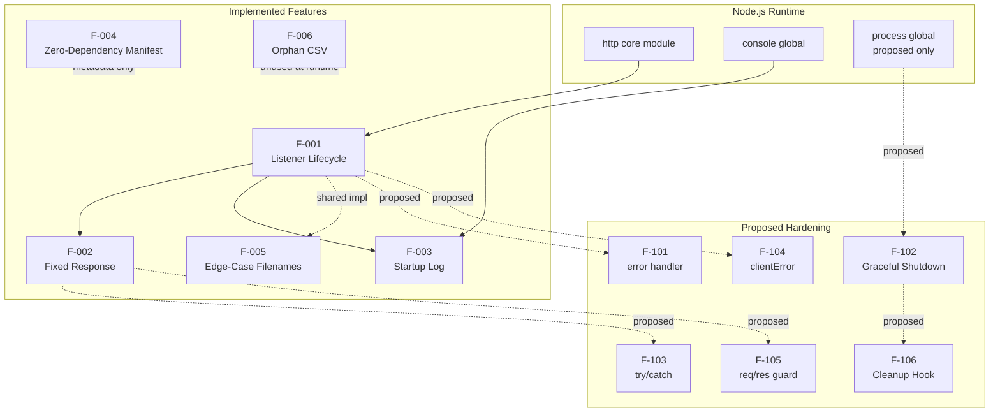

### 2.5.2 Integration Points

Per Section 1.2.1, the system has **no external integrations**. The only integration surface is the loopback TCP listener established by F-001. No database, message broker, identity provider, outbound HTTP client, TLS terminator, or observability backend is reachable from this codebase.

| Integration Point | Status | Source |
|-------------------|--------|--------|
| Loopback HTTP listener (`127.0.0.1:3000`) | Active | F-001 |
| stdout (startup log) | Active | F-003 |
| External APIs / Databases / Queues | Absent | Section 1.2.1 |
| Auth providers / TLS terminators | Absent | Section 1.2.1 |

### 2.5.3 Shared Components and Common Services

| Shared Element | Sharing Pattern | Features Involved |
|----------------|-----------------|-------------------|
| Canonical `server.js` source | Byte-identically duplicated in three edge-case filenames | F-001, F-002, F-003, F-005 |
| Hostname literal `'127.0.0.1'` | Reused in handler-bind and startup log string | F-001, F-003 |
| Port literal `3000` | Reused in handler-bind and startup log string | F-001, F-003 |
| `http.createServer` callback | The single function realizing F-002 and (when proposed) F-103, F-105 | F-002, F-103, F-105 |
| `gracefulShutdown` function (proposed) | Invoked by both SIGTERM and SIGINT handlers; hosts F-106 hook | F-102, F-106 |

## 2.6 IMPLEMENTATION CONSIDERATIONS

### 2.6.1 Technical Constraints

| Constraint | Affected Features | Source |
|------------|-------------------|--------|
| Port 3000 must be free; no fallback selection | F-001 | `server.js` literal |
| Loopback binding only — process is not externally reachable | F-001, F-002 | `server.js`; Section 1.3.1 |
| No graceful shutdown — external termination required | F-001 | Section 1.3.1 |
| Single Node.js process; no clustering | F-001 – F-006 | Section 1.2.2 |
| `package.json#main` references non-existent `index.js` | F-004 | Section 1.1.1 |
| Hardening constraints forbid metadata, behavioral, or dependency changes | F-101 – F-106 | `Response.txt` §0.5; Section 1.3.2 |

### 2.6.2 Performance Requirements

The repository defines **no formal performance SLAs**. Per Section 1.2.3, the implicit performance profile is constrained only by the Node.js `http` module; the application introduces no business-logic latency. The following derived objectives serve as informal acceptance signals.

| Objective | Target | Source |
|-----------|--------|--------|
| Startup success rate on free port 3000 | 100% | Section 1.2.3 |
| HTTP 200 response rate | 100% of requests | Section 1.2.3 |
| Response body byte-exact match | 100% | Section 1.2.3 |
| Third-party packages installed via `npm install` | 0 | Section 1.2.3 |

`Response.txt` mentions aspirational figures (response time < 50 ms, memory < 50 MB RSS, 100+ concurrent connections) but those apply to the proposed hardened variant and are not committed SLAs of the current build.

### 2.6.3 Scalability Considerations

| Dimension | Disposition |
|-----------|-------------|
| Horizontal scaling | Not supported — single-process model |
| Vertical scaling | Limited only by Node.js event-loop characteristics |
| Concurrency model | Standard Node.js event-loop callbacks; no Promises, async/await, streams, or worker threads in user code (per Section 1.2.2) |
| Load balancing | Not applicable — loopback binding precludes upstream proxying |
| Clustering | Explicitly out of scope (Section 1.3.2) |

### 2.6.4 Security Implications

The loopback-only binding is the implicit security boundary; the following capabilities are **verified absent** across the codebase (per Section 1.3.2):

| Security Capability | Status | Notes |
|---------------------|--------|-------|
| Authentication (OAuth/OIDC/SAML/basic/etc.) | Absent | No auth libraries imported |
| Authorization / access control | Absent | No access-control logic |
| TLS / HTTPS | Absent | Plain HTTP only |
| Input validation / sanitization | Absent | No request inspection performed |
| Network exposure | Loopback only | `127.0.0.1` binding precludes remote access |
| Logging of sensitive data | None | Single non-sensitive startup line |

Proposed features F-101 – F-106 improve resilience but explicitly do **not** introduce authentication, TLS, or authorization (per Section 2.3.7).

### 2.6.5 Maintenance Requirements

| Maintenance Concern | Current State | Evidence |
|---------------------|---------------|----------|
| Automated tests | None — `test` script intentionally exits with status 1 | `package.json` |
| Linting / formatting | No `.eslintrc`, `.prettierrc`, or equivalent | Section 1.3.2 |
| CI/CD | No `.github/` directory or pipeline configuration | Section 1.3.2 |
| Containerization | No `Dockerfile` or `docker-compose.yml` | Section 1.3.2 |
| Type checking | None — JavaScript without `tsconfig.json` | Section 1.3.2 |
| Documentation footprint | Two-line `README.md` plus this specification | `README.md` |
| Node.js version pin | None — no `engines` field in `package.json` | `package.json` |

## 2.7 TRACEABILITY MATRIX

### 2.7.1 Source-to-Feature Mapping

| Source Artifact | Contributing Features | Evidence Location |
|-----------------|------------------------|-------------------|
| `server.js` | F-001, F-002, F-003 | Lines 1, 3–4, 6–10, 12–14 |
| `package.json` | F-004 | Full file (11 lines) |
| `package-lock.json` | F-004 (verification) | Lockfile v3, root self-reference only |
| `README.md` | Project identity (cross-references all features) | 2 lines |
| `codebase_context (42).md` | F-201 (unmet original requirement) | 1 line |
| `Response.txt` | F-101 – F-106 (proposed) | Sections 0.1 – 0.7 |
| `Test.test..js` | F-005 | 15 lines, byte-identical to `server.js` |
| `!@#$%^&().js` | F-005 | 15 lines, byte-identical to `server.js` |
| `QWYFFGHGHFDDJFD…server.js` | F-005 | 15 lines, byte-identical to `server.js` |
| `phonenumber.csv` | F-006 | 16 lines (header + 15 rows) |

### 2.7.2 Requirement-to-Feature Mapping

| Requirement ID | Parent Feature | Status |
|----------------|----------------|--------|
| F-001-RQ-001 – RQ-004 | F-001 | Verified in `server.js` |
| F-002-RQ-001 – RQ-004 | F-002 | Verified in `server.js` |
| F-003-RQ-001 – RQ-002 | F-003 | Verified in `server.js` |
| F-004-RQ-001 – RQ-004 | F-004 | Verified in `package.json` / lockfile |
| F-005-RQ-001 – RQ-002 | F-005 | Verified by byte-comparison |
| F-006-RQ-001 – RQ-002 | F-006 | Verified in `phonenumber.csv` |
| F-101-RQ-001 – RQ-002 | F-101 | Not implemented |
| F-102-RQ-001 – RQ-003 | F-102 | Not implemented |
| F-103-RQ-001 – RQ-002 | F-103 | Not implemented |
| F-104-RQ-001 – RQ-002 | F-104 | Not implemented |
| F-105-RQ-001 | F-105 | Not implemented |
| F-106-RQ-001 | F-106 | Not implemented |
| F-201-RQ-001 – RQ-003 | F-201 | Not implemented (original ask) |

### 2.7.3 Cross-Reference to Process Flowcharts and Specifications

| Reference | Location |
|-----------|----------|
| Operational topology diagram (client ↔ server) | Section 1.2.1 — Integration mermaid diagram |
| Six production-readiness gaps table | Section 1.2.1 — Current System Limitations |
| In-scope capabilities and operator workflow | Section 1.3.1 |
| Verified-absent capability matrix | Section 1.3.2 |
| Future-phase hardening constraints | Section 1.3.2 — Future Phase Considerations |
| Measurable success objectives | Section 1.2.3 |
| Stakeholder roster | Section 1.1.3 |

### 2.7.4 Assumptions and Version Control Notes

| Assumption / Note | Detail |
|-------------------|--------|
| Specification version | 1.0 (initial issuance for the current `server.js` state) |
| Status inference basis | All priority and status labels derive from observable code and `Response.txt`; no external backlog exists |
| Test verification basis | Acceptance criteria derive from `server.js` behavior, not from a test suite (none present) |
| Authoritative implementation | `server.js`; the three byte-identical duplicates are fixtures only (per F-005) |
| Documentation freshness | This specification reflects the repository state at the time of analysis; any modification to `server.js` invalidates F-001 – F-005 acceptance criteria |

## 2.8 References

### 2.8.1 Files Examined

- `server.js` — Canonical 15-line HTTP server; primary evidence for F-001, F-002, F-003 (hostname, port, response body, startup log).
- `package.json` — npm manifest evidencing F-004 (zero-dependency posture, MIT license, placeholder `test` script, `main: index.js` inconsistency).
- `package-lock.json` — Lockfile v3 confirming the empty dependency tree underpinning F-004.
- `README.md` — Two-line project identity statement ("test project for backprop integration").
- `codebase_context (42).md` — Original natural-language requirement; sole evidence for F-201.
- `Response.txt` — Agent Action Plan documenting six production-readiness gaps; sole evidence for F-101 – F-106 and the Section 2.3.7 scope constraints.
- `Test.test..js` — Byte-identical duplicate of `server.js`; F-005 evidence (double-dot basename).
- `!@#$%^&().js` — Byte-identical duplicate of `server.js`; F-005 evidence (shell-special characters).
- `QWYFFGHGHFDDJFD…server.js` — Byte-identical duplicate of `server.js`; F-005 evidence (≈258-char filename).
- `phonenumber.csv` — 15 data rows of synthetic `message,phonenumber` data; sole evidence for F-006.

### 2.8.2 Folders Examined

- Repository root (depth 0) — Flat structure containing exactly 10 files; no subdirectories present.

### 2.8.3 Technical Specification Sections Referenced

- Section 1.1 (Executive Summary) — Project overview, stakeholders, value proposition.
- Section 1.2 (System Overview) — Business context, six-gap table, primary capabilities, success criteria.
- Section 1.3 (Scope) — In-scope feature list, out-of-scope exclusion matrix, future-phase constraints.

# 3. Technology Stack

## 3.1 STACK PHILOSOPHY AND DEFAULT-STACK RECONCILIATION

### 3.1.1 Deliberate Minimalism

The `hao-backprop-test` repository is an internally-positioned **test fixture for the "backprop" integration**, not a market-facing product. Its technology stack is, by intentional design, the smallest viable surface that can host a network-reachable HTTP listener. The system implements exactly one capability — respond to every HTTP request received on `127.0.0.1:3000` with a fixed `200 OK` / `Content-Type: text/plain` / `Hello, World!\n` response, and emit a single startup message to standard output. There is no business-logic layer, persistence layer, transport-abstraction layer, configuration layer, or observability layer. The entire stack consists of a single language (JavaScript), a single runtime (Node.js), a single built-in module (`http`), and a single executable file (`server.js`).

### 3.1.2 Default-Stack Inapplicability Notice

Standard enterprise default-stack components (AWS, Docker, Terraform, GitHub Actions, Flask, Auth0, MongoDB, Langchain, React, TypeScript, TailwindCSS, React-Native, Swift, Kotlin, Objective-C, Electron) are **all verified absent** from this codebase. None of them are appropriate for a fixture whose explicit scope constraints (Section 1.3.2) prohibit databases, authentication, TLS, frameworks, containerization, CI/CD, type checking, build systems, and any new dependencies. The reconciliation table below records the disposition of every default-stack item against the observed repository.

| Default Stack Item | Disposition | Evidence |
|--------------------|-------------|----------|
| AWS / cloud platform | Not used | Zero npm dependencies; no SDK imports |
| Docker / containerization | Not used | No `Dockerfile`, `docker-compose.yml`, or `.dockerignore` |
| Terraform / IaC | Not used | No `.tf` or `.tfvars` files |
| GitHub Actions / CI/CD | Not used | No `.github/` directory or pipeline configuration |
| Python | Not used | JavaScript is the only language present |
| Flask / web framework | Not used | Node.js built-in `http` core only |
| Auth0 / authentication | Not used | No auth libraries; no auth logic anywhere |
| MongoDB / databases | Not used | No driver imports, no connection strings |
| Langchain / AI framework | Not used | No ML/AI libraries; not an AI workload |
| React + TypeScript / web frontend | Not used | No frontend; loopback text/plain backend only |
| TailwindCSS / styling | Not used | No styling layer; no UI |
| React Native / mobile | Not used | No mobile platform |
| Swift / Kotlin / Objective-C / Electron | Not used | No native applications |

### 3.1.3 Stack Architecture Overview

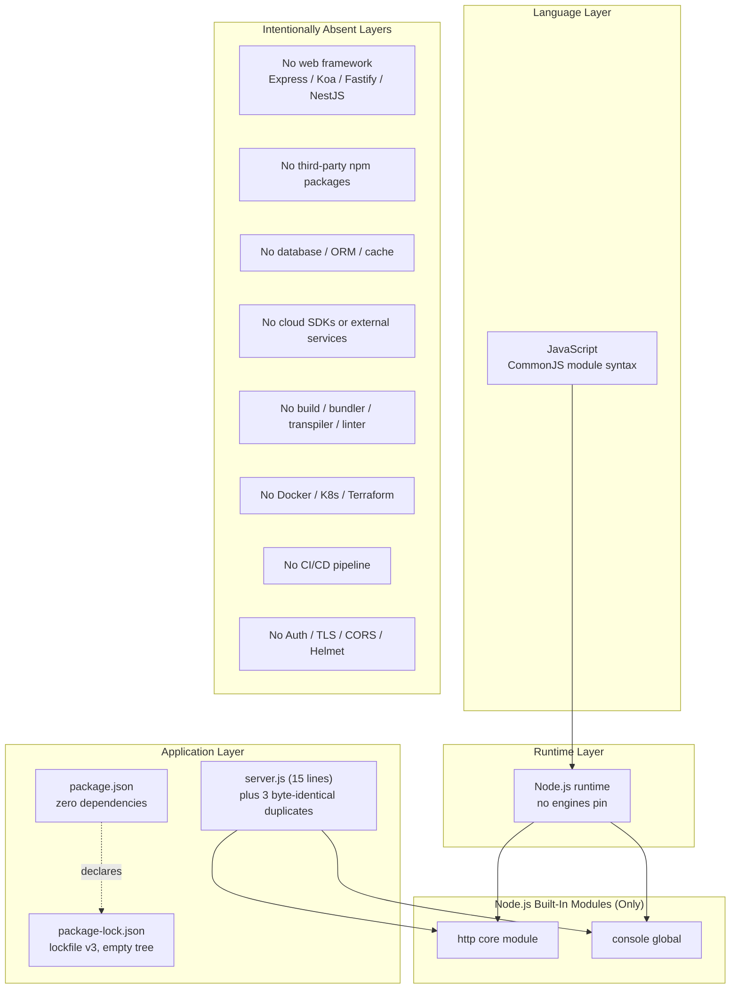

---

## 3.2 PROGRAMMING LANGUAGES

### 3.2.1 JavaScript (CommonJS)

The sole programming language in the repository is **JavaScript**, written using **CommonJS module syntax** (`require()` rather than ES modules `import`). All four `.js` files at the repository root — `server.js`, `Test.test..js`, `!@#$%^&().js`, and the long-named server duplicate — are byte-identical 15-line CommonJS files that use `const` declarations, 2-space indentation, semicolons, and arrow-function callbacks. The canonical implementation begins with `const http = require('http');` and contains no JSX, no TypeScript annotations, and no Flow types.

#### Selection Criteria

JavaScript on Node.js is the natural choice for this fixture for three reasons evident from the codebase:

- **Zero ceremony**: A working HTTP listener can be expressed in fewer than fifteen lines without any framework dependency.
- **Built-in transport**: Node.js's `http` core module provides the entire server capability needed, eliminating language-level reasons to introduce a framework.
- **CommonJS by mandate**: The hardening specification (`Response.txt` Section 0.7) explicitly directs *"Maintain CommonJS `require()` style (no ES6 import conversion)"*, locking the module style for the lifetime of the fixture.

#### Language Version Constraints

There is **no declared JavaScript language version constraint**. No `tsconfig.json` constrains a TypeScript target; no Babel configuration declares a compile target; no `.nvmrc` file pins a runtime version; and per Section 2.6.5, `package.json` contains no `engines` field. The codebase therefore inherits whatever ECMAScript level the host Node.js installation supports — the only language features actually used (`const`, arrow functions, template literals are not even used; the response string is a plain quoted literal) have been stable since Node.js 4.x.

### 3.2.2 Excluded Languages

Per Section 1.3.2 and direct file enumeration of the flat repository root, the following languages are verified absent:

| Language | Verification |
|----------|--------------|
| TypeScript | No `tsconfig.json`; no `.ts` or `.tsx` files |
| Python | No `.py` files; no `requirements.txt`, `pyproject.toml`, `setup.py` |
| Swift | No `.swift` files; no `Package.swift` |
| Kotlin | No `.kt` or `.kts` files; no Gradle configuration |
| Objective-C | No `.m` or `.h` files |
| Java / Go / Rust / C/C++ | No source files of any of these languages |
| HTML / CSS | No frontend layer exists |

### 3.2.3 Language-Level Constraints from the Hardening Plan

Proposed hardening features F-101 through F-106 (Section 2.3) are explicitly constrained to add no third-party libraries and to retain the existing language style. The hardening introduces only additional JavaScript code paths that leverage Node.js built-ins (`process`, `process.exit`, `server.close()`, `res.headersSent`, the `clientError` event). No language migration is contemplated.

---

## 3.3 RUNTIME PLATFORM

### 3.3.1 Node.js Runtime

The single runtime platform is **Node.js**, used directly with no process supervisor, no PM2, no systemd unit, no `forever`, and no clustering. Per Section 1.2.2, the runtime characteristics are:

- **Concurrency model**: standard Node.js event-loop callbacks. No Promises, no `async`/`await`, no streams, and no worker threads exist in user code.
- **Process model**: a single Node.js process per host. Clustering is explicitly out of scope (Section 1.3.2).
- **Module loader**: CommonJS, satisfied entirely by the runtime's built-in `require()` resolution.

### 3.3.2 Runtime Version Strategy

Per Section 2.6.5 (Maintenance Requirements), the Node.js version pin is recorded as *"None — no `engines` field in `package.json`"*. The repository assumes any modern Node.js LTS will execute the file correctly because the `http` module API surface used (`http.createServer(callback)`, `server.listen(port, hostname, callback)`, `res.statusCode`, `res.setHeader()`, `res.end()`) has been stable across all supported Node.js LTS releases. No compatibility matrix is published.

### 3.3.3 Runtime Prerequisites

Per Section 1.2.3 (Critical Success Factors), the only system prerequisites to execute the fixture are:

| Prerequisite | Reason |
|--------------|--------|
| Node.js installed on the host | Sole runtime |
| TCP port `3000` free on the host | Hardcoded; no fallback port logic |
| Functional loopback adapter | Bind target is `127.0.0.1` |

No package manager invocation is required at runtime (no `node_modules` directory must exist to execute `node server.js`). The npm CLI is used only for inspection — per Section 2.2.4, *"npm CLI (only for inspection; no install needed)"*.

---

## 3.4 FRAMEWORKS AND LIBRARIES

### 3.4.1 Built-In Node.js Modules in Active Use

The application uses exactly two Node.js built-in surfaces and nothing else:

| Module / Global | Usage | Source Location |
|-----------------|-------|-----------------|
| `http` core module | `http.createServer(callback)`, `server.listen(port, hostname, callback)`, `res.statusCode`, `res.setHeader()`, `res.end()` | `server.js` line 1 `require` + the request/listen logic |
| `console` global | A single `console.log` of the startup message `Server running at http://127.0.0.1:3000/` | `server.js` listener callback |

#### Justification

Node.js's built-in `http` module is sufficient to satisfy every functional requirement of F-001 (listener lifecycle), F-002 (fixed plaintext response), and F-003 (startup log). Introducing Express, Koa, Fastify, NestJS, or Hapi would expand the dependency surface and contradict the zero-dependency posture mandated by F-004 and Section 1.3.2. The `console` global similarly satisfies the entire observability requirement (which is intentionally minimal — exactly one startup line, no per-request logs, no error logs).

### 3.4.2 Built-In Modules Reserved for the Proposed Hardening

The hardening plan documented in `Response.txt` and catalogued as F-101 through F-106 in Section 2.3 introduces additional Node.js built-in surfaces. None of these are present in the current 15-line `server.js`; they are listed here for forward-looking traceability because the `Response.txt` Scope Boundaries (Section 2.3.7) require that hardening introduce **no** new dependencies:

| Built-In Surface | Used By Feature | Purpose |
|------------------|----------------|---------|
| `server.on('error', …)` | F-101 | Catch bind-time failures (`EADDRINUSE`, `EACCES`, `ENOTFOUND`) |
| `process.on('SIGTERM', …)`, `process.on('SIGINT', …)`, `process.exit()` | F-102 | Signal-driven graceful shutdown |
| `server.close()` | F-102, F-106 | Drain in-flight connections; host cleanup hook |
| `try` / `catch` (language built-in) and `res.headersSent` | F-103 | Defensive handler protection with 500 fallback |
| `server.on('clientError', …)` | F-104 | Reject malformed HTTP without crashing the listener |
| Falsy-check primitives (language built-in) | F-105 | `if (!req || !res) return;` guard |

All proposed remediations therefore continue to use **only Node.js built-ins**, preserving the zero-dependency posture.

### 3.4.3 Excluded Frameworks and Libraries

Per Section 1.2.2 and Section 1.3.2 (verified by inspection of `package.json` and `package-lock.json`), the following framework / library categories are absent. The exclusion list is exhaustive and intentional:

| Category | Excluded Item(s) | Verification |
|----------|------------------|--------------|
| Web frameworks | Express, Koa, Fastify, NestJS, Hapi, Restify | Section 1.2.2: *"no Express, Koa, Fastify, NestJS, or any third-party framework"* |
| Middleware | body-parser, morgan, cors, helmet, compression | Zero npm dependencies |
| Logging libraries | Winston, Pino, Bunyan, Morgan | Section 2.3.1: *"no logging library may be added"* |
| Validation libraries | Joi, Zod, Yup, AJV, express-validator | Section 1.3.2: input validation absent |
| HTTP clients | axios, node-fetch, got, undici | No outbound HTTP code |
| WebSocket | ws, socket.io | Section 1.3.2 |
| Templating engines | EJS, Pug, Handlebars | No view layer |
| ORMs / Query builders | Mongoose, Sequelize, Prisma, TypeORM, Knex | No database connectivity |
| Auth libraries | Passport, jsonwebtoken, bcrypt, OAuth/OIDC clients | No authentication |
| AI / ML frameworks | Langchain, OpenAI SDK, TensorFlow.js | Not applicable to this workload |
| Configuration libraries | dotenv, config, nconf, convict | All values hardcoded |
| Testing libraries | Jest, Mocha, Chai, Vitest, Tap, Supertest | Placeholder `test` script |
| Type runtime | tslib, ts-node | No TypeScript |

---

## 3.5 OPEN-SOURCE DEPENDENCIES

### 3.5.1 Dependency Inventory: Zero

The defining technology-stack property of this repository is its **zero-dependency posture**, formalized as feature F-004 (Section 2.2.4). The npm package manifest contains no dependency declarations of any kind:

| Manifest Field | Status | Source |
|----------------|--------|--------|
| `dependencies` | Absent | `package.json` (no field) |
| `devDependencies` | Absent | `package.json` (no field) |
| `peerDependencies` | Absent | `package.json` (no field) |
| `optionalDependencies` | Absent | `package.json` (no field) |
| `bundledDependencies` | Absent | `package.json` (no field) |

### 3.5.2 Lockfile Verification

`package-lock.json` is present at lockfile format version **3** (npm v7+ format). It contains only the root package self-reference under `packages[""]` — no `node_modules/<package>` entries and no transitive dependency nodes. This lockfile cryptographically attests that an `npm install` against this manifest will produce a `node_modules` directory containing no third-party packages, confirming reproducible zero-dependency installs.

### 3.5.3 npm Package Metadata

Authoritative metadata as declared in `package.json`:

| Property | Value | Notes |
|----------|-------|-------|
| Package name | `hello_world` | Differs from repository name `hao-backprop-test` |
| Version | `1.0.0` | Initial release; never bumped |
| Description | `Hello world in Node.js` | One-line description |
| Main entry | `index.js` | **Inconsistency**: file does not exist in repo — see Section 2.6.1 |
| Test script | `echo "Error: no test specified" && exit 1` | Placeholder; intentionally exits non-zero |
| Author | `hxu` | Per `package.json` |
| License | `MIT` | Permissive open-source license |
| Registry | Default npm public registry | No `.npmrc` overrides registry |

### 3.5.4 Zero-Dependency Posture: Justification

The zero-dependency choice yields the following architectural properties, several of which are stated as scope constraints (Section 1.3.2) and feature requirements (F-004-RQ-001 through F-004-RQ-004):

- **Reproducibility**: `npm install` produces a `node_modules` directory with no `<package>/` subdirectories beyond bookkeeping, eliminating "works on my machine" variance.
- **Bootstrap latency**: Near-instant installation; no network round-trips to fetch transitive dependencies.
- **Supply-chain attack surface**: Zero. There are no transitive packages to audit, no `package-lock.json` integrity hashes to maintain beyond the root self-reference, and no upstream maintainer compromise can affect this fixture.
- **Posture preservation mandate**: Section 1.3.2 future-phase considerations state *"No new dependencies — the zero-dependency posture must be preserved."* Section 2.3.7 reiterates this for the hardening phase. The zero-dependency property is therefore an immutable design constant, not merely the current state.

### 3.5.5 Package Manager

The package manager used is **npm** (inferred from the presence of `package-lock.json` rather than `yarn.lock`, `pnpm-lock.yaml`, or `bun.lockb`). No alternate package manager configuration is present. There is no `.npmrc` in the repository, so the default public npm registry applies — though this is academic given the empty dependency set.

---

## 3.6 THIRD-PARTY SERVICES

### 3.6.1 External Service Integrations: None

Per Section 1.2.1 ("Integration with Existing Enterprise Landscape"), the application has **no external integrations of any kind**. The operational topology consists of a single host process listening on the loopback interface, with no upstream or downstream service edges:

| Integration Category | Status | Verification |
|----------------------|--------|--------------|
| External REST / GraphQL APIs | Absent | No HTTP client code (no `fetch`, no `axios`, no outbound `http.request`) |
| Authentication / Identity providers (OAuth, OIDC, SAML, Auth0) | Absent | No auth libraries; no JWT validation |
| Message brokers / queues (RabbitMQ, Kafka, SQS, Pub/Sub) | Absent | No queue client libraries |
| Email / SMS providers (SendGrid, Twilio) | Absent | Although `phonenumber.csv` is present, it is orphaned — not loaded by any code (Section 2.2.6) |
| TLS terminators / reverse proxies | Absent | Loopback binding precludes upstream proxy |
| CDN / edge providers | Absent | No frontend assets |
| Webhook receivers / senders | Absent | No webhook code |

### 3.6.2 Authentication Services

Per Section 1.3.2 and Section 2.6.4, **no authentication subsystem of any kind exists**. The verified-absent capabilities include OAuth, OIDC, SAML, HTTP Basic, API key validation, JWT issuance or validation, and session management. The implicit security boundary is the loopback bind (`127.0.0.1`), which precludes remote access entirely without additional infrastructure that is itself out of scope.

### 3.6.3 Monitoring, Observability, and APM Services

Per Section 1.2.1 and Section 1.3.2, no observability third-party services are integrated:

| Observability Layer | Provider Categories Verified Absent |
|---------------------|-------------------------------------|
| Application Performance Monitoring | New Relic, Datadog APM, Dynatrace, AppDynamics |
| Log aggregation | Datadog Logs, Splunk, ELK, Loggly, Papertrail |
| Metrics platforms | Prometheus, StatsD, OpenTelemetry, CloudWatch Metrics |
| Distributed tracing | Jaeger, Zipkin, OpenTelemetry Tracing, AWS X-Ray |
| Error tracking | Sentry, Rollbar, Bugsnag, Honeybadger |
| Health-check endpoints | None — no dedicated `/health` or `/ready` route exists |

The only observability output is the single startup `console.log` line, which targets the process's standard output stream — no third-party log shipper consumes it.

### 3.6.4 Cloud Services

No cloud-provider services are used. There are no AWS, GCP, Azure, Cloudflare, or Vercel SDK imports — verified by the zero-dependency tree. No `.aws/`, `.gcloud/`, or equivalent configuration directories exist. The fixture is host-agnostic and runs on any platform that supports Node.js.

---

## 3.7 DATABASES AND STORAGE

### 3.7.1 Primary and Secondary Databases: None

Per Section 1.3.1 (Implementation Boundaries) — *"Data domains: None — no persistent or transient business data is processed"* — the application has **no database tier of any kind**. The verified absences are:

| Storage Class | Verification |
|---------------|--------------|
| Relational databases (PostgreSQL, MySQL, SQLite, MS SQL, Oracle) | No drivers; no `pg`, `mysql`, `sqlite3`, `mssql` in dependencies |
| Document databases (MongoDB, CouchDB, DynamoDB) | No `mongodb`, `mongoose`, `aws-sdk` |
| Key-value stores (Redis, Memcached, etcd) | No `redis`, `ioredis`, `memcached` |
| Graph databases (Neo4j, ArangoDB) | No drivers |
| Time-series databases (InfluxDB, TimescaleDB) | No drivers |
| Search engines (Elasticsearch, OpenSearch, Algolia) | No drivers |
| Embedded databases (LevelDB, RocksDB, BetterSqlite) | No drivers |

No connection strings, no DSN literals, and no database configuration appears anywhere in the source.

### 3.7.2 Data Persistence Strategy

Application state is **entirely ephemeral and in-memory** per process lifecycle. There is no per-request state, no session state, no cache, and no file-backed persistence. The handler is purely synchronous and stateless: it sets two response properties and writes a fixed string for every request.

### 3.7.3 Caching Solutions

No caching tier exists. There is no in-process LRU cache, no Redis or Memcached integration, no HTTP `Cache-Control` header emission (the only header set is `Content-Type: text/plain`), and no service-worker caching layer.

### 3.7.4 Storage Services and File I/O

Per Section 1.3.2, *"File I/O beyond stdout logging — No `fs` module usage"* is explicitly out of scope. The application does **not** use the Node.js `fs` module, does **not** read or write any file at runtime, and does **not** integrate with object storage (S3, GCS, Azure Blob) or block storage. The orphan data fixture `phonenumber.csv` (Section 2.2.6) is present in the repository for external tooling but is **not loaded** by `server.js` — its removal would not affect server startup or response behavior.

### 3.7.5 Configuration as Code (Hardcoded State)

In place of a configuration store or database, the entire mutable surface of the application consists of three hardcoded `const` literals in `server.js`:

| Hardcoded Value | Literal | Source Line | Lock Reason |
|-----------------|---------|-------------|-------------|
| Hostname | `'127.0.0.1'` | `server.js` line 3 | `Response.txt` §0.5: *"Port and hostname configuration … work correctly"* |
| Port | `3000` | `server.js` line 4 | Same source |
| Response body | `'Hello, World!\n'` | `server.js` line 9 | `Response.txt` §0.5: *"Response content 'Hello, World!' — This is functional"* |

Per Section 2.3.7, the hardening phase must preserve these literals (Behavioral Immutability constraint). No `process.env` reads, no `.env` file consumption, and no configuration-management library is used or planned.

---

## 3.8 DEVELOPMENT AND DEPLOYMENT TOOLING

### 3.8.1 Development Tooling

Per Section 2.6.5 (Maintenance Requirements), the development toolchain is intentionally empty:

| Tool Category | Status | Evidence |
|---------------|--------|----------|
| Linting (ESLint, JSHint, StandardJS) | Absent | No `.eslintrc`, `.eslintrc.json`, `.eslintrc.js`, or `eslint.config.js` |
| Formatting (Prettier, Beautify) | Absent | No `.prettierrc` or `.editorconfig` declaring style |
| Type checking (TypeScript, Flow) | Absent | No `tsconfig.json`; JavaScript only |
| Pre-commit hooks (Husky, lint-staged) | Absent | No `.husky/` directory; no `package.json#husky` block |
| Git hooks framework | Absent | No `.git/hooks/` artifacts checked in |
| API documentation (Swagger, OpenAPI, JSDoc) | Absent | No spec file; no JSDoc-tagged comments |
| Code-coverage tooling (nyc, c8, Istanbul) | Absent | No coverage configuration |

The only development tool used is the **npm CLI**, and only for inspection of `package.json` / `package-lock.json` — no install is required because the dependency tree is empty (Section 2.2.4).

### 3.8.2 Build System

The application has **no build system**. Specifically:

- **No bundlers**: webpack, Rollup, Parcel, esbuild, Vite, Browserify, and Snowpack are all absent.
- **No transpilers**: Babel, swc, and TypeScript's `tsc` are absent because the CommonJS source runs natively on the Node.js runtime without any transformation.
- **No task runners**: Gulp, Grunt, and Make are absent.
- **No `scripts.build` entry** in `package.json`; the only npm script is the placeholder `test` script which intentionally exits with status 1.

The deployment artifact is the source file itself. `node server.js` is the entire build-and-run procedure.

### 3.8.3 Testing Frameworks

No testing framework is integrated. Jest, Mocha, Chai, Vitest, Node's built-in `node:test`, AVA, and Tap are all absent. Per Section 2.6.5, the `package.json#scripts.test` entry is `echo "Error: no test specified" && exit 1` — a placeholder that intentionally exits non-zero to signal the absence of a test suite. The byte-identical `Test.test..js` file (F-005) is **not** a test fixture for a test runner — it is an edge-case-filename duplicate of `server.js`, despite its filename's superficial resemblance to test-runner conventions.

### 3.8.4 Containerization and Orchestration

Per Section 1.3.2 and Section 2.6.5, no containerization or orchestration tooling is present:

| Layer | Status |
|-------|--------|
| `Dockerfile` | Absent |
| `docker-compose.yml` | Absent |
| `.dockerignore` | Absent |
| Kubernetes manifests | Absent |
| Helm charts | Absent |
| Container registry configuration | Absent |
| Service mesh sidecars | Absent |

The application is designed to be executed directly on a host as `node server.js`.

### 3.8.5 CI/CD Pipeline

No continuous integration or continuous delivery infrastructure is configured:

| CI/CD Surface | Status |
|---------------|--------|
| GitHub Actions (`.github/workflows/`) | Absent — no `.github/` directory exists |
| GitLab CI (`.gitlab-ci.yml`) | Absent |
| CircleCI (`.circleci/config.yml`) | Absent |
| Jenkins (`Jenkinsfile`) | Absent |
| Travis CI (`.travis.yml`) | Absent |
| Azure Pipelines (`azure-pipelines.yml`) | Absent |
| Buildkite, Drone, Codefresh | Absent |

### 3.8.6 Infrastructure as Code

No infrastructure-as-code declarations exist:

| IaC Tool | Status |
|----------|--------|
| Terraform (`.tf`, `.tfvars`) | Absent |
| Pulumi (`Pulumi.yaml`) | Absent |
| AWS CloudFormation (`*.yml` / `*.json` templates) | Absent |
| AWS CDK | Absent |
| Ansible playbooks | Absent |
| Chef / Puppet manifests | Absent |

### 3.8.7 Deployment Model

The deployment model is **direct, single-host, single-process execution**:

1. Operator places the repository on a host with Node.js installed.
2. Operator confirms TCP port 3000 is free and the loopback adapter is functional.
3. Operator runs `node server.js` (or, equivalently per F-005, any of the three byte-identical duplicate files).
4. The process binds to `127.0.0.1:3000`, emits the single startup log, and remains running until externally terminated.

Because the binding is loopback-only, the listener is **not externally reachable** without additional infrastructure (such as a reverse proxy or NAT layer), which is itself out of scope per Section 1.3.2. There is no deployment automation, no process supervisor (PM2, systemd, forever, nodemon), and no rolling-restart strategy.

### 3.8.8 Documentation Tooling

Documentation tooling is minimal:

- `README.md` is a two-line file containing the project name (`hao-backprop-test`) and the one-line purpose statement (a test project for backprop integration).
- `codebase_context (42).md` is a single-line file capturing the original natural-language requirement (an unmet ask for a `/hello` endpoint).
- `Response.txt` is the JSON-wrapped Markdown "Agent Action Plan" specifying the proposed hardening features F-101 through F-106.
- This Technical Specification itself is the only systematic documentation.

No documentation generator (JSDoc, TypeDoc, MkDocs, Sphinx, Docusaurus) is configured.

---

## 3.9 SECURITY-RELEVANT TECHNOLOGY CHOICES

### 3.9.1 Security Posture Implications of the Stack

Per Section 2.6.4, the choice to operate without TLS, without authentication, without authorization, and without input validation is acceptable **only** because of the loopback-only binding, which serves as the implicit security boundary. The technology-stack security profile is summarized below:

| Security Capability | Status | Stack Implication |
|---------------------|--------|-------------------|
| TLS / HTTPS | Absent | Plain HTTP via Node.js `http` (not `https`) module; no certificates managed |
| Authentication | Absent | No auth library in dependency tree; no provider integration |
| Authorization | Absent | No access-control logic in handler |
| Input validation | Absent | Handler does not inspect `req.method`, `req.url`, `req.headers`, or body |
| CORS | Absent | No `Access-Control-*` headers emitted |
| Security headers (Helmet) | Absent | Only `Content-Type` is set |
| Rate limiting | Absent | No middleware |
| Secret management | Not applicable | No secrets exist in the stack |
| Dependency vulnerability scanning | Not applicable | Zero-dependency tree means no transitive CVEs |

### 3.9.2 Future Security Considerations

Per Section 2.3.7, the proposed hardening features F-101 through F-106 **explicitly do not introduce** authentication, TLS, or authorization. The hardening exclusions list (`Response.txt` §0.5) prohibits adding HTTPS/TLS support, authentication/authorization, request parsing middleware, health check endpoints, and metrics collection. The zero-dependency posture must be preserved even during hardening, so any future security capability would have to be implemented using only Node.js built-ins.

---

## 3.10 TECHNOLOGY STACK SUMMARY TABLE

| Stack Layer | Technology | Version | Source / Justification |
|-------------|------------|---------|------------------------|
| Programming language | JavaScript (CommonJS) | None pinned | `server.js`, hardening §0.7 mandates CommonJS |
| Runtime | Node.js | None pinned (no `engines`) | `package.json` lacks `engines` field |
| HTTP transport | Node.js `http` core module | Built-in | `server.js` line 1 `require('http')` |
| Console output | Node.js `console` global | Built-in | `server.js` startup log |
| Package manifest | npm `package.json` | n/a | Declares `hello_world` v1.0.0, MIT, zero deps |
| Lockfile | npm `package-lock.json` | lockfileVersion 3 | Empty dependency tree confirmed |
| Package registry | Default public npm registry | n/a | No `.npmrc` overrides |
| Third-party npm packages | **None** | n/a | F-004; Section 1.3.2 |
| Web framework | **None** | n/a | Section 1.2.2 |
| Database | **None** | n/a | Section 1.3.1 |
| Cache | **None** | n/a | Section 2.6.4 |
| File system access | **None** (no `fs` use) | n/a | Section 1.3.2 |
| Authentication | **None** | n/a | Section 2.6.4 |
| TLS | **None** (plain HTTP) | n/a | Section 2.6.4 |
| Build system | **None** | n/a | Section 2.6.5 |
| Bundler / transpiler | **None** | n/a | Section 2.6.5 |
| Linter / formatter | **None** | n/a | Section 2.6.5 |
| Type checker | **None** | n/a | Section 2.6.5 |
| Test framework | **None** (placeholder script) | n/a | Section 2.6.5 |
| Containerization | **None** | n/a | Section 1.3.2 |
| Orchestration | **None** | n/a | Section 1.3.2 |
| CI/CD | **None** | n/a | Section 1.3.2 |
| Infrastructure as Code | **None** | n/a | Section 1.3.2 |
| Configuration management | **None** (hardcoded literals) | n/a | Section 1.2.2 |
| Observability (logs / metrics / tracing) | Single `console.log` only | n/a | F-003; Section 1.3.2 |
| External services | **None** | n/a | Section 1.2.1 |

---

## 3.11 References

#### Repository Files Examined

- `server.js` — Canonical 15-line CommonJS HTTP server; source of the `require('http')` import, hardcoded hostname (`127.0.0.1`), port (`3000`), and response body (`Hello, World!\n`).
- `Test.test..js` — Byte-identical duplicate of `server.js` (double-dot filename edge case); confirms F-005 fixture intent.
- `!@#$%^&().js` — Byte-identical duplicate of `server.js` (shell-special-character filename edge case).
- `QWYFFGHGHFDDJFD…server.js` — Byte-identical duplicate of `server.js` (~258-character filename edge case).
- `package.json` — npm manifest declaring `hello_world` v1.0.0, MIT, author `hxu`, `main: index.js`, placeholder `test` script; no `dependencies`, `devDependencies`, `peerDependencies`, `optionalDependencies`, or `engines` fields.
- `package-lock.json` — npm lockfile v3 confirming empty dependency tree (only root self-reference under `packages[""]`).
- `README.md` — Two-line project identifier (`hao-backprop-test` and the one-line purpose statement).
- `codebase_context (42).md` — Single-line original natural-language requirement (the unmet `/hello` ask, tracked as F-201).
- `Response.txt` — JSON-wrapped Markdown "Agent Action Plan" defining the hardening scope (F-101 – F-106), the §0.5 Scope Boundaries (no metadata / behavioral / dependency changes), and the §0.7 CommonJS preservation directive.
- `phonenumber.csv` — Orphan 16-line CSV fixture (header plus 15 synthetic rows); not loaded by any executable code.

#### Repository Folders Explored

- Repository root (depth: 0) — All ten files reside at the root; no subdirectories exist. Confirms the absence of `.github/`, `.husky/`, `node_modules/`, `src/`, `dist/`, `build/`, `infra/`, or any other tooling directory.

#### Technical Specification Sections Cross-Referenced

- **1.2 SYSTEM OVERVIEW** — Operational topology mermaid diagram, integration absences, core technical approach (built-in `http` only, no configuration model, single executable file).
- **1.3 SCOPE** — In-scope / out-of-scope matrices identifying excluded frameworks, databases, observability, security, and tooling categories; hardening-phase constraints.
- **2.2 IMPLEMENTED FEATURES** — F-001 through F-006 detail with dependency tables confirming zero external dependencies and the lockfileVersion 3 attestation.
- **2.3 PROPOSED HARDENING FEATURES (NOT IMPLEMENTED)** — F-101 through F-106 detail and §2.3.7 Hardening Scope Constraints prohibiting any new dependencies.
- **2.5 FEATURE RELATIONSHIPS** — Dependency map showing only Node.js runtime (`http` core, `console`, `process`) as upstream of any feature.
- **2.6 IMPLEMENTATION CONSIDERATIONS** — Technical constraints, security implications (verified-absent capabilities), and maintenance gaps (no tests, lint, CI, Docker, types, version pin).

# 4. Process Flowchart

## 4.1 OVERVIEW

This section captures every observable workflow in the `hao-backprop-test` repository, faithful to the codebase's deliberately minimal nature. Because the canonical `server.js` is a 15-line, route-agnostic HTTP server with zero external integrations and zero conditional logic, the operative process flows are reducible to two trivial sequences: a one-time startup sequence and an idempotent request-handling sequence. The remainder of the elements customary in a Process Flowchart section (decision diamonds, integration sequences, retry loops, recovery procedures, transaction boundaries, validation gates, authorization checkpoints) are documented herein as **absent in the current implementation** with a clear, traceable indication of why — followed by separately delineated forward-looking diagrams for the proposed hardening features F-101 through F-106 described in Section 2.3.

### 4.1.1 Workflow Inventory

| Workflow ID | Workflow Name | Status | Primary Source | Lifetime |
|-------------|---------------|--------|----------------|----------|
| W-01 | Process Startup | Implemented | `server.js` lines 1–6, 12–14 | One-time per process |
| W-02 | HTTP Request/Response Handling | Implemented | `server.js` lines 6–10 | One per request, idempotent |
| W-03 | Process Termination (External) | Implemented (passive) | OS signal delivery | One-time per process |
| W-04 | Bind-Failure Crash Path | Implemented (unhandled) | Node.js `http` module | One-time on bind failure |
| W-05 | Server-Level Error Event Handling | **Proposed** (F-101) | `Response.txt` Change #2 | One-time per fatal error |
| W-06 | Graceful Shutdown | **Proposed** (F-102, F-106) | `Response.txt` Changes #4, #5 | One-time per signal |
| W-07 | Request-Handler Exception Recovery | **Proposed** (F-103, F-105) | `Response.txt` | One per failing request |
| W-08 | `clientError` Recovery | **Proposed** (F-104) | `Response.txt` Change #3 | One per malformed request |
| W-09 | `/hello` Routed Response | **Not Implemented** (F-201) | `codebase_context (42).md` | N/A |

### 4.1.2 Actors and Swim Lanes

The following actors participate in one or more workflows. They serve as swim lanes in subsequent diagrams.

| Actor / Lane | Role | Implementation Location |
|--------------|------|------------------------|
| Operator | Launches and terminates the process from a local shell | External to the codebase |
| Node.js Runtime | Hosts the event loop and orchestrates module loading | Node.js binary |
| `http` Core Module | Parses HTTP, dispatches `request` events, emits `error`/`clientError` events | Node.js built-in |
| Request Handler | The callback supplied to `http.createServer()`; performs three operations | `server.js` lines 6–10 |
| HTTP Client | Issues loopback requests to `127.0.0.1:3000` | External to the codebase |
| stdout | Receives a single `console.log` line on successful bind | Process file descriptor 1 |

### 4.1.3 Notation Conventions

Throughout this section the following conventions apply, consistent with the dependency diagram in Section 2.5.1:

- **Solid edges** represent code paths present in the current `server.js`.
- **Dashed/dotted edges and dashed-outlined nodes** represent **proposed** behavior from `Response.txt` (F-101 through F-106) — not yet present in executable code.
- **Stadium shapes** `([…])` denote terminator (start/end) nodes.
- **Diamond shapes** `{…}` denote decision points.
- **Hexagonal shapes** `{{…}}` denote external signals/events.
- **Cylinder shapes** `[(…)]` denote process-exit terminals.

---

## 4.2 HIGH-LEVEL SYSTEM WORKFLOW

### 4.2.1 End-to-End User Journey

Per Section 1.3.1, exactly one supported user workflow exists. It comprises five canonical steps:

1. Operator invokes `node server.js` (or any of the three byte-identical duplicate files documented under F-005) on a host where TCP port `3000` is free.
2. The process loads the `http` core module, instantiates a server, and binds to `127.0.0.1:3000`.
3. On successful bind, the listener callback emits exactly one line — `Server running at http://127.0.0.1:3000/` — to standard output.
4. Any HTTP client on the same host issues any HTTP request, with any method, to any path on port 3000.
5. The server returns `200 OK` with `Content-Type: text/plain` and a 14-byte body `Hello, World!\n`. The process continues running indefinitely until externally terminated; no graceful shutdown path is implemented.

### 4.2.2 High-Level Workflow Diagram

The following diagram depicts the complete end-to-end workflow with all participating swim lanes. Steps 1–6 of W-01 (startup) flow from the top; W-02 (request handling) executes for each incoming request thereafter.

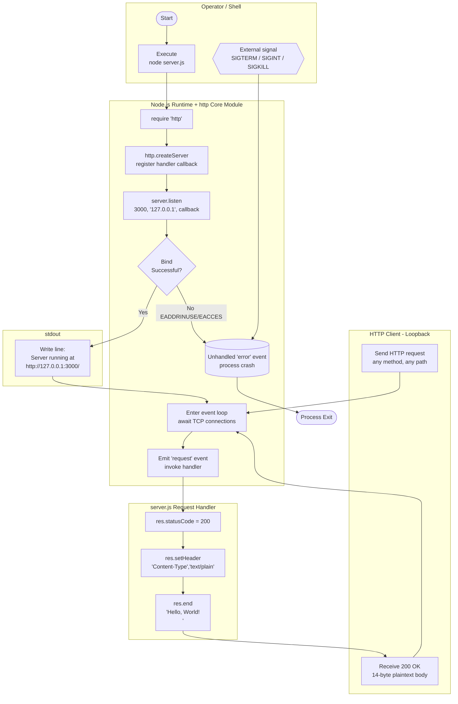

### 4.2.3 Decision Point Inventory

The current implementation contains **zero runtime decision points within the request handler**. Per Section 2.2.2, the handler does not inspect `req.method`, `req.url`, `req.headers`, or the request body. The only implicit decision is binary — the operating system either grants or denies the port bind:

| Decision Point | Location | Branches | Implemented? |
|----------------|----------|----------|--------------|
| Bind success vs. bind failure | Node.js `http` internals | success → listen callback fires; failure → `'error'` event emitted | Yes (success branch only — failure branch is unhandled) |
| URL path routing | (absent) | N/A | No — handler is route-agnostic |
| HTTP method dispatch | (absent) | N/A | No — handler is method-agnostic |
| Header inspection | (absent) | N/A | No — `req.headers` never read |
| Body parsing | (absent) | N/A | No |
| `res.headersSent` check | (absent) | N/A | No — proposed under F-103 only |

---

## 4.3 CORE BUSINESS PROCESSES

### 4.3.1 Process Startup Workflow (W-01)

The startup workflow executes once per process invocation. It comprises six ordered operations, all synchronous from the perspective of user code.

| Step | Source Line | Operation | Failure Mode |
|------|-------------|-----------|--------------|
| 1 | `server.js:1` | `const http = require('http');` — load core module | None (built-in always available) |
| 2 | `server.js:3` | `const hostname = '127.0.0.1';` | None (literal) |
| 3 | `server.js:4` | `const port = 3000;` | None (literal) |
| 4 | `server.js:6` | `http.createServer((req,res) => {…})` — register handler | None (synchronous) |
| 5 | `server.js:12` | `server.listen(port, hostname, callback)` — bind | `EADDRINUSE`, `EACCES`, `ENOTFOUND` — all unhandled |
| 6 | `server.js:13` | `console.log('Server running at…')` — startup log | None (single write to stdout) |

Per Section 2.6.1, port 3000 must be free; the implementation has no fallback port selection and no retry logic on bind failure.

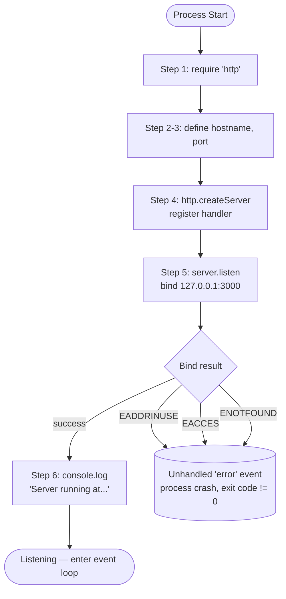

### 4.3.2 HTTP Request Handling Workflow (W-02)

The request handling workflow executes once per inbound HTTP request after a successful bind. Per Section 2.2.2's acceptance criteria F-002-RQ-001 through F-002-RQ-004, the handler is fully idempotent and performs no inspection of request attributes.

| Step | Source Line | Operation | Branches |
|------|-------------|-----------|----------|
| 1 | (Node internal) | Parse incoming bytes; construct `IncomingMessage` | None at user level |
| 2 | `server.js:6` | Invoke handler callback `(req, res) => {…}` | None — single callback |
| 3 | `server.js:7` | `res.statusCode = 200` | None |
| 4 | `server.js:8` | `res.setHeader('Content-Type', 'text/plain')` | None |
| 5 | `server.js:9` | `res.end('Hello, World!\n')` | None |
| 6 | (Node internal) | Serialize response, flush TCP socket | None at user level |

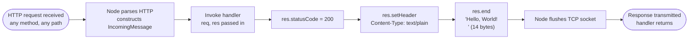

#### Idempotency and Determinism

Per F-002-RQ-003, the response body MUST equal `Hello, World!\n` byte-for-byte (comma after `Hello`, capital `W`, trailing LF). The handler introduces no business-logic latency because it performs no work beyond setting two response properties and writing a fixed string (Section 1.2.3).

### 4.3.3 Process Termination Workflow (W-03)

In the current implementation there is **no implemented termination workflow**. The process continues running indefinitely until an external actor delivers a signal. Because no `SIGTERM`, `SIGINT`, or `process.on('exit', …)` handler is registered, signal delivery causes immediate termination with no opportunity for cleanup. Per Section 1.2.1 (Gap #2 and Gap #6), this means:

- In-flight HTTP requests are dropped without response;
- TCP sockets are closed by the OS rather than gracefully via `server.close()`;
- No "shutting down" log line is emitted;
- The process exit code reflects the signal that terminated it (typically 130 for SIGINT, 143 for SIGTERM).

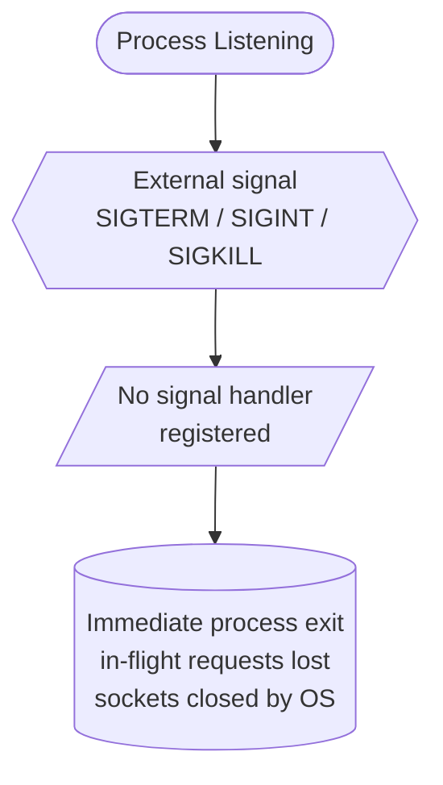

---

## 4.4 INTEGRATION WORKFLOWS

### 4.4.1 Data Flow Between Systems

Per Section 1.2.1 and Section 2.5.2, the system has **no external integrations of any kind**. The only data flows that exist are:

| Data Flow | Source | Destination | Volume | Format |
|-----------|--------|-------------|--------|--------|
| Inbound HTTP request | Loopback client | `server.js` handler (discarded) | Per request | HTTP/1.1 |
| Outbound HTTP response | `server.js` handler | Loopback client | Per request | HTTP/1.1, 14-byte plaintext body |
| Startup log | `server.js` listen callback | stdout | One line per process | Plain text |

Databases, REST/GraphQL APIs, message brokers, auth providers, TLS terminators, and observability backends are **explicitly absent** (Section 2.5.2). No driver imports, connection strings, HTTP client libraries, queue clients, or APM agents exist in the codebase.

### 4.4.2 API Interactions

The system makes **zero outbound API calls**. The only inbound "API" is the implicit "any request → fixed response" pattern realized by F-002. No API contract or schema is published; per Section 1.3.2 "Unsupported Use Cases", no API versioning or backward compatibility guarantees exist.

### 4.4.3 Event Processing Flows

The Node.js `http` module emits several events; the user code in `server.js` subscribes to exactly one, indirectly:

| Event Source | Event Name | Subscriber in `server.js`? | Outcome on Emission |
|--------------|------------|---------------------------|---------------------|
| `Server` | `'request'` | Yes — via the callback passed to `http.createServer()` | Handler executes |
| `Server` | `'listening'` | Yes — via the callback passed to `server.listen()` | Startup log emitted |
| `Server` | `'error'` | **No** | Process crashes (Section 1.2.1, Gap #1) |
| `Server` | `'clientError'` | **No** | Connection-level crash (Section 1.2.1, Gap #4) |
| `Server` | `'close'` | No | N/A — `server.close()` is never called |
| `process` | `'SIGTERM'` | **No** | Immediate termination (Section 1.2.1, Gap #2) |
| `process` | `'SIGINT'` | **No** | Immediate termination |
| `process` | `'uncaughtException'` | No | Default Node.js behavior — process crash |

### 4.4.4 Batch Processing Sequences

No batch jobs, scheduled tasks, cron triggers, worker threads, or queue consumers exist (Section 2.6.3). There is no batch processing surface in the codebase.

### 4.4.5 Integration Sequence Diagrams

#### 4.4.5.1 Successful Request Sequence

The following sequence diagram traces a single successful request from the loopback client through the TCP/HTTP stack into the handler and back. It illustrates the absence of any branching, validation, or external lookups.

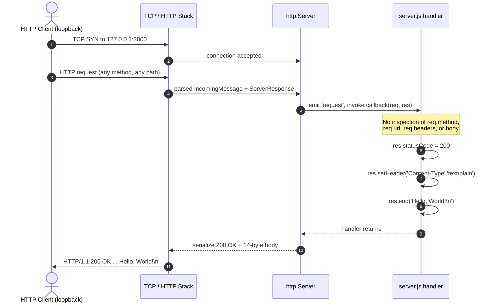

#### 4.4.5.2 Startup Sequence (Success and Failure Branches)

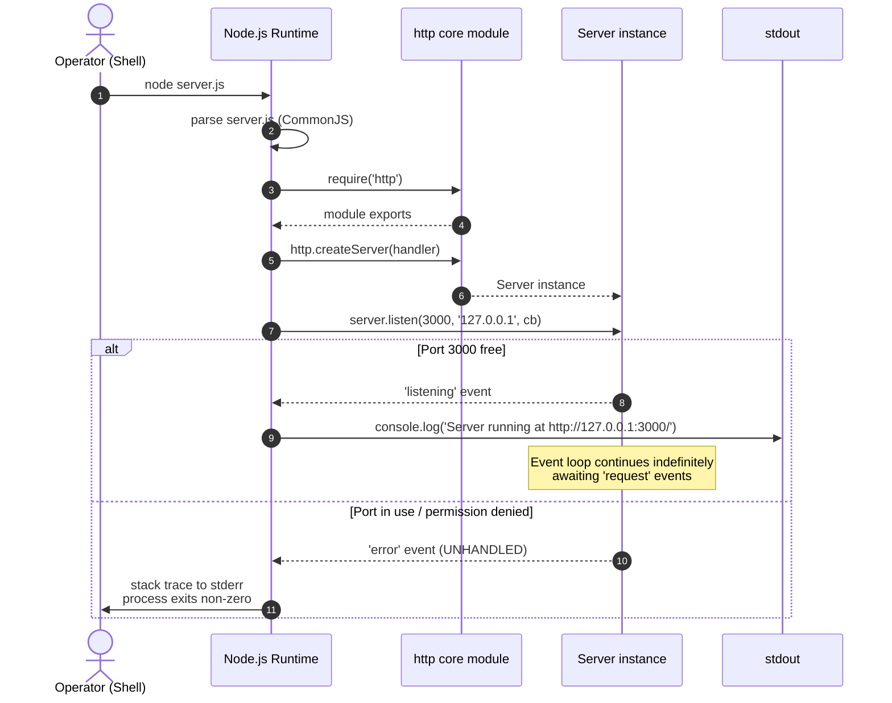

---

## 4.5 VALIDATION RULES

### 4.5.1 Business Rules

The only invariant business rule (per F-002-RQ-003 and F-002-RQ-004) governs the response itself:

| Rule | Enforcement | Source |
|------|-------------|--------|
| Response body MUST equal `Hello, World!\n` byte-for-byte | Hardcoded string literal | `server.js:9` |
| Response body MUST NOT vary per request (idempotency) | Static literal — no template, no interpolation | `server.js:9` |
| Status code MUST be `200` for every request | Hardcoded assignment | `server.js:7` |
| Content-Type MUST be `text/plain` | Hardcoded `setHeader` call | `server.js:8` |
| Handler MUST be route- and method-agnostic | Absence of `req.method` / `req.url` reads | `server.js:6–10` |
| Listener MUST bind to loopback only (`127.0.0.1`) | Hardcoded hostname literal | `server.js:3, 12` |
| Listener MUST bind to port `3000` (no fallback) | Hardcoded port literal | `server.js:4, 12` |

### 4.5.2 Data Validation Requirements

**No data validation is performed.** Per Section 2.6.4, input validation is verified absent across the codebase. No request body parsing, no query-string parsing, no header validation, and no schema enforcement exist. The proposed F-105 (Request/Response Object Input Validation in Section 2.3.5) would add a single defensive guard `if (!req || !res) { return; }` but is not currently implemented.

### 4.5.3 Authorization Checkpoints

**No authorization checkpoints exist.** Per Section 2.6.4, authentication, authorization, and access control are explicitly absent — no OAuth, OIDC, SAML, or basic-auth libraries are imported. The implicit security boundary is the loopback binding itself (`127.0.0.1` precludes external access). Per Section 2.3.7, hardening constraints explicitly forbid the introduction of authentication, TLS, or any access-control logic during the proposed remediation phase.

### 4.5.4 Regulatory Compliance Checks

No regulatory compliance frameworks (GDPR, HIPAA, PCI-DSS, SOX, etc.) are addressed. Every feature requirement under F-001 through F-006 in Section 2.2 lists "Compliance Requirements: None" or "None documented." No PII is processed at runtime — the orphan `phonenumber.csv` fixture (F-006) contains synthetic data and is not consumed by the executable code (Section 2.2.6).

---

## 4.6 STATE MANAGEMENT

### 4.6.1 Process Lifecycle State Transitions

The application is **fully stateless at the business-logic level** (Section 2.6.3). The only state that exists is the process lifecycle itself — managed by Node.js — and the TCP socket bookkeeping internal to the `http` module. The user code in `server.js` retains no in-memory state across requests.

| State | Entry Trigger | Exit Trigger | Next State |
|-------|--------------|--------------|------------|
| Not Started | — | `node server.js` invoked | Initializing |
| Initializing | Process spawn | Module load complete | Binding |
| Binding | `server.listen()` called | Bind result delivered | Listening (success) or Crashed (failure) |
| Listening | `'listening'` event fires | `'request'` event fires | Handling Request |
| Listening | `'listening'` event fires | External signal | Terminated |
| Handling Request | Handler invoked | `res.end()` returns | Listening |
| Handling Request | Handler invoked | Synchronous exception | Crashed |
| Crashed | Unhandled error event | Process exits | — |
| Terminated | External signal | Process exits | — |

Note: There is no formal **Shutting Down** state — the absence of signal handlers means the Listening state transitions directly to Terminated without any cleanup phase.

### 4.6.2 State Transition Diagram

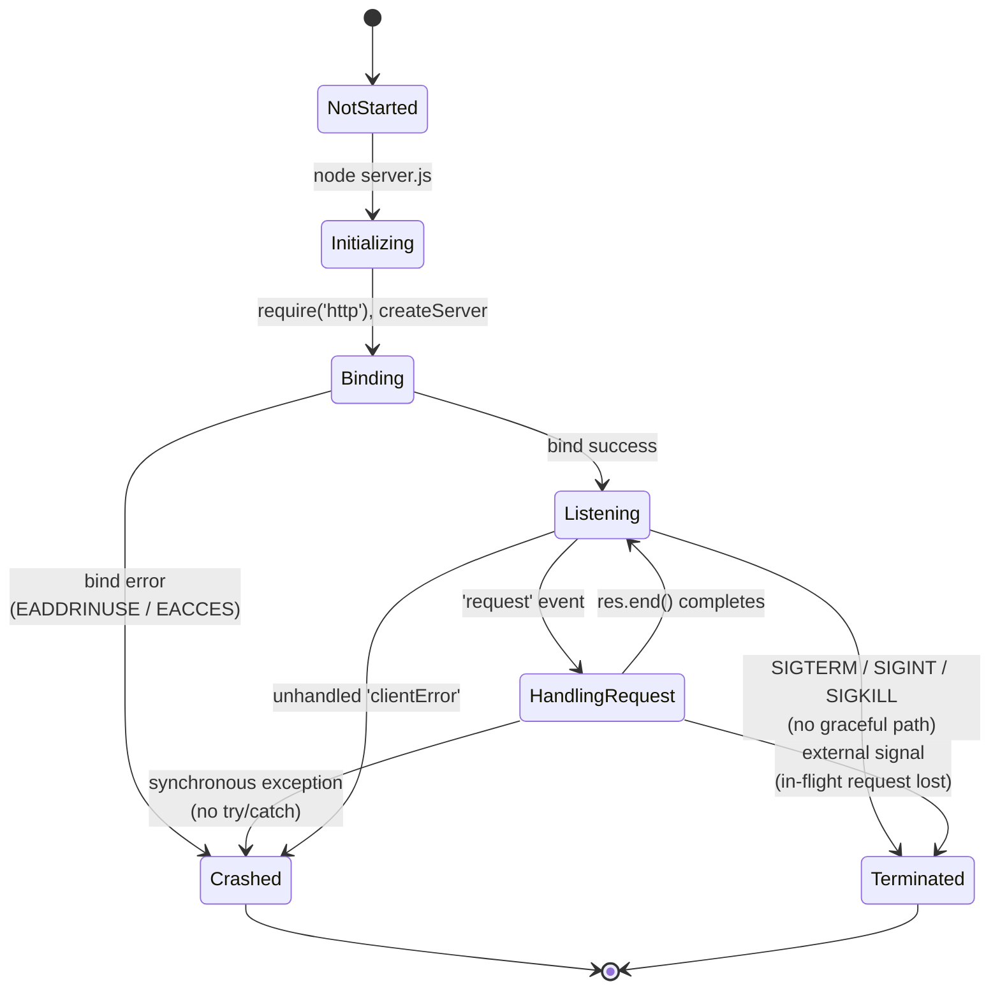

### 4.6.3 Data Persistence Points

**No data persistence points exist.** Per Section 2.6.4 and Section 1.3.2:

- No database connectivity (no driver imports, no connection strings);
- No file I/O beyond stdout logging (no `fs` module usage);
- No cache writes;
- No session storage;
- No cookies.

### 4.6.4 Caching Requirements

**No caching layer exists.** No in-memory cache, no Redis, no Memcached, no HTTP `Cache-Control` headers are set. Because the response body is a fixed string literal, no caching benefit would exist at the application layer.

### 4.6.5 Transaction Boundaries

**No transaction boundaries exist** because no transactional resources participate. With no database, no message broker, and no external API in scope, the concept of atomic, isolated, or durable operations does not apply. The request-handling workflow (W-02) is a single synchronous critical path with no rollback semantics.

---

## 4.7 ERROR HANDLING (CURRENT STATE)

### 4.7.1 Current Failure Modes

The implementation has **no error handling paths**. Per Section 1.2.1, the six production-readiness gaps documented in `Response.txt` exhaustively enumerate the unhandled failure modes:

| # | Failure Mode | Trigger | Current Outcome |
|---|--------------|---------|-----------------|
| 1 | Bind failure | Port 3000 in use (`EADDRINUSE`) or insufficient privileges (`EACCES`) | Process crash with stack trace to stderr |
| 2 | SIGTERM/SIGINT | Operator Ctrl+C or orchestrator-driven termination | Immediate process exit; in-flight requests lost |
| 3 | Handler exception (synchronous) | Theoretical — handler currently cannot throw | Process crash via uncaught exception |
| 4 | Malformed HTTP request | Buggy client or hostile scanner | `'clientError'` event unhandled — connection-level crash |
| 5 | Undefined `req` or `res` | Theoretical framework-contract violation | `TypeError` on first property access — process crash |
| 6 | Resource leakage | Sockets/handles not released on shutdown | OS reclaims resources after process death |

### 4.7.2 Error Handling Flowchart (Current)

The following flowchart depicts the current paths taken when any of the failure modes above is triggered. All terminal nodes converge on process or connection death — there are no recovery paths.

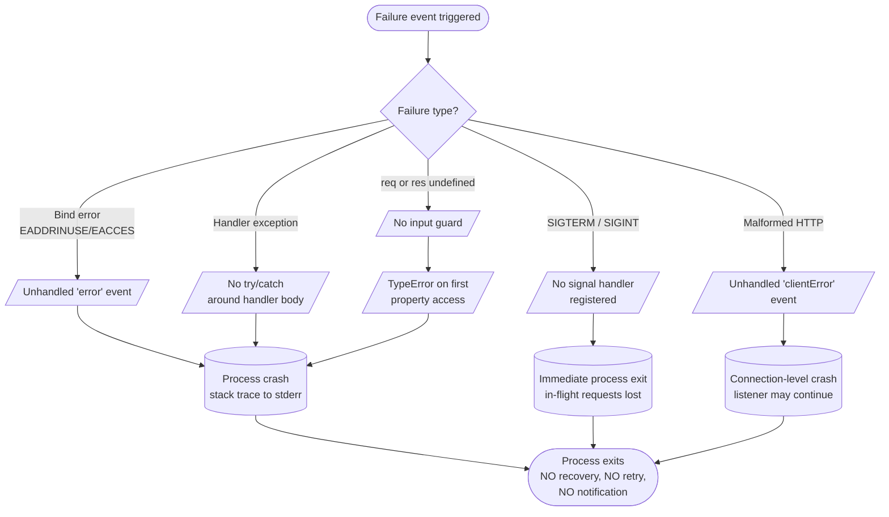

### 4.7.3 Retry, Fallback, Notification, Recovery

Per Section 1.2.1 and Section 2.6.4, none of the conventional error-handling primitives are present:

| Mechanism | Current Implementation |
|-----------|------------------------|
| Retry mechanisms | None — no retry on bind failure, no request-level retry |
| Fallback processes | None — no degraded mode, no alternate port, no alternate response |
| Error notification flows | None — no email, no webhook, no APM integration |
| Recovery procedures | None — operator must manually restart the process after a crash |
| Circuit breakers | Not applicable — no external dependencies to circuit-break |
| Dead-letter queues | Not applicable — no message processing |

---

## 4.8 PROPOSED HARDENING WORKFLOWS

The following four workflows correspond to the proposed features F-101 through F-106 in Section 2.3. **None of these workflows are present in the current `server.js`** — the file remains 15 lines without any of these capabilities. Diagrams in this subsection use dashed outlines to highlight proposed-only behavior consistent with the convention introduced in Section 2.5.1.

### 4.8.1 F-101: Server-Level Error Event Handling Flow (Proposed)

Per Section 2.3.1, F-101 would register `server.on('error', (error) => {…})` to capture bind-time failures, emit a diagnostic log line, and exit cleanly with status 1. The flow disambiguates the three error codes called out in F-101-RQ-001.

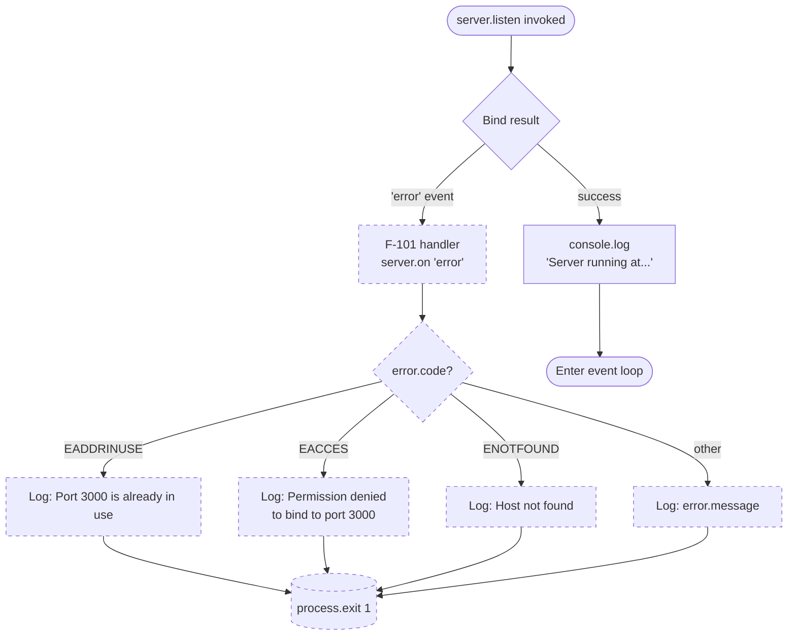

### 4.8.2 F-102 & F-106: Graceful Shutdown Flow (Proposed)

Per Section 2.3.2, F-102 would register handlers for both `SIGTERM` and `SIGINT` that invoke a shared `gracefulShutdown(signal)` function. The function calls `server.close()` and enforces a 10-second force-exit timeout. Per Section 2.3.6, F-106 provides a cleanup-hook placeholder inside the close callback.

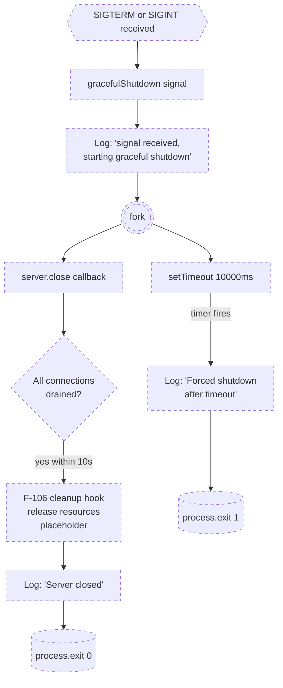

### 4.8.3 F-103 & F-105: Request Handler Exception Protection Flow (Proposed)

Per Section 2.3.3, F-103 would wrap the handler body in `try/catch` and emit a `500 Internal Server Error` response when `res.headersSent === false`. Per Section 2.3.5, F-105 would guard against undefined `req` or `res`.

```mermaid
flowchart TD
    Req([HTTP request arrives]) --> G{F-105 guard:<br/>req && res?}
    G -- no --> Ret([Return early<br/>no response])
    G -- yes --> Try[F-103: enter try block]
    Try --> S1[res.statusCode = 200]
    S1 --> S2[res.setHeader<br/>Content-Type: text/plain]
    S2 --> S3["res.end<br/>'Hello, World!\n'"]
    S3 --> OK([Response sent<br/>handler returns])
    S1 -. exception .-> Catch[F-103: catch block]
    S2 -. exception .-> Catch
    S3 -. exception .-> Catch
    Catch --> Log[Log: 'Error handling request:<br/>{error.message}']
    Log --> Sent{res.headersSent?}
    Sent -- no --> Err[res.statusCode = 500<br/>res.end<br/>'Internal Server Error']
    Err --> OK
    Sent -- yes --> Abandon([Cannot recover<br/>headers already flushed])
    Abandon --> OK

    classDef proposed stroke-dasharray: 5 5;
    class G,Ret,Try,Catch,Log,Sent,Err,Abandon proposed;
```

### 4.8.4 F-104: `clientError` Handling Flow (Proposed)

Per Section 2.3.4, F-104 would register `server.on('clientError', (error, socket) => {…})` to short-circuit malformed HTTP requests by emitting an HTTP 400 status line and closing the socket without crashing the listener.

```mermaid
flowchart TD
    Mal[/Malformed HTTP bytes<br/>from socket/] --> Emit{{Node emits 'clientError'}}
    Emit --> H[F-104 listener]
    H --> Log[Log: 'Client error: {message}']
    Log --> W{socket.writable?}
    W -- yes --> Reply[socket.end<br/>'HTTP/1.1 400 Bad Request\r\n\r\n']
    W -- no --> Drop[Drop socket silently]
    Reply --> Resume([Listener resumes<br/>no process exit])
    Drop --> Resume

    classDef proposed stroke-dasharray: 5 5;
    class Emit,H,Log,W,Reply,Drop,Resume proposed;
```

### 4.8.5 Hardening Scope Constraints

Per Section 2.3.7, the proposed workflows above are subject to strict scope constraints that govern any implementation effort:

- **Metadata immutability**: `package.json`, `package-lock.json`, and `README.md` MUST NOT be modified.
- **Behavioral immutability**: Port `3000`, hostname `127.0.0.1`, and response body `Hello, World!\n` MUST be preserved byte-for-byte.
- **Dependency immutability**: No npm packages may be added — the zero-dependency posture of F-004 must be preserved.
- **Surface immutability**: No new routes, authentication, HTTPS/TLS, clustering, health endpoints, or metrics may be introduced.

These constraints mean that no proposed workflow may alter the high-level diagram in Section 4.2.2 except by inserting branches around bind failure, signal delivery, and exception paths — they do not change the steady-state request/response cycle.

---

## 4.9 TIMING AND SLA CONSIDERATIONS

### 4.9.1 Current Implementation (No Formal SLAs)

Per Section 2.6.2, the repository defines **no formal performance SLAs**. The implicit performance profile is bounded only by the underlying Node.js `http` module's capabilities; the application introduces no business-logic latency because the request handler performs no work beyond setting two response properties and writing a fixed string (Section 1.2.3).

The derived informal acceptance signals (which apply to W-01 and W-02 above) are:

| Workflow | Objective | Target | Source |
|----------|-----------|--------|--------|
| W-01 Startup | Startup success rate on free port 3000 | 100% | Section 1.2.3 |
| W-01 Startup | Startup log emitted on stdout | 100% of successful launches | F-003-RQ-001 |
| W-02 Request | HTTP 200 response rate | 100% of requests | Section 1.2.3 |
| W-02 Request | Response body byte-exact match | 100% | F-002-RQ-003 |
| W-02 Request | Handler synchronous completion | No async operations introduce wait time | Section 1.2.2 |

### 4.9.2 Proposed Targets (Forward-Looking, Not Committed)

`Response.txt` mentions aspirational figures that would apply only to the proposed hardened variant. Per Section 2.6.2, these are **not committed SLAs** of the current build:

| Aspirational Target | Value | Applies To |
|---------------------|-------|------------|
| Response time per request | < 50 ms | Hardened variant only |
| Memory footprint (RSS) | < 50 MB | Hardened variant only |
| Concurrent connection capacity | 100+ | Hardened variant only |
| Graceful shutdown completion | ≤ 10 seconds (F-102 timeout) | W-06 (proposed) |

The 10-second timeout in F-102's graceful shutdown flow (Section 4.8.2) is the only timing constraint embedded in any proposed workflow. There are no per-request timeouts, no read/write idle timeouts, no keep-alive timeouts beyond Node.js defaults, and no circuit-breaker thresholds.

### 4.9.3 Concurrency and Capacity Constraints

| Dimension | Current Disposition | Source |
|-----------|---------------------|--------|
| Horizontal scaling | Not supported — single-process model | Section 2.6.3 |
| Clustering | Explicitly out of scope | Section 1.3.2 |
| Load balancing | Not applicable — loopback binding precludes upstream proxying | Section 2.6.3 |
| Concurrency model | Standard Node.js event-loop callbacks; no Promises, async/await, streams, or worker threads in user code | Section 1.2.2 |
| Vertical scaling | Limited only by Node.js event-loop characteristics | Section 2.6.3 |

---

## 4.10 Related Workflow References

Cross-references to capabilities documented elsewhere in this specification:

| Workflow | Related Section | Reason |
|----------|-----------------|--------|
| W-01 Startup | Section 2.2.1 (F-001) | Acceptance criteria for the listener |
| W-02 Request | Section 2.2.2 (F-002) | Acceptance criteria for the response |
| W-01 Step 6 | Section 2.2.3 (F-003) | Startup log requirements |
| W-04 Bind failure | Section 1.2.1, Gap #1 | Documented production gap |
| W-05 (proposed) | Section 2.3.1 (F-101) | Server-level error handler |
| W-06 (proposed) | Sections 2.3.2 (F-102), 2.3.6 (F-106) | Graceful shutdown + cleanup |
| W-07 (proposed) | Sections 2.3.3 (F-103), 2.3.5 (F-105) | Handler exception + input guard |
| W-08 (proposed) | Section 2.3.4 (F-104) | `clientError` handler |
| W-09 (not implemented) | Section 2.4 | Original `/hello` requirement (F-201) |
| Integration topology | Section 1.2.1 | High-level system context |
| Feature dependency graph | Section 2.5.1 | Notation convention for proposed edges |

---

## 4.11 References

#### Files Examined

- `server.js` — The canonical 15-line HTTP server source; the entire executable substrate of every workflow diagrammed in this section. Lines 1–6 source W-01 (Steps 1–4), lines 7–9 source W-02 (Steps 3–5), lines 12–14 source W-01 (Steps 5–6).
- `package.json` — Confirmed zero-dependency manifest; informs the absence of any framework-driven middleware or third-party event handlers in the workflows.
- `package-lock.json` — npm lockfile v3 with root-only self-reference; corroborates the empty dependency tree underlying all workflow assumptions.
- `README.md` — Two-line project description establishing the artifact's framing as a test fixture for backprop integration.
- `Response.txt` — Source of the proposed hardening features F-101 through F-106; the basis for forward-looking workflows W-05 through W-08 in Section 4.8.
- `codebase_context (42).md` — Source of the unimplemented original requirement F-201 (the `/hello` routed endpoint workflow W-09).
- `phonenumber.csv` — Orphan data fixture; confirmed not consumed by any workflow.
- `Test.test..js`, `!@#$%^&().js`, and the long-name JavaScript file — Byte-identical duplicates of `server.js` per F-005; each is an alternate entry point that executes the identical W-01/W-02 workflows.

#### Folders Examined

- Repository root (depth 0) — Flat structure with no subdirectories; all files reside at the root. This was confirmed by direct enumeration.

#### Technical Specification Sections Referenced

- Section 1.2 SYSTEM OVERVIEW — Operational topology, six production-readiness gaps, absent integrations matrix, hardcoded constants.
- Section 1.3 SCOPE — In-scope user workflow, out-of-scope capabilities matrix, unsupported use cases.
- Section 2.2 IMPLEMENTED FEATURES — Acceptance criteria for F-001 through F-006; business rules for the workflows.
- Section 2.3 PROPOSED HARDENING FEATURES — Specifications for F-101 through F-106; hardening scope constraints.
- Section 2.4 UNIMPLEMENTED ORIGINAL REQUIREMENTS — F-201 (`/hello` routing — not implemented; corresponds to W-09).
- Section 2.5 FEATURE RELATIONSHIPS — Notation convention for solid vs. dashed edges; integration points table; shared components.
- Section 2.6 IMPLEMENTATION CONSIDERATIONS — Technical constraints, performance objectives, scalability disposition, security implications.

# 5. System Architecture

## 5.1 HIGH-LEVEL ARCHITECTURE

### 5.1.1 System Overview

#### Architecture Style and Rationale

The `hao-backprop-test` system implements a **single-process, single-file, stateless monolith** that fulfils exactly one capability: respond to every HTTP request received on `127.0.0.1:3000` with a fixed `200 OK` / `Content-Type: text/plain` / `Hello, World!\n` response, and emit a single startup line to standard output. The entire executable surface is a 15-line CommonJS file (`server.js`) using only Node.js's built-in `http` module — no third-party npm packages, no internal sub-modules, no transport-abstraction layer, no business-logic layer, and no persistence layer.

The chosen architecture style is deliberate rather than incidental. As established in Section 3.1.1, the stack is "the smallest viable surface that can host a network-reachable HTTP listener." The repository's stated role — an internal test fixture for the "backprop" integration named in the `README.md` — does not require, and explicitly excludes (Section 1.3.2), the architectural elaborations associated with production-grade systems: databases, caches, authentication, TLS, message brokers, observability backends, containerization, CI/CD, or any new dependencies. The single-tier monolith is the most direct expression of this scope.

#### Key Architectural Principles

The implementation observed across `server.js`, `package.json`, and `package-lock.json` consistently embodies five architectural principles:

- **Deliberate Minimalism** — The system implements one capability with no optional surfaces, branches, or modes. Every line in `server.js` is load-bearing.
- **Zero-Dependency Posture (F-004)** — `package.json` declares no `dependencies` and no `devDependencies`; `package-lock.json` (lockfileVersion 3) contains only a root self-reference. The proposed hardening plan in `Response.txt` preserves this invariant.
- **Behavioral Determinism** — Every request, regardless of method, path, headers, or body, produces a byte-identical response. The handler does not inspect `req.method`, `req.url`, `req.headers`, or the request body (Section 4.2.3).
- **Configuration as Code** — The hostname `'127.0.0.1'`, port `3000`, and response body `'Hello, World!\n'` are hardcoded as `const` literals. There are no `process.env` reads, no `.env` files, and no configuration modules.
- **Stateless, Synchronous Handling** — The request handler is a pure function-style callback that retains no state across invocations and uses no Promises, async/await, streams, or worker threads.

#### System Boundaries and Major Interfaces

The system has a single, narrow boundary established by the loopback TCP listener:

| Boundary Dimension | Realization |
|--------------------|-------------|
| Process boundary | A single Node.js process on a single host |
| Network boundary | Loopback adapter only (`127.0.0.1:3000`) — not externally reachable |
| Data domain boundary | None — no business data is processed or persisted |
| Implicit security boundary | The loopback binding itself precludes remote access (Section 2.6.4) |

The only "major interfaces" exposed by the system are the loopback HTTP listener on port 3000 and a single line emitted to standard output during startup.

### 5.1.2 Core Components Table

The repository contains ten files at its root with no directory hierarchy. The table below reflects only components with a runtime or architectural role; metadata-only and tooling-resilience files are noted in the rows that follow.

| Component | Primary Responsibility | Key Dependencies | Critical Considerations |
|-----------|------------------------|------------------|-------------------------|
| `server.js` (HTTP Server) | Instantiate `http.Server`, bind to `127.0.0.1:3000`, dispatch fixed 200/text-plain response, log startup line | Node.js `http` core module; `console` global | Sole runtime entry; exports nothing; not importable as a library |
| `package.json` (Package Manifest) | Declare npm metadata (`hello_world` v1.0.0, MIT, author `hxu`) and zero-dependency posture | None | `main: "index.js"` references a file that does not exist in the repository |
| `package-lock.json` (Lockfile) | Pin the empty dependency tree (lockfileVersion 3) | None | Contains only a root self-reference in `packages[""]` |
| `README.md` (Project README) | Identify the project as `hao-backprop-test` ("test project for backprop integration") | None | Two lines; sole human-readable documentation in the repository |
| `Response.txt` (Remediation Spec) | JSON-wrapped Markdown "Agent Action Plan" documenting six production-readiness gaps and proposed hardening (F-101 – F-106) | None | Specification artefact; no runtime role |
| `codebase_context (42).md` | Capture the original natural-language requirement for a `/hello` endpoint returning "Hello world" | None | Diverges from current implementation (no routing; body differs) |
| `phonenumber.csv` (Orphan Fixture) | 15-row CSV of synthetic `message,phonenumber` rows | None | **Not loaded by any code** — confirmed by absence of `fs` usage in `server.js` |
| `Test.test..js`, `!@#$%^&().js`, long-name `.js` file | Byte-identical duplicates of `server.js` exercising filesystem tooling (F-005) | Same as `server.js` if executed | Not test fixtures; no test runner is configured |

### 5.1.3 Data Flow Description

#### Primary Data Flows

Three runtime data flows exist; all are direct, single-hop, and have no intermediate stages, queues, transformations, or persistence:

1. **Inbound HTTP request** — A loopback HTTP client sends an HTTP/1.1 request (any method, any path) over TCP to `127.0.0.1:3000`. The Node.js `http` core module parses the request into an `IncomingMessage` (`req`) and a `ServerResponse` (`res`), then emits the `'request'` event into the handler callback registered by `server.js`. The handler **discards** all inbound request data — `req.method`, `req.url`, `req.headers`, and the body are never read.
2. **Outbound HTTP response** — The handler executes three synchronous operations against the `ServerResponse`: `res.statusCode = 200`, `res.setHeader('Content-Type', 'text/plain')`, `res.end('Hello, World!\n')`. The `http` module serialises a 200 OK status line, a single header, and a 14-byte plaintext body back to the loopback client.
3. **Startup log** — On successful bind, the `server.listen` callback emits exactly one line — `Server running at http://127.0.0.1:3000/` — to standard output via `console.log`.

#### Integration Patterns and Protocols

The only protocol in use is HTTP/1.1 over loopback TCP. There are no integration patterns of any kind — no request/reply over a message bus, no publish/subscribe, no RPC, no streaming, no batch processing. The system is method-agnostic and route-agnostic (Section 4.2.3), so the only "pattern" is "any request → fixed response."

#### Data Transformation Points

**None.** The handler performs no parsing, no validation, no enrichment, no formatting beyond emitting a fixed string literal, and no serialization other than the HTTP framing performed by Node.js's `http` module itself. Because no inbound data is read, no transformation is possible.

#### Key Data Stores and Caches

**None.** Per Section 4.6.3, no data persistence points exist: no database connectivity, no file I/O beyond stdout, no cache writes, no session storage, no cookies. Per Section 4.6.4, no caching layer exists; because the response body is a fixed string literal, no caching benefit would exist at the application layer.

### 5.1.4 External Integration Points

The application has **no external integrations of any kind** (Section 1.2.1, Section 2.5.2). The table below records the verified disposition of every conventional integration category against the observed codebase.

| Integration Category | Status / Disposition | Verification Evidence |
|----------------------|----------------------|-----------------------|
| Loopback HTTP listener (`127.0.0.1:3000`) | **Active** — sole external surface | `server.js` `server.listen(3000, '127.0.0.1', …)` |
| stdout (startup log line) | **Active** — sole observability output | `server.js` `console.log(...)` in listen callback |
| External REST / GraphQL APIs | Absent | No HTTP client code (`fetch`, `axios`, outbound `http.request` all absent) |
| Databases / ORMs | Absent | No driver imports; no connection strings; no `fs` use |
| Authentication / Identity providers | Absent | No OAuth/OIDC/SAML libraries; no JWT validation |
| Message brokers / Queues | Absent | No queue client libraries |
| Email / SMS providers | Absent | `phonenumber.csv` is orphaned and not loaded |
| TLS terminators / Reverse proxies | Absent | Plain HTTP only; loopback binding precludes upstream proxying |
| Observability backends (APM, metrics, tracing) | Absent | Only `console.log` startup line; no agent code |
| Cloud-service SDKs (AWS / GCP / Azure) | Absent | Zero npm dependencies |

Because no external integration exists, no SLA can be negotiated against an external counterpart; the system has no upstream or downstream dependencies beyond the operating-system loopback adapter and the Node.js runtime itself.

---

## 5.2 COMPONENT DETAILS

### 5.2.1 HTTP Server Component (`server.js`)

#### Purpose and Responsibilities

`server.js` is the sole runtime component and realizes three implemented features:

- **F-001 HTTP Server Listener Lifecycle** — Instantiate the `http.Server`, bind to `127.0.0.1:3000`, and remain listening until externally terminated.
- **F-002 Fixed Plaintext Response Generation** — Execute, for every inbound request, a three-operation synchronous response (set status, set header, end body).
- **F-003 Startup Console Logging** — On successful bind, emit exactly one line `Server running at http://127.0.0.1:3000/` to stdout.

#### Technologies and Frameworks

- JavaScript using CommonJS module syntax (`require()` style is mandated by `Response.txt §0.7`).
- Node.js runtime (no version pinned — `package.json` lacks an `engines` field).
- Node.js built-in `http` core module — line 1: `const http = require('http')`.
- Node.js `console` global — used once in the listen callback.
- Stylistic conventions: `const` declarations, arrow-function callbacks, 2-space indentation, semicolons.

#### Key Interfaces and APIs

| Surface | Description |
|---------|-------------|
| Inbound TCP listener | `127.0.0.1:3000` accepting any HTTP/1.1 request |
| Outbound HTTP response | `HTTP/1.1 200 OK`, `Content-Type: text/plain`, 14-byte body `Hello, World!\n` |
| Standard output | Single startup line `Server running at http://127.0.0.1:3000/` |
| Module exports | **None** — `server.js` has no `module.exports`; not importable as a library |

#### Data Persistence Requirements

**None.** Per Section 4.6.3, the component holds no state across requests. Application state is entirely ephemeral and in-memory per process lifecycle. The only state tracked is internal to Node.js's `http` module (TCP socket bookkeeping) and the process lifecycle itself (Section 4.6.1).

#### Scaling Considerations

| Dimension | Disposition |
|-----------|-------------|
| Horizontal scaling | Not supported — single-process model |
| Vertical scaling | Limited only by Node.js event-loop characteristics |
| Concurrency model | Standard Node.js event-loop callbacks; no Promises, async/await, streams, or worker threads in user code |
| Load balancing | Not applicable — loopback binding precludes upstream proxying |
| Clustering | Explicitly out of scope (Section 1.3.2) |

### 5.2.2 Supporting Components (Metadata and Fixtures)

The non-executable components in the repository play three distinct roles. None of them have runtime behaviour, but their presence shapes the system architecture.

| Component | Role | Architectural Significance |
|-----------|------|----------------------------|
| `package.json` | Declares package identity and zero-dependency posture | Enforces F-004; constrains all proposed hardening (Section 2.3.7) |
| `package-lock.json` | Records empty dependency tree (lockfileVersion 3) | Provides reproducible install (`npm install` produces no `node_modules`) |
| `README.md` | Identifies project as `hao-backprop-test` integration fixture | Sole human-readable description |
| `Response.txt` | Specifies six gaps and proposed F-101 – F-106 hardening | Future-state architecture spec; not implemented |
| `codebase_context (42).md` | Records original `/hello` requirement (F-201) | Documents divergence between intent and implementation |
| `phonenumber.csv` | Orphan synthetic data fixture (F-006) | Not loaded; demonstrates absence of `fs` integration |
| `Test.test..js`, `!@#$%^&().js`, long-name `.js` | Byte-identical duplicates of `server.js` (F-005) | Exercise filesystem/tooling resilience to unusual filenames |

### 5.2.3 Component Interaction Diagram

The diagram below depicts steady-state interactions among the runtime component, Node.js built-in surfaces, the operating-system loopback adapter, and the loopback HTTP client. Dashed edges denote explicitly absent integrations.

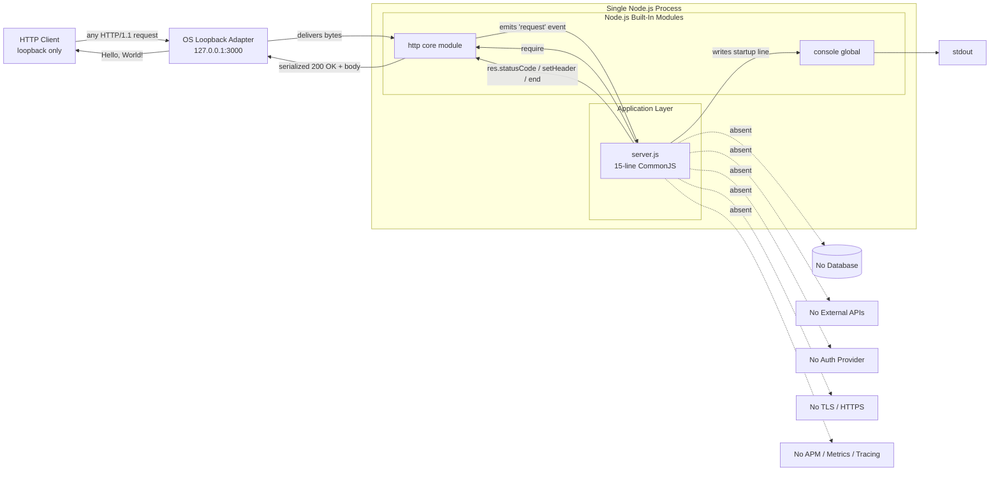

### 5.2.4 State Transition Diagram

The application is stateless at the business-logic level (Section 4.6.1). The only state present is the process lifecycle itself, managed by Node.js. There is **no formal "Shutting Down" state** — the absence of signal handlers means the `Listening` state transitions directly to `Terminated` without cleanup.


### 5.2.5 Sequence Diagrams for Key Flows

#### 5.2.5.1 Successful Request Sequence

The sequence below traces a single successful request from the loopback client through the TCP/HTTP stack into the handler and back. It illustrates the absence of any branching, validation, or external lookups.


#### 5.2.5.2 Startup Sequence (Success and Failure Branches)


---

## 5.3 TECHNICAL DECISIONS

### 5.3.1 Architecture Style Decisions and Trade-offs

The architectural choices observed in the codebase are interrelated: each reinforces the others, and the trade-offs they impose are accepted explicitly through the scope constraints in Section 1.3.2 and the hardening constraints in Section 2.3.7.

| Decision | Rationale | Accepted Trade-off |
|----------|-----------|--------------------|
| Single-file monolith | Smallest viable surface; auditable in seconds | No modularity; no reusability across projects |
| Zero npm dependencies | Reproducibility; zero supply-chain attack surface; near-zero bootstrap | Cannot leverage ecosystem improvements |
| Built-in `http` only (no framework) | Sufficient for F-001–F-003; preserves zero-dependency posture | No middleware ecosystem; routing/parsing must be hand-rolled |
| Loopback-only binding | Implicit security boundary precludes remote access | Not externally reachable without additional infrastructure |
| Hardcoded configuration | Behavioral determinism; reproducibility | No environment portability |
| CommonJS over ES modules | Mandated by `Response.txt §0.7` | Forgoes native ES module benefits |
| Synchronous handler | No async coordination cost | No backpressure handling |
| Stateless | Trivially horizontal-scalable if scaling were in scope | No session/state functionality |
| Method/route-agnostic handler | Trivial, deterministic | Cannot satisfy original F-201 `/hello` requirement |

### 5.3.2 Communication Pattern Choices

| Pattern | Decision | Justification |
|---------|----------|---------------|
| Inbound transport | HTTP/1.1 over loopback TCP | Sufficient for fixture role; preserves zero-dependency posture |
| Outbound communication | **None** | No upstream services; no need for HTTP clients, RPC, or messaging |
| Asynchronous messaging | **Not used** | No queue broker; no scheduled jobs; nothing to publish or consume |
| Streaming / Server-Sent Events | **Not used** | Response body is a 14-byte literal — streaming would add no value |
| Observability emission | `console.log` to stdout once at startup | No APM, metrics, or tracing in scope (Section 3.6.3) |

### 5.3.3 Data Storage Solution Rationale

The system has no data storage component because no business data is processed. Per Section 4.6.3 and Section 4.6.4, this decision flows directly from the system's stateless, deterministic capability.

| Storage Concern | Decision | Justification |
|-----------------|----------|---------------|
| Persistent database | **None** | No business data is processed; no entities to persist |
| In-memory cache | **None** | Response body is a static literal; no caching benefit |
| Session storage | **None** | Handler is stateless; no session lifecycle exists |
| File system access | **None** (no `fs` module use) | `phonenumber.csv` is orphan data, intentionally unread |
| Configuration store | **None** (hardcoded literals) | Behavioral determinism requires fixed configuration |

### 5.3.4 Caching Strategy Justification

No caching layer exists at any tier. No in-memory cache, no Redis, no Memcached, and no HTTP `Cache-Control` headers are set. The response body is a fixed string literal, so caching would not reduce latency or compute cost. Adding a cache would violate F-004 (zero dependencies) and the hardening surface-immutability constraint (Section 2.3.7).

### 5.3.5 Security Mechanism Selection

The system's only security mechanism is the **loopback-only network binding**, which functions as an implicit security boundary by precluding remote access. This is the entirety of the security posture; all conventional security primitives are verified absent (Section 2.6.4).

| Security Primitive | Status | Notes |
|--------------------|--------|-------|
| Authentication (OAuth / OIDC / SAML / basic / API keys / JWT) | Absent | No auth libraries imported |
| Authorization / access control | Absent | No access-control logic |
| TLS / HTTPS | Absent | Plain HTTP only via `http` module |
| Input validation / sanitization | Absent | Handler does not inspect request |
| CORS headers / security headers (Helmet) | Absent | No HTTP security headers set |
| Rate limiting | Absent | No middleware exists |
| Network exposure | Loopback only | `127.0.0.1` binding precludes remote access |

Proposed features F-101–F-106 improve resilience (error handling, graceful shutdown, exception protection) but **explicitly do not introduce** authentication, TLS, authorization, CORS, or rate limiting (Section 2.3.7).

### 5.3.6 Architecture Decision Records

The decision tree below distils the chain of conditional reasoning that produces the observed architecture from the system's purpose.

```mermaid
flowchart TD
    Start([What is the artifact's role?]) --> Role{Internal test<br/>fixture for<br/>'backprop' integration?}
    Role -- yes --> Min[Apply Deliberate Minimalism principle]
    Min --> Q1{Is a database<br/>required?}
    Q1 -- no business data --> NoDB[Decide: no database / no ORM]
    NoDB --> Q2{Is authentication<br/>required?}
    Q2 -- no remote access --> NoAuth[Decide: no auth / no TLS]
    NoAuth --> Q3{Is a framework<br/>required?}
    Q3 -- built-in http is sufficient --> NoFW[Decide: built-in http only]
    NoFW --> Q4{Are external<br/>dependencies allowed?}
    Q4 -- F-004 forbids --> NoDep[Decide: zero npm dependencies]
    NoDep --> Q5{Is configuration<br/>portability required?}
    Q5 -- determinism preferred --> HardCfg[Decide: hardcode literals]
    HardCfg --> Q6{Is horizontal<br/>scaling required?}
    Q6 -- single-process scope --> NoClu[Decide: no clustering]
    NoClu --> Q7{Is observability<br/>tooling required?}
    Q7 -- single fixture --> NoObs[Decide: console.log only]
    NoObs --> Final([Single-process,<br/>single-file, stateless,<br/>loopback-only monolith])
```

The decision records below summarise the principal architecturally significant choices.

| ADR | Decision | Status |
|-----|----------|--------|
| ADR-01 | Use Node.js built-in `http` module as sole transport; no framework | Accepted (implemented) |
| ADR-02 | Maintain zero npm dependencies (no `dependencies` / `devDependencies`) | Accepted (implemented; F-004) |
| ADR-03 | Bind only to loopback `127.0.0.1`; do not accept remote traffic | Accepted (implemented) |
| ADR-04 | Hardcode hostname, port, and response body as `const` literals | Accepted (implemented) |
| ADR-05 | Use CommonJS module syntax exclusively | Accepted (mandated by `Response.txt §0.7`) |
| ADR-06 | Implement handler as synchronous, route-agnostic, method-agnostic | Accepted (implemented) |
| ADR-07 | Defer all production-readiness hardening to F-101–F-106 (proposed only) | Accepted (not implemented) |
| ADR-08 | Reject the original `/hello` routing requirement (F-201) in favour of fixture simplicity | Accepted (intentional divergence) |
| ADR-09 | Preserve metadata, behavioral, and surface immutability under any hardening | Accepted (Section 2.3.7) |

---

## 5.4 CROSS-CUTTING CONCERNS

### 5.4.1 Monitoring and Observability Approach

The system's observability surface consists of **a single line** written to standard output at startup. All conventional observability tooling categories are verified absent.

| Observability Category | Status / Implementation |
|------------------------|-------------------------|
| Application Performance Monitoring (New Relic, Datadog APM, Dynatrace, AppDynamics) | Absent |
| Log aggregation (Datadog Logs, Splunk, ELK, Loggly) | Absent |
| Metrics platforms (Prometheus, StatsD, OpenTelemetry, CloudWatch) | Absent |
| Distributed tracing (Jaeger, Zipkin, AWS X-Ray) | Absent |
| Error tracking (Sentry, Rollbar, Bugsnag) | Absent |
| Health-check endpoints (`/health`, `/ready`) | Absent |
| Startup log to stdout | **Present** — exactly one line via `console.log` (F-003) |

### 5.4.2 Logging and Tracing Strategy

The logging strategy is the minimum that satisfies F-003: emit exactly one human-readable line `Server running at http://127.0.0.1:3000/` to standard output on successful bind. There is no structured logging (no JSON formatting), no log levels (no info/warn/error tiers), no log routing (no transports), no log enrichment (no request IDs, correlation IDs, timestamps in application code), and no distributed tracing (no trace context propagation).

The proposed hardening features F-101 – F-104 introduce additional `console.log`/`console.error` lines (for bind failure, signal receipt, handler exceptions, and `clientError` events), but they remain in the same unstructured, single-stream model — no log shipper is introduced, and no tracing library is added.

### 5.4.3 Error Handling Patterns

The current implementation has **no error handling paths**. The six failure modes documented in `Response.txt` (Section 1.2.1, Section 4.7.1) all converge on either process death or a connection-level crash.

| # | Failure Mode | Trigger | Current Outcome |
|---|--------------|---------|-----------------|
| 1 | Bind failure | Port 3000 in use (`EADDRINUSE`) or insufficient privileges (`EACCES`) | Process crash with stack trace to stderr |
| 2 | SIGTERM / SIGINT | Operator Ctrl+C or orchestrator-driven termination | Immediate process exit; in-flight requests lost |
| 3 | Handler exception (synchronous) | Theoretical — handler currently cannot throw | Process crash via uncaught exception |
| 4 | Malformed HTTP request | Buggy client or hostile scanner | `'clientError'` event unhandled — connection-level crash |
| 5 | Undefined `req` or `res` | Theoretical framework-contract violation | `TypeError` on first property access — process crash |
| 6 | Resource leakage | Sockets/handles not released on shutdown | OS reclaims resources after process death |

Conventional error-handling primitives are uniformly absent from the implementation:

- No retry mechanisms (no retry on bind failure, no request-level retry)
- No fallback processes (no degraded mode, no alternate port, no alternate response)
- No error notification flows (no email, webhook, or APM integration)
- No recovery procedures (operator must manually restart the process after a crash)
- No circuit breakers (no external dependencies to circuit-break)
- No dead-letter queues (no message processing)

The error-handling flowchart in Section 5.4.7 visualises how every failure path leads to termination.

### 5.4.4 Authentication and Authorization Framework

**No authentication or authorization framework is present.** The system implements no identity verification, no access-control logic, no role-based access, no API keys, and no token validation. The loopback-only binding is the entirety of the security posture, functioning as an implicit boundary that prevents remote callers from reaching the listener without additional, unimplemented infrastructure. Section 5.3.5 details the verified-absent security primitives.

### 5.4.5 Performance Requirements and SLAs

The repository defines **no formal SLAs**. Per Section 2.6.2 and Section 4.9.1, the implicit performance profile is constrained only by the Node.js `http` module; the application introduces no business-logic latency because the handler performs no work beyond setting two response properties and writing a fixed string.

The following are derived informal acceptance signals, not committed SLAs:

| Objective | Target | Applies To |
|-----------|--------|------------|
| Startup success rate on free port 3000 | 100% | W-01 Startup |
| Startup log emitted on stdout | 100% of successful launches | W-01 Startup (F-003) |
| HTTP 200 response rate | 100% of requests | W-02 Request |
| Response body byte-exact match (`Hello, World!\n`) | 100% | W-02 Request (F-002) |
| Handler synchronous completion | No async wait time introduced | W-02 Request |

`Response.txt` lists aspirational figures (response time < 50 ms, RSS memory < 50 MB, 100+ concurrent connections, graceful shutdown ≤ 10 s) that would apply only to the proposed hardened variant; they are **not committed SLAs** of the current build (Section 4.9.2).

### 5.4.6 Disaster Recovery Procedures

The system has **no disaster recovery procedures**. On any failure mode in Section 5.4.3, the operator must manually restart the process. The repository contains no process supervisor configuration (no PM2, systemd, forever, or nodemon), no rolling-restart strategy, no backup mechanism, no replica, and no failover host. The proposed hardening features F-101 (server error handler), F-102 (graceful shutdown), and F-106 (resource cleanup hook) would improve termination cleanliness if implemented, but they are not currently implemented and remain subject to the immutability constraints in Section 2.3.7.

### 5.4.7 Error Handling Flow

The flowchart below depicts the current error paths. Every terminal node converges on process or connection death — there are no recovery paths, no retries, and no notifications.

```mermaid
flowchart TD
    F([Failure event triggered]) --> T{Failure type?}
    T -- Bind error<br/>EADDRINUSE/EACCES --> E1[/Unhandled 'error' event/]
    T -- SIGTERM / SIGINT --> E2[/No signal handler<br/>registered/]
    T -- Handler exception --> E3[/No try/catch<br/>around handler body/]
    T -- Malformed HTTP --> E4[/Unhandled 'clientError' event/]
    T -- req or res undefined --> E5[/No input guard/]
    E1 --> Crash[(Process crash<br/>stack trace to stderr)]
    E2 --> Immediate[(Immediate process exit<br/>in-flight requests lost)]
    E3 --> Crash
    E4 --> SockCrash[(Connection-level crash<br/>listener may continue)]
    E5 --> TErr[/TypeError on first<br/>property access/]
    TErr --> Crash
    Crash --> Exit([Process exits<br/>NO recovery, NO retry,<br/>NO notification])
    Immediate --> Exit
    SockCrash --> Exit
```

---

## 5.5 References

#### Files Examined

- `server.js` — 15-line canonical CommonJS HTTP server; sole runtime component; source of F-001, F-002, F-003 behaviour and of the hostname / port / response-body literals cited throughout this section.
- `package.json` — Verified zero `dependencies` and `devDependencies`; declares `hello_world` v1.0.0, MIT, `main: "index.js"` (referenced file not present); placeholder `test` script.
- `package-lock.json` — npm lockfile v3 with only a root self-reference in `packages[""]`; confirms empty dependency tree.
- `README.md` — Two-line file naming the project `hao-backprop-test` / "test project for backprop integration"; sole human-readable documentation.
- `codebase_context (42).md` — Single-line original natural-language requirement for a `/hello` endpoint returning "Hello world"; basis of the F-201 divergence noted in Section 5.3.1.
- `Response.txt` — JSON-wrapped Markdown "Agent Action Plan" specifying six production-readiness gaps and proposed features F-101 – F-106; source of CommonJS mandate (§0.7) and immutability constraints (§0.5) cited in Sections 5.3.1 and 5.4.6.
- `phonenumber.csv` — 15-row synthetic CSV fixture; verified not loaded by any executable code; documents the absence of `fs` module use.
- `Test.test..js`, `!@#$%^&().js`, long-name `.js` file — Byte-identical duplicates of `server.js`; exercise filesystem tooling resilience (F-005); no test runner is configured.

#### Folders Explored

- Repository root `/` (depth 0) — flat layout containing all ten files; no subdirectories.

#### Technical Specification Sections Referenced

- §1.1 EXECUTIVE SUMMARY — Project identification and stakeholder context.
- §1.2 SYSTEM OVERVIEW — Integration topology diagram and six-gap remediation table.
- §1.3 SCOPE — In-scope / out-of-scope capabilities; immutability constraints.
- §2.2 IMPLEMENTED FEATURES — F-001 through F-006 metadata.
- §2.3 PROPOSED HARDENING FEATURES (NOT IMPLEMENTED) — F-101 through F-106; scope constraints in §2.3.7.
- §2.4 UNIMPLEMENTED ORIGINAL REQUIREMENTS — F-201 `/hello` endpoint divergence.
- §2.5 FEATURE RELATIONSHIPS — Feature dependency map and integration-point table.
- §2.6 IMPLEMENTATION CONSIDERATIONS — Technical constraints, performance targets, scalability, security implications.
- §3.1 STACK PHILOSOPHY AND DEFAULT-STACK RECONCILIATION — Deliberate minimalism rationale and absent-layers diagram.
- §3.6 THIRD-PARTY SERVICES — Verified absence of all external integration categories.
- §3.7 DATABASES AND STORAGE — Verified absence of persistence and `fs` use.
- §3.9 SECURITY-RELEVANT TECHNOLOGY CHOICES — Loopback boundary; verified-absent security primitives.
- §3.10 TECHNOLOGY STACK SUMMARY TABLE — Complete stack disposition.
- §4.2 HIGH-LEVEL SYSTEM WORKFLOW — End-to-end journey and swim-laned workflow diagram.
- §4.4 INTEGRATION WORKFLOWS — Data-flow table, event-subscription inventory, sequence diagrams.
- §4.6 STATE MANAGEMENT — Process lifecycle states; state-transition diagram; no persistence / cache / transactions.
- §4.7 ERROR HANDLING (CURRENT STATE) — Six failure modes and current-state flowchart.
- §4.8 PROPOSED HARDENING WORKFLOWS — F-101 – F-106 flow diagrams and hardening constraints.
- §4.9 TIMING AND SLA CONSIDERATIONS — Informal targets; aspirational hardened-variant figures; concurrency disposition.

# 6. SYSTEM COMPONENTS DESIGN

## 6.1 Core Services Architecture

### 6.1.1 Applicability Determination

**Core Services Architecture is not applicable for this system.**

The `hao-backprop-test` repository implements a single-process, single-file, stateless monolith whose entire executable surface is a 15-line CommonJS file (`server.js`) using only Node.js's built-in `http` module. The system fulfils exactly one capability — responding to every HTTP request received on `127.0.0.1:3000` with a fixed `200 OK` / `Content-Type: text/plain` / `Hello, World!\n` response — and emits a single startup line to standard output. There are no third-party npm packages, no internal sub-modules, no transport-abstraction layer, no business-logic layer, and no persistence layer (Section 5.1.1).

Because the system contains no service decomposition, no inter-process communication, no external integrations, and is explicitly constrained to remain a single process bound to the loopback adapter (Section 1.3.2; Section 2.3.7), none of the architectural elements that a Core Services Architecture section is meant to describe — service boundaries, inter-service communication, service discovery, load balancing, circuit breakers, retries, auto-scaling, fault tolerance, failover, or service degradation — exist within the codebase or its supporting artefacts. Each of the required subtopics is documented below as **verified absent** with explicit traceability to the contractual scope and the source-level evidence that justifies the determination.

#### 6.1.1.1 Architectural Verdict Rationale

The "Not Applicable" determination rests on five mutually reinforcing facts established elsewhere in this specification:

1. **Single-tier monolith by design.** The architecture is characterized as a "single-process, single-file, stateless monolith that fulfils exactly one capability" (Section 5.1.1). The single-tier monolith is described as "the most direct expression of this scope" — chosen deliberately rather than incidentally.
2. **Zero external integrations.** Section 5.1.4 enumerates every conventional integration category (external REST/GraphQL APIs, databases/ORMs, authentication/identity providers, message brokers/queues, email/SMS providers, TLS terminators/reverse proxies, observability backends, cloud-service SDKs) and records each as absent with verification evidence.
3. **Zero npm dependencies.** `package.json` declares no `dependencies` and no `devDependencies`; `package-lock.json` (lockfileVersion 3) contains only a root self-reference (Section 5.1.1). ADR-02 makes this an accepted, implemented invariant (Section 5.3.6).
4. **Loopback-only network exposure.** ADR-03 binds the listener exclusively to `127.0.0.1`; the loopback binding "precludes any upstream proxying or load balancing" (Section 2.6.3; Section 5.3.6).
5. **Hardening constraints forbid distributed-systems elaborations.** Section 2.3.7 establishes "surface immutability": no new routes, authentication, HTTPS/TLS, **clustering**, health endpoints, or metrics may be introduced. This applies prospectively to the proposed hardening features F-101 – F-106 and confirms that the monolithic posture is not merely incidental but contractually preserved.

#### 6.1.1.2 Repository Role Context

The `README.md` identifies the project as `hao-backprop-test` — a "test project for backprop integration" — confirming that the artefact is an **internal test fixture** rather than a market-facing product (Section 5.1.1). It is not deployed to production, is not exposed to external network traffic, and has no upstream consumers or downstream dependencies beyond the operating-system loopback adapter and the Node.js runtime itself (Section 5.1.4).

#### 6.1.1.3 Determination Summary

| Required Topic Cluster | Determination | Primary Source of Evidence |
|------------------------|---------------|----------------------------|
| Service Components | Not Applicable | Section 5.1.1; Section 5.1.4 |
| Scalability Design | Not Applicable | Section 2.6.3; Section 5.2.1 |
| Resilience Patterns | Not Applicable | Section 5.4.3; Section 5.4.6 |

---

### 6.1.2 Service Components — Verified Absent

The system has no service components in the architectural sense. The only runtime component is `server.js`, which is the entire application; it has no callers and no callees beyond Node.js core modules and the loopback adapter. The table below records the disposition of each service-component concern enumerated in the section prompt against verified source-code and specification evidence.

#### 6.1.2.1 Service Boundaries and Responsibilities

There is exactly one runtime boundary in the system: a single Node.js process on a single host (Section 5.1.1). The architecture has no internal sub-module boundary because `server.js` is the only source file with a runtime role, and it exposes no `module.exports`, making it non-importable as a library (Section 5.2.1). The four byte-identical duplicate files (`Test.test..js`, `!@#$%^&().js`, the long-name `.js` file) are not independent services — they are tooling-resilience fixtures that exercise unusual filenames (Section 5.1.2; F-005).

| Boundary Dimension | Realization | Source |
|--------------------|-------------|--------|
| Process boundary | A single Node.js process on a single host | Section 5.1.1 |
| Network boundary | Loopback adapter only (`127.0.0.1:3000`) | Section 5.1.1 |
| Module boundary | None — `server.js` has no `module.exports` | Section 5.2.1 |
| Data domain boundary | None — no business data is processed or persisted | Section 5.1.1 |

#### 6.1.2.2 Inter-Service Communication

The system has no inter-service communication of any form. Section 5.3.2 records the communication-pattern decisions as follows:

| Pattern | Decision in the Codebase | Justification |
|---------|--------------------------|---------------|
| Inbound transport | HTTP/1.1 over loopback TCP (only) | Sufficient for fixture role |
| Outbound communication | **None** | No upstream services to call |
| Asynchronous messaging | **Not used** | No broker; nothing to publish or consume |
| Streaming / Server-Sent Events | **Not used** | Body is a 14-byte literal |

The handler does not import an HTTP client library (`fetch`, `axios`, outbound `http.request` are all absent), does not import a message-broker client, and does not establish any outbound TCP connections (Section 5.1.4).

#### 6.1.2.3 Service Discovery, Load Balancing, Circuit Breakers, Retry/Fallback

Each of the four remaining service-component concerns named in the prompt resolves to "Not Applicable" or "Absent" against verified evidence:

| Concern | Current State | Source |
|---------|---------------|--------|
| Service discovery | Hardcoded `'127.0.0.1'` and `3000` as `const` literals; no DNS, registry, or service mesh | Section 5.1.1; Section 5.3.6 (ADR-04) |
| Load balancing | "Not applicable — loopback binding precludes upstream proxying" | Section 2.6.3 |
| Circuit breaker patterns | "Not applicable — no external dependencies to circuit-break" | Section 4.7.3 |
| Retry mechanisms | "None — no retry on bind failure, no request-level retry" | Section 4.7.3 |
| Fallback processes | "None — no degraded mode, no alternate port, no alternate response" | Section 4.7.3 |

Because there are no downstream service dependencies to invoke, no transient failures to retry, and no surrogate paths to fall back to, none of these resilience primitives have semantic meaning within the current architecture.

---

### 6.1.3 Scalability Design — Explicitly Out of Scope

The repository's scalability posture is not a deferred decision; it is an explicit, contractual exclusion. Section 1.3.2 lists "Clustering / multi-process orchestration" and "Process management (PM2, systemd)" as out-of-scope items, and Section 2.3.7 forbids the introduction of clustering during any hardening pass. The verified scaling disposition is reproduced below from Section 5.2.1 and Section 2.6.3.

#### 6.1.3.1 Horizontal and Vertical Scaling

| Dimension | Disposition | Source |
|-----------|-------------|--------|
| Horizontal scaling | Not supported — single-process model | Section 2.6.3; Section 5.2.1 |
| Vertical scaling | Limited only by Node.js event-loop characteristics | Section 2.6.3; Section 5.2.1 |
| Concurrency model | Standard Node.js event-loop callbacks; no Promises, async/await, streams, or worker threads in user code | Section 2.6.3; Section 5.2.1 |
| Clustering | Explicitly out of scope | Section 1.3.2; Section 2.3.7 |

The stateless nature of the handler means the system would be trivially horizontally scalable **if scaling were in scope** (Section 5.3.1), but scaling is not in scope and no mechanism — clustering, container orchestration, or process supervision — is provided to execute multiple instances cooperatively.

#### 6.1.3.2 Auto-Scaling Triggers and Resource Allocation

| Concern | Current State | Source |
|---------|---------------|--------|
| Auto-scaling triggers | None — no process supervisor, no PM2/systemd/forever/nodemon | Section 5.4.6 |
| Auto-scaling rules | None — no orchestrator manifests; no Kubernetes HPA configuration | Section 1.3.2; Section 2.6.5 |
| Resource allocation | None — no `Dockerfile`, no `docker-compose.yml`, no Kubernetes manifests | Section 1.3.2; Section 2.6.5 |
| CPU/memory limits | None — no `engines` field in `package.json`; no container limits | Section 2.6.5 |

There are no triggers or rules to enumerate because the system has no scaling mechanism to govern.

#### 6.1.3.3 Performance Optimization and Capacity Planning

Performance optimization is not a concern within the application code because the handler performs no work beyond setting two response properties and writing a fixed string (Section 5.4.5). There is no business-logic latency to optimize. Capacity planning likewise has no formal basis: "The repository defines **no formal performance SLAs**" (Section 2.6.2; Section 5.4.5).

| Performance Concern | State | Source |
|---------------------|-------|--------|
| Formal SLAs | None defined | Section 2.6.2 |
| Application-introduced latency | None — handler performs no work beyond fixed string write | Section 5.4.5 |
| Caching layer | None at any tier (no in-memory cache, no Redis, no Memcached) | Section 5.3.4 |
| HTTP `Cache-Control` headers | Not set | Section 5.3.4 |
| Capacity planning guidelines | Not defined — no committed throughput or concurrency targets | Section 2.6.2 |

The aspirational figures mentioned in `Response.txt` (response time < 50 ms, RSS memory < 50 MB, 100+ concurrent connections) apply to the **proposed hardened variant** and are explicitly noted as "**not committed SLAs** of the current build" (Section 2.6.2; Section 5.4.5).

---

### 6.1.4 Resilience Patterns — Verified Absent

Resilience patterns are uniformly absent from the implementation. Section 5.4.3 records the canonical statement: "The current implementation has **no error handling paths**." The six identified failure modes (Section 4.7.1; Section 5.4.3) all converge on process death or connection-level crash, with no recovery, no retry, and no notification (Section 5.4.7).

#### 6.1.4.1 Fault Tolerance Mechanisms

Conventional error-handling primitives are uniformly absent from the implementation (Section 5.4.3):

| Mechanism | Current Implementation | Source |
|-----------|------------------------|--------|
| Retry mechanisms | None — no retry on bind failure, no request-level retry | Section 4.7.3; Section 5.4.3 |
| Fallback processes | None — no degraded mode, no alternate port, no alternate response | Section 4.7.3; Section 5.4.3 |
| Error notification flows | None — no email, no webhook, no APM integration | Section 4.7.3; Section 5.4.3 |
| Recovery procedures | None — operator must manually restart after a crash | Section 4.7.3; Section 5.4.3 |
| Circuit breakers | Not applicable — no external dependencies to circuit-break | Section 4.7.3 |
| Dead-letter queues | Not applicable — no message processing | Section 4.7.3 |

#### 6.1.4.2 Disaster Recovery Procedures

"The system has **no disaster recovery procedures**" (Section 5.4.6). The repository contains:

| DR Primitive | Current State | Source |
|--------------|---------------|--------|
| Process supervisor (PM2, systemd, forever, nodemon) | None | Section 5.4.6 |
| Rolling-restart strategy | None | Section 5.4.6 |
| Backup mechanism | None | Section 5.4.6 |
| Replica or standby | None | Section 5.4.6 |
| Failover host | None — single process on single host | Section 5.4.6 |

On any failure mode, the operator must manually restart the process (Section 5.4.6).

#### 6.1.4.3 Data Redundancy and Failover Configurations

Data redundancy and failover have no semantic basis because the system has no data and no peer processes. Section 5.3.3 records the storage decisions:

| Concern | Decision | Source |
|---------|----------|--------|
| Persistent database | None — no business data is processed | Section 5.3.3 |
| In-memory cache | None — response body is a static literal | Section 5.3.3 |
| Session storage | None — handler is stateless | Section 5.3.3 |
| File system access | None — no `fs` module use; `phonenumber.csv` is orphaned | Section 5.3.3 |
| Failover host | None — single process on single host | Section 5.4.6 |

Because no data is persisted, there is nothing to replicate, mirror, or fail over. Because there is no second process, there is no peer to which traffic could be redirected.

#### 6.1.4.4 Service Degradation Policies

Service degradation requires alternate paths through the application graph. The current handler has exactly one path: respond with `200 OK` and the fixed body. There is "no degraded mode, no alternate port, no alternate response" (Section 4.7.3; Section 5.4.3). The six identified failure modes — bind failure, SIGTERM/SIGINT, handler exception, malformed HTTP, undefined `req`/`res`, and resource leakage — all terminate either the process or the connection without entering a degraded mode (Section 4.7.1; Section 5.4.3).

| Failure Mode | Current Outcome | Source |
|--------------|-----------------|--------|
| Bind failure (`EADDRINUSE`/`EACCES`) | Process crash with stack trace to stderr | Section 4.7.1 |
| SIGTERM / SIGINT | Immediate process exit; in-flight requests lost | Section 4.7.1 |
| Handler exception (synchronous) | Process crash via uncaught exception | Section 4.7.1 |
| Malformed HTTP request | `'clientError'` event unhandled — connection-level crash | Section 4.7.1 |

---

### 6.1.5 Architectural Boundary Diagrams

Because the system contains no distributed components, the diagrams required by the section prompt — service interaction, scalability architecture, and resilience pattern implementations — would, if drawn, depict empty topologies. The diagrams below illustrate **why** they are empty: they show the single architectural boundary that contains the entire system.

#### 6.1.5.1 Monolithic Boundary Diagram

```mermaid
flowchart LR
    Client["Loopback HTTP Client<br/>(any process on same host)"]

    subgraph Host["Single Host"]
        OS["OS Loopback Adapter<br/>127.0.0.1:3000"]
        subgraph Proc["Single Node.js Process"]
            subgraph App["Application Layer (entire system)"]
                Server["server.js<br/>15-line CommonJS<br/>no module.exports"]
            end
            subgraph Core["Node.js Built-In Modules"]
                HTTP["http core module"]
                CON["console global"]
            end
            Server -->|require| HTTP
            Server -->|startup log line| CON
            HTTP -->|"emits 'request' event"| Server
            Server -->|"res.statusCode / setHeader / end"| HTTP
        end
        OS -->|delivers bytes| HTTP
        HTTP -->|"serialized 200 OK"| OS
    end

    Stdout["stdout"]
    CON --> Stdout
    Client -->|"any HTTP/1.1 request"| OS
    OS -->|"Hello, World!\n"| Client

    NoServices["No peer services<br/>No database<br/>No cache<br/>No queue<br/>No external API<br/>No APM / metrics / tracing<br/>No auth provider<br/>No TLS terminator"]
    Server -.absent.-> NoServices
```

The dashed edge to **No peer services** is the visual restatement of Section 5.1.4: every conventional integration category is verified absent. There is no service mesh edge, no load-balancer edge, no broker edge, and no replica edge to draw.

#### 6.1.5.2 Scalability Topology Diagram (Null Topology)

```mermaid
flowchart TB
    subgraph Current["Current Topology (Implemented)"]
        N1["Single Node.js process<br/>bound to 127.0.0.1:3000"]
    end

    subgraph OutOfScope["Out-of-Scope per Section 1.3.2 and Section 2.3.7"]
        direction LR
        LB["Load Balancer<br/>(NOT permitted —<br/>loopback precludes proxying)"]
        Cluster["Node.js cluster / workers<br/>(NOT permitted —<br/>clustering explicitly excluded)"]
        Orch["Container Orchestrator<br/>(NOT present —<br/>no Dockerfile / no K8s manifest)"]
        AutoScale["Auto-scaler / HPA<br/>(NOT present —<br/>no triggers, no rules)"]
        Supervisor["Process Supervisor<br/>(NOT present —<br/>no PM2 / systemd / forever)"]
    end

    Current -. forbidden by scope .-> OutOfScope
```

#### 6.1.5.3 Resilience Pattern Diagram (Current Convergence to Termination)

The current resilience picture is captured by Section 4.7.2 and Section 5.4.7: every failure path converges on process or connection death. The diagram below is a condensed restatement of that error-handling flow, included here to demonstrate the absence of recovery, retry, and notification edges that a populated resilience-pattern diagram would otherwise depict.

```mermaid
flowchart TD
    F([Failure event triggered]) --> T{Failure type?}
    T -- "Bind error (EADDRINUSE / EACCES)" --> E1[/Unhandled 'error' event/]
    T -- "SIGTERM / SIGINT" --> E2[/No signal handler/]
    T -- "Handler exception" --> E3[/No try/catch/]
    T -- "Malformed HTTP" --> E4[/Unhandled 'clientError'/]
    E1 --> Crash[(Process crash<br/>stack trace to stderr)]
    E2 --> Immediate[(Immediate process exit<br/>in-flight requests lost)]
    E3 --> Crash
    E4 --> SockCrash[(Connection-level crash)]
    Crash --> Exit([NO recovery<br/>NO retry<br/>NO notification<br/>NO failover])
    Immediate --> Exit
    SockCrash --> Exit
```

---

### 6.1.6 Forward-Looking Considerations

#### 6.1.6.1 Proposed Hardening Features Preserve Monolithic Architecture

The proposed hardening features F-101 – F-106 enumerated in Section 2.3 introduce improved error-handling and lifecycle hygiene but are **explicitly forbidden** from introducing distributed-systems concerns. Section 2.3.7 codifies four immutability constraints that apply to every proposed change:

| Constraint | Effect on Core Services Architecture |
|------------|---------------------------------------|
| Metadata immutability | `package.json`, `package-lock.json`, `README.md` MUST NOT be modified |
| Behavioral immutability | Port `3000`, hostname `127.0.0.1`, response body MUST be preserved |
| Dependency immutability | No npm packages may be added (preserves zero-dependency posture, F-004) |
| Surface immutability | No new routes, authentication, HTTPS/TLS, **clustering**, health endpoints, or metrics may be introduced |

These constraints mean that even after the proposed hardening is implemented, the system will remain a single-process, single-file, loopback-only monolith, and Section 6.1 will continue to be Not Applicable.

#### 6.1.6.2 Conditions That Would Require Reopening This Section

The Core Services Architecture section would become applicable only if the project's scope were redefined to permit one or more of the following — none of which is on the current roadmap (Section 1.3.2; Section 2.3.7):

| Trigger | What Would Be Required |
|---------|------------------------|
| Multi-process execution | Node.js `cluster`, worker threads, or a process supervisor — explicitly excluded |
| External network exposure | Binding to `0.0.0.0` or a non-loopback interface — explicitly excluded |
| Decomposition into multiple services | Introduction of internal modules and inter-module communication — none exist today |
| Downstream service dependencies | HTTP client, broker client, or database driver — none are imported |

Until any of these triggers is introduced through an explicit scope expansion, the "Not Applicable" determination stands.

---

### 6.1.7 References

#### Files Examined

- `server.js` — The canonical 15-line HTTP server entry point; sole runtime component; confirms hardcoded `127.0.0.1:3000` binding, single synchronous handler, absence of error handlers, and absence of `module.exports`
- `package.json` — Confirms zero `dependencies` and zero `devDependencies`; placeholder `test` script; `main` field references non-existent `index.js`; absence of `engines` field
- `package-lock.json` — Lockfile v3 confirming empty dependency tree (only root self-reference in `packages[""]`)
- `README.md` — Two-line documentation identifying the project as `hao-backprop-test`, an internal test fixture
- `Response.txt` — Specification artefact documenting six production-readiness gaps and the proposed F-101 – F-106 hardening plan; not implemented
- `Test.test..js`, `!@#$%^&().js`, long-name `.js` file — Byte-identical duplicates of `server.js`; tooling-resilience fixtures, not independent services
- `phonenumber.csv` — Orphan CSV fixture; not loaded by any executable code
- `codebase_context (42).md` — Original natural-language requirement; documents intent that diverges from current implementation

#### Folders Examined

- Repository root (depth: 0) — Flat repository with no subdirectories; confirms absence of `src/`, `services/`, `lib/`, `.github/`, container configuration, or orchestrator manifests

#### Technical Specification Sections Consulted

- Section 1.2 (System Overview) — Established system role as internal test fixture without external integrations
- Section 1.3.1 (In-Scope Elements) — Defined the single supported workflow and the loopback-only network boundary
- Section 1.3.2 (Out-of-Scope Elements) — Listed clustering, multi-process orchestration, load balancing, process management, observability, and containerization as explicit exclusions
- Section 2.3 (Proposed Hardening Features) — Catalogued F-101 – F-106 as proposed-only, not implemented
- Section 2.3.7 (Hardening Scope Constraints) — Defined the metadata, behavioral, dependency, and surface immutability constraints
- Section 2.6.1 (Technical Constraints) — Confirmed single-process, no-clustering constraint
- Section 2.6.2 (Performance Requirements) — Confirmed absence of formal SLAs
- Section 2.6.3 (Scalability Considerations) — Provided the scaling disposition table reproduced in Section 6.1.3
- Section 2.6.5 (Maintenance Requirements) — Confirmed absence of containerization, CI/CD, and Node.js version pinning
- Section 4.7.1 (Current Failure Modes) — Enumerated the six unhandled failure modes
- Section 4.7.3 (Retry, Fallback, Notification, Recovery) — Confirmed absence of every conventional error-handling primitive
- Section 5.1.1 (Architecture Style and Rationale) — Established the "single-process, single-file, stateless monolith" characterization
- Section 5.1.4 (External Integration Points) — Verified absence of every conventional integration category
- Section 5.2.1 (HTTP Server Component) — Provided the per-component scaling considerations table
- Section 5.3.1 (Architecture Style Decisions and Trade-offs) — Documented the explicit trade-offs supporting the monolithic posture
- Section 5.3.2 (Communication Pattern Choices) — Confirmed absence of outbound communication, asynchronous messaging, and streaming
- Section 5.3.3 (Data Storage Solution Rationale) — Confirmed absence of all storage tiers
- Section 5.3.4 (Caching Strategy Justification) — Confirmed absence of caching at every tier
- Section 5.3.6 (Architecture Decision Records) — Provided ADR-01 through ADR-09, particularly ADR-02 (zero dependencies), ADR-03 (loopback-only), and ADR-09 (immutability preservation)
- Section 5.4.3 (Error Handling Patterns) — Documented the absence of error-handling paths and convergence to termination
- Section 5.4.5 (Performance Requirements and SLAs) — Confirmed absence of committed SLAs in the current build
- Section 5.4.6 (Disaster Recovery Procedures) — Confirmed absence of every DR primitive (no supervisor, no rolling restart, no backup, no replica, no failover host)
- Section 5.4.7 (Error Handling Flow) — Provided the canonical flow visualisation summarised in Section 6.1.5.3

## 6.2 Database Design

### 6.2.1 Applicability Determination

**Database Design is not applicable to this system.**

The `hao-backprop-test` repository implements a single-process, single-file, stateless Node.js HTTP server whose entire executable surface is the 15-line `server.js` file. The server's only import is the Node.js built-in `http` module; no database driver, no Object-Relational Mapper (ORM), no query builder, no migration framework, no `fs` module use, no in-memory cache, and no external persistence client appears anywhere in the source code or its declared dependency graph. `package.json` declares no `dependencies` and no `devDependencies`, and `package-lock.json` (lockfileVersion 3) contains only a root self-reference. Because no business data is processed, no entities exist to be modelled; because no data is persisted, no schema, index, partition, replica, or backup can be described.

This determination is the direct consequence of Section 1.3.1's implementation-boundary statement that **"Data domains: None — no persistent or transient business data is processed"** and is corroborated end-to-end by Section 3.7 (Databases and Storage), Section 4.6.3 (Data Persistence Points), Section 4.6.4 (Caching Requirements), Section 5.1.4 (External Integration Points), Section 5.3.3 (Data Storage Solution Rationale), and Section 5.3.4 (Caching Strategy Justification). The subsections below document each required sub-topic from the section prompt as **verified absent**, providing explicit traceability to the contractual scope and the source-level evidence that justifies the determination.

#### 6.2.1.1 Rationale for the "Not Applicable" Determination

The Database Design determination rests on six mutually reinforcing facts established by source-code inspection and corroborated elsewhere in this specification:

1. **Zero database drivers in source.** `server.js` performs exactly one `require()` call, against the Node.js built-in `http` module. There is no `pg`, `mysql`, `sqlite3`, `mssql`, `mongodb`, `mongoose`, `redis`, `ioredis`, `memcached`, or any other persistence client imported anywhere in the codebase (Section 3.7.1).
2. **Zero declared npm dependencies.** `package.json` lists no `dependencies` and no `devDependencies`; `package-lock.json` contains only a root self-reference under `packages[""]`. ADR-02 in Section 5.3.6 elevates the zero-dependency posture to an accepted, implemented architectural invariant.
3. **No file I/O at runtime.** Section 3.7.4 confirms that the application does not use the Node.js `fs` module, does not read or write any file at runtime, and does not integrate with object storage (S3, GCS, Azure Blob) or block storage.
4. **No connection strings or configuration secrets.** No DSN literal, JDBC URL, MongoDB URI, Redis URL, or `process.env` read appears anywhere in `server.js`. The only configuration values are three hardcoded `const` literals (Section 3.7.5): hostname `'127.0.0.1'`, port `3000`, and response body `'Hello, World!\n'`.
5. **Orphan data fixture is not consumed.** The `phonenumber.csv` file present at the repository root is explicitly identified by Section 3.7.4 and Section 1.3.2 as **not loaded** by `server.js` — its removal would not affect server startup or response behavior. It is repository ballast, not a persistence layer.
6. **Hardening preserves the no-persistence state.** Section 2.3.7 establishes a Dependency Immutability constraint forbidding any new npm package introduction across the proposed F-101 – F-106 hardening features, contractually precluding the future addition of any database, ORM, cache, or persistence layer.

#### 6.2.1.2 Determination Summary

The table below maps every required topic from the Section 6.2 prompt to its disposition and primary source of evidence.

| Required Topic Cluster | Determination | Primary Source of Evidence |
|------------------------|---------------|----------------------------|
| Schema Design (entities, models, indexing, partitioning, replication, backup) | Not Applicable — no data tier exists | Section 3.7.1; Section 4.6.3 |
| Data Management (migration, versioning, archival, retrieval, caching) | Not Applicable — no data lifecycle exists | Section 3.7.2; Section 4.6.4 |
| Compliance (retention, backup, privacy, audit, access controls) | Not Applicable — no data subject to compliance | Section 5.3.3; Section 5.3.5 |
| Performance Optimization (query tuning, caching, pooling, read/write splitting, batching) | Not Applicable — no persistence tier to optimize | Section 5.3.4; Section 6.1.3 |

#### 6.2.1.3 Repository-Wide Evidence Summary

The verified absences below restate the canonical storage-class enumeration from Section 3.7.1 and extend it with the developer-tooling absences relevant to database design.

| Storage / Tooling Class | Verification Evidence |
|-------------------------|-----------------------|
| Relational databases (PostgreSQL, MySQL, SQLite, MS SQL, Oracle) | No `pg`, `mysql`, `sqlite3`, `mssql` in dependencies (Section 3.7.1) |
| Document databases (MongoDB, CouchDB, DynamoDB) | No `mongodb`, `mongoose`, `aws-sdk` in dependencies (Section 3.7.1) |
| Key-value stores (Redis, Memcached, etcd) | No `redis`, `ioredis`, `memcached` in dependencies (Section 3.7.1) |
| Graph / time-series / search engines | No drivers in dependencies (Section 3.7.1) |
| Embedded databases (LevelDB, RocksDB, BetterSqlite) | No drivers in dependencies (Section 3.7.1) |
| ORM / query builder / migration tool | No `prisma`, `sequelize`, `typeorm`, `knex`, `objection` (zero npm deps) |
| Schema-migration directories | No `migrations/`, `db/`, `models/`, `schemas/`, `prisma/`, `seeds/` |
| File-system persistence | No `fs` module use (Section 3.7.4) |
| Configuration store | None — hardcoded `const` literals only (Section 3.7.5) |

---

### 6.2.2 Schema Design — Verified Absent

The required schema-design concerns — entity relationships, data models and structures, indexing strategy, partitioning approach, replication configuration, and backup architecture — are uniformly **not applicable** because no schema, no entities, no tables, no collections, and no documents exist in the system. Each concern is recorded individually below to demonstrate due diligence and to provide explicit traceability for compliance reviewers.

#### 6.2.2.1 Entity Relationships and Data Models

The system has no entities and therefore no entity relationships. Section 5.1.1 establishes that the architecture is a "single-process, single-file, stateless monolith" with no data domain boundary (Section 6.1.2.1), and Section 4.6.3 records the canonical "**No data persistence points exist**" statement. The handler in `server.js` does not parse the request body, does not inspect query parameters, does not extract path segments, and does not deserialize JSON; consequently, no value object, no domain entity, and no transfer object is constructed at any point in the request-handling workflow.

| Schema Concept | Disposition | Source |
|----------------|-------------|--------|
| Logical data model | None — no entities defined | Section 1.3.1; Section 4.6.3 |
| Physical data model | None — no tables, collections, or documents | Section 3.7.1 |
| Entity-relationship diagram (ERD) | Empty — no entities to relate | Section 5.3.3 |
| Data dictionary | None — no fields to document | Section 3.7.5 |
| Constraints (PK, FK, UNIQUE, CHECK, NOT NULL) | None — no relations on which constraints could be defined | Section 3.7.1 |

The orphan fixture `phonenumber.csv` contains a two-column CSV schema (`message`, `phonenumber`) populated with synthetic `+111111112xx` numbers but is **not loaded** by `server.js` (Section 2.2.6, F-006; Section 3.7.4). It does not constitute a data model of the application and is not parsed into entities by any executable code path. Treating it as a "schema" would misrepresent the system because the file participates in no read, no write, and no validation operation.

#### 6.2.2.2 Indexing Strategy

Indexing is not applicable. Indexes exist to accelerate query evaluation across relations stored in a database; this system has no relations, no queries, and no database. The handler in `server.js` executes a fixed three-statement sequence (`res.statusCode = 200`; `res.setHeader('Content-Type', 'text/plain')`; `res.end('Hello, World!\n')`) and performs no lookup against any data structure. There is no B-tree, no hash index, no inverted index, no covering index, no full-text index, and no spatial index to document because there is no relation to which such a structure could be attached.

#### 6.2.2.3 Partitioning Approach

Partitioning is not applicable. Horizontal partitioning (sharding), vertical partitioning, range partitioning, list partitioning, and hash partitioning are all techniques for distributing rows or documents across storage units; the system has no rows and no documents to distribute. The architectural posture documented in Section 6.1.3.1 also constrains horizontal scaling at the process level — "Not supported — single-process model" — which precludes the deployment-tier sharding that would otherwise be discussed here.

#### 6.2.2.4 Replication Configuration

Replication is not applicable. Section 6.1.4.3 records the canonical statement: "Because no data is persisted, there is nothing to replicate, mirror, or fail over." The verified absences relevant to data replication are restated below.

| Replication Concern | Status | Source |
|---------------------|--------|--------|
| Synchronous primary–replica replication | Not applicable — no database | Section 5.3.3; Section 6.1.4.3 |
| Asynchronous primary–replica replication | Not applicable — no database | Section 5.3.3; Section 6.1.4.3 |
| Multi-primary / active–active topologies | Not applicable — no database | Section 5.3.3; Section 6.1.4.3 |
| Quorum / consensus replication (Raft, Paxos) | Not applicable — no replicated state | Section 5.3.3 |
| Logical / streaming replication | Not applicable — no source of changes | Section 5.3.3 |
| Read-replica fan-out | Not applicable — no read workload to offload | Section 6.1.4.3 |

#### 6.2.2.5 Backup Architecture

Backup is not applicable because there is no data to back up. Section 6.1.4.2 records the canonical statement that "the system has no disaster recovery procedures" and enumerates the absence of every conventional backup primitive: no process supervisor, no rolling-restart strategy, no backup mechanism, no replica, and no failover host. The source code itself is preserved by the Git repository, but that is source-control backup, not database backup, and falls outside the Section 6.2 topic boundary.

| Backup Concern | Status | Source |
|----------------|--------|--------|
| Full backup schedule (cron, AWS Backup, pg_dump) | Not applicable — no database | Section 6.1.4.2 |
| Incremental / differential backup | Not applicable — no database | Section 6.1.4.2 |
| Point-in-time recovery (PITR) | Not applicable — no transaction log | Section 6.1.4.2 |
| Offsite / cross-region backup | Not applicable — no data | Section 6.1.4.2 |
| Backup verification / restore testing | Not applicable — no backup artefact | Section 6.1.4.2 |
| Recovery Point Objective (RPO) | Not defined — no data state to recover | Section 6.1.4.2 |
| Recovery Time Objective (RTO) | Not defined — manual process restart only | Section 5.4.6 |

---

### 6.2.3 Data Management — Verified Absent

The required data-management concerns — migration procedures, versioning strategy, archival policies, data storage and retrieval mechanisms, and caching policies — are uniformly **not applicable** because no data lifecycle exists. The handler is purely synchronous and stateless; it constructs no data, persists no data, retrieves no data, and ages no data. The records below document each concern individually.

#### 6.2.3.1 Migration Procedures

Schema migrations are not applicable. The repository contains no `migrations/`, `db/`, `prisma/`, `flyway/`, `liquibase/`, or `knex/` directory, and no migration script of any kind is present. No migration tool (`prisma migrate`, `sequelize-cli`, `typeorm migration:run`, `knex migrate`, `alembic`, `flyway migrate`, `liquibase update`) appears in `package.json` scripts or in the dependency graph. Because no schema exists, schema evolution cannot occur, and migration procedures have no semantic basis.

#### 6.2.3.2 Versioning Strategy

Schema and data versioning are not applicable. There is no schema version table, no `__migrations` ledger, no embedded `version` column, and no application-managed migration history. The only versioning artefact in the repository is the application's own semantic version (`"version": "1.0.0"` in `package.json`), which describes the source release, not any data artefact.

#### 6.2.3.3 Archival Policies

Data archival is not applicable. Archival policies define how data ages from a primary store to a secondary store (cold storage, object archive, tape) once it crosses an age or access threshold; the system has no primary store from which data could age, no time dimension on any stored record, and no retention threshold to enforce. Section 6.1.4.3 confirms that no data is persisted at any tier.

#### 6.2.3.4 Data Storage and Retrieval Mechanisms

Data storage and retrieval are not applicable. Section 5.3.3 enumerates the storage-tier decisions explicitly:

| Storage Concern | Decision | Justification |
|-----------------|----------|---------------|
| Persistent database | None | No business data is processed; no entities to persist |
| In-memory cache | None | Response body is a static literal; no caching benefit |
| Session storage | None | Handler is stateless; no session lifecycle exists |
| File system access | None (no `fs` module use) | `phonenumber.csv` is orphan data, intentionally unread |

The retrieval path through the handler is constant: every inbound request — regardless of method, path, headers, query parameters, or body — receives the identical 14-byte response. No lookup, no projection, no filter, no join, and no aggregation occurs.

#### 6.2.3.5 Caching Policies

Caching policies are not applicable. Section 4.6.4 records the canonical statement that "**No caching layer exists.**" Section 5.3.4 documents the rationale: the response body is a fixed string literal, so caching would not reduce latency or compute cost, and adding a cache would violate F-004 (zero dependencies) and the surface-immutability constraint of Section 2.3.7. The verified absences are restated below.

| Caching Tier | Status | Source |
|--------------|--------|--------|
| In-process LRU / TTL cache | None — no `lru-cache`, no `node-cache`, no `memory-cache` imported | Section 3.7.3; Section 4.6.4 |
| Distributed cache (Redis, Memcached) | None — no driver imports | Section 3.7.1; Section 4.6.4 |
| HTTP response cache (`Cache-Control`, `ETag`, `Last-Modified`) | None — only `Content-Type: text/plain` is set | Section 3.7.3; Section 5.3.4 |
| CDN / edge cache | None — loopback-only binding precludes edge layer | Section 5.3.4 |
| Service worker / client cache | None — no client-side asset shipped | Section 3.7.3 |

---

### 6.2.4 Compliance Considerations — Verified Absent

Compliance considerations described in the section prompt — data retention rules, backup and fault-tolerance policies, privacy controls, audit mechanisms, and access controls — have no semantic basis because no data subject to regulatory or contractual obligation is processed by the system. The records below document each concern individually so that compliance reviewers can verify that the absence is intentional and contractually preserved.

#### 6.2.4.1 Data Retention Rules

Data retention rules are not applicable. Retention rules govern how long data must be kept and when it must be purged (GDPR Article 5(1)(e); CCPA §1798.105; HIPAA §164.530(j)). The system stores no data — neither personally identifiable information (PII), nor protected health information (PHI), nor payment card information (PCI), nor any other category — so there is no retention obligation to satisfy and no purge schedule to define. Per Section 4.6.3, "no data persistence points exist."

#### 6.2.4.2 Backup and Fault-Tolerance Policies

Backup and fault-tolerance policies are not applicable. The verified absences are recorded in Section 6.1.4.2 and reproduced for completeness:

| Fault-Tolerance Primitive | Status | Source |
|---------------------------|--------|--------|
| Process supervisor (PM2, systemd, forever, nodemon) | None | Section 5.4.6; Section 6.1.4.2 |
| Rolling-restart strategy | None | Section 5.4.6; Section 6.1.4.2 |
| Backup mechanism | None | Section 5.4.6; Section 6.1.4.2 |
| Replica / standby | None | Section 5.4.6; Section 6.1.4.2 |
| Failover host | None — single process on single host | Section 5.4.6; Section 6.1.4.2 |

#### 6.2.4.3 Privacy Controls

Privacy controls are not applicable. The handler does not inspect the request — it reads no header, no body, no path, no query parameter, and no client IP beyond what Node.js's `http` module captures internally for socket bookkeeping. No request data is logged (only a single startup line is emitted to stdout, per Section 5.3.2), no request data is persisted, and no request data is forwarded to any downstream system because no outbound communication exists (Section 5.1.4). The orphan `phonenumber.csv` contains only synthetic `+111111112xx` numbers and is **not loaded** by the application code (Section 3.7.4); even though the values are synthetic, the file participates in no processing pipeline.

| Privacy Primitive | Status | Source |
|-------------------|--------|--------|
| Pseudonymization / tokenization | Not applicable — no data processed | Section 5.3.5 |
| Encryption at rest | Not applicable — nothing stored | Section 3.7.1; Section 4.6.3 |
| Encryption in transit | Absent — plain HTTP only via built-in `http` module | Section 5.3.5 |
| Right-to-erasure (GDPR Art. 17) workflow | Not applicable — no subject data captured | Section 5.3.5 |
| Data minimization | Achieved by construction — no fields collected | Section 5.3.5 |

#### 6.2.4.4 Audit Mechanisms

Audit mechanisms are not applicable. There is no audit log, no change-data-capture (CDC) stream, no event-sourcing journal, no transaction log, and no append-only ledger because the system produces no auditable data-modification events. The single `console.log` line emitted at startup records the bind result but captures no request, no user, no action, and no data change; it is an operational diagnostic, not an audit record.

| Audit Primitive | Status | Source |
|-----------------|--------|--------|
| Audit log / immutable ledger | None | Section 5.3.2 |
| Change data capture (CDC) | None — no data changes occur | Section 4.6.3 |
| Database activity monitoring | None — no database to monitor | Section 3.7.1 |
| User action attribution | None — no authenticated user, no per-request log | Section 5.3.5 |
| Tamper-evident logging | None — only one untimestamped stdout line | Section 5.3.2 |

#### 6.2.4.5 Access Controls

Database-level access controls are not applicable because no database exists to which roles, grants, or row-level security could be attached. The verified absences are reproduced from Section 5.3.5:

| Access-Control Primitive | Status | Source |
|--------------------------|--------|--------|
| Database role / grant model | Not applicable — no database | Section 3.7.1; Section 5.3.5 |
| Row-level security (RLS) | Not applicable — no rows | Section 5.3.5 |
| Column-level encryption / masking | Not applicable — no columns | Section 5.3.5 |
| Application-level authentication | Absent — no auth libraries imported | Section 5.3.5 |
| Application-level authorization | Absent — no access-control logic | Section 5.3.5 |
| Network-level access control | Loopback-only binding precludes remote access | Section 5.3.5 |

The loopback-only network binding (ADR-03, Section 5.3.6) functions as the system's sole access-control mechanism by precluding any remote connectivity at the OS networking layer. This is a network boundary, not a database-tier access control.

---

### 6.2.5 Performance Optimization — Verified Absent

Performance-optimization concerns specific to database tiers — query optimization patterns, caching strategy, connection pooling, read/write splitting, and batch processing — are uniformly **not applicable** because no database tier exists. The records below document each concern individually.

#### 6.2.5.1 Query Optimization Patterns

Query optimization is not applicable. There is no query parser, no query planner, no `EXPLAIN` output, no statistics collection, and no index-tuning workflow because no query is ever issued. The handler performs no SELECT, no INSERT, no UPDATE, no DELETE, no MERGE, no aggregation, and no join.

#### 6.2.5.2 Caching Strategy

Caching strategy is not applicable. Section 4.6.4 and Section 5.3.4 record the canonical statement that no caching layer exists at any tier (in-process, distributed, HTTP, CDN, or service worker). Section 6.1.3.3 confirms that the handler "performs no work beyond setting two response properties and writing a fixed string"; consequently, there is no compute or I/O cost that caching could amortize.

#### 6.2.5.3 Connection Pooling

Connection pooling is not applicable. Pools amortize the cost of establishing connections to a database; this system establishes no database connection of any kind. The only connection object in the runtime is the inbound TCP socket managed internally by the Node.js `http` module, which is not pooled by user code and is not exposed for tuning.

#### 6.2.5.4 Read/Write Splitting

Read/write splitting is not applicable. Splitting routes read traffic to replicas and write traffic to a primary; this system has no replica, no primary, no read traffic against any datastore, and no write traffic against any datastore. The request-handling workflow generates no database I/O of either kind.

#### 6.2.5.5 Batch Processing

Batch processing is not applicable. Batch APIs amortize per-row overhead by submitting multiple rows in a single round trip; this system submits no row. There is no bulk-insert path, no ETL pipeline, no scheduled job, and no message-broker consumer that would benefit from batching. Section 5.3.2 confirms the absence of asynchronous messaging and scheduled jobs.

---

### 6.2.6 Null Persistence Topology Diagrams

The section prompt mandates the inclusion of database schema diagrams, data flow diagrams, and replication architecture diagrams. Because the system contains no persistence components, the diagrams below illustrate **why** they are empty: they depict the request-handling topology with the conventional persistence and replication tiers explicitly marked absent. The visual style follows the pattern established in Section 6.1.5 for null-topology illustrations.

#### 6.2.6.1 Null Schema Diagram (Empty ERD)

```mermaid
erDiagram
    NO_ENTITIES {
        none no_attributes "System processes no business data"
    }
```

The diagram above represents the canonical empty ERD: a single placeholder entity with a single placeholder attribute documenting that no real entity, no real attribute, no primary key, no foreign key, no unique constraint, no check constraint, and no relationship line exists in the schema. The placeholder is included only to satisfy Mermaid's syntactic requirement that an ER diagram contain at least one entity. Per Section 6.2.2.1, the logical and physical data models are both empty.

#### 6.2.6.2 Data Flow Diagram — No Persistence Tier

```mermaid
flowchart LR
    Client["Loopback HTTP Client<br/>(any process on 127.0.0.1)"]

    subgraph HostBoundary["Single Host"]
        OS["OS Loopback Adapter<br/>127.0.0.1:3000"]
        subgraph ProcessBoundary["Single Node.js Process"]
            Server["server.js handler<br/>(stateless, synchronous)"]
            FixedBody["Fixed string literal<br/>'Hello, World!\\n'<br/>14 bytes"]
            Server -->|reads| FixedBody
        end
        OS -->|inbound HTTP/1.1 bytes| Server
        Server -->|"200 OK + Content-Type: text/plain"| OS
    end

    subgraph AbsentPersistence["Persistence Tier — VERIFIED ABSENT"]
        NoDB[("No database<br/>(no driver imports)")]
        NoCache[("No cache<br/>(no Redis / Memcached / LRU)")]
        NoFS[("No file system<br/>(no fs module use)")]
        NoBroker[("No message broker<br/>(no publish / consume)")]
    end

    Client -->|HTTP/1.1 request| OS
    OS -->|HTTP/1.1 response| Client
    Server -. no read .-> NoDB
    Server -. no write .-> NoDB
    Server -. no read .-> NoCache
    Server -. no write .-> NoCache
    Server -. no read .-> NoFS
    Server -. no write .-> NoFS
    Server -. no publish .-> NoBroker
```

The dashed edges between the `server.js` handler and each entry in the **Persistence Tier — VERIFIED ABSENT** subgraph are the visual restatement of Section 4.6.3: no read or write edge exists from application code to any persistence resource. Every conventional data store is shown disconnected.

#### 6.2.6.3 Replication Architecture — Null Topology

```mermaid
flowchart TB
    subgraph CurrentTopology["Current Topology (Implemented)"]
        SoleProcess["Single Node.js process<br/>127.0.0.1:3000<br/>stateless, ephemeral"]
    end

    subgraph AbsentReplication["Replication Tier — VERIFIED ABSENT per Section 6.1.4.3"]
        direction LR
        NoPrimary["Database primary<br/>(NOT present — no database)"]
        NoReplica["Database replica<br/>(NOT present — nothing to replicate)"]
        NoStandby["Hot / warm standby<br/>(NOT present — no failover host)"]
        NoQuorum["Consensus quorum<br/>(NOT present — no replicated state)"]
        NoBackup["Backup target<br/>(NOT present — no backup mechanism)"]
    end

    CurrentTopology -. no replication edge .-> AbsentReplication
```

The diagram visualises the canonical statement from Section 6.1.4.3 that "because no data is persisted, there is nothing to replicate, mirror, or fail over." Every node in the **Replication Tier — VERIFIED ABSENT** subgraph is annotated with the specific evidence supporting its absence.

---

### 6.2.7 Forward-Looking Considerations

#### 6.2.7.1 Hardening Constraints Preserve the No-Persistence State

Section 2.3.7 establishes four immutability constraints that apply to every proposed F-101 – F-106 hardening feature. Three of those constraints directly preserve the "no database" posture documented in this section.

| Constraint | Effect on Section 6.2 |
|------------|------------------------|
| Metadata immutability | `package.json` and `package-lock.json` MUST NOT be modified, preserving the zero-dependency posture under which no database driver can be introduced |
| Dependency immutability | No npm packages may be added — explicitly precludes the introduction of `pg`, `mysql`, `sqlite3`, `mongodb`, `redis`, ORMs, or migration tools |
| Surface immutability | No new routes, persistence layers, caches, or storage integrations may be introduced as part of hardening |

ADR-02 (zero npm dependencies) and ADR-09 (preserve metadata, behavioral, and surface immutability under any hardening) in Section 5.3.6 make these constraints accepted, documented architectural decisions rather than incidental properties of the current build. The "Database Design is Not Applicable" determination therefore stands not only for the current implementation but also for the entire planned hardening trajectory.

#### 6.2.7.2 Conditions That Would Require Reopening This Section

Section 6.2 would become applicable only if the project's scope were explicitly redefined to permit one or more of the triggers in the table below, none of which is on the current roadmap.

| Trigger | What Would Be Required |
|---------|------------------------|
| Introduction of a relational database | Addition of a driver dependency (e.g., `pg`, `mysql2`), connection-string configuration, schema definitions, and migration tooling — explicitly excluded by ADR-02 and Section 2.3.7 |
| Introduction of a NoSQL document store | Addition of `mongodb`, `mongoose`, or DynamoDB SDK dependency, collection definitions, and index strategy — explicitly excluded |
| Introduction of a cache tier | Addition of `redis`, `ioredis`, `memcached`, or in-process LRU dependency and cache-key strategy — explicitly excluded |
| File-backed persistence | Use of the Node.js `fs` module to read or write application state — explicitly excluded by Section 1.3.2 and Section 3.7.4 |
| Loading of `phonenumber.csv` | Promotion of the orphan fixture from repository ballast to an active data source — F-006 marks the file as orphan; loading it is out of scope |
| Configuration store | Use of `process.env`, `.env` files, or a configuration-management library — explicitly excluded by ADR-04 and Section 3.7.5 |

Until any of these triggers is introduced through an explicit scope expansion, the "Not Applicable" determination stands, and the diagrams in Section 6.2.6 remain accurate as null-topology illustrations.

---

### 6.2.8 References

#### Files Examined

- `server.js` — The canonical 15-line HTTP server entry point; sole runtime component; confirms `require('http')` is the only import, no `fs` use, no database driver, no connection string, no `process.env` read, no caching primitive, and a fixed 14-byte response body
- `package.json` — Confirms absence of `dependencies` and `devDependencies` fields; no database driver, no ORM, no migration tool, no cache client declared; only placeholder `test` script present
- `package-lock.json` — Lockfile v3 confirming empty dependency tree (only root self-reference in `packages[""]`); corroborates zero-dependency posture
- `phonenumber.csv` — 16-line orphan CSV fixture (two-column schema `message,phonenumber` populated with synthetic `+111111112xx` numbers); confirmed not loaded by `server.js`; F-006 designates it as orphan data
- `README.md` — Two-line documentation identifying the project as `hao-backprop-test`, an internal test fixture; provides no database or persistence context
- `Response.txt` — Specification artefact documenting six production-readiness gaps (F-101 – F-106); explicitly excludes addition of new dependencies or persistence

#### Folders Examined

- Repository root (depth: 0) — Flat repository with no subdirectories; confirms absence of `migrations/`, `db/`, `models/`, `schemas/`, `prisma/`, `seeds/`, `config/`, `.env`, or any other data-tier folder

#### Technical Specification Sections Consulted

- Section 1.2 (System Overview) — Established the system role as an internal test fixture with explicit "No Database" annotation in the architecture diagram
- Section 1.3.1 (Implementation Boundaries) — Provided the canonical "Data domains: None — no persistent or transient business data is processed" statement
- Section 1.3.2 (Out-of-Scope Elements) — Listed database connectivity, file I/O beyond stdout, and the loading of `phonenumber.csv` as explicit exclusions
- Section 2.2.6 (Implemented Feature F-006) — Documented `phonenumber.csv` as an orphan data fixture not consumed by executable code
- Section 2.3.7 (Hardening Scope Constraints) — Defined the metadata, behavioral, dependency, and surface immutability constraints that preserve the no-persistence state
- Section 3.7.1 (Primary and Secondary Databases: None) — Provided the canonical storage-class verification table reproduced in Section 6.2.1.3
- Section 3.7.2 (Data Persistence Strategy) — Confirmed application state is entirely ephemeral and in-memory per process lifecycle
- Section 3.7.3 (Caching Solutions) — Confirmed absence of every caching tier
- Section 3.7.4 (Storage Services and File I/O) — Confirmed absence of `fs` module use and confirmed `phonenumber.csv` is not loaded
- Section 3.7.5 (Configuration as Code) — Documented the three hardcoded `const` literals that replace any configuration store
- Section 3.10 (Technology Stack Summary Table) — Confirmed Database, Cache, and File system access all listed as "None"
- Section 4.6.3 (Data Persistence Points) — Provided the canonical "No data persistence points exist" statement
- Section 4.6.4 (Caching Requirements) — Provided the canonical "No caching layer exists" statement
- Section 4.6.5 (Transaction Boundaries) — Confirmed absence of transaction boundaries
- Section 5.1.1 (Architecture Style and Rationale) — Established the "single-process, single-file, stateless monolith" characterization
- Section 5.1.4 (External Integration Points) — Verified absence of databases / ORMs as an integration category
- Section 5.3.2 (Communication Pattern Choices) — Confirmed absence of outbound communication and messaging
- Section 5.3.3 (Data Storage Solution Rationale) — Provided the storage-decision table reproduced in Section 6.2.3.4
- Section 5.3.4 (Caching Strategy Justification) — Confirmed absence of caching at every tier
- Section 5.3.5 (Security Mechanism Selection) — Documented the loopback-only binding as the sole security mechanism
- Section 5.3.6 (Architecture Decision Records) — Provided ADR-02 (zero dependencies), ADR-03 (loopback-only), ADR-04 (hardcoded literals), and ADR-09 (immutability preservation)
- Section 5.4.6 (Disaster Recovery Procedures) — Confirmed absence of every DR primitive (no supervisor, no backup, no replica, no failover host)
- Section 6.1.2 (Service Components — Verified Absent) — Provided the architectural-boundary context that informs the null-topology diagrams in Section 6.2.6
- Section 6.1.3 (Scalability Design — Explicitly Out of Scope) — Confirmed single-process model that precludes deployment-tier sharding
- Section 6.1.4.2 (Disaster Recovery Procedures) — Confirmed absence of every DR primitive
- Section 6.1.4.3 (Data Redundancy and Failover Configurations) — Provided the canonical "nothing to replicate, mirror, or fail over" statement
- Section 6.1.5 (Architectural Boundary Diagrams) — Established the null-topology diagram pattern that Section 6.2.6 follows

## 6.3 Integration Architecture

### 6.3.1 Applicability Determination

**Integration Architecture is not applicable for this system.**

The `hao-backprop-test` repository implements a single-process, single-file, stateless monolith whose entire executable surface is a 15-line CommonJS file (`server.js`) using only Node.js's built-in `http` core module. The application has no external integrations of any kind — no databases, no third-party APIs, no message brokers, no authentication providers, no observability backends, no TLS terminators, no cloud-service SDKs, and no webhook receivers or senders. The only network surface is an HTTP/1.1 listener bound exclusively to the loopback adapter (`127.0.0.1:3000`); the only observability output is a single startup line written to standard output via `console.log` (Section 5.1.3; Section 5.1.4).

Because the system contains no API contract, no outbound communication, no message processing, and no external service edges, none of the architectural elements that an Integration Architecture section is meant to describe — API design, authentication and authorization frameworks, rate limiting, versioning, event processing patterns, queue topology, stream design, batch flows, third-party integration patterns, legacy interfaces, API gateway configuration, or external service contracts — exist within the codebase or its supporting artefacts. Each of the required subtopics is documented below as **verified absent** with explicit traceability to the contractual scope and the source-level evidence that justifies the determination. This treatment mirrors the precedent established by Section 6.1 ("Core Services Architecture is not applicable for this system") and Section 6.2 ("Database Design is not applicable for this system").

#### 6.3.1.1 Architectural Verdict Rationale

The "Not Applicable" determination rests on six mutually reinforcing facts established elsewhere in this specification:

1. **No external integrations of any kind.** Section 1.2.1, Section 2.5.2, Section 3.6.1, Section 4.4.1, and Section 5.1.4 each independently record that the application has "no external integrations of any kind." Every conventional integration category is verified absent with categorical source-level evidence.
2. **Zero npm dependencies.** `package.json` declares no `dependencies` and no `devDependencies`. ADR-02 makes this an accepted, implemented invariant (Section 5.3.6). The absence of HTTP clients (`fetch`, `axios`, outbound `http.request`), queue clients, database drivers, and auth libraries is therefore physically verifiable from the dependency tree itself.
3. **No outbound communication code.** The single source file (`server.js`) contains no HTTP client invocations, no broker publish/subscribe calls, no database driver calls, and no other outbound network primitives (Section 5.3.2).
4. **Method- and route-agnostic handler.** The request handler does not inspect `req.method`, `req.url`, `req.headers`, or the request body (Section 4.2.3; Section 4.4.5.1). There is therefore no API surface to design, version, document, or rate-limit.
5. **Loopback-only network exposure.** ADR-03 binds the listener exclusively to `127.0.0.1`; the loopback binding "precludes any upstream proxying or load balancing" (Section 2.6.3; Section 5.3.6). An API gateway, reverse proxy, or TLS terminator has no architectural surface to attach to.
6. **Hardening constraints forbid integration elaborations.** Section 2.3.7 establishes surface immutability: no new routes, authentication, HTTPS/TLS, clustering, health endpoints, or metrics may be introduced during any hardening pass. This applies prospectively to the proposed hardening features F-101 – F-106 and confirms that the non-integration posture is not merely incidental but contractually preserved.

#### 6.3.1.2 Repository Role Context

The `README.md` identifies the project as `hao-backprop-test` — a "test project for backprop integration" — confirming that the artefact is an **internal test fixture** rather than a market-facing product (Section 5.1.1). The phrase "backprop integration" in the README refers to the external development context for which the fixture is consumed; it does **not** denote an integration that the application itself performs. The application has no upstream consumers or downstream dependencies beyond the operating-system loopback adapter and the Node.js runtime itself (Section 5.1.4).

#### 6.3.1.3 Determination Summary

The table below maps each subtopic required by the section prompt to its disposition and the primary source of evidence supporting that disposition.

| Required Topic Cluster | Determination | Primary Source of Evidence |
|------------------------|---------------|----------------------------|
| API Design (protocol, auth, rate limit, versioning, docs) | Not Applicable — no API contract published | Section 4.4.2; Section 5.4.4 |
| Message Processing (events, queues, streams, batch, errors) | Not Applicable — no message processing surface | Section 4.4.3; Section 4.4.4 |
| External Systems (third-party, legacy, gateway, contracts) | Not Applicable — no external service edges | Section 3.6.1; Section 5.1.4 |

#### 6.3.1.4 Top-Level Integration Boundary Diagram

The diagram below is a visual restatement of Section 5.1.4 ("External Integration Points"). It depicts the single architectural boundary that contains the entire system and enumerates the integration categories that are categorically absent. The dashed edges denote categorical absence rather than potential or deferred relationships.

```mermaid
flowchart LR
    LoopbackClient["Loopback HTTP Client<br/>(any process on same host)"]

    subgraph Host["Single Host"]
        subgraph Proc["Single Node.js Process"]
            Server["server.js<br/>(15-line CommonJS,<br/>no module.exports)"]
            HTTPCore["Node.js http core module<br/>(built-in)"]
            Console["console global"]
            Server -->|require| HTTPCore
            HTTPCore -->|"'request' event"| Server
            Server -->|"res.end('Hello, World!\n')"| HTTPCore
            Server -->|"startup log line"| Console
        end
        Loopback["OS Loopback Adapter<br/>127.0.0.1:3000"]
        HTTPCore <-->|HTTP/1.1 over TCP| Loopback
    end

    Stdout["stdout"]
    Console --> Stdout
    LoopbackClient <-->|"any HTTP/1.1 request"| Loopback

    subgraph Absent["Verified Absent (no edges exist)"]
        NoAPI["No outbound REST / GraphQL API"]
        NoDB["No database / ORM"]
        NoBroker["No message broker / queue"]
        NoAuth["No auth / identity provider"]
        NoTLS["No TLS terminator / reverse proxy"]
        NoAPM["No APM / metrics / tracing backend"]
        NoCloud["No cloud-service SDK"]
        NoWebhook["No webhook sender / receiver"]
    end

    Server -.absent.-> Absent
```

---

### 6.3.2 API Design — Verified Absent

The system publishes no API contract. The handler is method- and route-agnostic: every inbound HTTP/1.1 request, regardless of method, path, headers, or body, yields a byte-identical `200 OK` / `Content-Type: text/plain` / `Hello, World!\n` response (Section 4.2.3; Section 4.4.5.1). Section 4.4.2 records the canonical statement: "The system makes zero outbound API calls. The only inbound 'API' is the implicit 'any request → fixed response' pattern realized by F-002. No API contract or schema is published." Each API-design subtopic required by the section prompt is dispositioned below.

#### 6.3.2.1 Protocol Specifications

The only protocol in use is HTTP/1.1 over loopback TCP. No outbound protocol is used; no streaming, server-sent events, WebSocket, gRPC, or GraphQL surface exists.

| Protocol Concern | Disposition | Verification Source |
|------------------|-------------|---------------------|
| Inbound transport | HTTP/1.1 over loopback TCP on `127.0.0.1:3000` | Section 5.3.2; `server.js` |
| Outbound transport | None — zero outbound API calls | Section 4.4.2 |
| Streaming / Server-Sent Events | Not used — response body is a 14-byte literal | Section 5.3.2 |
| WebSocket / gRPC / GraphQL | Not present — no client or server libraries | Section 3.6.1; Section 5.1.4 |
| HTTPS / TLS | Not present — plain HTTP only; explicitly excluded | Section 1.3.2; Section 2.3.7 |

#### 6.3.2.2 Authentication Methods

No authentication subsystem of any kind exists. Section 3.6.2 records that "no authentication subsystem of any kind exists," and Section 5.4.4 confirms "No authentication or authorization framework is present." The implicit security boundary is the loopback bind (`127.0.0.1`), which precludes remote access entirely.

| Authentication Mechanism | Disposition | Verification Source |
|--------------------------|-------------|---------------------|
| OAuth 2.0 / OIDC / SAML | Absent — no auth libraries | Section 3.6.1; Section 3.6.2 |
| HTTP Basic / Bearer / API key | Absent — no header inspection | Section 3.6.2; Section 4.2.3 |
| JWT issuance or validation | Absent — no JWT libraries | Section 3.6.2 |
| Session management | Absent — handler is stateless | Section 3.6.2 |
| Implicit security boundary | Loopback bind `127.0.0.1` only | Section 5.4.4 |

#### 6.3.2.3 Authorization Framework

No authorization or access-control logic exists. Section 2.6.4 records "Authorization / access control | Absent | No access-control logic."

| Authorization Concern | Disposition | Verification Source |
|-----------------------|-------------|---------------------|
| Role-Based Access Control (RBAC) | Absent — no role model | Section 2.6.4; Section 5.4.4 |
| Attribute-Based Access Control (ABAC) | Absent — no attribute model | Section 2.6.4 |
| Access Control Lists (ACLs) | Absent — no ACL store | Section 2.6.4 |
| Policy engines (OPA, Cedar) | Absent — no policy libraries | Section 3.6.1 |

#### 6.3.2.4 Rate Limiting Strategy

No rate limiting is enforced. Section 5.3.5 records "Rate limiting | Absent | No middleware exists." There is no middleware pipeline into which a limiter could be inserted, and no shared state store (Redis, in-memory map) into which counters could be persisted.

| Rate-Limiting Concern | Disposition | Verification Source |
|-----------------------|-------------|---------------------|
| Per-IP / per-user limits | Absent — handler does not read client identity | Section 5.3.5 |
| Token bucket / leaky bucket | Absent — no limiter implementation | Section 5.3.5 |
| Distributed counter store (Redis) | Absent — zero dependencies | Section 5.3.5; Section 5.1.4 |
| Surge / burst protection | Absent — no middleware layer | Section 5.3.5 |

#### 6.3.2.5 Versioning Approach

No API versioning scheme exists. Section 1.3.2 ("Unsupported Use Cases") lists "API versioning or backward compatibility guarantees — no versioning scheme or API contract is published." Section 4.4.2 confirms "No API contract or schema is published."

| Versioning Mechanism | Disposition | Verification Source |
|----------------------|-------------|---------------------|
| URI-path version prefix (e.g., `/v1/...`) | Absent — handler is route-agnostic | Section 1.3.2; Section 4.2.3 |
| `Accept` / media-type versioning | Absent — handler does not read headers | Section 1.3.2; Section 4.2.3 |
| Custom version header | Absent — handler does not read headers | Section 1.3.2 |
| Backward-compatibility guarantees | None published | Section 1.3.2; Section 4.4.2 |

#### 6.3.2.6 Documentation Standards

No API documentation exists in any standardised form. The sole human-readable artefact in the repository is the two-line `README.md` identifying the project as `hao-backprop-test`.

| Documentation Standard | Disposition | Verification Source |
|------------------------|-------------|---------------------|
| OpenAPI / Swagger specification | Absent — no `openapi.yaml` / `swagger.json` | Section 4.4.2 |
| GraphQL SDL / introspection | Absent — no GraphQL surface | Section 3.6.1 |
| AsyncAPI specification | Absent — no async surface | Section 4.4.3 |
| RAML / API Blueprint | Absent — no descriptor file | Section 4.4.2 |
| Repository README API section | Absent — README is two lines | `README.md` |

#### 6.3.2.7 Implicit Inbound API Behaviour Diagram

Although no formal API contract exists, the implicit inbound behaviour can be expressed as a sequence diagram. The diagram below — adapted from Section 4.4.5.1 — illustrates the absence of any branching, validation, authentication step, authorization step, or external lookup in the request path.

```mermaid
sequenceDiagram
    autonumber
    actor C as HTTP Client (loopback)
    participant N as TCP / HTTP Stack
    participant S as http.Server
    participant H as server.js handler
    C->>N: TCP SYN to 127.0.0.1:3000
    N->>S: connection accepted
    C->>N: HTTP/1.1 request (any method, any path)
    N->>S: parsed IncomingMessage + ServerResponse
    S->>H: emit 'request', invoke callback(req, res)
    Note over H: No auth check. No authz check.<br/>No rate-limit check. No version check.<br/>No inspection of req.method,<br/>req.url, req.headers, or body.
    H->>H: res.statusCode = 200
    H->>H: res.setHeader('Content-Type','text/plain')
    H->>H: res.end('Hello, World!\n')
    H-->>S: handler returns
    S-->>N: serialize 200 OK + 14-byte body
    N-->>C: HTTP/1.1 200 OK ... Hello, World!\n
```

---

### 6.3.3 Message Processing — Verified Absent

The system performs no message processing in any conventional sense — no event sourcing, no queue consumption, no stream processing, no batch jobs, and no error-recovery flow. The only events that exist within the runtime are the events emitted by the Node.js `http` core module to its own listener (`'request'`, `'listening'`), and the user code subscribes only to those that are needed to fulfil the request/response cycle (Section 4.4.3).

#### 6.3.3.1 Event Processing Patterns

The Node.js `http` module exposes several lifecycle events; `server.js` subscribes to exactly two via callback registration (the request handler passed to `http.createServer()` and the listen callback passed to `server.listen()`). Critical reliability-relevant events are **unsubscribed**, with the consequences enumerated in the gap analysis (Section 4.4.3).

| Event Source / Name | Subscribed in `server.js`? | Outcome on Emission |
|---------------------|----------------------------|---------------------|
| `Server` `'request'` | Yes — via `http.createServer` callback | Handler executes; fixed response emitted |
| `Server` `'listening'` | Yes — via `server.listen` callback | Startup log line emitted to stdout |
| `Server` `'error'` | **No** | Process crashes (Gap #1) |
| `Server` `'clientError'` | **No** | Connection-level crash (Gap #4) |
| `Server` `'close'` | No | Never reached — `server.close()` is never called |
| `process` `'SIGTERM'` | **No** | Immediate termination (Gap #2) |
| `process` `'SIGINT'` | **No** | Immediate termination |
| `process` `'uncaughtException'` | No | Default Node.js crash behaviour |

#### 6.3.3.2 Message Queue Architecture

No message broker or queue infrastructure is present. Section 3.6.1 lists "Message brokers / queues (RabbitMQ, Kafka, SQS, Pub/Sub) | Absent | No queue client libraries." Section 5.3.2 records "Asynchronous messaging: Not used — No broker; nothing to publish or consume." The zero-dependency posture (ADR-02) makes the absence physically verifiable: no broker client library can be present in a tree with no `dependencies`.

| Queue Concern | Disposition | Verification Source |
|---------------|-------------|---------------------|
| Broker integration (RabbitMQ, Kafka, NATS) | Absent — no client libraries | Section 3.6.1; Section 5.3.2 |
| Cloud queue services (SQS, Pub/Sub, Service Bus) | Absent — no cloud SDKs | Section 3.6.4 |
| Topic / exchange topology | None defined — no broker | Section 5.3.2 |
| Producer / consumer code | Absent — no publish or subscribe calls | `server.js`; Section 5.3.2 |

#### 6.3.3.3 Stream Processing Design

No stream processing surface exists. Section 1.2.2 records that the user code uses "no Promises, async/await, **streams**, or worker threads." Section 5.3.2 confirms "Streaming / Server-Sent Events: Not used."

| Stream-Processing Concern | Disposition | Verification Source |
|---------------------------|-------------|---------------------|
| Stream processor (Kafka Streams, Flink, Spark Streaming) | Absent — no client libraries | Section 3.6.1; Section 5.3.2 |
| Node.js `stream` module use in user code | Absent — handler uses no streams | Section 1.2.2 |
| Server-Sent Events (SSE) | Absent — body is a 14-byte literal | Section 5.3.2 |
| Request/response body chunking | Not used — single `res.end()` call | `server.js`; Section 5.1.3 |

#### 6.3.3.4 Batch Processing Flows

No batch processing surface exists. Section 4.4.4 records: "No batch jobs, scheduled tasks, cron triggers, worker threads, or queue consumers exist. There is no batch processing surface in the codebase."

| Batch-Processing Concern | Disposition | Verification Source |
|--------------------------|-------------|---------------------|
| Scheduled job runners (cron, node-cron, Agenda, Bull) | Absent — no scheduler libraries | Section 4.4.4 |
| Worker threads / child processes | Absent — single-process model | Section 4.4.4; Section 2.6.3 |
| ETL pipelines | Absent — no data sources | Section 4.4.4; Section 5.1.4 |
| File-based batch input | `phonenumber.csv` orphaned — not loaded | Section 3.6.1 |

#### 6.3.3.5 Error Handling Strategy (Integration Context)

The current implementation has **no error handling paths** (Section 5.4.3). Because no external integrations exist, the conventional integration-error-handling primitives — retries, circuit breakers, dead-letter queues, fallback paths, error-notification webhooks — have no semantic basis. Section 4.7.3 records the disposition explicitly: "Circuit breakers — Not applicable — no external dependencies to circuit-break" and "Dead-letter queues — Not applicable — no message processing."

| Integration-Error Primitive | Disposition | Verification Source |
|------------------------------|-------------|---------------------|
| Retry with exponential backoff | Absent — no outbound calls to retry | Section 4.7.3; Section 5.4.3 |
| Circuit breaker | Not applicable — no external dependencies | Section 4.7.3 |
| Dead-letter queue | Not applicable — no message processing | Section 4.7.3 |
| Fallback / degraded-mode path | Absent — single response path | Section 4.7.3; Section 5.4.3 |
| Error-notification webhook / email | Absent — no notification flow | Section 4.7.3 |

#### 6.3.3.6 Event Subscription Flow Diagram

The diagram below visualises the event-subscription state described in Section 6.3.3.1. Subscribed events (solid arrows) drive the normal request/response and startup paths; unsubscribed events (dashed arrows) converge on process or connection termination because no handler intercepts them.

```mermaid
flowchart TD
    HTTP["Node.js http core module"]
    Proc["process global"]
    subgraph Subscribed["Subscribed Events"]
        ReqEv["'request' event"]
        ListenEv["'listening' event"]
    end
    subgraph Unsubscribed["Unsubscribed Events (no handler)"]
        ErrEv["'error' event"]
        ClientErr["'clientError' event"]
        Sigterm["'SIGTERM' signal"]
        Sigint["'SIGINT' signal"]
        Uncaught["'uncaughtException'"]
    end
    Handler["server.js handler"]
    Log["console.log startup line"]
    Crash[("Process crash / immediate exit")]
    SockCrash[("Connection-level crash")]

    HTTP --> ReqEv --> Handler
    HTTP --> ListenEv --> Log
    HTTP -. unhandled .-> ErrEv -. crash .-> Crash
    HTTP -. unhandled .-> ClientErr -. crash .-> SockCrash
    Proc -. unhandled .-> Sigterm -. crash .-> Crash
    Proc -. unhandled .-> Sigint -. crash .-> Crash
    Proc -. unhandled .-> Uncaught -. crash .-> Crash
```

---

### 6.3.4 External Systems — Verified Absent

There are no external systems integrated with this application. Section 3.6.1 enumerates every conventional integration category as absent with verification evidence; Section 5.1.4 reproduces and extends that enumeration with categorical observability and cloud disposition. Section 1.3.2 ("Integration Points Not Covered") records: "No integration points are currently active or planned within the repository's scope. The system does not expose, consume, or proxy any third-party interface."

#### 6.3.4.1 Third-Party Integration Patterns

Each conventional third-party integration category is verified absent against the observed codebase.

| Integration Category | Status | Verification Source |
|----------------------|--------|---------------------|
| External REST / GraphQL APIs | Absent — no HTTP client code | Section 3.6.1; Section 5.1.4 |
| Authentication / identity providers (OAuth, OIDC, SAML, Auth0) | Absent — no auth libraries | Section 3.6.1; Section 3.6.2 |
| Message brokers / queues (RabbitMQ, Kafka, SQS, Pub/Sub) | Absent — no client libraries | Section 3.6.1; Section 6.3.3.2 |
| Email / SMS providers (SendGrid, Twilio) | Absent — `phonenumber.csv` is orphaned | Section 3.6.1 |
| CDN / edge providers | Absent — no frontend assets | Section 3.6.1 |
| Webhook receivers / senders | Absent — no webhook code | Section 3.6.1 |
| Cloud-service SDKs (AWS / GCP / Azure / Cloudflare) | Absent — zero npm dependencies | Section 3.6.4; Section 5.1.4 |

#### 6.3.4.2 Legacy System Interfaces

No legacy system interfaces exist. There are no SOAP clients, no XML-RPC adapters, no flat-file exchange jobs, no FTP/SFTP connectors, no message-bridging adapters, and no database-link or stored-procedure callouts in the codebase. Section 1.3.2 records that "No integration points are currently active or planned within the repository's scope."

| Legacy-Interface Category | Disposition | Verification Source |
|---------------------------|-------------|---------------------|
| SOAP / XML-RPC clients | Absent — no protocol libraries | Section 3.6.1; Section 5.1.4 |
| Flat-file (FTP / SFTP / SCP) exchange | Absent — no transport libraries | Section 3.6.1 |
| Mainframe / MQ bridging adapters | Absent — no broker clients | Section 3.6.1 |
| Stored-procedure / DB-link callouts | Absent — no database drivers | Section 3.6.1; Section 6.2 |

#### 6.3.4.3 API Gateway Configuration

There is no API gateway, reverse proxy, ingress controller, or service-mesh sidecar in the project's scope. Section 3.6.1 records "TLS terminators / reverse proxies | Absent | Loopback binding precludes upstream proxy." ADR-03 (Section 5.3.6) binds the listener exclusively to `127.0.0.1`, which by definition makes the application unreachable from outside the host — any externally facing gateway would require a re-binding to `0.0.0.0` or a non-loopback interface, which is explicitly excluded by Section 1.3.2 and Section 2.3.7.

| Gateway / Proxy Concern | Disposition | Verification Source |
|--------------------------|-------------|---------------------|
| API gateway (Kong, Apigee, AWS API Gateway) | Absent — no configuration; out of scope | Section 1.3.2; Section 3.6.1 |
| Reverse proxy (NGINX, HAProxy, Envoy) | Absent — loopback precludes upstream proxying | Section 3.6.1; Section 5.3.6 |
| Ingress controller (Kubernetes Ingress, Istio Gateway) | Absent — no orchestrator manifests | Section 1.3.2; Section 2.6.5 |
| Service-mesh sidecar (Envoy, Linkerd) | Absent — single-process monolith | Section 5.1.1; Section 6.1.2 |

#### 6.3.4.4 External Service Contracts

No external service contracts exist because there are no upstream or downstream service edges. Section 5.1.4 records: "Because no external integration exists, no SLA can be negotiated against an external counterpart; the system has no upstream or downstream dependencies beyond the operating-system loopback adapter and the Node.js runtime itself."

| Contract Element | Disposition | Verification Source |
|------------------|-------------|---------------------|
| Upstream consumer SLA | None — no consumer contract published | Section 5.1.4 |
| Downstream provider SLA | None — no downstream services invoked | Section 4.4.2; Section 5.1.4 |
| Schema registry (Avro, Protobuf, JSON Schema) | Absent — no schemas defined | Section 4.4.2 |
| Contract testing (Pact, Spring Cloud Contract) | Absent — no test runner configured | Section 5.1.4 |

#### 6.3.4.5 Observability Backends

The application has no integration with external observability backends. Section 3.6.3 categorically enumerates the absent providers across every observability layer. The only observability output is a single startup `console.log` line sent to stdout, which no shipper consumes.

| Observability Layer | Verified-Absent Providers |
|---------------------|---------------------------|
| Application Performance Monitoring | New Relic, Datadog APM, Dynatrace, AppDynamics |
| Log aggregation | Datadog Logs, Splunk, ELK, Loggly, Papertrail |
| Metrics platforms | Prometheus, StatsD, OpenTelemetry, CloudWatch Metrics |
| Distributed tracing | Jaeger, Zipkin, OpenTelemetry Tracing, AWS X-Ray |
| Error tracking | Sentry, Rollbar, Bugsnag, Honeybadger |
| Health-check endpoints | None — no `/health` or `/ready` route exists |

#### 6.3.4.6 Cloud Services

No cloud-provider services are used. Section 3.6.4 records: "No cloud-provider services are used. There are no AWS, GCP, Azure, Cloudflare, or Vercel SDK imports — verified by the zero-dependency tree." No `.aws/`, `.gcloud/`, or equivalent configuration directories exist; the repository is flat with no subdirectories (Section 5.1.2).

| Cloud-Service Category | Disposition | Verification Source |
|------------------------|-------------|---------------------|
| Compute (Lambda, Cloud Run, App Service) | Not used — no manifests, no SDKs | Section 3.6.4 |
| Storage (S3, GCS, Blob Storage) | Not used — no SDKs | Section 3.6.4 |
| Databases (RDS, DynamoDB, Cloud SQL) | Not used — no drivers; see Section 6.2 | Section 3.6.4; Section 6.2 |
| Edge / CDN (CloudFront, Cloudflare) | Not used — no frontend assets | Section 3.6.1; Section 3.6.4 |

---

### 6.3.5 Required Integration Diagrams

The section prompt requires three diagram categories: integration flow, API architecture, and message flow. Because the system has no external integrations, these diagrams depict **null topologies** — they show the absence of edges that a populated diagram would otherwise contain, alongside the single edge that does exist (the loopback HTTP listener).

#### 6.3.5.1 Integration Flow Diagram (Null Topology)

The diagram below contrasts the implemented topology (a single Node.js process bound to loopback) with the out-of-scope topologies that would constitute conventional integration. Dashed edges marked "out of scope" are forbidden by Section 1.3.2 and Section 2.3.7.

```mermaid
flowchart TB
    subgraph Implemented["Implemented Topology (active edges only)"]
        direction LR
        ClientA["Loopback HTTP Client"]
        ProcA["Node.js Process (server.js)"]
        StdoutA["stdout (startup log)"]
        ClientA <-->|"HTTP/1.1 on 127.0.0.1:3000"| ProcA
        ProcA -->|"single console.log line"| StdoutA
    end

    subgraph OutOfScope["Out-of-Scope Integration Edges (none implemented)"]
        direction LR
        ExtAPI["External REST / GraphQL API"]
        DB["Database / ORM"]
        Broker["Message Broker / Queue"]
        Auth["Identity Provider (OAuth / OIDC / SAML)"]
        TLS["TLS Terminator / Reverse Proxy"]
        APM["APM / Metrics / Tracing Backend"]
        Cloud["Cloud-Service SDK<br/>(AWS / GCP / Azure)"]
        Webhook["Webhook Sender / Receiver"]
    end

    Implemented -. forbidden by Section 1.3.2 / Section 2.3.7 .-> OutOfScope
```

#### 6.3.5.2 API Architecture Diagram

The diagram below depicts the implicit inbound API surface — a single listener with a single uniform handler — alongside the absent middleware and protocol layers that a populated API architecture would otherwise contain. The handler emits a fixed response without consulting any middleware, authentication, authorization, rate-limit, or validation layer (Section 4.2.3; Section 5.3.5).

```mermaid
flowchart LR
    Caller["Loopback HTTP Caller"]

    subgraph Listener["Loopback TCP Listener (127.0.0.1:3000)"]
        Parse["Node.js http module<br/>(HTTP/1.1 parser)"]
    end

    subgraph Absent["Absent Middleware Layers (not present in code)"]
        direction TB
        TLSLayer["TLS termination"]
        AuthLayer["Authentication"]
        AuthzLayer["Authorization"]
        RateLayer["Rate limiting"]
        ValidLayer["Schema / input validation"]
        VersionLayer["API versioning router"]
        RouteLayer["Route dispatcher<br/>(handler is route-agnostic)"]
    end

    Handler["server.js handler<br/>(method/route-agnostic;<br/>emits fixed 200 / text-plain)"]
    Response["res.end('Hello, World!\n')"]

    Caller --> Parse
    Parse -. bypasses .-> Absent
    Parse --> Handler
    Handler --> Response --> Caller
```

#### 6.3.5.3 Message Flow Diagram

Because no message processing surface exists (Section 6.3.3), the only "messages" that traverse the system are HTTP/1.1 request and response bodies on the loopback adapter. The sequence diagram below documents that single flow end-to-end, and the note in the diagram explicitly enumerates the conventional message-flow stages (queue ingress, broker exchange, consumer worker, dead-letter queue, downstream publish) that are absent.

```mermaid
sequenceDiagram
    autonumber
    actor C as Loopback Client
    participant L as OS Loopback Adapter
    participant H as http core module
    participant S as server.js handler
    participant O as stdout
    Note over C,O: Startup-time message flow
    S->>H: http.createServer(handler)
    S->>H: server.listen(3000, '127.0.0.1', cb)
    H-->>S: 'listening' event
    S->>O: console.log('Server running at http://127.0.0.1:3000/')

    Note over C,O: Per-request message flow (no queues, no brokers, no DLQ)
    C->>L: HTTP/1.1 request bytes
    L->>H: parsed IncomingMessage + ServerResponse
    H->>S: 'request' event
    S->>S: res.statusCode = 200
    S->>S: res.setHeader('Content-Type','text/plain')
    S->>H: res.end('Hello, World!\n')
    H->>L: 200 OK + 14-byte body
    L->>C: HTTP/1.1 response bytes

    Note over C,O: Absent stages — no broker ingress, no consumer worker,<br/>no retry topic, no dead-letter queue, no downstream publish
```

---

### 6.3.6 External Dependencies — Comprehensive Inventory

A canonical inventory of dependencies — including the deliberately empty external-dependency set — is documented below to satisfy the section prompt's requirement to "document all external dependencies." The runtime-only dependencies are the Node.js runtime itself and its built-in `http` module; the npm dependency tree is empty.

| Dependency Class | Specific Dependency | Type |
|------------------|---------------------|------|
| Runtime | Node.js (version unpinned — no `engines` field) | Built-in runtime |
| Built-in module | `http` (Node.js core) | Built-in module |
| Built-in global | `console` (Node.js global) | Built-in global |
| Operating-system facility | Loopback network adapter (`127.0.0.1`) | OS facility |
| npm `dependencies` | None — field absent | Production npm |
| npm `devDependencies` | None — field absent | Development npm |
| Third-party SaaS | None — Section 3.6.1 | External service |
| Cloud SDK | None — Section 3.6.4 | External SDK |

The empty `dependencies` and `devDependencies` fields constitute the F-004 zero-dependency posture, ratified by ADR-02 (Section 5.3.6) and held immutable by Section 2.3.7.

---

### 6.3.7 Forward-Looking Considerations

#### 6.3.7.1 Proposed Hardening Features Preserve the Non-Integration Posture

The proposed hardening features F-101 – F-106 (Section 2.3) introduce improved error-handling and lifecycle hygiene but introduce **no external integrations**. The table below confirms that each proposed feature operates wholly within the existing process boundary and adds no outbound communication, no broker client, no auth subsystem, and no observability backend.

| Proposed Feature | Scope of Change | Integration Implication |
|------------------|-----------------|--------------------------|
| F-101 — `Server` `'error'` handler | Subscribe to `'error'`, log, `process.exit()` | None — internal only |
| F-102 — Graceful shutdown on SIGTERM / SIGINT | Subscribe to signals, `server.close()` | None — internal only |
| F-103 — `try/catch` around handler body | Wrap synchronous handler code | None — internal only |
| F-104 — `'clientError'` handler | Subscribe to event, write 400 line | None — internal only |
| F-105 — Defensive `req` / `res` guards | Internal null/undefined checks | None — internal only |
| F-106 — Resource cleanup placeholder | Comment placeholder for future hooks | None — placeholder |

Section 2.3.7's surface immutability constraint forbids the introduction of new routes, authentication, HTTPS/TLS, clustering, health endpoints, and metrics during any hardening pass. Each of these forbidden elaborations is precisely the surface that would have to be added before Integration Architecture could become applicable.

#### 6.3.7.2 Conditions That Would Require Reopening This Section

This section would become applicable only if the project's scope were redefined to permit one or more of the following — none of which is on the current roadmap (Section 1.3.2; Section 2.3.7; Section 6.1.6.2):

| Trigger | Required Change | Integration Implication |
|---------|-----------------|--------------------------|
| Downstream service dependency | Import HTTP client / broker client / DB driver | Would create outbound API edge |
| Upstream API contract publication | Define `/v1/...` routes; publish OpenAPI | Would create published API design |
| Authentication / identity provider integration | Import auth library; configure IdP | Would create auth integration |
| Observability backend integration | Import APM agent; configure exporter | Would create observability edge |
| External network exposure | Bind to `0.0.0.0`; deploy gateway / TLS terminator | Would create gateway configuration |
| Cloud-service usage | Import AWS / GCP / Azure SDK | Would create cloud integration |

Until any of these triggers is introduced through an explicit scope expansion, the "Not Applicable" determination stands.

---

### 6.3.8 References

#### Files Examined

- `server.js` — The canonical 15-line HTTP server entry point; confirmed sole `require` is the Node.js built-in `http` module, no HTTP client code (`fetch`, `axios`, outbound `http.request`), no middleware, no `module.exports`, route- and method-agnostic handler, and hardcoded `'127.0.0.1'` / `3000` / `'Hello, World!\n'` literals
- `package.json` — Confirmed zero `dependencies` and zero `devDependencies` fields; absence of `engines` field; placeholder `test` script; `main` field references non-existent `index.js`
- `package-lock.json` — Confirmed empty dependency tree (lockfileVersion 3 with only root self-reference)
- `README.md` — Two-line identification of the project as `hao-backprop-test`, "test project for backprop integration"
- `Response.txt` — Remediation specification documenting six production-readiness gaps and proposed F-101 – F-106 hardening; confirms surface immutability and forbids adding HTTPS/TLS, authentication, clustering, health endpoints, metrics, additional routes, databases, and new dependencies
- `codebase_context (42).md` — Original natural-language requirement for a `/hello` endpoint returning "Hello world"; not implemented in current build
- `phonenumber.csv` — Orphan CSV fixture; not loaded by any code (confirms email/SMS provider integrations are absent)

#### Folders Examined

- Repository root (depth: 0) — Flat repository with no subdirectories; absence of `src/`, `services/`, `lib/`, `.github/`, container configuration, or orchestrator manifests directly corroborates absence of API gateway, ingress, and service-mesh configuration

#### Technical Specification Sections Consulted

- Section 1.2 (System Overview) — Established the categorical "no external integrations of any kind" disposition
- Section 1.3.2 (Scope — Out of Scope) — Listed integration categories and gateway/proxy infrastructure as explicit exclusions; recorded "Integration Points Not Covered"
- Section 2.3 (Proposed Hardening Features) — Documented F-101 – F-106 as non-integration changes; defined Section 2.3.7 surface immutability constraint
- Section 2.5 (Feature Relationships) — Confirmed only loopback HTTP listener and stdout are active integration points
- Section 2.6 (Implementation Considerations) — Confirmed authorization, rate limiting, and access-control absence
- Section 3.6 (Third-Party Services) — Provided the categorical absent-provider enumeration reproduced in Sections 6.3.4.1 and 6.3.4.5
- Section 4.2 (High-Level System Workflow) — Confirmed method- and route-agnostic handler behaviour
- Section 4.4 (Integration Workflows) — Provided the canonical event-subscription table and the request/startup sequence diagrams adapted in Sections 6.3.2.7 and 6.3.3.6
- Section 4.7 (Error Handling) — Established absence of retry, circuit breaker, dead-letter queue, fallback, and notification primitives
- Section 5.1 (High-Level Architecture) — Provided the External Integration Points table verifying every category as absent
- Section 5.2 (Component Details) — Confirmed `server.js` has no `module.exports`, no client libraries, no middleware
- Section 5.3 (Technical Decisions) — Provided ADR-02 (zero dependencies) and ADR-03 (loopback-only) supporting the non-integration posture; confirmed no outbound communication, no async messaging, no streaming
- Section 5.4 (Cross-Cutting Concerns) — Confirmed absence of authentication/authorization framework, observability backends, and error notification flows
- Section 6.1 (Core Services Architecture) — Provided the precedent "Not Applicable" treatment, the monolithic boundary diagram structure, and the forward-looking trigger framework reused in Section 6.3.7.2
- Section 6.2 (Database Design) — Provided the precedent "Not Applicable" treatment confirming no persistence-layer integration

## 6.4 Security Architecture

### 6.4.1 Applicability Determination

**Detailed Security Architecture is not applicable for this system.**

The `hao-backprop-test` repository implements a single-process, single-file, stateless Node.js HTTP server whose entire executable surface is the 15-line `server.js` file using only the Node.js built-in `http` core module (not `https`). The system has no identity model, no credential surface, no authorization decisions, no data persistence, no secrets, and no external integrations. The sole import is `require('http')`; `package.json` declares no `dependencies` and no `devDependencies`; and `package-lock.json` (lockfileVersion 3) contains only a root self-reference, making the absence of every conventional security primitive — auth library, JWT library, OAuth/OIDC/SAML client, TLS configuration, rate-limiter middleware, CORS middleware, or secret-management library — physically verifiable from the dependency tree itself.

The system's **sole security control** is the **loopback-only network binding** (`127.0.0.1:3000`), which functions as an implicit security boundary by precluding any remote connectivity at the OS networking layer. Per Section 5.3.5, "the system's only security mechanism is the loopback-only network binding, which functions as an implicit security boundary by precluding remote access. This is the entirety of the security posture; all conventional security primitives are verified absent." This is reinforced by Section 5.4.4: "No authentication or authorization framework is present. The system implements no identity verification, no access-control logic, no role-based access, no API keys, and no token validation."

This treatment mirrors the precedent established by Section 6.1 ("Core Services Architecture is not applicable for this system"), Section 6.2 ("Database Design is not applicable to this system"), and Section 6.3 ("Integration Architecture is not applicable for this system"). The required subtopics of the Section 6.4 prompt — Authentication Framework, Authorization System, and Data Protection — are each documented below as **verified absent** with explicit traceability to source-level evidence, alongside the **standard security practices** that are followed implicitly by virtue of the system's minimalist construction.

#### 6.4.1.1 Rationale for the "Not Applicable" Determination

The Security Architecture determination rests on seven mutually reinforcing facts established by source-code inspection and corroborated elsewhere in this specification:

1. **Loopback-only binding is the sole security control.** ADR-03 (Section 5.3.6) records the decision to "Bind only to loopback `127.0.0.1`; do not accept remote traffic" as Accepted and implemented. The `server.listen(port, hostname, ...)` invocation in `server.js` uses the hardcoded `'127.0.0.1'` literal, making remote callers unreachable without additional unimplemented infrastructure.
2. **Zero authentication libraries in the dependency tree.** Section 3.9.1 records "Authentication | Absent | No auth library in dependency tree; no provider integration." No OAuth, OIDC, SAML, JWT, Passport, or API-key library can exist in a `dependencies` field that is itself absent.
3. **Zero authorization logic in source.** Section 5.3.5 records "Authorization / access control | Absent | No access-control logic." The handler is method- and route-agnostic (Section 4.2.3); it does not inspect `req.method`, `req.url`, `req.headers`, or the body — there is therefore no decision point at which an authorization check could be enforced.
4. **Plain HTTP only — no TLS.** `server.js` imports `http`, not `https`. Section 3.9.1 records "TLS / HTTPS | Absent | Plain HTTP via Node.js `http` (not `https`) module; no certificates managed." No certificate store, no key file, and no TLS configuration is referenced anywhere in the codebase.
5. **No secrets, no configuration store, no `process.env` reads.** Section 3.9.1 records "Secret management | Not applicable | No secrets exist in the stack." The only configuration values are three hardcoded `const` literals (Section 3.7.5): hostname `'127.0.0.1'`, port `3000`, and response body `'Hello, World!\n'`.
6. **No data subject to compliance obligations.** Section 1.2.1 establishes "Data domains: None — no persistent or transient business data is processed." Section 6.2.4 confirms that no PII, PHI, PCI, or other regulated data category enters the system. No GDPR, CCPA, HIPAA, PCI-DSS, SOX, or equivalent obligation is therefore triggered.
7. **Hardening constraints forbid future security elaborations.** Section 2.3.7 establishes surface immutability: no new routes, authentication, HTTPS/TLS, clustering, health endpoints, or metrics may be introduced during any hardening pass. Section 3.9.2 confirms that "the proposed hardening features F-101 through F-106 explicitly do not introduce authentication, TLS, or authorization."

#### 6.4.1.2 Repository Role Context

The `README.md` identifies the project as `hao-backprop-test` — a "test project for backprop integration" — confirming that the artefact is an **internal test fixture** rather than a market-facing product (Section 5.1.1). It is not deployed to production, is not exposed to external network traffic, and processes no business, user, or regulated data (Section 5.1.4; Section 6.2.4). The fixture's intended consumer is the surrounding development environment for "backprop integration"; the fixture itself does not perform that integration nor does it implement any authentication or authorization on its behalf.

#### 6.4.1.3 Determination Summary

The table below maps each subtopic required by the Section 6.4 prompt to its disposition and the primary source of evidence.

| Required Topic Cluster | Determination | Primary Source of Evidence |
|------------------------|---------------|----------------------------|
| Authentication Framework (identity, MFA, session, token, password) | Not Applicable — Verified Absent | Section 5.4.4; Section 3.9.1 |
| Authorization System (RBAC, permissions, resource auth, PEPs, audit) | Not Applicable — Verified Absent | Section 5.3.5; Section 2.6.4 |
| Data Protection (encryption, key mgmt, masking, secure comms, compliance) | Not Applicable — No Data Processed | Section 6.2.4.3; Section 3.9.1 |

---

### 6.4.2 Authentication Framework — Verified Absent

The system implements **no authentication framework of any kind**. The canonical statement from Section 5.4.4 establishes the disposition: "No authentication or authorization framework is present. The system implements no identity verification, no access-control logic, no role-based access, no API keys, and no token validation. The loopback-only binding is the entirety of the security posture." Each authentication-framework subtopic required by the section prompt is dispositioned below against verified source-level evidence.

#### 6.4.2.1 Identity Management

No identity model exists. The handler does not establish, read, validate, or maintain any notion of caller identity. There is no user store, no service-account registry, no machine-identity model, no client-certificate trust store, and no integration with any external identity provider (Auth0, Okta, Azure AD, AWS Cognito, Keycloak). Section 1.2.1 confirms no OAuth/OIDC/SAML libraries appear in the dependency tree, and Section 3.6.2 records that "no authentication subsystem of any kind exists."

| Identity Concern | Disposition | Verification Source |
|------------------|-------------|---------------------|
| User identity store | Absent — no user data processed | Section 1.2.1; Section 6.2.4.1 |
| Service / machine identity | Absent — no service-account model | Section 3.6.2; Section 5.4.4 |
| Identity provider integration | Absent — no IdP libraries imported | Section 3.6.1; Section 3.9.1 |
| Federated identity / SSO | Absent — no SAML / OIDC client | Section 3.6.1 |

#### 6.4.2.2 Multi-Factor Authentication

Multi-factor authentication is not applicable because no first-factor authentication exists. There is no TOTP/HOTP library, no WebAuthn/FIDO2 implementation, no SMS-OTP integration (no SMS provider — `phonenumber.csv` is orphan data, Section 3.7.4), no push-notification factor, and no hardware-token enrollment flow. With no primary credential surface to extend, the MFA topic resolves to "Not Applicable" by construction.

| MFA Concern | Disposition | Verification Source |
|-------------|-------------|---------------------|
| TOTP / HOTP (RFC 6238 / RFC 4226) | Absent — no library imported | Section 3.9.1; Section 5.4.4 |
| WebAuthn / FIDO2 | Absent — no library imported | Section 3.9.1 |
| SMS / Email OTP | Absent — no SMS / email provider | Section 3.6.1 |
| Hardware token (YubiKey, smart card) | Absent — no enrollment surface | Section 3.6.2 |

#### 6.4.2.3 Session Management

No session lifecycle exists. The handler is stateless and synchronous; it constructs no session object, sets no `Set-Cookie` header, reads no `Cookie` header, and persists no per-caller state across requests (Section 5.3.3; Section 4.6.3). The response sets only `Content-Type: text/plain`. Section 5.3.3 records the canonical "Session storage: None — Handler is stateless; no session lifecycle exists."

| Session Primitive | Disposition | Verification Source |
|-------------------|-------------|---------------------|
| Session token issuance | Absent — no `Set-Cookie` emitted | Section 5.3.3; Section 5.4.4 |
| Session storage (in-memory / Redis / DB) | Absent — no session store | Section 5.3.3; Section 6.2.3.4 |
| Session expiration / sliding renewal | Not applicable — no session exists | Section 5.3.3 |
| Idle / absolute timeout policy | Not applicable — no session exists | Section 5.3.3 |

#### 6.4.2.4 Token Handling

No token issuance, validation, signing, encryption, refresh, or revocation occurs anywhere in the system. The handler does not read `Authorization` headers (no header inspection occurs per Section 4.2.3 and Section 6.3.2.2); no JWT, PASETO, Macaroon, or opaque token format is consumed or produced; no signing key is stored; and no token introspection endpoint is implemented.

| Token Concern | Disposition | Verification Source |
|---------------|-------------|---------------------|
| JWT issuance / validation | Absent — no JWT libraries | Section 6.3.2.2; Section 3.9.1 |
| Opaque token / reference token | Absent — no token store | Section 5.3.3 |
| Refresh-token rotation | Not applicable — no tokens issued | Section 6.3.2.2 |
| API key issuance / revocation | Absent — no key store; no header inspection | Section 6.3.2.2; Section 4.2.3 |

#### 6.4.2.5 Password Policies

Password policies are not applicable. The system has no user accounts, no credential storage, no password-reset workflow, no breach-detection integration (HaveIBeenPwned, Pwned Passwords), and no password-strength evaluator. There is no `bcrypt`, `argon2`, `scrypt`, or `pbkdf2` import in the dependency tree (which is itself empty per Section 3.9.1).

| Password-Policy Concern | Disposition | Verification Source |
|-------------------------|-------------|---------------------|
| Password hashing (bcrypt / argon2 / scrypt) | Absent — no crypto-hash library | Section 3.9.1; Section 5.4.4 |
| Complexity / length / dictionary rules | Not applicable — no password input collected | Section 4.2.3 |
| Rotation / expiration policy | Not applicable — no credential store | Section 6.2.4 |
| Breach-detection lookup | Absent — no external integration | Section 3.6.1 |

#### 6.4.2.6 Authentication Flow Diagram (Null Topology)

The diagram below documents the **absence** of authentication steps within the request flow. The handler emits a fixed response without consulting any authentication primitive. The annotated note explicitly enumerates each authentication step that a populated flow would otherwise contain — none of which is present in `server.js`.

```mermaid
sequenceDiagram
    autonumber
    actor C as HTTP Client (loopback only)
    participant L as OS Loopback Adapter<br/>(127.0.0.1:3000)
    participant H as Node.js http core module
    participant S as server.js handler

    C->>L: HTTP/1.1 request (any method, any path, any headers)
    L->>H: parsed IncomingMessage + ServerResponse
    H->>S: 'request' event with (req, res)

    Note over S: NO identity lookup.<br/>NO credential validation.<br/>NO token verification.<br/>NO session lookup.<br/>NO MFA challenge.<br/>NO password check.<br/>Handler does not inspect<br/>req.method / req.url /<br/>req.headers / body.

    S->>S: res.statusCode = 200
    S->>S: res.setHeader('Content-Type', 'text/plain')
    S->>H: res.end('Hello, World!\n')
    H->>L: 200 OK + 14-byte body
    L->>C: HTTP/1.1 200 OK ... Hello, World!\n
```

---

### 6.4.3 Authorization System — Verified Absent

The system implements **no authorization system of any kind**. Section 5.3.5 records "Authorization / access control | Absent | No access-control logic." Section 2.6.4 confirms "No access-control logic." Because the handler is method- and route-agnostic and emits a byte-identical response for every inbound request (Section 4.2.3; Section 6.3.2.7), there is no decision point at which an access-control determination could be made. Each authorization-system subtopic required by the section prompt is dispositioned below.

#### 6.4.3.1 Role-Based Access Control

No role model exists. There is no role definition table, no role-assignment store, no role-membership lookup, and no role-based dispatcher. Section 6.3.2.3 records "Role-Based Access Control (RBAC) | Absent — no role model." With no identity (Section 6.4.2.1) and no resource model (Section 6.4.3.3), the prerequisite ingredients for RBAC are unavailable.

| RBAC Element | Disposition | Verification Source |
|--------------|-------------|---------------------|
| Role definitions | Absent — no role registry | Section 6.3.2.3; Section 2.6.4 |
| Role assignments / memberships | Absent — no identity to assign | Section 5.4.4 |
| Role-hierarchy / inheritance | Absent — no role model | Section 6.3.2.3 |
| Role-based route dispatch | Absent — handler is route-agnostic | Section 4.2.3; Section 6.3.2.5 |

#### 6.4.3.2 Permission Management

No permission management surface exists. There are no permission definitions, no permission-grant tables, no permission-revocation workflows, and no delegation primitives. Attribute-Based Access Control (ABAC) and Access Control Lists (ACLs) are both absent (Section 6.3.2.3). Because no resource (Section 6.4.3.3) and no actor (Section 6.4.2.1) is modelled, no `(actor, action, resource)` triple can be evaluated.

| Permission Primitive | Disposition | Verification Source |
|----------------------|-------------|---------------------|
| Permission registry / catalogue | Absent — no permission model | Section 6.3.2.3; Section 5.4.4 |
| Attribute-Based Access Control (ABAC) | Absent — no attribute model | Section 6.3.2.3 |
| Access Control Lists (ACLs) | Absent — no ACL store | Section 6.3.2.3 |
| Delegation / impersonation | Absent — no identity propagation | Section 5.4.4 |

#### 6.4.3.3 Resource Authorization

No resource model exists, so resource authorization has no semantic basis. The handler is method-agnostic and route-agnostic — every request, regardless of verb (`GET`, `POST`, `PUT`, `DELETE`, `PATCH`, `OPTIONS`, `HEAD`, `CONNECT`, `TRACE`, or any custom verb) and regardless of path (`/`, `/hello`, `/admin`, `/api/v1/anything`, or any other URI), yields the same `200 OK` / `Hello, World!\n` response (Section 4.2.3; Section 4.4.5.1). Because the system does not distinguish among resources, it cannot enforce per-resource authorization.

| Resource-Authorization Concern | Disposition | Verification Source |
|--------------------------------|-------------|---------------------|
| Route-level authorization | Absent — handler is route-agnostic | Section 4.2.3; Section 6.3.2.3 |
| Method-level authorization | Absent — handler is method-agnostic | Section 4.2.3 |
| Field-level / projection-level authorization | Not applicable — no data fields | Section 6.2.4.5 |
| Row-level / record-level authorization | Not applicable — no records exist | Section 6.2.4.5 |

#### 6.4.3.4 Policy Enforcement Points

There are no policy enforcement points (PEPs) in the request pipeline. No middleware chain exists into which a PEP could be inserted (Section 5.3.5: "No middleware exists"); no policy decision point (PDP) is invoked because no policy is defined; and no policy administration point (PAP), policy information point (PIP), or external policy engine (Open Policy Agent, AWS Cedar, AWS IAM, Casbin) is integrated. Section 6.3.2.3 records "Policy engines (OPA, Cedar) | Absent — no policy libraries."

| PEP / PDP / PAP / PIP Element | Disposition | Verification Source |
|-------------------------------|-------------|---------------------|
| Policy enforcement point (PEP) | Absent — no middleware pipeline | Section 5.3.5; Section 6.3.2.4 |
| Policy decision point (PDP) | Absent — no policy engine | Section 6.3.2.3 |
| Policy administration point (PAP) | Absent — no policy store | Section 6.3.2.3 |
| Policy information point (PIP) | Absent — no attribute source | Section 6.3.2.3 |

#### 6.4.3.5 Audit Logging

No audit logging exists. Section 6.2.4.4 records the canonical statement: "There is no audit log, no change-data-capture (CDC) stream, no event-sourcing journal, no transaction log, and no append-only ledger because the system produces no auditable data-modification events. The single `console.log` line emitted at startup records the bind result but captures no request, no user, no action, and no data change; it is an operational diagnostic, not an audit record." No request is logged, no caller IP is captured by application code, no timestamp is emitted, and no correlation ID is generated.

| Audit-Logging Primitive | Disposition | Verification Source |
|-------------------------|-------------|---------------------|
| Per-request access log | Absent — handler emits no log | Section 5.3.2; Section 6.2.4.4 |
| Authentication-event log | Not applicable — no auth events | Section 5.4.4 |
| Authorization-decision log | Not applicable — no authz decisions | Section 5.4.4 |
| Tamper-evident / immutable ledger | Absent — no log integrity mechanism | Section 6.2.4.4 |

#### 6.4.3.6 Authorization Flow Diagram (Null Topology)

The diagram below documents the **absence** of authorization steps within the request flow. The handler does not consult any policy, attribute, role, or permission — it bypasses every conventional PEP/PDP boundary entirely.

```mermaid
sequenceDiagram
    autonumber
    actor C as HTTP Client (loopback only)
    participant L as OS Loopback Adapter<br/>(127.0.0.1:3000)
    participant H as Node.js http core module
    participant S as server.js handler

    C->>L: HTTP/1.1 request (any method, any path)
    L->>H: parsed IncomingMessage + ServerResponse
    H->>S: 'request' event with (req, res)

    Note over S: NO PEP invoked. NO PDP consulted.<br/>NO role lookup. NO permission check.<br/>NO ABAC attribute evaluation.<br/>NO ACL lookup. NO policy engine call.<br/>NO audit record written.<br/>Handler is route-agnostic and<br/>method-agnostic — every request<br/>traverses an identical path.

    S->>H: res.end('Hello, World!\n')
    H->>L: 200 OK (uniform for all requests)
    L->>C: HTTP/1.1 200 OK
```

---

### 6.4.4 Data Protection — Verified Absent / Not Applicable

The system processes no data subject to protection. The handler does not read the request body, does not log request content, does not store any caller-provided value, and does not forward any data downstream (no outbound communication exists per Section 5.1.4). The data-protection topic therefore decomposes into two dispositions: **Absent** (where the primitive could in principle apply to the response path but is not implemented, e.g., TLS for in-transit protection) and **Not Applicable** (where the primitive presupposes data that does not exist, e.g., encryption at rest, data masking, retention rules).

#### 6.4.4.1 Encryption Standards

Encryption at rest is not applicable because nothing is stored (Section 6.2.4.3: "Encryption at rest | Not applicable — nothing stored"). Encryption in transit is absent because the listener uses the Node.js built-in `http` module, not `https`; no TLS context is constructed, no certificate is loaded, and no cipher suite is negotiated (Section 3.9.1; Section 5.3.5). The system uses no cryptographic primitive of any kind — no `crypto` module use in user code, no hash function invocation, no symmetric or asymmetric encryption call.

| Encryption Standard | Disposition | Verification Source |
|---------------------|-------------|---------------------|
| Encryption at rest (AES-256, KMS envelope) | Not applicable — no storage | Section 6.2.4.3; Section 5.3.3 |
| Encryption in transit (TLS 1.2 / 1.3) | Absent — plain HTTP via `http` module | Section 3.9.1; Section 5.3.5 |
| Hash / MAC primitives (SHA-256, HMAC) | Absent — no `crypto` module use | Section 3.9.1 |
| Field-level / application-level encryption | Not applicable — no fields exist | Section 6.2.4.3 |

#### 6.4.4.2 Key Management

Key management is not applicable. No cryptographic key — symmetric, asymmetric, signing, MAC, KEK, DEK, or session — exists in the system. No key store, key vault, HSM, KMS, or PKI integration is referenced. Section 3.9.1 records "Secret management | Not applicable | No secrets exist in the stack."

| Key-Management Concern | Disposition | Verification Source |
|------------------------|-------------|---------------------|
| Key generation / rotation policy | Not applicable — no keys | Section 3.9.1; Section 6.2.4.3 |
| Key storage (HSM / KMS / Vault) | Not applicable — no key material | Section 3.9.1 |
| Envelope encryption (KEK / DEK pattern) | Not applicable — no encryption performed | Section 3.9.1 |
| Certificate lifecycle (issue / renew / revoke) | Not applicable — no certificates managed | Section 3.9.1 |

#### 6.4.4.3 Data Masking Rules

Data masking is not applicable because no field is collected, projected, or transmitted that would warrant masking. The handler does not log request data (Section 6.2.4.3), does not write to any data store, and does not include any request-derived value in the response (the response body is the fixed 14-byte literal `Hello, World!\n`). The orphan `phonenumber.csv` fixture contains only synthetic `+111111112xx` numbers and is **not loaded** by `server.js` (Section 3.7.4; Section 6.2.4.3), so its contents do not enter any masking pipeline.

| Data-Masking Concern | Disposition | Verification Source |
|----------------------|-------------|---------------------|
| Static masking of stored data | Not applicable — no stored data | Section 6.2.4.3 |
| Dynamic masking on read | Not applicable — no reads | Section 6.2.4.3 |
| Tokenization / format-preserving encryption | Not applicable — no token store | Section 3.9.1 |
| Log redaction / scrubbing | Not applicable — no request data logged | Section 5.3.2; Section 6.2.4.3 |

#### 6.4.4.4 Secure Communication

Secure communication is absent at the transport layer because plain HTTP is used. However, the loopback-only binding provides a **network-isolation substitute** for transport security: traffic never traverses any network medium outside the host's kernel, so the threat model addressed by TLS (passive eavesdropping, active man-in-the-middle) does not apply at runtime. This is the explicit rationale recorded in Section 3.9.1: "The choice to operate without TLS, without authentication, without authorization, and without input validation is acceptable only because of the loopback-only binding, which serves as the implicit security boundary."

| Secure-Communication Primitive | Disposition | Verification Source |
|--------------------------------|-------------|---------------------|
| TLS termination (server-side) | Absent — plain HTTP only | Section 3.9.1; Section 5.3.5 |
| Mutual TLS (mTLS) | Absent — no certificate trust store | Section 3.9.1 |
| HSTS / HPKP / certificate pinning | Absent — no HTTPS surface | Section 3.9.1 |
| Loopback-only network isolation | Present — sole transport-layer control | Section 5.3.5; Section 5.3.6 (ADR-03) |

#### 6.4.4.5 Compliance Controls

No regulatory or contractual compliance obligation is triggered. Section 6.2.4 establishes that "no data subject to regulatory or contractual obligation is processed." The system collects no PII, no PHI, no PCI, no financial data, no biometric data, no children's data (COPPA), and no EU-resident data (GDPR). The retention, right-to-erasure, breach-notification, and lawful-basis workflows that compliance frameworks mandate have no semantic basis here because the underlying data does not exist.

| Compliance Framework | Disposition | Verification Source |
|----------------------|-------------|---------------------|
| GDPR (EU 2016/679) | Not triggered — no personal data processed | Section 6.2.4.1; Section 6.2.4.3 |
| CCPA / CPRA (California) | Not triggered — no personal data processed | Section 6.2.4.1 |
| HIPAA (US health) | Not triggered — no PHI processed | Section 6.2.4 |
| PCI-DSS (payment cards) | Not triggered — no cardholder data | Section 6.2.4 |
| SOX / SOC 2 audit logging | Not applicable — no auditable events; fixture not in scope | Section 6.2.4.4 |
| MIT License attribution | Followed — declared in `package.json` | `package.json` |

---

### 6.4.5 Security Zone Architecture

Because the system has no horizontal decomposition (single-process monolith per Section 5.1.1) and no external network surface (loopback-only binding per ADR-03), it occupies a single implicit security zone. The diagram below depicts that zone and the implicit boundary that excludes every external network. This is the only "zone diagram" that the architecture supports; multi-zone topologies (DMZ, trusted internal network, secured enclave, isolated processing tier) have no realisation here.

#### 6.4.5.1 Security Zone Diagram

```mermaid
flowchart LR
    subgraph External["External Networks — UNREACHABLE"]
        direction TB
        Internet["Public Internet"]
        LAN["Local Area Network"]
        VPN["VPN / Remote Access"]
        OtherHosts["Other Hosts on Same Subnet"]
    end

    subgraph Host["Single Host (Operator Workstation or CI Runner)"]
        subgraph LoopbackZone["Loopback Security Zone (127.0.0.1)"]
            direction TB
            Process["Node.js Process<br/>server.js (15 lines)<br/>require('http') only"]
            LocalCaller["Local Process<br/>(any UID on same host)"]
            LocalCaller -->|HTTP/1.1 on 127.0.0.1:3000| Process
            Process -->|"Hello, World!\\n"| LocalCaller
        end
        Stdout["stdout (startup log)"]
        Process -->|"single console.log line"| Stdout
    end

    External -. "no route — loopback<br/>binding precludes<br/>remote connection at<br/>OS networking layer" .-> LoopbackZone
```

#### 6.4.5.2 Zone Trust-Level Matrix

The matrix below restates the verified disposition of every conventional trust zone against the implemented architecture.

| Zone | Trust Level | Implemented? |
|------|-------------|--------------|
| Loopback (`127.0.0.1`) | Implicit-trusted (same-host caller) | Yes — sole active zone |
| Trusted internal network | Not addressable — bind precludes | No |
| DMZ / public-facing edge | Not addressable — bind precludes | No |
| Untrusted internet | Not addressable — bind precludes | No |

#### 6.4.5.3 Zone Transition Controls

There are no inter-zone transitions because there is only one zone. The implicit boundary between the loopback zone and every external network is enforced **outside the application** — by the OS networking stack's handling of the `INADDR_LOOPBACK` bind — and requires no application-layer policy, no firewall configuration, and no proxy mediation. The application does not implement, configure, or depend on host firewall rules (`iptables`, `nftables`, Windows Firewall), container network policies, or Kubernetes `NetworkPolicy` resources because no orchestrator or container manifest exists (Section 1.3.2; Section 6.1.3.2).

---

### 6.4.6 Standard Security Practices in Effect

Although no formal security architecture is implemented, the system observes several **standard security practices implicitly** by virtue of its minimalist construction. These practices satisfy the section prompt's requirement to "explain which standard security practices will be followed instead" when a detailed security architecture is not applicable.

#### 6.4.6.1 Network-Layer Practices

| Practice | Implementation in Codebase | Verification Source |
|----------|----------------------------|---------------------|
| Network isolation via loopback bind | Hardcoded `'127.0.0.1'` in `server.js` line 3 | `server.js`; Section 5.3.6 (ADR-03) |
| Single network port exposure | Single listener on port 3000; no additional sockets | `server.js`; Section 5.3.2 |
| No outbound network surface | Zero outbound HTTP/RPC/messaging calls | Section 5.3.2; Section 6.3.3.2 |

#### 6.4.6.2 Supply-Chain Practices

| Practice | Implementation in Codebase | Verification Source |
|----------|----------------------------|---------------------|
| Zero npm dependencies | Empty `dependencies` and `devDependencies` | `package.json`; Section 3.9.1 |
| Zero transitive dependencies | `package-lock.json` (v3) has only root self-reference | `package-lock.json`; Section 3.9.1 |
| No transitive CVE surface | No package tree to scan | Section 3.9.1 |
| Built-in modules only | `require('http')` is the sole `require` call | `server.js`; Section 5.3.6 (ADR-01) |

#### 6.4.6.3 Source-Hygiene Practices

| Practice | Implementation in Codebase | Verification Source |
|----------|----------------------------|---------------------|
| No secrets in source | No `process.env` reads; no API keys; no DB credentials | Section 3.7.5; Section 3.9.1 |
| No `.env` files / dotenv use | Absent — flat repo, no env loader | Section 3.7.5 |
| Hardcoded literals limited to non-sensitive values | Only host, port, response body are `const` literals | Section 3.7.5; Section 5.3.6 (ADR-04) |
| Source-control backup via Git | Repository tracked by Git | Section 6.2.2.5 |

#### 6.4.6.4 Attack-Surface Practices

| Practice | Implementation in Codebase | Verification Source |
|----------|----------------------------|---------------------|
| Minimal executable surface | 15 lines of JavaScript, auditable in seconds | Section 1.1.4; Section 5.3.1 |
| No data collection | Handler does not read req method / url / headers / body | Section 4.2.3; Section 6.2.4.3 |
| No data persistence | No database, no cache, no file I/O | Section 5.3.3; Section 6.2.4.3 |
| Deterministic behaviour | Byte-identical response for every request | Section 4.4.5.1; Section 6.3.2.7 |

#### 6.4.6.5 Licensing Practice

| Practice | Implementation in Codebase | Verification Source |
|----------|----------------------------|---------------------|
| Declared open-source license | MIT license declared in `package.json` | `package.json` |

---

### 6.4.7 Security Control Matrix

The matrix below provides the consolidated disposition of every standard security control category against the implemented architecture, accompanied by the canonical evidence source.

#### 6.4.7.1 Preventive Controls

| Control Family | Status | Evidence Source |
|----------------|--------|-----------------|
| Authentication (OAuth / OIDC / SAML / basic / API key / JWT) | Absent | Section 5.3.5; Section 6.4.2 |
| Authorization (RBAC / ABAC / ACL / policy engine) | Absent | Section 5.3.5; Section 6.4.3 |
| TLS / HTTPS (transport encryption) | Absent | Section 3.9.1; Section 6.4.4.1 |
| Input validation / sanitization | Absent | Section 3.9.1; Section 5.3.5 |
| CORS / security headers (Helmet) | Absent | Section 3.9.1; Section 5.3.5 |
| Rate limiting / surge protection | Absent | Section 3.9.1; Section 6.3.2.4 |
| Network isolation (loopback bind) | Present (sole control) | Section 5.3.5; Section 5.3.6 (ADR-03) |

#### 6.4.7.2 Detective Controls

| Control Family | Status | Evidence Source |
|----------------|--------|-----------------|
| Audit log / immutable ledger | Absent | Section 6.2.4.4; Section 6.4.3.5 |
| Per-request access log | Absent | Section 5.3.2; Section 6.4.3.5 |
| Intrusion detection (IDS / IPS) | Absent — no integration | Section 3.6.3 |
| Anomaly detection / SIEM forwarding | Absent — no log shipper | Section 5.4.2 |
| Vulnerability scanning (Snyk / Dependabot / npm audit) | Not applicable — empty tree | Section 3.9.1 |

#### 6.4.7.3 Responsive Controls

| Control Family | Status | Evidence Source |
|----------------|--------|-----------------|
| Incident response runbook | Absent | Section 5.4.6 |
| Rate-limit / IP-block automation | Absent — no limiter exists | Section 6.3.2.4 |
| Token revocation workflow | Not applicable — no tokens issued | Section 6.4.2.4 |
| Session invalidation workflow | Not applicable — no sessions exist | Section 6.4.2.3 |
| Disaster-recovery procedure | Absent — manual restart only | Section 5.4.6; Section 6.1.4.2 |

#### 6.4.7.4 Data-Protection Controls

| Control Family | Status | Evidence Source |
|----------------|--------|-----------------|
| Encryption at rest | Not applicable — no storage | Section 6.2.4.3 |
| Encryption in transit | Absent — plain HTTP | Section 3.9.1; Section 5.3.5 |
| Key management (HSM / KMS / Vault) | Not applicable — no keys | Section 3.9.1 |
| Secret management (Vault / Secrets Manager) | Not applicable — no secrets | Section 3.9.1 |
| Data masking / tokenization | Not applicable — no data processed | Section 6.2.4.3; Section 6.4.4.3 |

#### 6.4.7.5 Governance Controls

| Control Family | Status | Evidence Source |
|----------------|--------|-----------------|
| Compliance certification (SOC 2 / ISO 27001 / PCI-DSS) | Not applicable — fixture not in compliance scope | Section 6.2.4 |
| Privacy compliance (GDPR / CCPA) | Not triggered — no personal data | Section 6.2.4.3 |
| License compliance | MIT declared in `package.json` | `package.json` |
| Code-review / SAST gate | Not present in repo — no CI configuration | Section 2.6.5 |

---

### 6.4.8 Compliance Requirements Documentation

The compliance posture of this fixture is "out-of-scope" for the conventional regulatory regimes because no data subject to obligation is processed. The table below documents this disposition explicitly for compliance reviewers who require an itemised "not applicable" record.

#### 6.4.8.1 Regulatory Compliance Disposition

| Regime | Applicable? | Rationale |
|--------|-------------|-----------|
| GDPR (EU 2016/679) | No | No personal data of EU residents processed (Section 6.2.4.3) |
| CCPA / CPRA (California Civ. §1798.100) | No | No California-resident personal information processed |
| HIPAA (45 CFR §160 / §164) | No | No protected health information (PHI) processed |
| PCI-DSS v4.0 | No | No cardholder data; not a payment processor |
| SOX §404 (ICFR) | No | No financial reporting data; fixture, not financial system |
| SOC 2 Type II | No | Not a service organisation in audit scope |
| FedRAMP / FISMA | No | Not deployed to federal cloud; fixture only |
| COPPA (15 USC §6501) | No | No children's data collected |

#### 6.4.8.2 Triggers That Would Reopen Compliance Scope

The disposition above would change only if data with regulatory significance were introduced. The triggers are restated from Section 6.2.4 and Section 6.2.7.2:

| Trigger | Compliance Regime Activated |
|---------|------------------------------|
| Begin collecting any PII (name, email, IP-as-identifier) | GDPR / CCPA / CPRA |
| Begin collecting PHI (medical / clinical records) | HIPAA |
| Begin processing cardholder data | PCI-DSS |
| Begin processing children's data (under 13 US / 16 EU) | COPPA / GDPR Art. 8 |
| Begin reporting financial transactions | SOX / SOC 1 |

None of these triggers is on the current roadmap. Section 2.3.7 surface immutability forbids the introduction of new routes or data-collection surfaces during any hardening pass, contractually preserving the "not in compliance scope" disposition.

---

### 6.4.9 Forward-Looking Considerations

#### 6.4.9.1 Proposed Hardening Features Preserve the Verified-Absent Posture

The proposed hardening features F-101 through F-106 (Section 2.3) introduce improved error-handling and lifecycle hygiene but introduce **no security primitives**. Section 3.9.2 records the canonical statement: "The proposed hardening features F-101 through F-106 explicitly do not introduce authentication, TLS, or authorization. The hardening exclusions list (`Response.txt` §0.5) prohibits adding HTTPS/TLS support, authentication/authorization, request parsing middleware, health check endpoints, and metrics collection."

The matrix below confirms that each proposed feature operates wholly within the existing process boundary and adds no auth, no TLS, no authz, no input validation, and no audit log.

| Proposed Feature | Scope of Change | Security Implication |
|------------------|-----------------|----------------------|
| F-101 — `Server` `'error'` handler | Subscribe to `'error'`, log, exit | None — internal lifecycle only |
| F-102 — Graceful shutdown on SIGTERM/SIGINT | Subscribe to signals, `server.close()` | None — internal lifecycle only |
| F-103 — `try/catch` around handler body | Wrap synchronous handler code | None — defensive only |
| F-104 — `'clientError'` handler | Subscribe, write 400 status line | None — protocol resilience only |
| F-105 — Defensive `req`/`res` guards | Null checks at handler entry | None — defensive only |
| F-106 — Resource cleanup placeholder | Comment placeholder in shutdown | None — placeholder only |

#### 6.4.9.2 Hardening Constraint Restatement

Section 2.3.7 establishes four immutability constraints. All four directly preserve the "Security Architecture Not Applicable" determination of this section.

| Constraint | Effect on Section 6.4 |
|------------|------------------------|
| Metadata immutability | `package.json` / `package-lock.json` MUST NOT be modified — precludes adding any security library |
| Behavioral immutability | Port `3000`, hostname `127.0.0.1`, response body MUST be preserved — preserves loopback boundary |
| Dependency immutability | No npm packages may be added — precludes auth/TLS/policy libraries |
| Surface immutability | No new routes, authentication, HTTPS/TLS, clustering, health endpoints, or metrics — explicit security-feature exclusion |

ADR-09 (Section 5.3.6) elevates these constraints to accepted architectural decisions for the entire planned hardening trajectory, meaning the "Not Applicable" determination of Section 6.4 stands not only for the current build but also for every proposed F-101–F-106 elaboration.

#### 6.4.9.3 Conditions That Would Require Reopening This Section

This section would become applicable only if the project's scope were redefined to permit one or more of the triggers in the table below — none of which is on the current roadmap (Section 1.3.2; Section 2.3.7).

| Trigger | Required Change |
|---------|-----------------|
| External network exposure | Re-bind to `0.0.0.0` or a non-loopback interface — explicitly excluded |
| Introduction of authentication | Add auth library; configure IdP; design credential surface — explicitly excluded |
| Introduction of TLS/HTTPS | Replace `http` with `https`; manage certificate lifecycle — explicitly excluded |
| Processing of regulated data | Read PII / PHI / PCI in handler — currently route/method-agnostic |
| Database integration | Add encryption-at-rest, role grants, audit log — forbidden by Section 6.2.7.2 |
| Multi-tenant operation | Add authn, authz, tenant isolation, audit logging — surface immutability forbids |

Until any of these triggers is introduced through an explicit scope expansion, the "Detailed Security Architecture is Not Applicable" determination of Section 6.4 stands and the null-topology diagrams in Sections 6.4.2.6, 6.4.3.6, and 6.4.5.1 remain accurate.

---

### 6.4.10 References

#### Files Examined

- `server.js` — The canonical 15-line HTTP server entry point; confirmed `require('http')` (not `https`) is the sole import, hardcoded `'127.0.0.1'` bind on port `3000`, no `process.env` reads, no `Authorization`/`Cookie`/`Set-Cookie` header handling, route- and method-agnostic handler, no middleware, no `module.exports`
- `package.json` — Confirmed absence of `dependencies` and `devDependencies` fields; no auth, TLS, crypto, or policy libraries declared; MIT license declared
- `package-lock.json` — Lockfile v3 confirming empty dependency tree (only root self-reference); zero transitive CVE surface
- `README.md` — Two-line identification of the project as `hao-backprop-test`, "test project for backprop integration"; confirms fixture role
- `Response.txt` — Remediation specification documenting six production-readiness gaps and proposed F-101 – F-106 hardening; §0.5 explicitly forbids adding HTTPS/TLS, authentication/authorization, request parsing middleware, health check endpoints, and metrics
- `codebase_context (42).md` — Original natural-language requirement for a `/hello` endpoint; not implemented; contains no security requirements
- `phonenumber.csv` — Orphan CSV with synthetic `+111111112xx` numbers; confirmed not loaded by `server.js`; participates in no processing pipeline; does not trigger PII / data-masking considerations
- `Test.test..js` and `!@#$%^&().js` — Byte-identical duplicates of `server.js`; tooling-resilience fixtures, not independent security surfaces

#### Folders Examined

- Repository root (depth: 0) — Flat repository with no subdirectories; confirmed absence of `src/`, `lib/`, `auth/`, `security/`, `middleware/`, `policies/`, `.github/`, container configuration, or any subdirectory that might contain security-related code

#### Technical Specification Sections Consulted

- Section 1.1 (Executive Summary) — Established 15-line minimalism and zero-dependency posture
- Section 1.2 (System Overview) — Confirmed no auth provider, no TLS, no external integrations; established "no personal data" disposition
- Section 1.3 (Scope) — Listed authentication, authorization, TLS, input validation as explicit out-of-scope items
- Section 2.3 (Proposed Hardening Features) — Catalogued F-101 – F-106 with explicit exclusion of auth, TLS, and authorization; Section 2.3.7 defined the four immutability constraints
- Section 2.6 (Implementation Considerations) — Section 2.6.4 enumerated all absent security capabilities
- Section 3.6 (Third-Party Services) — Section 3.6.1 enumerated absent integration categories; Section 3.6.2 confirmed "no authentication subsystem of any kind"
- Section 3.7 (Databases and Storage) — Section 3.7.4 confirmed `phonenumber.csv` is not loaded; Section 3.7.5 documented absence of `process.env` and configuration stores
- Section 3.9 (Security-Relevant Technology Choices) — Provided the canonical security-posture summary table reproduced and extended in Section 6.4.7
- Section 3.10 (Technology Stack Summary Table) — Confirmed Authentication, TLS, Cache all listed as "None"
- Section 4.2 (High-Level System Workflow) — Confirmed method- and route-agnostic handler behaviour
- Section 4.4 (Integration Workflows) — Provided Section 4.4.5.1's uniform-response statement
- Section 4.6 (State Management) — Section 4.6.3 established "no data persistence points exist"
- Section 4.7 (Error Handling) — Confirmed no error notification flows and no security event logging
- Section 5.1 (High-Level Architecture) — Confirmed loopback-only as implicit security boundary; Section 5.1.4 verified absence of every integration category
- Section 5.2 (Component Details) — Confirmed no `module.exports`, no auth code, no middleware in `server.js`
- Section 5.3 (Technical Decisions) — Section 5.3.5 "Security Mechanism Selection" provided the core security posture statement; Section 5.3.6 (ADR-03) recorded loopback-only binding as Accepted; ADR-09 preserved immutability under hardening
- Section 5.4 (Cross-Cutting Concerns) — Section 5.4.4 "Authentication and Authorization Framework" provided the canonical absent-framework statement
- Section 6.1 (Core Services Architecture) — Provided the "Not Applicable" precedent pattern and null-topology diagram style
- Section 6.2 (Database Design) — Provided the "Not Applicable" precedent pattern; Section 6.2.4 enumerated compliance considerations; Section 6.2.4.4 provided the canonical audit-logging absence statement; Section 6.2.4.5 documented the loopback bind as sole access-control mechanism
- Section 6.3 (Integration Architecture) — Provided the "Not Applicable" precedent pattern; Section 6.3.2.2 enumerated authentication methods (all absent); Section 6.3.2.3 enumerated authorization concerns (all absent); Section 6.3.2.4 documented absent rate limiting

## 6.5 Monitoring and Observability

### 6.5.1 Applicability Determination

**Detailed Monitoring Architecture is not applicable for this system.**

The `hao-backprop-test` repository implements a single-process, single-file, stateless Node.js HTTP server whose entire executable surface is the 15-line `server.js` file using only the Node.js built-in `http` core module. The system's observability surface consists of **a single line** written to standard output at startup — the canonical statement from Section 5.4.1 establishes this disposition: "The system's observability surface consists of a single line written to standard output at startup. All conventional observability tooling categories are verified absent." The sole `require` call is for the `http` core module; `package.json` declares no `dependencies` and no `devDependencies`; and `package-lock.json` (lockfileVersion 3) contains only a root self-reference, making the absence of every conventional observability primitive — APM agent, metrics exporter, log shipper, tracing library, error-tracking SDK, or health-check route — physically verifiable from the dependency tree itself.

This treatment mirrors the precedent established by Section 6.1 ("Core Services Architecture is not applicable for this system"), Section 6.2 ("Database Design is not applicable to this system"), Section 6.3 ("Integration Architecture is not applicable for this system"), and Section 6.4 ("Detailed Security Architecture is not applicable for this system"). The required subtopic clusters from the Section 6.5 prompt — Monitoring Infrastructure, Observability Patterns, and Incident Response — are each documented below as **verified absent** with explicit traceability to source-level evidence, alongside the **standard monitoring practices** that are followed implicitly by virtue of the system's minimalist construction.

#### 6.5.1.1 Rationale for the "Not Applicable" Determination

The Monitoring Architecture determination rests on seven mutually reinforcing facts established by source-code inspection and corroborated elsewhere in this specification:

1. **Single observability output, single sink.** F-003 (Section 2.2.3) is the only observability feature implemented: a single `console.log` line `Server running at http://127.0.0.1:3000/` emitted to stdout on successful bind. Section 5.4.2 confirms: "There is no structured logging (no JSON formatting), no log levels (no info/warn/error tiers), no log routing (no transports), no log enrichment (no request IDs, correlation IDs, timestamps in application code), and no distributed tracing (no trace context propagation)."
2. **Zero observability libraries in the dependency tree.** Section 3.6.3 enumerates "Application Performance Monitoring | New Relic, Datadog APM, Dynatrace, AppDynamics" and every other observability layer as absent. No APM, metrics exporter, log shipper, or tracing library can exist in a `dependencies` field that is itself absent.
3. **Handler emits no request-level observability data.** The handler does not inspect `req.method`, `req.url`, `req.headers`, or the request body (Section 4.2.3); it therefore captures no access-log information that any log shipper or APM agent could harvest.
4. **No formal SLAs.** Section 5.4.5 records the canonical statement: "The repository defines no formal SLAs." With no SLA defined, SLA-monitoring infrastructure (latency budgets, error-budget burn alerts, SLI registries) has no semantic basis.
5. **No data persistence — no metrics storage.** Section 4.6 confirms "no data persistence points exist." Metric time-series storage, log retention buckets, and trace span databases all presuppose persistence that the architecture does not provide.
6. **No error notification flows.** Section 4.7.3 records "Error notification flows | None — no email, no webhook, no APM integration." All six failure modes converge on process death or connection crash with no alerting, no escalation, and no notification of any kind.
7. **Hardening constraints forbid future monitoring elaborations.** Section 2.3.7 establishes surface immutability: no new routes, authentication, HTTPS/TLS, clustering, **health endpoints, or metrics** may be introduced during any hardening pass. ADR-09 (Section 5.3.6) elevates this to an accepted architectural decision, preserving the "Not Applicable" disposition prospectively.

#### 6.5.1.2 Repository Role Context

The `README.md` identifies the project as `hao-backprop-test` — a "test project for backprop integration" — confirming that the artefact is an **internal test fixture** rather than a market-facing product (Section 5.1.1). It is not deployed to production, is not exposed to external network traffic, and is operated as a foreground process that an operator launches and terminates manually. The conventional motivations for monitoring infrastructure — production uptime tracking, customer SLA compliance, capacity planning under load, distributed-system failure correlation, regulatory audit-trail retention — are all absent because the operating context that gives rise to them is absent.

#### 6.5.1.3 Determination Summary

The table below maps each subtopic cluster required by the Section 6.5 prompt to its disposition and the primary source of evidence.

| Required Topic Cluster | Determination | Primary Source of Evidence |
|------------------------|---------------|----------------------------|
| Monitoring Infrastructure (metrics, logs, tracing, alerts, dashboards) | Not Applicable — Verified Absent | Section 5.4.1; Section 3.6.3 |
| Observability Patterns (health checks, perf metrics, business metrics, SLA, capacity) | Not Applicable — Verified Absent | Section 5.4.5; Section 2.6.4 |
| Incident Response (routing, escalation, runbooks, post-mortems, improvement tracking) | Not Applicable — Verified Absent | Section 4.7.3; Section 5.4.6 |

---

### 6.5.2 Monitoring Infrastructure — Verified Absent

The system implements **no monitoring infrastructure of any kind**. The canonical disposition from Section 5.4.1 enumerates every conventional category as absent, with one exception — the F-003 startup console log to stdout. Each subtopic required by the section prompt is dispositioned below against verified source-level evidence.

#### 6.5.2.1 Metrics Collection

No metrics collection is performed. The system imports no metrics library (no `prom-client`, no `statsd-client`, no `node-statsd`, no `@opentelemetry/api`, no `aws-sdk` CloudWatch client). Section 3.6.3 records "Metrics platforms | Prometheus, StatsD, OpenTelemetry, CloudWatch Metrics | Absent." Because the handler does not inspect the request (no method, path, header, or body reads per Section 4.2.3) and performs no measurable work (response is a 14-byte literal write), there are no request-level metrics that instrumentation could even capture: no request counter, no latency histogram, no error-rate counter, no in-flight gauge.

| Metric Family | Disposition | Verification Source |
|---------------|-------------|---------------------|
| Application metrics (counters, gauges, histograms) | Absent — no instrumentation library | Section 3.6.3; Section 5.4.1 |
| Runtime / process metrics (heap, event-loop lag, GC) | Absent — no exporter; runtime emits nothing | Section 3.6.3 |
| Prometheus scrape endpoint (`/metrics`) | Absent — handler is route-agnostic; no dedicated route | Section 4.2.3; Section 2.3.7 |
| StatsD push pipeline | Absent — no UDP socket; no broker integration | Section 3.6.3 |

#### 6.5.2.2 Log Aggregation

No log aggregation infrastructure exists. The system writes exactly one line to stdout at startup via `console.log` (F-003); no log shipper, log forwarder, or syslog daemon consumes it. Section 3.6.3 records "Log aggregation | Datadog Logs, Splunk, ELK, Loggly, Papertrail | Absent." The single startup log line targets the process's standard output stream and is captured only by whatever terminal or process supervisor launched the process — there is no Filebeat, Fluentd, Fluent Bit, Vector, Logstash, or Datadog Agent in the runtime environment of the application.

| Log-Aggregation Concern | Disposition | Verification Source |
|--------------------------|-------------|---------------------|
| Structured logging (JSON) | Absent — single plain-text line only | Section 5.4.2 |
| Log levels (debug / info / warn / error) | Absent — no log-level framework | Section 5.4.2 |
| Log transports (file, syslog, HTTP) | Absent — stdout only | Section 5.4.1; Section 5.4.2 |
| Log enrichment (request IDs, correlation IDs, timestamps) | Absent — no enrichment in application code | Section 5.4.2 |

#### 6.5.2.3 Distributed Tracing

No distributed tracing exists. The system has no upstream callers, no downstream services, and no context-propagation surface. Section 3.6.3 records "Distributed tracing | Jaeger, Zipkin, OpenTelemetry Tracing, AWS X-Ray | Absent." The handler does not read `traceparent` / `tracestate` headers (W3C Trace Context), does not generate span IDs, and does not export to any tracing backend. Because Section 5.1.4 confirms there are no outbound network calls and no peer services, trace-context propagation has no destination even if it were instrumented.

| Tracing Concern | Disposition | Verification Source |
|-----------------|-------------|---------------------|
| W3C Trace Context header read/write | Absent — no header inspection | Section 4.2.3; Section 5.4.2 |
| Span instrumentation (OpenTelemetry, Jaeger SDK) | Absent — no SDK imported | Section 3.6.3 |
| Trace exporter (OTLP, Jaeger UDP, Zipkin HTTP) | Absent — no exporter configured | Section 3.6.3 |
| Sampling policy | Not applicable — no spans produced | Section 5.4.2 |

#### 6.5.2.4 Alert Management

No alert management infrastructure exists. There is no Alertmanager, no PagerDuty integration, no Opsgenie webhook, no Slack notifier, and no email transport. Section 4.7.3 records "Error notification flows | None — no email, no webhook, no APM integration." All failure events terminate the process or the connection silently from the perspective of any alerting pipeline — failure visibility depends entirely on whoever is observing the foreground terminal or the process exit code.

| Alert-Management Primitive | Disposition | Verification Source |
|-----------------------------|-------------|---------------------|
| Alert rules / Prometheus AlertManager | Absent — no rules defined; no AlertManager | Section 3.6.3; Section 4.7.3 |
| Notification routing (PagerDuty, Opsgenie, VictorOps) | Absent — no integration | Section 4.7.3 |
| Notification transport (email, SMS, webhook, Slack) | Absent — no transport configured | Section 4.7.3 |
| Alert deduplication / silencing / grouping | Not applicable — no alerts produced | Section 4.7.3 |

#### 6.5.2.5 Dashboard Design

No dashboard infrastructure exists. There is no Grafana installation, no Datadog dashboard, no Kibana visualisation, no CloudWatch dashboard JSON, and no New Relic Insights query. The "dashboard" available to an operator consists solely of the terminal window into which the process emits its single startup line and, in the failure path, any stack trace written to stderr.

| Dashboard Primitive | Disposition | Verification Source |
|---------------------|-------------|---------------------|
| Grafana dashboards (JSON model) | Absent — no Grafana; no datasource | Section 3.6.3 |
| Vendor dashboards (Datadog, New Relic, AppDynamics) | Absent — no APM vendor integration | Section 3.6.3 |
| CloudWatch / Azure Monitor dashboards | Absent — no cloud-vendor SDK | Section 3.6.3 |
| Custom in-process dashboard endpoint | Absent — handler is route-agnostic | Section 4.2.3; Section 2.3.7 |

---

### 6.5.3 Observability Patterns — Verified Absent

The five observability-pattern subtopics required by the section prompt — health checks, performance metrics, business metrics, SLA monitoring, and capacity tracking — are each dispositioned below against verified source-level evidence. The system implements **none** of these patterns; in most cases, the underlying ingredients required (a route, a metric, an SLA, a workload model) are themselves absent.

#### 6.5.3.1 Health Checks

No health-check endpoints exist. Section 3.6.3 explicitly records "Health-check endpoints | None — no dedicated `/health` or `/ready` route exists." Because the handler is route-agnostic (Section 4.2.3) — every URI receives the same `200 OK` / `Hello, World!\n` response — a `GET /health` request returns the same `200 OK` body as any other request, but this is not a health check in the architectural sense: no readiness signal is computed, no dependency state is inspected, and no liveness criterion is evaluated. Section 2.3.7 surface-immutability further forbids the introduction of dedicated `/health`, `/ready`, or `/live` routes during any hardening pass.

| Health-Check Pattern | Disposition | Verification Source |
|----------------------|-------------|---------------------|
| Liveness probe (`/live`) | Absent — no dedicated route; surface immutability forbids | Section 3.6.3; Section 2.3.7 |
| Readiness probe (`/ready`) | Absent — no dedicated route; no dependency model to check | Section 3.6.3; Section 2.3.7 |
| Startup probe | Absent — no dedicated route | Section 3.6.3; Section 2.3.7 |
| Deep health check (dependency interrogation) | Not applicable — no downstream dependencies | Section 5.1.4 |

#### 6.5.3.2 Performance Metrics

No performance metrics are emitted. The application introduces no business-logic latency because the handler performs no work beyond setting two response properties and writing a fixed string (Section 5.4.5). There is no latency histogram, no throughput counter, no response-size distribution, no CPU-utilisation gauge, and no event-loop-lag exporter. The Node.js runtime emits no metrics on its own; metric exposure would require an explicit `process.cpuUsage()` / `process.memoryUsage()` / `perf_hooks` instrumentation that the source code does not perform.

| Performance Metric Concern | Disposition | Verification Source |
|----------------------------|-------------|---------------------|
| Request latency histogram (p50/p95/p99) | Absent — no timing instrumentation | Section 5.4.1; Section 5.4.5 |
| Throughput / requests-per-second counter | Absent — no counter instrumentation | Section 5.4.1 |
| Event-loop lag / `perf_hooks` exporter | Absent — no `perf_hooks` use | Section 5.4.1 |
| Memory / heap gauges (RSS, heap used, GC duration) | Absent — no `process.memoryUsage()` exporter | Section 5.4.1 |

#### 6.5.3.3 Business Metrics

No business metrics are emitted. The system has no business domain: Section 1.2.1 establishes "Data domains: None — no persistent or transient business data is processed." There is no funnel to instrument, no conversion to count, no transaction to track, and no revenue or usage signal to expose. Because the response is a byte-identical 14-byte literal for every request, the cardinality of the system's behaviour is exactly 1 — there is no business event taxonomy that a business-metrics platform could populate.

| Business-Metric Concern | Disposition | Verification Source |
|--------------------------|-------------|---------------------|
| Business event counters (signups, purchases, etc.) | Not applicable — no business domain | Section 1.2.1; Section 6.2.4 |
| Funnel / conversion tracking | Not applicable — single-path handler | Section 4.2.3 |
| Feature-flag impression metrics | Not applicable — no feature flags | Section 3.7.5 |
| Cohort / segmentation analytics | Not applicable — no caller identity | Section 6.4.2.1 |

#### 6.5.3.4 SLA Monitoring

No SLA monitoring exists because no SLA is defined. Section 5.4.5 records the canonical statement: "The repository defines no formal SLAs." The acceptance signals listed below are informal pass/fail conditions that an operator could verify manually by launching the process and issuing a single `curl` request — they are not committed SLAs, no SLI is registered, no error budget is computed, and no burn-rate alert is configured.

| Informal Acceptance Signal | Target | Verification Source |
|----------------------------|--------|---------------------|
| Startup success rate on free port 3000 | 100% | Section 5.4.5 |
| Startup log emitted on stdout | 100% of successful launches | Section 5.4.5 (F-003) |
| HTTP 200 response rate | 100% of requests | Section 5.4.5 |
| Response body byte-exact match (`Hello, World!\n`) | 100% | Section 5.4.5 (F-002) |

The aspirational figures in `Response.txt` (response time < 50 ms, RSS memory < 50 MB, 100+ concurrent connections, graceful shutdown ≤ 10 s) apply only to the proposed hardened variant and are explicitly noted as "not committed SLAs" of the current build (Section 5.4.5; Section 4.9.2).

#### 6.5.3.5 Capacity Tracking

No capacity tracking is performed. Section 2.6.2 confirms "No formal performance SLAs"; Section 2.6.3 confirms the single-process model with no horizontal scaling and no auto-scaling triggers. The repository contains no Kubernetes Horizontal Pod Autoscaler manifest, no Datadog Watchdog configuration, no CloudWatch alarm definition, and no concurrent-connection saturation gauge. There is no capacity plan because there is no committed workload model to plan against.

| Capacity Concern | Disposition | Verification Source |
|------------------|-------------|---------------------|
| Saturation metrics (in-flight requests, queue depth) | Absent — no gauge instrumentation | Section 6.1.3.3 |
| Resource-utilisation tracking (CPU, memory, network) | Absent — no exporter | Section 5.4.1 |
| Auto-scaling triggers | Absent — no orchestrator; no supervisor | Section 6.1.3.2 |
| Forecast / trend analysis | Not applicable — no historical metric store | Section 5.3.3 |

---

### 6.5.4 Incident Response — Verified Absent

The five incident-response subtopics required by the section prompt — alert routing, escalation procedures, runbooks, post-mortem processes, and improvement tracking — are each dispositioned below. The system implements **none** of these processes. Section 5.4.6 records the canonical statement: "The system has no disaster recovery procedures."

#### 6.5.4.1 Alert Routing

No alert routing exists because no alerts are produced. Section 4.7.3 records "Error notification flows | None — no email, no webhook, no APM integration." The six failure modes documented in Section 4.7.1 (bind failure, SIGTERM/SIGINT, handler exception, malformed HTTP, undefined `req`/`res`, resource leakage) all converge on process death or connection-level crash without any notification edge — no email is sent, no webhook is invoked, no PagerDuty incident is opened, and no Slack message is posted.

| Alert-Routing Concern | Disposition | Verification Source |
|------------------------|-------------|---------------------|
| On-call rotation / paging schedule | Absent — no paging integration | Section 4.7.3 |
| Routing trees / severity-based dispatch | Absent — no alerts produced | Section 4.7.3 |
| Notification channel registry (email, SMS, webhook) | Absent — no integration | Section 4.7.3 |
| ChatOps integration (Slack, MS Teams) | Absent — no webhook | Section 4.7.3 |

#### 6.5.4.2 Escalation Procedures

No escalation procedures exist. There is no defined Tier 1 / Tier 2 / Tier 3 model, no severity ladder (SEV-1 / SEV-2 / SEV-3), and no time-bound escalation chain. The operating model is implicitly that whoever launched the foreground process is also whoever observes its termination — escalation has no semantic basis because the system has no production operations team and no audit-grade incident lifecycle.

| Escalation Primitive | Disposition | Verification Source |
|----------------------|-------------|---------------------|
| Severity classification (SEV-1 through SEV-4) | Absent — no severity taxonomy | Section 5.4.6 |
| Time-bound escalation rules | Absent — no escalation engine | Section 5.4.6 |
| Incident commander assignment | Absent — no incident lifecycle | Section 5.4.6 |
| Customer-impact communication workflow | Not applicable — no customers; fixture role | Section 1.2.1 |

#### 6.5.4.3 Runbooks

No runbooks exist. The repository contains no `RUNBOOK.md`, no `OPERATIONS.md`, no `docs/` directory, and no troubleshooting guide. The implicit operational procedure for every failure mode is identical: "operator must manually restart the process after a crash" (Section 4.7.3; Section 5.4.6). The `README.md` consists of two lines identifying the project; it contains no operating instructions, no diagnostic procedure, and no remediation steps.

| Runbook Primitive | Disposition | Verification Source |
|--------------------|-------------|---------------------|
| Documented operating procedures (`RUNBOOK.md`, wiki) | Absent — no operations documentation in repo | Section 5.4.6 |
| Per-failure-mode remediation steps | Absent — manual restart is the only remediation | Section 4.7.3 |
| Diagnostic commands / observability cookbooks | Absent — no observability surface to diagnose | Section 5.4.1 |
| Automation hooks / self-healing scripts | Absent — no supervisor; no automation | Section 5.4.6 |

#### 6.5.4.4 Post-Mortem Processes

No post-mortem process exists. There is no incident-record template, no `postmortems/` directory, no blameless-retrospective workflow, and no root-cause analysis framework. Because no incidents are recorded (no alert pipeline exists) and no telemetry is preserved (no log retention exists), the forensic substrate required for a post-mortem — timestamps, traces, metric snapshots, log excerpts — is unavailable by construction.

| Post-Mortem Primitive | Disposition | Verification Source |
|------------------------|-------------|---------------------|
| Incident-record template / repository | Absent — no `postmortems/` directory | Section 5.4.6 |
| Timeline reconstruction tooling | Not applicable — no telemetry preserved | Section 5.4.1; Section 5.4.2 |
| Root-cause analysis framework | Absent — no framework adopted | Section 5.4.6 |
| Blameless-retrospective workflow | Absent — no operations team in scope | Section 5.4.6 |

#### 6.5.4.5 Improvement Tracking

No improvement tracking exists in the reliability/operations sense. There is no defect-tracker integration (no Jira project ID, no GitHub Issues template configured in the repo), no error-rate trend dashboard, no SLO burn-rate review, and no quarterly reliability review cadence. The forward-looking improvement signal that is documented is the `Response.txt` remediation specification, which catalogues the proposed F-101 – F-106 hardening features — but `Response.txt` is a static planning artefact, not a continuous improvement tracker, and its features are not implemented (Section 2.3).

| Improvement-Tracking Primitive | Disposition | Verification Source |
|---------------------------------|-------------|---------------------|
| Defect / ticket integration (Jira, GitHub Issues) | Not configured in repo; no `.github/ISSUE_TEMPLATE/` | Section 2.6.5 |
| Error-rate trend dashboard | Absent — no metrics store | Section 5.4.1 |
| SLO / error-budget review cadence | Not applicable — no SLO defined | Section 5.4.5 |
| Continuous-improvement backlog | Static — `Response.txt` enumerates proposed-only hardening | Section 2.3 |

---

### 6.5.5 Architectural Diagrams (Null Topology)

Because the system has no monitoring infrastructure, the diagrams required by the section prompt — monitoring architecture, alert flow, and dashboard layout — would, if populated, depict empty topologies. The diagrams below illustrate **why** they are empty: they show the single observability edge that exists (`console.log → stdout`) and explicitly enumerate the verified-absent components that a populated topology would otherwise contain. This follows the null-topology convention established by Sections 6.1.5, 6.3.5, and 6.4.5.1.

#### 6.5.5.1 Monitoring Architecture Diagram

The diagram below depicts the **entire** monitoring topology of the system: a single process emitting one line to stdout, with every conventional observability backend enumerated as verified absent.

```mermaid
flowchart LR
    Client["Loopback HTTP Client<br/>(any process on same host)"]

    subgraph Host["Single Host"]
        subgraph Proc["Node.js Process — server.js (15 lines)"]
            Server["HTTP listener on<br/>127.0.0.1:3000"]
            Console["console global<br/>(single startup log line)"]
            Server -->|"on bind success"| Console
        end
        Stdout["stdout stream<br/>(captured by terminal or<br/>process supervisor)"]
        Stderr["stderr stream<br/>(receives uncaught<br/>exception stack traces)"]
        Console -->|"Server running at<br/>http://127.0.0.1:3000/"| Stdout
        Proc -.->|"on crash only"| Stderr
        Client -->|"any HTTP/1.1 request"| Server
        Server -->|"200 OK + Hello, World!\n"| Client
    end

    subgraph Absent["Verified Absent — Section 3.6.3 and Section 5.4.1"]
        direction TB
        APM["APM Agent<br/>(New Relic / Datadog APM /<br/>Dynatrace / AppDynamics)"]
        Metrics["Metrics Exporter<br/>(Prometheus / StatsD /<br/>OpenTelemetry / CloudWatch)"]
        LogShip["Log Shipper<br/>(Fluentd / Filebeat /<br/>Logstash / Vector)"]
        Trace["Tracing Exporter<br/>(Jaeger / Zipkin / OTLP / X-Ray)"]
        ErrTrack["Error Tracker<br/>(Sentry / Rollbar / Bugsnag)"]
        Health["Health Endpoints<br/>(/health, /ready, /live)"]
        Dash["Dashboards<br/>(Grafana / Datadog /<br/>Kibana / CloudWatch)"]
        Alerts["Alert Manager<br/>(PagerDuty / Opsgenie /<br/>AlertManager / VictorOps)"]
    end

    Proc -. "no agent installed" .-> APM
    Proc -. "no exporter imported" .-> Metrics
    Stdout -. "no shipper consumes" .-> LogShip
    Proc -. "no SDK imported" .-> Trace
    Proc -. "no SDK imported" .-> ErrTrack
    Server -. "handler is route-agnostic;<br/>surface immutability forbids" .-> Health
    Proc -. "no datasource exists" .-> Dash
    Proc -. "no notification flows" .-> Alerts
```

The diagram makes three architectural facts visually explicit. First, the only observability edge that exists is the single `console.log → stdout` line emitted at startup. Second, the only failure-path observability is the uncaught-exception stack trace that Node.js writes to stderr on crash — this is runtime-default behaviour, not application instrumentation. Third, every conventional monitoring backend is reachable from the process only via a dashed "absent" edge: the integration does not exist, and Section 2.3.7 forbids its introduction during any hardening pass.

#### 6.5.5.2 Alert Flow Diagram

The diagram below depicts the alert pathway for each of the six failure modes from Section 4.7.1. Every path terminates in process death or connection crash without traversing any notification, escalation, or remediation edge. This is the alerting-context restatement of the error-handling flowchart in Section 4.7.2 and Section 5.4.7.

```mermaid
flowchart TD
    F([Failure event triggered]) --> T{Failure mode}
    T -- "Bind failure<br/>(EADDRINUSE / EACCES)" --> E1[/"Unhandled 'error' event"/]
    T -- "SIGTERM / SIGINT" --> E2[/"No signal handler<br/>registered"/]
    T -- "Handler exception<br/>(synchronous)" --> E3[/"No try/catch<br/>around handler body"/]
    T -- "Malformed HTTP" --> E4[/"Unhandled 'clientError'<br/>event"/]
    T -- "req or res undefined" --> E5[/"No input guard"/]
    T -- "Resource leakage" --> E6[/"No cleanup hook"/]

    E1 --> Crash[(Process crash<br/>stack trace to stderr)]
    E2 --> Immediate[(Immediate process exit<br/>in-flight requests lost)]
    E3 --> Crash
    E4 --> SockCrash[(Connection-level crash<br/>listener may continue)]
    E5 --> Crash
    E6 --> OSReclaim[(OS reclaims handles<br/>after process death)]

    Crash --> NoAlert{Alert pipeline?}
    Immediate --> NoAlert
    SockCrash --> NoAlert
    OSReclaim --> NoAlert

    NoAlert -->|"NO email transport"| End([Terminal state:<br/>NO recovery, NO retry,<br/>NO notification, NO escalation,<br/>NO ticket created])
    NoAlert -->|"NO webhook"| End
    NoAlert -->|"NO APM integration"| End
    NoAlert -->|"NO PagerDuty / Opsgenie"| End
    NoAlert -->|"NO Slack / MS Teams"| End
    NoAlert -->|"NO SMS / phone bridge"| End
```

The single `{Alert pipeline?}` decision node makes the architectural absence visually explicit: there is no edge that exits the alert-pipeline node into a notification transport. All six failure modes share the same terminal state — Section 4.7.3's canonical "operator must manually restart the process after a crash."

#### 6.5.5.3 Dashboard Layout Diagram

The diagram below depicts the operator's "dashboard" — the operating-system surface and shell-level tools that constitute the entirety of the runtime visibility available. This is the only "dashboard" the architecture supports because no Grafana, Datadog, Kibana, or CloudWatch surface exists (Section 6.5.2.5).

```mermaid
flowchart TB
    subgraph Terminal["Operator Terminal Window — the only 'dashboard'"]
        direction TB
        StartupLine["Stdout: <code>Server running at http://127.0.0.1:3000/</code><br/>(single line emitted on successful bind — F-003)"]
        ErrLine["Stderr: (on crash only)<br/>Node.js uncaught-exception stack trace"]
        ExitCode["Shell <code>$?</code>: process exit code<br/>0 = clean (rare); non-zero = crash"]
    end

    subgraph OSTools["OS-Level Visibility Tools (operator-invoked, not application-emitted)"]
        direction TB
        PS["ps / pgrep / top<br/>process presence"]
        Netstat["netstat / ss / lsof<br/>port 3000 bound on 127.0.0.1"]
        Curl["curl http://127.0.0.1:3000/<br/>functional probe<br/>(returns Hello, World!\n)"]
    end

    subgraph Absent["Verified Absent — Section 6.5.2.5"]
        direction TB
        Grafana["Grafana panels"]
        DD["Datadog dashboards"]
        Kibana["Kibana visualisations"]
        CW["CloudWatch dashboards"]
        NR["New Relic Insights"]
    end

    Terminal -. "no metric data flows<br/>to any visualisation tier" .-> Absent
    OSTools -. "no exporter scrapes<br/>OS-level signals" .-> Absent
```

The "dashboard" reduces to a single text line on stdout plus the runtime's default crash-to-stderr behaviour. Operating-system tools (`ps`, `netstat`/`ss`, `curl`) provide the only secondary visibility, and they are invoked manually by the operator rather than continuously sampled by any monitoring agent.

---

### 6.5.6 Standard Monitoring Practices in Effect

Although no formal monitoring architecture is implemented, the system observes several **standard monitoring practices implicitly** by virtue of its minimalist construction. These practices satisfy the section prompt's requirement to "explain which basic monitoring practices will be followed instead" when detailed monitoring is not applicable. This subsection mirrors the structure of Section 6.4.6 ("Standard Security Practices in Effect").

#### 6.5.6.1 Startup Confirmation Signal

| Practice | Implementation in Codebase | Verification Source |
|----------|----------------------------|---------------------|
| Single startup log line | `console.log` in `server.listen` callback in `server.js` | `server.js`; Section 2.2.3 (F-003) |
| Bind-success ready signal | Line emitted only after successful TCP listen | Section 2.2.3 (F-003-RQ-001) |
| Hostname and port in message | Message includes `127.0.0.1` and `3000` | Section 2.2.3 (F-003-RQ-002) |
| Binary alive/dead indicator | Line present = alive; line absent + crash = dead | Section 5.4.1 |

The startup line functions as a positive ready signal that an automation script could wait for (e.g., `until grep -q "Server running" log; do sleep 1; done`). It is the system's sole intentional observability output.

#### 6.5.6.2 Operating-System Process Visibility

| Practice | Implementation in Codebase | Verification Source |
|----------|----------------------------|---------------------|
| Process exit-code propagation | Node.js default behaviour — non-zero on crash | Section 5.4.3 |
| Process presence via `ps`/`pgrep`/`top` | Standard Unix process visibility — no special config required | Section 6.1.4.2 |
| TCP port visibility via `netstat`/`ss`/`lsof` | Bound listener on `127.0.0.1:3000` observable to local OS users | `server.js`; Section 5.3.6 (ADR-03) |
| Functional probe via `curl` / `wget` | Any HTTP client can verify `200 OK` / `Hello, World!\n` response | Section 4.4.5.1 |

These practices require no application instrumentation — they exploit standard OS-level observability that exists by virtue of running on a POSIX-compatible (or Windows equivalent) operating system. They are the de facto health-checking surface for the fixture.

#### 6.5.6.3 Node.js Runtime Default Diagnostics

| Practice | Implementation in Codebase | Verification Source |
|----------|----------------------------|---------------------|
| Uncaught-exception stack trace to stderr | Node.js default behaviour on unhandled `'error'` events | Section 4.7.1; Section 5.4.3 |
| Synchronous error reporting on bind failure | `EADDRINUSE`/`EACCES` produce immediate stderr output | Section 4.7.1 (failure mode 1) |
| `TypeError` stack on contract violation | Standard V8 stack-trace formatter | Section 4.7.1 (failure mode 5) |
| No structured / JSON formatting | Raw stack-trace text only | Section 5.4.2 |

Runtime diagnostics are unformatted and unrouted — they appear in the same terminal or supervisor capture as the startup line. No log shipper consumes them; no error tracker is notified.

#### 6.5.6.4 Source-Code Auditability

| Practice | Implementation in Codebase | Verification Source |
|----------|----------------------------|---------------------|
| Minimal executable surface | 15 lines of JavaScript, auditable in seconds | Section 1.1.4 ("Auditability"); Section 5.3.1 |
| Byte-exact response enables golden-path validation | `'Hello, World!\n'` literal; deterministic | Section 4.4.5.1; Section 6.3.2.7 |
| No hidden state to inspect | Stateless handler; no caches; no persistent stores | Section 4.6; Section 5.3.3 |
| Auditable from `package.json` alone | Empty `dependencies` tree means zero transitive surface | `package.json`; `package-lock.json` |

The auditability practice partially substitutes for monitoring: where a production system would need continuous telemetry to know its state, a 15-line fixture can be re-read from source to know its state completely.

---

### 6.5.7 SLA Documentation

The Section 6.5 prompt requires SLA requirements to be documented. The repository's SLA disposition is "none formal; informal acceptance signals only." This subsection records the disposition explicitly.

#### 6.5.7.1 Formal SLA Disposition

| SLA Concern | Status | Verification Source |
|-------------|--------|---------------------|
| Availability SLA (e.g., 99.9% uptime) | Not defined | Section 5.4.5 |
| Latency SLO (e.g., p95 < 50 ms) | Not defined | Section 5.4.5 |
| Error-budget policy | Not defined | Section 5.4.5 |
| Customer-facing SLA contract | Not applicable — fixture role; no customers | Section 1.2.1; Section 5.1.1 |

#### 6.5.7.2 Informal Acceptance Signals (Current Build)

The acceptance signals below are derived informal pass/fail conditions that an operator can verify manually. They are not committed SLAs; no SLI is registered with any monitoring tool, no SLO target is encoded in policy-as-code, and no burn-rate alert is configured.

| Acceptance Signal | Target | Workflow |
|-------------------|--------|----------|
| Startup success rate on free port 3000 | 100% | W-01 Startup |
| Startup log emitted on stdout | 100% of successful launches | W-01 Startup (F-003) |
| HTTP 200 response rate | 100% of requests | W-02 Request |
| Response body byte-exact match | 100% | W-02 Request (F-002) |

#### 6.5.7.3 Aspirational Targets (Hardened Variant Only)

`Response.txt` lists aspirational performance figures that would apply only to the proposed hardened variant. They are **not** committed SLAs of the current build and are reproduced here only to document the boundary between current-state and proposed-state targets.

| Aspirational Target | Value | Status |
|---------------------|-------|--------|
| Response time | < 50 ms | Hardened variant only — not current SLA |
| RSS memory | < 50 MB | Hardened variant only — not current SLA |
| Concurrent connections | 100+ | Hardened variant only — not current SLA |
| Graceful shutdown duration | ≤ 10 s | Hardened variant only — not current SLA |

The aspirational targets are aligned with the proposed F-101 (server error handler), F-102 (graceful shutdown), and F-106 (resource cleanup) features (Section 2.3) — none of which is implemented.

---

### 6.5.8 Alert Threshold Matrix

The Section 6.5 prompt requires an alert threshold matrix. Because no alert rules are defined, the matrix below documents the **null disposition** of each conventional alert family. A "threshold" column is retained to make the matrix structurally complete, but every entry resolves to "not defined" because no alert pipeline exists.

#### 6.5.8.1 Process-Level Alert Thresholds

| Alert Family | Threshold (Current) | Disposition |
|--------------|---------------------|-------------|
| Process down (no listener on `127.0.0.1:3000`) | Not defined — no health check | Manual: operator observes terminal / re-issues `curl` |
| Crash loop (rapid restart cycle) | Not defined — no supervisor | Not detectable — no supervisor records restarts |
| Out-of-memory event | Not defined — no memory exporter | Surfaces only as crash via runtime default |
| Event-loop lag spike | Not defined — no `perf_hooks` instrumentation | Not detectable |

#### 6.5.8.2 Request-Level Alert Thresholds

| Alert Family | Threshold (Current) | Disposition |
|--------------|---------------------|-------------|
| Error-rate spike (5xx) | Not defined — no counter | Handler emits only `200 OK`; cannot produce 5xx in current code |
| Latency-budget burn | Not defined — no SLO | Not measured; no instrumentation |
| Saturation (in-flight requests) | Not defined — no gauge | Not measured |
| Connection error spike (`clientError`) | Not defined — no handler | Surfaces only as connection-level crash |

#### 6.5.8.3 Infrastructure-Level Alert Thresholds

| Alert Family | Threshold (Current) | Disposition |
|--------------|---------------------|-------------|
| Host CPU saturation | Not defined — no host-level monitor | Operator-observable via `top` only |
| Host memory saturation | Not defined — no host-level monitor | Operator-observable via `top` only |
| Disk-space saturation | Not applicable — no file I/O | No persistent write path |
| Network-bandwidth saturation | Not applicable — loopback only | No network-medium contention |

---

### 6.5.9 Forward-Looking Considerations

#### 6.5.9.1 Proposed Hardening Features Preserve the Verified-Absent Posture

The proposed hardening features F-101 through F-106 (Section 2.3) introduce improved error-handling and lifecycle hygiene but introduce **no monitoring or observability primitives**. Section 5.4.2 records the canonical statement: "The proposed hardening features F-101 – F-104 introduce additional `console.log`/`console.error` lines (for bind failure, signal receipt, handler exceptions, and `clientError` events), but they remain in the same unstructured, single-stream model — no log shipper is introduced, and no tracing library is added."

The matrix below confirms that each proposed feature operates wholly within the existing process boundary and adds no APM, no metrics exporter, no log shipper, no tracing library, no health endpoint, no `/metrics` endpoint, and no alert pipeline.

| Proposed Feature | Logging Addition | Monitoring Implication |
|------------------|------------------|------------------------|
| F-101 — `Server` `'error'` event handler | `console.error` on bind failure | None — internal lifecycle only |
| F-102 — Graceful shutdown on SIGTERM/SIGINT | `console.log` on signal receipt | None — internal lifecycle only |
| F-103 — `try/catch` around handler body | `console.error` on exception | None — defensive only |
| F-104 — `'clientError'` handler | `console.error` on protocol violation | None — protocol resilience only |
| F-105 — Defensive `req`/`res` guards | `console.error` if undefined | None — defensive only |
| F-106 — Resource cleanup placeholder | None (comment placeholder only) | None — placeholder only |

#### 6.5.9.2 Hardening Constraint Restatement

Section 2.3.7 establishes four immutability constraints. All four directly preserve the "Monitoring Architecture Not Applicable" determination of this section.

| Constraint | Effect on Section 6.5 |
|------------|------------------------|
| Metadata immutability | `package.json` / `package-lock.json` MUST NOT be modified — precludes adding any monitoring/observability library |
| Behavioral immutability | Port `3000`, hostname `127.0.0.1`, response body MUST be preserved — preserves route-agnostic handler |
| Dependency immutability | No npm packages may be added — precludes APM, metrics, tracing, log-shipping libraries |
| Surface immutability | No new routes, authentication, HTTPS/TLS, clustering, **health endpoints, or metrics** may be introduced — explicit monitoring-feature exclusion |

ADR-09 (Section 5.3.6) elevates these constraints to accepted architectural decisions for the entire planned hardening trajectory. The "Not Applicable" determination of Section 6.5 therefore stands not only for the current build but also for every proposed F-101 – F-106 elaboration.

#### 6.5.9.3 Conditions That Would Require Reopening This Section

This section would become applicable only if the project's scope were redefined to permit one or more of the triggers in the table below — none of which is on the current roadmap (Section 1.3.2; Section 2.3.7).

| Trigger | Required Change |
|---------|-----------------|
| Health-endpoint introduction | Add `/health` or `/ready` route — forbidden by Section 2.3.7 surface immutability |
| Metrics-endpoint introduction | Add `/metrics` Prometheus-format route — forbidden by Section 2.3.7 |
| APM agent integration | Add APM dependency (Datadog, New Relic, Dynatrace) — forbidden by ADR-02 zero-dependency posture |
| Log-shipper integration | Add log-shipping library (Winston, Pino, Bunyan, Fluentd client) — forbidden by ADR-02 |
| Distributed tracing | Add OpenTelemetry/Jaeger/Zipkin SDK — forbidden by ADR-02 |
| Error tracker integration | Add Sentry/Rollbar/Bugsnag SDK — forbidden by ADR-02 |
| External network exposure | Re-bind to `0.0.0.0` (creates monitoring need) — forbidden by ADR-03 |
| Formal SLA commitment | Define SLI catalogue + SLO targets + error-budget policy — none currently defined |

Until any of these triggers is introduced through an explicit scope expansion, the "Detailed Monitoring Architecture is Not Applicable" determination of Section 6.5 stands and the null-topology diagrams in Sections 6.5.5.1, 6.5.5.2, and 6.5.5.3 remain accurate.

---

### 6.5.10 References

#### Files Examined

- `server.js` — The canonical 15-line HTTP server entry point; confirmed `require('http')` is the sole import; confirmed the only `console.log` call is in the `server.listen` callback (F-003 startup line); confirmed no APM/metrics/tracing/log-shipping imports; confirmed handler does not read `req.method` / `req.url` / `req.headers` / body, so no access-log information is even captured
- `package.json` — Confirmed empty `dependencies` and `devDependencies` fields; no monitoring/APM/logging/tracing packages declared; placeholder `test` script that exits with error
- `package-lock.json` — Lockfile v3 confirming empty dependency tree (only root self-reference in `packages[""]`); zero transitive observability surface
- `README.md` — Two-line identification of the project as `hao-backprop-test`, "test project for backprop integration"; contains no runbook, no operations guide, no troubleshooting instructions
- `Response.txt` — Remediation specification; §0.5 (Scope Boundaries) explicitly forbids adding logging libraries (winston, morgan), monitoring instrumentation, health-check endpoints, and metrics collection
- `codebase_context (42).md` — Original natural-language requirement (one line); contains no monitoring or observability requirements
- `Test.test..js`, `!@#$%^&().js`, long-name `.js` file — Byte-identical duplicates of `server.js`; confirm the canonical 15-line implementation is the sole runtime surface and contain no additional observability instrumentation
- `phonenumber.csv` — Orphan CSV; not loaded; produces no observability signal

#### Folders Examined

- Repository root (depth: 0) — Flat repository with no subdirectories; confirmed absence of `monitoring/`, `metrics/`, `health/`, `observability/`, `dashboards/`, `alerts/`, `runbooks/`, `postmortems/`, `.github/`, `docker-compose.yml`, `Dockerfile`, Kubernetes manifests, Prometheus configs, Grafana provisioning files, or any subdirectory that might contain monitoring-related code

#### Technical Specification Sections Consulted

- Section 1.1 (Executive Summary) — Established 15-line minimalism, zero-dependency posture, and auditability as substitute for observability
- Section 1.2 (System Overview) — Confirmed no observability tooling categories; established "no business data" disposition
- Section 1.3 (Scope) — Listed structured logging, metrics emission, distributed tracing, and health-check endpoints as explicit out-of-scope items
- Section 2.2 (Implemented Features) — Documented F-003 as the sole "Observability (Minimal)" feature — single startup `console.log` line
- Section 2.3 (Proposed Hardening Features) — Catalogued F-101 – F-106 as non-monitoring features; Section 2.3.7 surface immutability explicitly forbids health endpoints and metrics
- Section 2.6 (Implementation Considerations) — Section 2.6.2 confirmed no formal SLAs; Section 2.6.4 enumerated absent observability capabilities
- Section 3.6 (Third-Party Services) — Section 3.6.3 provided the canonical APM, log aggregation, metrics, tracing, and error-tracking absent-provider catalogue
- Section 4.2 (High-Level System Workflow) — Section 4.2.3 confirmed route- and method-agnostic handler (no access-log data captured)
- Section 4.6 (State Management) — Confirmed "no data persistence points exist" — no metrics time-series storage
- Section 4.7 (Error Handling, Current State) — Documented all six failure modes converging on death; Section 4.7.3 confirmed no notification/alerting flows
- Section 4.9 (Timing and SLA Considerations) — Confirmed no committed SLAs in current build
- Section 5.1 (High-Level Architecture) — Section 5.1.4 verified absence of observability backends as integration category
- Section 5.2 (Component Details) — Confirmed `server.js` is the sole runtime component with no instrumentation
- Section 5.3 (Technical Decisions) — ADR-01 (built-in `http` only), ADR-02 (zero dependencies), ADR-03 (loopback-only), ADR-09 (immutability) — all supporting the no-monitoring posture
- Section 5.4 (Cross-Cutting Concerns) — Section 5.4.1 "Monitoring and Observability Approach" is the canonical source; Section 5.4.2 documented the unstructured single-line logging strategy; Section 5.4.5 confirmed no formal SLAs; Section 5.4.6 confirmed no disaster recovery procedures; Section 5.4.7 provided the canonical error-handling flowchart restated in Section 6.5.5.2
- Section 6.1 (Core Services Architecture) — Provided the "Not Applicable" precedent pattern and null-topology diagram style
- Section 6.2 (Database Design) — Provided the "Not Applicable" precedent pattern; confirmed no metrics persistence surface
- Section 6.3 (Integration Architecture) — Provided the "Not Applicable" precedent pattern; confirmed no observability backends as integration partners
- Section 6.4 (Security Architecture) — Provided the structural template for "Standard Practices in Effect" subsection (Section 6.4.6) replicated as Section 6.5.6

## 6.6 Testing Strategy

### 6.6.1 Applicability Determination

**Detailed Testing Strategy is not applicable for this system.**

The `hao-backprop-test` repository implements a single-process, single-file, stateless Node.js HTTP server whose entire executable surface is the 15-line `server.js` file using only the Node.js built-in `http` core module. The repository contains **no test framework, no test directory, no test files, no code-coverage configuration, no continuous-integration pipeline, and no automated quality gates**. The `package.json#scripts.test` entry is the npm default placeholder `echo "Error: no test specified" && exit 1` — a script that intentionally exits with status code 1 to signal that no test suite exists (Section 3.8.3; Section 2.6.5). `package.json` declares no `dependencies` and no `devDependencies`; `package-lock.json` (lockfileVersion 3) contains only a root self-reference, making the absence of every conventional testing primitive — unit test runner, assertion library, HTTP test client, mocking library, code-coverage tool, E2E browser harness, performance load generator, or CI orchestrator — physically verifiable from the dependency tree itself.

This treatment mirrors the precedent established by Section 6.1 ("Core Services Architecture is not applicable for this system"), Section 6.2 ("Database Design is not applicable to this system"), Section 6.3 ("Integration Architecture is not applicable for this system"), Section 6.4 ("Detailed Security Architecture is not applicable for this system"), and Section 6.5 ("Detailed Monitoring Architecture is not applicable for this system"). The required subtopic clusters from the Section 6.6 prompt — Testing Approach (unit / integration / E2E), Test Automation, and Quality Metrics — are each documented below as **verified absent** with explicit traceability to source-level evidence, alongside the **standard verification practices** that are followed implicitly by virtue of the system's minimalist construction.

#### 6.6.1.1 Rationale for the "Not Applicable" Determination

The Testing Strategy determination rests on seven mutually reinforcing facts established by source-code inspection and corroborated elsewhere in this specification:

1. **Internal test fixture, not a product.** The `README.md` identifies the project as `hao-backprop-test` — a "test project for backprop integration" — confirming that the artefact is itself an **internal fixture** rather than a market-facing product requiring formal quality assurance (Section 5.1.1; Section 6.1.1.2). The conventional motivations for a test pyramid — regression protection of business logic, contract validation against consumers, capacity planning under load — are absent because the operating context that gives rise to them is absent.

2. **Trivial executable surface (15 lines).** Per Section 1.1.4 ("Auditability"), "the entire executable surface (15 lines of JavaScript) can be reviewed exhaustively in seconds." There is no business-logic complexity that would justify test-coverage instrumentation, and visual review of the source against the requirements (F-001 through F-006) is a tractable verification substitute.

3. **Behaviourally deterministic — exactly one code path.** Every HTTP request — regardless of method, path, headers, or body — produces an identical `200 OK` / `text/plain` / `Hello, World!\n` response (Section 4.4.5.1; Section 6.3.2.7). A single manual `curl` invocation exercises 100% of the runtime code path; no branching exists for unit tests to traverse.

4. **Zero dependencies — nothing to mock or stub.** Per Section 3.8.3 and Section 3.9.1, the system imports only the Node.js `http` core module and has zero `dependencies` and zero `devDependencies`. There is no external service to stub, no database to fake, no HTTP client to mock, and no third-party library whose behaviour test doubles would replace.

5. **No business logic in the handler.** Per Section 4.5.2 ("No data validation is performed") and Section 4.2.3 (handler does not read `req.method` / `req.url` / `req.headers` / body), the handler performs exactly three operations: set status code, set one header, end with a fixed string literal. Nothing computes, branches, transforms, validates, or aggregates — therefore nothing has the semantic shape that unit tests would exercise.

6. **No formal SLAs to verify.** Per Section 5.4.5 and Section 4.9.1, "the repository defines no formal SLAs." Without acceptance thresholds, performance tests, load tests, and quality gates have no target to enforce. The aspirational figures in `Response.txt` (response time < 50 ms, RSS < 50 MB, 100+ concurrent connections, graceful shutdown ≤ 10 s) apply only to the proposed hardened variant and are explicitly "not committed SLAs of the current build" (Section 5.4.5; Section 4.9.2).

7. **Hardening constraints contractually forbid adding test infrastructure.** Section 2.3.7 establishes four immutability constraints. The "Dependency immutability" constraint ("no npm packages may be added") precludes the introduction of Jest, Mocha, Vitest, supertest, k6, Cypress, Playwright, nyc, c8, Istanbul, or any other test-related package. The "Metadata immutability" constraint preserves the placeholder `test` script. The "Surface immutability" constraint precludes adding `/health` or `/test` endpoints that automated tests might target. ADR-09 (Section 5.3.6) elevates these to accepted architectural decisions for the entire planned hardening trajectory.

#### 6.6.1.2 Repository Role Context

The fixture role established in Section 5.1.1, Section 6.1.1.2, and Section 6.5.1.2 is the dispositive context for this section. An internal test fixture — itself a verification artefact for an external "backprop integration" workflow — is not the kind of artefact for which a test pyramid, coverage gate, or CI pipeline is engineered. Verification of the fixture's correctness is performed by direct manual inspection and a single `curl` invocation; verification of the *consumer* using the fixture is the responsibility of the consuming system, not of this repository.

#### 6.6.1.3 Determination Summary

The table below maps each subtopic cluster required by the Section 6.6 prompt to its disposition and the primary source of evidence.

| Required Topic Cluster | Determination | Primary Source of Evidence |
|------------------------|---------------|----------------------------|
| Testing Approach (unit / integration / E2E) | Not Applicable — Verified Absent | Section 3.8.3; Section 2.6.5 |
| Test Automation (CI/CD, triggers, parallelism, reporting, flake mgmt) | Not Applicable — Verified Absent | Section 3.8.5; Section 2.6.5 |
| Quality Metrics (coverage, success rate, perf thresholds, quality gates) | Not Applicable — Not Defined | Section 3.8.1; Section 5.4.5 |

---

### 6.6.2 Testing Approach — Verified Absent

The system implements **no testing approach of any kind**. The canonical statements appear in Section 3.8.3 ("No testing framework is integrated. Jest, Mocha, Chai, Vitest, Node's built-in `node:test`, AVA, and Tap are all absent") and Section 2.6.5 ("Automated tests | None — `test` script intentionally exits with status 1"). Each subtopic required by the section prompt — unit testing, integration testing, end-to-end testing — is dispositioned below against verified source-level evidence.

#### 6.6.2.1 Unit Testing

No unit testing exists. The repository contains no test runner, no test files, no test directory, no mocking library, no assertion library, no code-coverage tool, no test-data fixtures, and no naming convention because nothing is named. The handler under test (`server.js`) does not export anything — it has no `module.exports` (Section 5.2.1; Section 6.1.2.1) — making it non-importable by any unit-test framework that operates by `require`-ing the module under test.

| Unit-Testing Concern | Disposition | Verification Source |
|----------------------|-------------|---------------------|
| Test framework (Jest, Mocha, Vitest, AVA, Tap, `node:test`) | Absent — no runner installed | Section 3.8.3 |
| Test directory (`test/`, `tests/`, `__tests__/`, `spec/`) | Absent — flat repo; no subdirectories | Repository root inspection; Section 6.1.7 |
| Test files (`*.test.js`, `*.spec.js`) | Absent — `Test.test..js` is a duplicate of `server.js`, not a test | Section 3.8.3; F-005 (Section 2.2.5) |
| Assertion library (Chai, `expect`, `should`, `node:assert`) | Absent — no library imported | Section 3.8.3; zero dependencies (Section 3.9.1) |
| Mocking strategy (Sinon, jest.mock, td.js, proxyquire) | Not applicable — zero deps; nothing to mock | Section 3.8.3; Section 6.1.2.2 |
| Code-coverage tool (nyc, c8, Istanbul, `--coverage`) | Absent — no coverage configuration | Section 3.8.1 |
| Test-naming convention (BDD `describe/it`, AAA, Given-When-Then) | Not applicable — no tests | Section 3.8.3 |
| Test-data management (factories, fixtures, builders) | Not applicable — handler reads no input | Section 4.5.2; Section 4.2.3 |

A critical clarification regarding the misleadingly named `Test.test..js` file: per Section 3.8.3, this file is **not a test fixture for a test runner** — it is a byte-for-byte duplicate of `server.js` whose filename participates in F-005 (filesystem-resilience fixture exercising double-dot, special-character, and long-name edge cases). The same is true of `!@#$%^&().js` and the 250+ character filename. These files are tooling-resilience fixtures, not tests.

#### 6.6.2.2 Integration Testing

No integration testing exists. The system has no peer services with which to integrate (Section 5.1.4; Section 6.1.2.2), no database against which to verify queries (Section 6.2 — Database Design is not applicable), no external API to call (Section 6.3 — Integration Architecture is not applicable), and no middleware pipeline through which integration paths would flow (Section 6.4.3.4: "no middleware exists"). The integration-testing subtopic decomposes into five concerns, each of which resolves to "Absent" or "Not Applicable":

| Integration-Testing Concern | Disposition | Verification Source |
|-----------------------------|-------------|---------------------|
| Service integration test approach | Not applicable — single-process monolith; no peer services | Section 6.1.2.1; Section 5.1.4 |
| API testing strategy (supertest, Postman, REST Assured) | Absent — no automated API test client; manual `curl` only | Section 4.4.5.1; Section 6.5.6.2 |
| Database integration testing (testcontainers, in-memory DB) | Not applicable — no database exists | Section 6.2 (entire section "Not Applicable") |
| External service mocking (nock, MSW, WireMock, Mountebank) | Not applicable — no outbound calls exist | Section 5.1.4; Section 6.3.3.2 |
| Test environment management (Docker Compose, ephemeral env) | Not applicable — only "environment" is `node server.js` on any host | Section 3.8.4; Section 3.8.7 |

The only "integration" the system performs is the inbound HTTP/1.1 conversation between a loopback client and the listener. This integration is exercised manually by a single `curl` request and verified by visual inspection of the response — no automated harness mediates the verification.

#### 6.6.2.3 End-to-End Testing

No end-to-end testing exists. The five E2E concerns from the section prompt — scenarios, UI automation, test data setup/teardown, performance testing, cross-browser testing — are each disposed below as not applicable. The system has no UI (the response is `Content-Type: text/plain`, not HTML, per F-002), no multi-step workflow (the single workflow W-02 Request is one round-trip per F-001/F-002), no persisted state requiring setup or teardown (Section 4.6 — no state to manage), and no committed performance SLA against which to measure (Section 5.4.5; Section 4.9.1).

| E2E-Testing Concern | Disposition | Verification Source |
|---------------------|-------------|---------------------|
| E2E test scenarios (multi-step user journeys) | Not applicable — single round-trip workflow only | Section 1.3.2; Section 4.4 |
| UI automation (Cypress, Playwright, Puppeteer, Selenium) | Not applicable — no UI; response is `text/plain` | F-002 (Section 2.2.2); Section 3.8.3 |
| Test data setup / teardown (seeders, factories, snapshots) | Not applicable — no state to set up or tear down | Section 4.6; Section 6.2 |
| Performance testing (k6, Artillery, JMeter, autocannon) | Not applicable — no committed performance SLAs | Section 5.4.5; Section 4.9.1 |
| Cross-browser testing (BrowserStack, Sauce Labs) | Not applicable — no browser-facing UI rendered | F-002 (`text/plain` only) |

---

### 6.6.3 Test Automation — Verified Absent

The system has **no test automation infrastructure of any kind**. Section 3.8.5 is the canonical source: "No continuous integration or continuous delivery infrastructure is configured" — there is no `.github/` directory, no `.gitlab-ci.yml`, no `.circleci/config.yml`, no `Jenkinsfile`, no `.travis.yml`, no `azure-pipelines.yml`, and no Buildkite/Drone/Codefresh configuration. With no automation pipeline, every subtopic in this cluster — automated triggers, parallel execution, reporting, failed-test handling, flaky-test management — resolves to "Absent" or "Not Applicable".

#### 6.6.3.1 CI/CD Integration

No CI/CD integration exists. The repository is hosted in Git but no pipeline configuration file is checked in. Section 3.8.5 enumerates every conventional CI/CD surface and records each as absent. The matrix below restates this for the testing-strategy lens.

| CI/CD Surface | Disposition | Verification Source |
|---------------|-------------|---------------------|
| GitHub Actions (`.github/workflows/test.yml`) | Absent — no `.github/` directory exists | Section 3.8.5 |
| GitLab CI (`.gitlab-ci.yml`) | Absent | Section 3.8.5 |
| CircleCI (`.circleci/config.yml`) | Absent | Section 3.8.5 |
| Jenkins (`Jenkinsfile`), Travis CI, Azure Pipelines | Absent | Section 3.8.5 |
| Pre-commit / pre-push hooks (Husky, lint-staged) | Absent — no `.husky/` directory | Section 3.8.1 |
| Pull-request status checks | Absent — no PR automation configured | Section 6.4.7.5 |

#### 6.6.3.2 Automated Test Triggers, Parallel Execution, and Reporting

Because no test runner and no CI pipeline exist, the concerns of test triggers, parallel execution, and test reporting are vacuous. The matrix below documents the null disposition of each subtopic.

| Automation Concern | Disposition | Verification Source |
|--------------------|-------------|---------------------|
| Automated test triggers (push, PR, schedule, manual dispatch) | Absent — no triggers; no automation engine | Section 3.8.5 |
| Parallel test execution (sharding, workers, matrix builds) | Not applicable — no tests to parallelize | Section 3.8.3; Section 3.8.5 |
| Test-result reporting (JUnit XML, JSON, HTML, dashboards) | Absent — no reporter; no artefact store | Section 3.8.5; Section 6.5.2.5 |
| Test artefact retention (coverage HTML, video recordings) | Absent — no CI artefact pipeline | Section 3.8.5 |

#### 6.6.3.3 Failed Test Handling and Flaky Test Management

Failed-test handling and flaky-test management presuppose a test suite that can fail or behave non-deterministically. Because no test suite exists, both concerns resolve to "Not Applicable" by construction — except for the trivial observation that `npm test` itself **always fails by design** (the placeholder exits with status code 1 on every invocation, regardless of repository state).

| Failure-Handling Concern | Disposition | Verification Source |
|--------------------------|-------------|---------------------|
| Failed-test alerting (Slack, email, PagerDuty on red build) | Not applicable — no build; no alerting | Section 4.7.3; Section 6.5.4.1 |
| Auto-retry on failure (CI re-run, `--retries` flag) | Not applicable — no test runner | Section 3.8.3 |
| Flaky-test quarantine / known-failures list | Not applicable — no tests | Section 3.8.3 |
| Deterministic-failure handling | Trivially "always fails" — `npm test` exits 1 by design | `package.json` placeholder script |

---

### 6.6.4 Quality Metrics — Not Defined

The five quality-metric concerns from the section prompt — code coverage targets, test success rate requirements, performance thresholds, quality gates, documentation requirements — are dispositioned below. Each resolves to "Not defined" or "Not applicable" because the underlying instrument that would measure the metric is itself absent.

#### 6.6.4.1 Code Coverage Targets

No code-coverage target is defined because no code-coverage tool is configured. Section 3.8.1 records: "Code-coverage tooling (nyc, c8, Istanbul) | Absent | No coverage configuration." Without a coverage instrument, neither line-coverage, branch-coverage, function-coverage, nor statement-coverage targets can be enforced. The hardening constraint of dependency immutability (Section 2.3.7) precludes adding any coverage tool.

| Coverage Concern | Disposition | Verification Source |
|------------------|-------------|---------------------|
| Line / statement coverage target | Not defined — no coverage tool installed | Section 3.8.1 |
| Branch coverage target | Not defined — no coverage tool installed | Section 3.8.1 |
| Function coverage target | Not defined — no coverage tool installed | Section 3.8.1 |
| Coverage delta enforcement (don't decrease) | Not defined — no baseline coverage exists | Section 3.8.1; Section 3.8.5 |

#### 6.6.4.2 Test Success Rate Requirements

No test success-rate requirement is defined. The placeholder `test` script in `package.json` is `echo "Error: no test specified" && exit 1` — a command that **deterministically fails** on every invocation. There is no green build to require; there is no historical success-rate trend to track; there is no Service Level Objective for build health to enforce.

| Success-Rate Concern | Disposition | Verification Source |
|----------------------|-------------|---------------------|
| Required test pass rate (e.g., 100% on main branch) | Not defined — no CI; `npm test` always fails | `package.json`; Section 3.8.5 |
| Build-stability SLO | Not defined — no build automation | Section 3.8.5 |
| Test-execution time budget | Not applicable — no tests to time | Section 3.8.3 |
| Trend analysis (flake rate, fail rate) | Not applicable — no historical record kept | Section 3.8.5 |

#### 6.6.4.3 Performance Test Thresholds

No performance-test thresholds are defined for the current build. Section 5.4.5 records "The repository defines no formal SLAs." The aspirational figures from `Response.txt` apply only to the proposed hardened variant and are documented in Section 4.9.2 and Section 6.5.7.3 as explicitly "not committed SLAs" of the current build. No load test, soak test, stress test, or spike test is configured.

| Performance-Threshold Concern | Disposition | Verification Source |
|-------------------------------|-------------|---------------------|
| Response-time threshold (p50 / p95 / p99) | Not defined — no SLO; no load harness | Section 5.4.5; Section 4.9.1 |
| Throughput threshold (req/s, RPS) | Not defined — no committed throughput target | Section 2.6.2; Section 6.1.3.3 |
| Resource threshold (RSS memory, CPU, event-loop lag) | Not defined — no profiler; no exporter | Section 5.4.1; Section 6.5.3.2 |
| Aspirational figures (`Response.txt`) | < 50 ms / < 50 MB / 100+ conn / ≤ 10 s shutdown — **hardened variant only** | Section 4.9.2; Section 6.5.7.3 |

#### 6.6.4.4 Quality Gates

No quality gates are configured. There is no CI step that enforces coverage thresholds, no SAST/DAST scan that blocks a release, no manual approval gate, no peer-review enforcement encoded in CODEOWNERS, no signed-commit requirement, and no dependency-audit gate (per Section 6.4.7.2, `npm audit` is not applicable because the dependency tree is empty). Section 6.4.7.5 records "Code-review / SAST gate | Not present in repo — no CI configuration."

| Quality-Gate Concern | Disposition | Verification Source |
|----------------------|-------------|---------------------|
| Coverage-threshold gate | Not configured — no coverage tool | Section 3.8.1 |
| Static analysis gate (ESLint, SonarQube) | Not configured — no linter installed | Section 3.8.1 |
| Security-scan gate (Snyk, npm audit, Dependabot) | Not configured — empty dependency tree | Section 6.4.7.2; Section 6.4.7.5 |
| Peer-review gate (CODEOWNERS, required reviewers) | Not configured — no `.github/` directory | Section 3.8.5; Section 6.4.7.5 |

#### 6.6.4.5 Documentation Requirements

The Section 6.6 prompt requires documentation of test-related documentation requirements. Test documentation is absent because no tests exist. The two documentation artefacts present in the repository — `README.md` (two lines) and `codebase_context (42).md` (one line) — contain no test instructions, no setup guide, no troubleshooting steps, and no contributor protocol. This Technical Specification (the document being authored) is the only systematic documentation (Section 3.8.8).

| Documentation Concern | Disposition | Verification Source |
|-----------------------|-------------|---------------------|
| Test plan / test strategy document | Absent — this section is the strategy document, and it determines tests are not applicable | Section 3.8.8 |
| Per-test documentation (test case IDs, expected outcomes) | Not applicable — no test cases | Section 3.8.3 |
| Contributor testing guide (`CONTRIBUTING.md`) | Absent — file not present in repo | Section 3.8.8 |
| Operational runbook for test failures | Absent — no operations documentation | Section 5.4.6; Section 6.5.4.3 |

---

### 6.6.5 Security Testing Requirements — Verified Absent

Per the Section 6.6 prompt's explicit instruction to "include security testing requirements", this subsection documents the disposition of every conventional security-testing primitive. The system performs **no security testing** because the underlying security surface against which such testing operates is itself absent (Section 6.4 — Detailed Security Architecture is not applicable). The loopback-only network binding (`127.0.0.1:3000`) functions as the sole implicit security control, and its enforcement is performed by the OS networking stack — not by application-layer security tests.

| Security-Test Category | Disposition | Verification Source |
|------------------------|-------------|---------------------|
| Static Application Security Testing (SAST: Snyk Code, CodeQL, Semgrep) | Absent — no CI; no scanner configured | Section 6.4.7.2 |
| Dynamic Application Security Testing (DAST: OWASP ZAP, Burp Suite) | Absent — no DAST tool integrated | Section 6.4.7.2 |
| Dependency vulnerability scanning (`npm audit`, Snyk, Dependabot) | Not applicable — empty dependency tree (no surface to scan) | Section 6.4.6.2; Section 6.4.7.2 |
| Penetration testing | Not in scope — loopback-only binding; fixture role | Section 6.4 (entire section "Not Applicable") |
| Authentication test cases | Not applicable — no authentication exists | Section 6.4.2 |
| Authorization test cases | Not applicable — no authorization exists | Section 6.4.3 |
| Input-validation test cases (fuzzing, malformed payloads) | Not applicable — handler reads no input | Section 4.5.2; Section 4.2.3 |
| TLS / certificate testing (testssl.sh, SSL Labs) | Not applicable — plain HTTP only | Section 3.9.1; Section 6.4.4.1 |

The only implicit "security test" the system supports is loopback-bind verification: `netstat -an | grep 127.0.0.1:3000` confirms the listener is not exposed to `0.0.0.0` (Section 6.4.6.1). This is a manual operator-invoked OS-level check rather than an automated security test.

---

### 6.6.6 Standard Verification Practices in Effect

Although no formal testing strategy is implemented, the system supports several **standard verification practices implicitly** by virtue of its minimalist construction. These practices satisfy the section prompt's requirement to document basic testing approaches that are followed when detailed testing is not applicable. This subsection mirrors the structure of Section 6.4.6 ("Standard Security Practices in Effect") and Section 6.5.6 ("Standard Monitoring Practices in Effect").

#### 6.6.6.1 Manual Functional Verification

The de facto "test suite" is a sequence of operator-invoked shell commands. Each command exploits only built-in operating-system tools and the Node.js runtime — no test framework, no `devDependency`, no CI pipeline is required.

| Practice | Implementation | Verification Source |
|----------|----------------|---------------------|
| Functional probe via `curl` / `wget` | `curl http://127.0.0.1:3000/` returns `200 OK` + `Hello, World!\n` | Section 4.4.5.1; Section 6.5.6.2 |
| Byte-exact response comparison | `diff` / shell test against expected literal | Section 6.3.2.7; Section 4.4.5.1 |
| Process presence check | `ps` / `pgrep` / `top` verifies Node.js process is running | Section 6.5.6.2 |
| Port-binding check | `netstat` / `ss` / `lsof` verifies `127.0.0.1:3000` listener | Section 6.5.6.2 |
| Syntax check before run | `node --check server.js` returns exit code 0 | Section 6.5.6.2 |
| Process exit-code observation | Shell `$?` — 0 = clean, non-zero = crash | Section 5.4.3; Section 6.5.6.2 |

#### 6.6.6.2 File-Equivalence Verification for F-005 Duplicates

Feature F-005 (Section 2.2.5) is verified by a non-runtime test: byte equality between each duplicate file and the canonical `server.js`. Acceptance criterion F-005-RQ-001 is satisfied if `diff` reports zero differences. This is a verification-by-equality, not a runtime test, and it is performed by the standard Unix `diff` utility — no test framework is involved.

| Practice | Implementation | Verification Source |
|----------|----------------|---------------------|
| Byte-equality check (canonical vs. `Test.test..js`) | `diff server.js Test.test..js` returns no output (exit 0) | F-005 (Section 2.2.5) |
| Byte-equality check (canonical vs. `!@#$%^&().js`) | `diff` returns no output | F-005 |
| Byte-equality check (canonical vs. long-name file) | `diff` returns no output | F-005 |
| Filesystem traversal robustness | Tool can list and read pathological filenames | F-005 (filesystem-resilience role) |

#### 6.6.6.3 Source-Code Auditability as Verification Substitute

Per Section 6.5.6.4: "The auditability practice partially substitutes for monitoring: where a production system would need continuous telemetry to know its state, a 15-line fixture can be re-read from source to know its state completely." The same principle applies to testing — the 15-line surface can be visually verified against the requirements (F-001 through F-006) without an automated test harness.

| Practice | Implementation | Verification Source |
|----------|----------------|---------------------|
| Minimal executable surface | 15 lines of JavaScript, reviewable in seconds | Section 1.1.4; Section 5.3.1 |
| Deterministic behaviour enables source-level audit | Byte-identical response → state is computable from source | Section 4.4.5.1; Section 6.3.2.7 |
| No hidden state to test | Stateless handler; no caches; no persistent stores | Section 4.6; Section 5.3.3 |
| Auditable from `package.json` alone | Empty `dependencies` tree means zero transitive surface | Section 6.4.6.2 |

#### 6.6.6.4 Informal Acceptance Signals (Current Build)

The acceptance signals below are informal pass/fail conditions an operator can verify manually. They are not committed SLAs — no SLI is registered with any monitoring tool, no SLO target is encoded in policy-as-code, and no burn-rate alert is configured. They are the closest analogue to "test assertions" that the current architecture supports.

| Acceptance Signal | Target | Workflow |
|-------------------|--------|----------|
| Startup success rate on free port 3000 | 100% | W-01 Startup (F-001) |
| Startup log emitted on stdout | 100% of successful launches | W-01 Startup (F-003-RQ-001) |
| HTTP 200 response rate | 100% of requests | W-02 Request (F-002) |
| Response body byte-exact match (`Hello, World!\n`) | 100% | W-02 Request (F-002-RQ-003) |

---

### 6.6.7 Example Manual Verification Patterns

Per the section prompt's requirement to "provide example test patterns", this subsection documents illustrative bash patterns drawn from the verification protocol in `Response.txt` §0.6. **These patterns are not an existing test suite** — no `test_fixes.js`, `test_server.js`, or similar script is present in the repository. They are reproduced here only as illustrative of how manual verification can be performed using OS-level tools and the Node.js runtime, in accordance with the dependency-immutability constraint (Section 2.3.7).

#### 6.6.7.1 Functional Probe Pattern (Golden-Path Validation)

```bash
# Launch server in background, wait for binding, issue request, verify body

node server.js &
SERVER_PID=$!
sleep 1
RESPONSE=$(curl -s http://127.0.0.1:3000/)
if [ "$RESPONSE" = "Hello, World!" ]; then
  echo "✓ PASS — golden-path response matches"
else
  echo "✗ FAIL — expected 'Hello, World!', got: $RESPONSE"
fi
kill $SERVER_PID
```

#### 6.6.7.2 Status-Code Probe Pattern

```bash
# Verify the response status code without inspecting the body

HTTP_CODE=$(curl -s -o /dev/null -w "%{http_code}" http://127.0.0.1:3000/)
[ "$HTTP_CODE" = "200" ] && echo "✓ PASS — 200 OK" || echo "✗ FAIL — got $HTTP_CODE"
```

#### 6.6.7.3 Content-Type Probe Pattern

```bash
# Verify the Content-Type header (F-002-RQ-002)

curl -s -I http://127.0.0.1:3000/ | grep -q "Content-Type: text/plain" \
  && echo "✓ PASS — text/plain emitted" \
  || echo "✗ FAIL — Content-Type incorrect or missing"
```

#### 6.6.7.4 File-Equivalence Pattern (F-005-RQ-001)

```bash
# Verify each F-005 duplicate is byte-identical to the canonical server.js

diff server.js Test.test..js && echo "✓ Test.test..js is byte-identical"
diff server.js '!@#$%^&().js' && echo "✓ special-char file is byte-identical"
```

#### 6.6.7.5 Syntax-Validation Pattern (Lightweight Static Check)

```bash
# Use the Node.js runtime's built-in syntax checker (no external tool)

node --check server.js && echo "✓ Syntax OK" || echo "✗ Syntax error"
```

#### 6.6.7.6 Port-Listener Pattern

```bash
# Confirm listener is bound to loopback only (Section 6.4.6.1 security control)

netstat -an | grep -q "127.0.0.1:3000.*LISTEN" \
  && echo "✓ Bound to loopback" \
  || echo "✗ Not bound or bound to wrong interface"
```

These patterns exploit only built-in OS tools (`curl`, `diff`, `grep`, `netstat`, `kill`, `sleep`) and the Node.js runtime (`node --check`). No `devDependency` is required, no test framework is invoked, and no CI pipeline executes them — they are operator-invoked ad-hoc commands consistent with the manual-execution model documented in Section 3.8.7.

---

### 6.6.8 Test Environment and Resource Requirements

The Section 6.6 prompt requires documentation of test-environment needs and resource requirements for test execution. Both resolve to "minimal" because the verification surface is itself minimal.

#### 6.6.8.1 Test Environment

There is exactly one "test environment" — the same execution environment defined in Section 3.8.7: any host with Node.js installed and TCP port 3000 free. There is no separate dev, staging, or production tier; no test database; no mock-service host; no browser farm; and no load-generator cluster.

| Environment Concern | Requirement | Verification Source |
|---------------------|-------------|---------------------|
| Host operating system | Any POSIX-compatible OS (or Windows equivalent) supporting Node.js | Section 3.8.7 |
| Node.js runtime | Any modern version (no `engines` field pins a version) | Section 2.6.5; `package.json` |
| Network requirement | Loopback adapter functional; TCP port 3000 free | Section 2.6.1 |
| Additional tooling required | `curl` / `diff` / `netstat` (standard Unix utilities) | Section 6.5.6.2 |
| Container infrastructure | None — no `Dockerfile`, no `docker-compose.yml`, no K8s manifests | Section 3.8.4 |

#### 6.6.8.2 Resource Requirements for Test Execution

Resource requirements are dominated by the runtime itself, not by any test apparatus. Because no test framework, no coverage tool, and no CI runner are present, the marginal resource cost of "running tests" reduces to the cost of running `server.js` plus one `curl` invocation.

| Resource Category | Requirement | Notes |
|-------------------|-------------|-------|
| Test runner / framework | None | No `devDependency` to install or execute |
| Test database | None | No data persistence anywhere in stack |
| Mock services | None | No external integrations to stub |
| CI runner / build agent | None | Manual execution only |
| Browser farm | None | No UI rendered (`text/plain` response) |
| Load generator | None | No performance SLAs to verify |
| Test data storage | None | Handler reads no input |
| Minimum verification host | Any host with Node.js + `curl` + free TCP port 3000 | Section 3.8.7 |

---

### 6.6.9 Architectural Diagrams (Null Topology)

Because the system has no test infrastructure, the diagrams required by the section prompt — test execution flow, test environment architecture, and test data flow — would, if populated, depict empty topologies. The diagrams below illustrate **why** they are empty: each shows the single verification edge that exists (manual `curl` invocation) and explicitly enumerates the verified-absent test components that a populated topology would otherwise contain. This follows the null-topology convention established by Section 6.1.5, Section 6.3.5, Section 6.4.5.1, and Section 6.5.5.

#### 6.6.9.1 Test Execution Flow Diagram

The diagram below depicts the **entire** test-execution flow of the system: an operator manually launches the process, manually issues a probe, manually inspects the result. Every conventional automated-testing component is enumerated as verified absent.

```mermaid
flowchart LR
    Op["Human Operator"]
    Proc["Node.js Process<br/>server.js<br/>(15 lines)"]
    Curl["curl HTTP probe<br/>against 127.0.0.1:3000"]
    Verdict{"Pass/Fail<br/>determined by<br/>visual comparison<br/>or shell exit code"}

    Op -->|"manual: node server.js"| Proc
    Op -->|"manual invocation"| Curl
    Curl -->|"HTTP/1.1 request"| Proc
    Proc -->|"200 OK<br/>Hello, World!\n"| Curl
    Curl -->|"response body / status code"| Verdict
    Verdict -->|"observed by"| Op

    subgraph Absent["Verified Absent — Section 3.8.3 / Section 3.8.5"]
        direction TB
        JestNode["Jest / Mocha / Vitest<br/>test runner"]
        CINode["GitHub Actions /<br/>GitLab CI / CircleCI"]
        CovNode["nyc / c8 / Istanbul<br/>coverage collector"]
        SupNode["supertest / nock /<br/>HTTP test client"]
        E2ENode["Cypress / Playwright /<br/>Puppeteer / Selenium"]
        PerfNode["k6 / Artillery /<br/>autocannon load harness"]
        ReportNode["JUnit XML / HTML report /<br/>test dashboards"]
    end

    Op -. "no runner invoked" .-> JestNode
    Op -. "no pipeline triggered" .-> CINode
    Proc -. "no coverage instrumentation" .-> CovNode
    Curl -. "no automated client" .-> SupNode
    Proc -. "no browser driven" .-> E2ENode
    Proc -. "no load applied" .-> PerfNode
    Verdict -. "no reporter writes artefact" .-> ReportNode
```

The diagram makes three architectural facts visually explicit. First, the only verification edge that exists is the manual operator-driven `curl` round-trip. Second, the pass/fail determination is made by a human observing a shell, not by an automated assertion. Third, every conventional test-automation component is reachable from the verification surface only via a dashed "absent" edge — the integration does not exist, and the dependency-immutability constraint (Section 2.3.7) forbids its introduction during any hardening pass.

#### 6.6.9.2 Test Environment Architecture Diagram

The diagram below depicts the test environment: a single host with a Node.js process and standard OS utilities. There is no separate test tier, no isolated environment, no service-virtualization layer, and no shared infrastructure.

```mermaid
flowchart TB
    subgraph Host["Single Host — the entire test environment"]
        direction TB
        Term["Operator Terminal<br/>(serves as the<br/>'test harness UI')"]
        SrvProc["Node.js Process<br/>bound to 127.0.0.1:3000<br/>(System Under Test)"]
        OSTools["Standard OS Utilities<br/>curl / wget / diff /<br/>netstat / ss / ps / pgrep"]
        Term -->|"node server.js"| SrvProc
        Term -->|"invokes"| OSTools
        OSTools -->|"loopback HTTP / OS probes"| SrvProc
    end

    subgraph AbsentEnv["Verified Absent — Section 3.8.4 / Section 3.8.7"]
        direction TB
        DevTier["Dedicated Dev<br/>Test Environment"]
        StagingTier["Staging /<br/>Pre-Production Environment"]
        TestDB["Test Database<br/>(testcontainers, in-memory)"]
        MockHost["Mock Service Hosts<br/>(WireMock, Mountebank, MSW)"]
        CIAgent["CI Runner Pool<br/>(GitHub-hosted, self-hosted)"]
        BrowserGrid["Browser Farm /<br/>Selenium Grid /<br/>BrowserStack / Sauce Labs"]
        LoadCluster["Load Generator Cluster<br/>(k6 / Artillery / JMeter)"]
    end

    Host -. "no separate dev tier" .-> DevTier
    Host -. "no staging tier" .-> StagingTier
    Host -. "no test database" .-> TestDB
    Host -. "no service virtualization" .-> MockHost
    Host -. "no CI provisioned" .-> CIAgent
    Host -. "no UI to drive" .-> BrowserGrid
    Host -. "no SLO targets to load-test against" .-> LoadCluster
```

The diagram makes two architectural facts explicit. First, the test environment is co-located with the system under test on the same host — there is no environmental separation between SUT and verifier. Second, every conventional test-environment component (separate tiers, test databases, mock services, CI agents, browser farms, load generators) is reachable only via a dashed "absent" edge.

#### 6.6.9.3 Test Data Flow Diagram

The diagram below depicts the test-data flow. The handler's input ingestion is effectively null — `req.method`, `req.url`, `req.headers`, and the request body are all ignored (Section 4.2.3). The output is the byte-exact literal `Hello, World!\n`. Verification reduces to a single byte-equality check.

```mermaid
flowchart LR
    subgraph InputStage["Test Input Stage"]
        AnyReq["Any HTTP/1.1 request<br/>(method, path, headers,<br/>body — all ignored<br/>per Section 4.2.3)"]
    end

    subgraph HandlerStage["server.js Handler — F-002"]
        direction TB
        Step1["res.statusCode = 200"]
        Step2["res.setHeader('Content-Type',<br/>'text/plain')"]
        Step3["res.end('Hello, World!\n')"]
        Step1 --> Step2 --> Step3
    end

    subgraph OutputStage["Test Output Stage"]
        FixedResp["Byte-exact response:<br/>HTTP/1.1 200 OK<br/>Content-Type: text/plain<br/>Body: 'Hello, World!\n'<br/>(14 bytes)"]
    end

    subgraph VerifyStage["Verification Stage (manual)"]
        ByteEq["Byte-equality check:<br/>actual_body == 'Hello, World!\n'"]
    end

    AnyReq -->|"input is consumed but not read"| Step1
    Step3 --> FixedResp
    FixedResp --> ByteEq

    subgraph AbsentData["Verified Absent — no test-data infrastructure"]
        direction TB
        FixFiles["Fixture data files<br/>(.json / .yaml / .sql /<br/>__fixtures__/)"]
        SeedScripts["Test database seeders /<br/>migration scripts"]
        Factories["Data factories<br/>(faker / factory-bot /<br/>test-data-bot)"]
        Snapshots["Snapshot files<br/>(jest __snapshots__/<br/>storybook stories)"]
        MockGen["Mock data generators<br/>(MSW handlers /<br/>sinon stubs)"]
    end

    AnyReq -. "no fixture consumed" .-> FixFiles
    AnyReq -. "no DB seeded" .-> SeedScripts
    AnyReq -. "no factory invoked" .-> Factories
    FixedResp -. "no snapshot compared" .-> Snapshots
    AnyReq -. "no mock generated" .-> MockGen
```

The diagram makes the input-output asymmetry explicit: any input is acceptable (because no input is read), and the output is byte-identical for every input. The verification step is therefore reducible to comparing the output against a single literal — there is no input parameterization, no fixture rotation, no snapshot library, and no data factory in the workflow.

---

### 6.6.10 Forward-Looking Considerations

#### 6.6.10.1 Proposed Hardening Features Preserve the Verified-Absent Posture

The proposed hardening features F-101 through F-106 (Section 2.3) introduce improved error-handling and lifecycle hygiene but introduce **no automated tests and no test framework dependencies**. The remediation specification (`Response.txt` §0.5) explicitly excludes "Unit test files" from the hardening scope, with the footnote: "Integration tests created for verification are sufficient; formal test suite is beyond bug fix scope" (Section 2.6.5).

Each proposed feature is verified by manual bash commands of the kind illustrated in Section 6.6.7 — not by any persisted test harness. The matrix below confirms that none of the proposed features adds a test runner, coverage tool, CI pipeline, or any other test-automation primitive.

| Proposed Feature | Verification Method | Test Infrastructure Added |
|------------------|---------------------|---------------------------|
| F-101 — Server `'error'` handler | Manual: trigger EADDRINUSE by binding twice | None |
| F-102 — Graceful shutdown on SIGTERM/SIGINT | Manual: `kill -TERM $PID`, verify clean exit | None |
| F-103 — Handler `try/catch` | Manual: defensive — no observable test path | None |
| F-104 — `'clientError'` handler | Manual: send malformed HTTP, verify 400 line | None |
| F-105 — Defensive `req`/`res` guards | Manual: defensive — no observable test path | None |
| F-106 — Resource cleanup placeholder | Manual: visual inspection of close callback | None |

#### 6.6.10.2 Hardening Constraint Restatement

Section 2.3.7 establishes four immutability constraints. All four directly preserve the "Testing Strategy Not Applicable" determination of this section.

| Constraint | Effect on Section 6.6 (Testing Strategy) |
|------------|------------------------------------------|
| Metadata immutability | `package.json` MUST NOT be modified — the placeholder `test` script must remain; no `scripts.test` replacement |
| Behavioral immutability | Port `3000`, hostname `127.0.0.1`, response body `Hello, World!\n` MUST be preserved — golden-path probe remains valid |
| **Dependency immutability** | No npm packages may be added — **precludes Jest, Mocha, Vitest, supertest, k6, Cypress, Playwright, nyc, c8, Istanbul, ESLint, TypeScript, and every test-related package** |
| Surface immutability | No new routes — precludes `/health`, `/test`, `/ping`, `/metrics`, or any test-only endpoint |

ADR-09 (Section 5.3.6) elevates these constraints to accepted architectural decisions for the entire planned hardening trajectory. The "Not Applicable" determination of Section 6.6 therefore stands not only for the current build but also for every proposed F-101 – F-106 elaboration.

#### 6.6.10.3 Conditions That Would Require Reopening This Section

This section would become applicable only if the project's scope were redefined to permit one or more of the triggers in the table below — none of which is on the current roadmap (Section 1.3.2; Section 2.3.7).

| Trigger | Required Change |
|---------|-----------------|
| Add a unit-test framework | Add Jest / Mocha / Vitest / `node:test` as `devDependency` — forbidden by ADR-02 |
| Add a CI pipeline | Add `.github/workflows/test.yml` or equivalent — currently absent (Section 3.8.5) |
| Add code-coverage enforcement | Add nyc / c8 / Istanbul as `devDependency` — forbidden by ADR-02 |
| Add E2E / browser tests | Add Playwright / Cypress / Puppeteer — forbidden by ADR-02; no UI exists |
| Add performance benchmarks | Add k6 / Artillery / autocannon — forbidden by ADR-02 |
| Add formal SLAs | Define SLI/SLO targets — none currently committed (Section 5.4.5) |
| Add a mocking layer | Add Sinon / nock / MSW — forbidden by ADR-02; nothing to mock today |
| Add SAST/DAST scans | Add Snyk / CodeQL / Semgrep — would require CI; currently absent (Section 6.4.7.2) |

Until any of these triggers is introduced through an explicit scope expansion, the "Detailed Testing Strategy is Not Applicable" determination of Section 6.6 stands and the null-topology diagrams in Sections 6.6.9.1, 6.6.9.2, and 6.6.9.3 remain accurate.

---

### 6.6.11 References

#### Files Examined

- `package.json` — **Primary evidence**: confirmed placeholder `test` script `echo "Error: no test specified" && exit 1`; zero `dependencies`; zero `devDependencies`; MIT license; `main` field references non-existent `index.js`; absence of `engines` field
- `package-lock.json` — Lockfile v3 confirming empty dependency tree (only root self-reference); no test framework or coverage tool transitively reachable
- `server.js` — The canonical 15-line HTTP server entry point; confirmed no `module.exports` (non-importable for unit testing); no test hooks; no instrumentation
- `Test.test..js` — **Critical clarification**: verified byte-for-byte identical to `server.js`; NOT a test file despite the filename's superficial resemblance to test-runner conventions; participates in F-005 filesystem-resilience fixture
- `!@#$%^&().js` — Byte-identical duplicate of `server.js`; F-005 fixture; not a test file
- `QWYFFGHGHFDDJFDame_...server.js` — Byte-identical duplicate of `server.js`; F-005 fixture; not a test file
- `README.md` — Two-line file identifying the project as `hao-backprop-test`, "test project for backprop integration" (fixture role); contains no test instructions
- `codebase_context (42).md` — One-line file capturing the original natural-language requirement; contains no test requirements
- `Response.txt` — Remediation specification; §0.5 explicitly excludes "Unit test files" from hardening scope; §0.6 documents manual bash-based verification commands (referenced for illustrative patterns in Section 6.6.7)
- `phonenumber.csv` — Orphan CSV with synthetic numbers; not loaded by `server.js`; not a test fixture for any executable code

#### Folders Examined

- Repository root (depth: 0) — Flat repository confirmed; no `test/`, `tests/`, `__tests__/`, `spec/`, `e2e/`, `cypress/`, `playwright/`, `coverage/`, `.github/workflows/`, or any subdirectory that might contain test-related code

#### Technical Specification Sections Consulted

- **Section 1.1 (Executive Summary)** — Established fixture role, 15-line minimalism, "auditability" as substitute for automated verification
- **Section 1.2 (System Overview)** — Confirmed deterministic single-path behaviour and absence of business data
- **Section 1.3 (Scope)** — Section 1.3.2 listed automated tests as out-of-scope
- **Section 2.2 (Implemented Features)** — F-005 confirms `Test.test..js` is a filename-edge-case fixture, not a test; F-002-RQ-003 byte-exact response is the implicit golden-path assertion
- **Section 2.3 (Proposed Hardening Features)** — F-101 through F-106 introduce no test infrastructure; Section 2.3.7 immutability constraints contractually preclude test framework addition
- **Section 2.6 (Implementation Considerations)** — Section 2.6.5 records "Automated tests | None — `test` script intentionally exits with status 1"
- **Section 3.8 (Development and Deployment Tooling)** — Section 3.8.1 enumerates absent code-coverage and linting tools; Section 3.8.3 is the canonical statement on absent testing frameworks; Section 3.8.4 confirms absent containerization; Section 3.8.5 enumerates absent CI/CD platforms; Section 3.8.7 confirms manual execution model
- **Section 3.9 (Security-Relevant Technology Choices)** — Section 3.9.1 confirms empty dependency tree precluding security-test tooling
- **Section 3.10 (Technology Stack Summary Table)** — Lists "Test framework | None (placeholder script)"
- **Section 4.2 (High-Level System Workflow)** — Section 4.2.3 confirms handler does not inspect `req` — there is no input to validate via tests
- **Section 4.4 (Integration Workflows)** — Section 4.4.5.1 provides byte-exact response statement (golden-path assertion target)
- **Section 4.5 (Validation Rules)** — Section 4.5.2 confirms "No data validation is performed" — nothing to test on the input side
- **Section 4.6 (State Management)** — Confirms no state exists to set up or tear down across tests
- **Section 4.7 (Error Handling - Current State)** — Section 4.7.1 enumerates failure modes; no automated tests exist for any of them
- **Section 4.9 (Timing and SLA Considerations)** — Section 4.9.1 confirms no formal performance SLAs; Section 4.9.2 lists aspirational figures for the hardened variant only
- **Section 5.1 (High-Level Architecture)** — Section 5.1.4 verifies absence of integration partners (no peer services to integration-test)
- **Section 5.3 (Technical Decisions)** — ADR-02 (zero dependencies) is the canonical constraint precluding test framework addition; ADR-09 (immutability) preserves this prospectively
- **Section 5.4 (Cross-Cutting Concerns)** — Section 5.4.3 confirms no error-handling paths to test; Section 5.4.5 canonical statement on absent SLAs; Section 5.4.6 confirms no DR procedures
- **Section 6.1 (Core Services Architecture)** — Established the "Not Applicable" precedent pattern, including the seven-fact rationale, determination summary, verified-absent topic dispositions, null-topology diagram convention, and forward-looking-considerations subsection
- **Section 6.2 (Database Design)** — Provided the "Not Applicable" precedent; confirmed no database to integration-test
- **Section 6.3 (Integration Architecture)** — Provided the "Not Applicable" precedent; confirmed no external services to mock or contract-test
- **Section 6.4 (Security Architecture)** — Provided the structural template for "Standard Practices in Effect" subsection (Section 6.4.6) replicated as Section 6.6.6; Section 6.4.6.2 confirmed empty dependency tree precludes `npm audit` and dependency vulnerability scanning; Section 6.4.7 control matrix provides cross-reference for security-testing dispositions
- **Section 6.5 (Monitoring and Observability)** — Most directly applicable precedent: established the null-topology Mermaid diagram convention (Section 6.5.5), the explicit Determination Summary table, and Section 6.5.6.2 documents how `curl` / `netstat` / `ps` are the de facto "dashboard" — the same pattern applies to testing where these tools become the de facto "test runner"

# 7. User Interface Design

> **No user interface required.**

The `hao-backprop-test` repository contains **no user interface of any kind** — no rendered views, no client-side application, no static assets, no templating engine, no styling system, and no end-user-facing interaction surface. The system is a backend-only Node.js HTTP server whose sole output channel is a fixed plain-text HTTP response. Consequently, none of the conventional User Interface Design subsections (core UI technologies, UI use cases, UI/backend interaction boundaries, UI schemas, required screens, user interactions, or visual design considerations) are applicable to this project.

The remainder of this section formalizes that determination, enumerates the verifying evidence, and documents the cross-references to other portions of this specification that independently confirm the absence of a presentation tier.

## 7.1 APPLICABILITY STATEMENT

### 7.1.1 Determination of Non-Applicability

This section is **declared non-applicable** in accordance with the documentation directive that prescribes a "No user interface required" notation when the system under specification does not define a user interface. The determination is unambiguous and is grounded in three independently sufficient observations:

1. **Response media type.** The single HTTP response emitted by `server.js` carries `Content-Type: text/plain` — not `text/html`, `application/xhtml+xml`, or any other media type associated with rendered user-facing content. Plain text is consumed by HTTP clients programmatically, not rendered as a UI.
2. **Fixed, opaque response body.** The 14-byte response body `Hello, World!\n` is a hardcoded string literal. It contains no markup, no document structure, no interactive elements, no scripting hooks, and no data that a UI layer would render, transform, or bind to view components.
3. **Absence of UI artifacts in the repository.** The repository's flat ten-file root contains no HTML files, no CSS files, no client-side JavaScript bundles, no template files (no `.ejs`, `.pug`, `.hbs`, `.njk`, `.mustache`, `.liquid`, `.svelte`, `.vue`, `.jsx`, `.tsx`), no font/icon assets, and no directories conventionally associated with UI code (no `views/`, `templates/`, `public/`, `static/`, `assets/`, `client/`, `frontend/`, `src/components/`, `src/pages/`, or equivalent).

### 7.1.2 Authoritative Cross-References

Three sections elsewhere in this technical specification independently corroborate the non-applicability finding. They are summarized here so that this section can stand on its own without restating their detail:

| Confirming Section | Confirming Statement |
|---|---|
| **Section 1.2.2 (High-Level Description)** | Identifies the system as having "exactly one capability" — emitting a `200 OK` / `text/plain` / `Hello, World!\n` HTTP response — with no rendering, templating, or client-side processing surface. |
| **Section 1.3.2 (Out-of-Scope Elements)** | Explicitly excludes content negotiation (only `text/plain`; `Accept` headers ignored), internationalization, localization, WebSocket support, and session/cookie/state tracking. |
| **Section 5.1.1 (Architecture Style and Rationale)** | Characterizes the system as a "single-process, single-file, stateless monolith" with "no transport-abstraction layer, no business-logic layer, and no persistence layer." A presentation layer is likewise absent. |

## 7.2 EVIDENCE SUPPORTING NON-APPLICABILITY

### 7.2.1 Source-Code Evidence

The complete executable surface of the project is the file `server.js` (15 lines). The relevant behavioral characteristics that demonstrate the absence of a UI tier are:

| Characteristic | Observed Value | UI Implication |
|---|---|---|
| Response `Content-Type` header | `text/plain` | Not a rendered media type; consumed programmatically by HTTP clients |
| Response body | `Hello, World!\n` (14-byte fixed string literal) | No markup, no interactive elements, no view structure |
| HTML/markup output | None | No DOM construction; no document is ever produced |
| Template engine | None imported or registered | No server-side rendering pipeline exists |
| Static asset serving | None | The `fs` module is not used; no asset directory is exposed |
| URL routing | None | Every request — regardless of path — receives the identical response, so no view-routing logic exists |
| Request introspection | None | `req.method`, `req.url`, and `req.headers` are never read, so no content negotiation or UI variant selection is possible |

### 7.2.2 Dependency-Manifest Evidence

The `package.json` manifest declares **zero `dependencies` and zero `devDependencies`** (Section 1.2.1, F-004 of the Feature Catalog at Section 2.1.2). This zero-dependency posture is independently confirmed by `package-lock.json` (lockfileVersion 3 with only a root self-reference). The empty dependency tree categorically excludes the presence of:

- **Frontend frameworks** — no React, Vue, Angular, Svelte, Solid, Preact, Lit, or equivalent.
- **Server-side templating engines** — no EJS, Pug, Handlebars, Mustache, Nunjucks, Liquid, or Marko.
- **HTML/DOM utilities** — no JSDOM, Cheerio, or similar server-side DOM libraries.
- **CSS toolchains** — no Sass, Less, PostCSS, Tailwind, styled-components, or Emotion.
- **UI build tooling** — no Webpack, Vite, Parcel, Rollup, esbuild, or Snowpack.
- **Static-site generators** — no Next.js, Gatsby, Nuxt, Astro, or equivalent.

Because the proposed hardening plan (Section 2.3 / `Response.txt`) is explicitly bound by a "no new dependencies" constraint, this exclusion is preserved across the future hardening phase as well.

### 7.2.3 Repository-Inventory Evidence

The repository is a flat structure of ten files at the root, with **no subdirectories of any kind**. The complete inventory has been cross-tabulated against UI-relevance:

| File | Role | UI-Related? |
|---|---|---|
| `server.js` | Backend HTTP server entry point | No |
| `Test.test..js` | Byte-identical duplicate of `server.js` (filename edge case) | No |
| `!@#$%^&().js` | Byte-identical duplicate of `server.js` (filename edge case) | No |
| `QWYFFGHGHFDDJFDame_…long-name…server.js` | Byte-identical duplicate of `server.js` (filename edge case) | No |
| `package.json` | npm manifest (zero dependencies) | No |
| `package-lock.json` | Lockfile v3 (empty dependency tree) | No |
| `README.md` | Two-line project description | No |
| `Response.txt` | Hardening remediation specification | No |
| `codebase_context (42).md` | Original natural-language requirement | No |
| `phonenumber.csv` | Orphan data fixture (not loaded by any code) | No |

No file in the inventory is, or contains, a UI artifact. The repository has been verified to contain no `views/`, `public/`, `static/`, `src/`, `client/`, `frontend/`, `assets/`, `components/`, `pages/`, or any other directory conventionally associated with user-interface code.

### 7.2.4 Requirements-Origin Evidence

The original natural-language requirement (preserved in `codebase_context (42).md`) requests a Node.js tutorial project featuring a single endpoint (`/hello`) that returns `"Hello world"` to **the calling HTTP client**. The phrase "calling HTTP client" denotes a programmatic API consumer — `curl`, a test harness, an integration probe, or another service — rather than a rendered browser interface for an end user. Neither the original requirement (Section 2.4 / F-201) nor any subsequently implemented feature (Section 2.2 / F-001 through F-006) introduces a UI surface.

### 7.2.5 Feature-Catalog Evidence

Per Section 2.1.2 (Master Feature Inventory), the complete feature catalog comprises thirteen entries: six implemented features (F-001 – F-006), six proposed hardening features (F-101 – F-106), and one unimplemented original requirement (F-201). **None of these thirteen features defines, references, or implies a user interface.** The categorical distribution is:

| Category | Feature IDs | UI-Bearing? |
|---|---|---|
| Network Transport / Process Lifecycle | F-001 | No (backend listener) |
| Request/Response Handling | F-002 | No (fixed plaintext body) |
| Observability (Minimal) | F-003 | No (stdout console log) |
| Build / Distribution Metadata | F-004 | No (package manifest) |
| Test Fixture / Tooling Resilience | F-005 | No (filename fixtures) |
| Static Data Fixture | F-006 | No (orphan CSV) |
| Resilience (Proposed) | F-101 – F-105 | No (error/exception handling) |
| Lifecycle (Proposed) | F-102, F-106 | No (signal handling, cleanup) |
| Routing / Original Requirement | F-201 | No (path-based routing, not UI) |

Note that F-201 — although it concerns request routing — defines a server-side path-matching capability that would still return a plain-text body to a programmatic HTTP client. It does not introduce a presentation tier.

## 7.3 IMPLICATIONS FOR CONVENTIONAL UI-DESIGN SUBSECTIONS

The conventional subsections enumerated in the section prompt are addressed below with explicit non-applicability findings to make the documentation's coverage of each topic auditable.

### 7.3.1 Core UI Technologies

**Not applicable.** No UI technologies are present in the repository. The complete technology surface — Node.js runtime, Node.js built-in `http` module, JavaScript (CommonJS), and the `console` global — is enumerated in Section 3 (Technology Stack) and does not include any UI runtime, rendering engine, markup language, styling system, or client-side framework.

### 7.3.2 UI Use Cases

**Not applicable.** The system supports a single use case (Section 1.3.1): an operator runs the server, and a local HTTP client issues an HTTP request to `127.0.0.1:3000` and receives the fixed plain-text response. Because the response is consumed programmatically and not rendered, there are no end-user-facing use cases that would be expressed as UI workflows, user journeys, or screen flows.

### 7.3.3 UI / Backend Interaction Boundaries

**Not applicable.** The system has no UI tier, so there is no UI/backend interaction boundary to specify. The system's only external boundary is the loopback HTTP listener at `127.0.0.1:3000`, which is documented in detail in Section 5.1.4 (External Integration Points) and Section 5.1.3 (Data Flow Description). Any caller of that boundary is an HTTP client, not a UI client.

### 7.3.4 UI Schemas

**Not applicable.** Because the system emits a fixed, opaque 14-byte string with no internal structure (`Hello, World!\n`), no UI schema — view-model schema, form schema, component-prop schema, JSON-binding schema, or equivalent — applies. The response is not parsed by any UI layer.

### 7.3.5 Screens Required

**Not applicable.** No screens, views, pages, panels, dialogs, modals, drawers, popovers, or any other rendered surfaces are required, defined, or implemented. A repository-wide inspection (Section 7.2.3) confirms the absence of any file or directory that could host a screen definition.

### 7.3.6 User Interactions

**Not applicable.** The system does not interact with end users. Its sole interactions are:

- **HTTP request/response exchange** with an HTTP client over the loopback interface (Section 4.2 / Section 5.1.3) — a machine-to-machine interaction, not a user interaction.
- **Startup log line** emitted to standard output (F-003) — an operator-visible diagnostic message, not a user-interface element.

Neither interaction surface presents controls, accepts user input, or renders information for human consumption beyond raw text in a console.

### 7.3.7 Visual Design Considerations

**Not applicable.** No visual design exists or is contemplated. The repository contains no design tokens, no color palettes, no typography specifications, no layout grids, no spacing systems, no iconography, no responsive breakpoints, no accessibility (WCAG) considerations, no theming, no localization assets, and no brand guidelines. The proposed hardening phase (Section 2.3, sourced from `Response.txt`) is explicitly scoped to server-side resilience improvements and introduces no visual-design surface.

## 7.4 SUMMARY

The User Interface Design section of this technical specification is formally declared **non-applicable**. The `hao-backprop-test` system is a single-file, single-process, zero-dependency backend HTTP server whose only externally observable behavior is the emission of a fixed `text/plain` HTTP response and a single stdout startup log line. The repository contains no UI artifacts, the dependency manifest excludes all UI tooling, the feature catalog contains no UI-bearing entries, and three independent sections of this specification (1.2.2, 1.3.2, and 5.1.1) corroborate the absence of a presentation tier. Should a UI tier ever be introduced in a future phase, that addition would constitute a scope expansion beyond both the current implementation and the hardening plan documented in `Response.txt`, and would require a new revision of this specification.

## 7.5 References

### 7.5.1 Files Examined

- `server.js` — 15-line Node.js HTTP server; sole executable artifact. Confirmed `Content-Type: text/plain` response, no HTML/templating, no static-file serving, no routing, no request introspection, no view rendering.
- `package.json` — npm manifest with no `dependencies` and no `devDependencies` fields; confirms the absence of frontend frameworks, templating engines, CSS toolchains, and UI build tooling.
- `package-lock.json` — Lockfile v3 with only a root self-reference; corroborates the empty dependency tree.
- `README.md` — Two-line description (`hao-backprop-test`, "test project for backprop integration"); contains no mention of any UI surface.
- `Response.txt` — Hardening remediation specification; scoped exclusively to server-side resilience and explicitly prohibits new dependencies and behavioral changes, thereby excluding any UI introduction.
- `codebase_context (42).md` — Original natural-language requirement specifying an HTTP endpoint (`/hello`) for "the calling HTTP client"; confirms the project is API-oriented, not UI-oriented.
- `phonenumber.csv` — Orphan 15-row data fixture; not loaded by any executable code and not part of any UI surface.
- `Test.test..js`, `!@#$%^&().js`, `QWYFFGHGHFDDJFDame_…long-name…server.js` — Byte-identical duplicates of `server.js`; filename edge-case fixtures with no UI relevance.

### 7.5.2 Folders Examined

- Repository root (depth 0) — All ten files reside at the root; the repository contains no subdirectories. Verified absence of `views/`, `public/`, `static/`, `src/`, `client/`, `frontend/`, `assets/`, `components/`, `pages/`, or any other UI-related directory.

### 7.5.3 Technical Specification Sections Cross-Referenced

- **Section 1.2 (System Overview)** — Confirmed the single-capability nature of the system: a `text/plain` HTTP response with no integration, persistence, or UI surface.
- **Section 1.3 (Scope)** — Confirmed out-of-scope items including content negotiation, internationalization, localization, WebSocket support, and stateful interactions; verified no UI features appear anywhere in the documented scope.
- **Section 2.1 (Feature Catalog Overview)** — Confirmed all 13 catalogued features (F-001 through F-201) are backend, operational, or metadata only; none defines a UI surface.
- **Section 5.1 (High-Level Architecture)** — Confirmed the architecture is a single-process, single-file, stateless monolith with no presentation, business-logic, or persistence layers.

# 8. Infrastructure

## 8.1 APPLICABILITY DETERMINATION

**Detailed Infrastructure Architecture is not applicable for this system.**

The `hao-backprop-test` repository is an **internal test fixture** consisting of a 15-line CommonJS Node.js HTTP server (`server.js`) with zero npm dependencies, zero subdirectories, and zero deployment automation. The system's deployment model is characterised in Section 3.8.7 as **"direct, single-host, single-process execution"**, and Section 3.8.2 establishes that **"the deployment artifact is the source file itself"** because **"`node server.js` is the entire build-and-run procedure"**. The conventional motivations that give rise to infrastructure architecture — production deployment, multi-tenant operation, geographic distribution, customer SLAs, capacity planning, compliance auditing — are all absent because the operating context that gives rise to them is absent (Section 1.2.1; Section 5.1.1).

This treatment mirrors the precedent established by Section 6.1 ("Core Services Architecture is not applicable for this system"), Section 6.2 ("Database Design is not applicable to this system"), Section 6.3 ("Integration Architecture is not applicable for this system"), Section 6.4 ("Detailed Security Architecture is not applicable for this system"), and Section 6.5 ("Detailed Monitoring Architecture is not applicable for this system"). The required subtopic clusters from the Section 8 prompt — Deployment Environment, Cloud Services, Containerization, Orchestration, CI/CD Pipeline, and Infrastructure Monitoring — are each documented below as **verified absent** with explicit traceability to source-level evidence, alongside the **minimal build and distribution requirements** that the section prompt directs be documented when conventional infrastructure does not apply.

### 8.1.1 Rationale for the "Not Applicable" Determination

The Infrastructure determination rests on six mutually reinforcing facts established by source-code inspection and corroborated elsewhere in this specification.

| # | Determining Fact | Primary Evidence Source |
|---|------------------|--------------------------|
| 1 | No build system of any kind — no bundlers, no transpilers, no task runners, no `scripts.build` entry | Section 3.8.2 |
| 2 | No containerization tooling — no `Dockerfile`, no `docker-compose.yml`, no `.dockerignore`, no Kubernetes manifests, no Helm charts | Section 3.8.4 |
| 3 | No CI/CD pipeline — no `.github/workflows/`, no GitLab CI, no CircleCI, no Jenkins, no Travis, no Azure Pipelines, no Buildkite, no Drone | Section 3.8.5 |
| 4 | No Infrastructure-as-Code — no Terraform, no Pulumi, no CloudFormation, no AWS CDK, no Ansible, no Chef, no Puppet | Section 3.8.6 |
| 5 | No cloud services — no AWS, GCP, Azure, Cloudflare, or Vercel SDK imports (verified by zero-dependency tree) | Section 3.6.4 |
| 6 | Section 2.3.7 hardening immutability constraints contractually prohibit ever introducing any infrastructure during planned hardening | Section 2.3.7; ADR-09 (Section 5.3.6) |

### 8.1.2 Repository Role Context

The `README.md` identifies the project as `hao-backprop-test` — a "test project for backprop integration" — confirming that the artefact is an **internal test fixture** rather than a market-facing product (Section 5.1.1). It is not deployed to production, is not exposed to external network traffic, and is operated as a foreground process that an operator launches and terminates manually (Section 6.1.1.2). The fixture's intended consumer is the surrounding development environment for "backprop integration"; the fixture itself does not perform that integration nor does it implement any deployment, orchestration, or infrastructure provisioning on its behalf.

### 8.1.3 Determination Summary

The table below maps each subtopic cluster required by the Section 8 prompt to its disposition and the primary source of evidence.

| Required Topic Cluster | Determination | Primary Source of Evidence |
|------------------------|---------------|----------------------------|
| Deployment Environment (target, IaC, promotion, DR) | Not Applicable — Verified Absent | Section 3.8.7; Section 5.4.6 |
| Cloud Services (provider, services, HA, cost, compliance) | Not Applicable — Verified Absent | Section 3.6.4 |
| Containerization (platform, images, versioning, scanning) | Not Applicable — Verified Absent | Section 3.8.4 |
| Orchestration (platform, cluster, auto-scaling, resources) | Not Applicable — Verified Absent | Section 1.3.2; Section 3.8.4 |
| CI/CD Pipeline (build, deployment, rollback, release) | Not Applicable — Verified Absent | Section 3.8.5 |
| Infrastructure Monitoring (resource, performance, cost, security) | Not Applicable — Verified Absent | Section 5.4.1; Section 6.5 |

---

## 8.2 MINIMAL BUILD AND DISTRIBUTION REQUIREMENTS

As directed by the Section 8 prompt when detailed infrastructure architecture does not apply, this subsection documents the minimal build and distribution requirements that the system does have. These requirements are intentionally trivial — they exist by virtue of running a CommonJS file on a Node.js runtime and require no tooling beyond the runtime itself.

### 8.2.1 Build Procedure

**There is no build step.** Section 3.8.2 enumerates the build-tool categories that are absent from the repository:

| Build Tool Category | Status | Verification |
|---------------------|--------|--------------|
| Bundlers (webpack, Rollup, Parcel, esbuild, Vite, Browserify, Snowpack) | Absent | No bundler configuration files |
| Transpilers (Babel, swc, `tsc`) | Absent | CommonJS source runs natively on Node.js |
| Task runners (Gulp, Grunt, Make) | Absent | No `gulpfile.js`, `Gruntfile.js`, or `Makefile` |
| `scripts.build` in `package.json` | Absent | Only `scripts.test` exists (placeholder that exits non-zero) |

The canonical statement from Section 3.8.2 establishes the build disposition: "The deployment artifact is the source file itself. `node server.js` is the entire build-and-run procedure." No artefact transformation, compilation, minification, or packaging step is required between the repository state and the runtime state.

### 8.2.2 Distribution Procedure

Per Section 3.8.7, distribution is operator-driven and proceeds through the four steps below. There is no installer, no package manager artefact, no container image, no IaC apply step, and no CI-driven deployment.

| Step | Operator Action | Expected System Behaviour |
|------|-----------------|---------------------------|
| 1 | Place the repository on a host with Node.js installed | Files present on local filesystem |
| 2 | Confirm TCP port 3000 is free and the loopback adapter is functional | Port available; `127.0.0.1` reachable |
| 3 | Execute `node server.js` (or any byte-identical duplicate per F-005) | Node.js loads `server.js`; `http.createServer` invoked |
| 4 | Observe the startup line on stdout | `Server running at http://127.0.0.1:3000/` printed; process remains running until externally terminated |

Section 3.8.7 further notes: "Because the binding is loopback-only, the listener is not externally reachable without additional infrastructure (such as a reverse proxy or NAT layer), which is itself out of scope per Section 1.3.2. There is no deployment automation, no process supervisor (PM2, systemd, forever, nodemon), and no rolling-restart strategy."

### 8.2.3 Runtime Prerequisites

Per Section 3.3.3, three host-level prerequisites must be satisfied before `node server.js` will execute successfully.

| Prerequisite | Rationale | Verification |
|--------------|-----------|--------------|
| Node.js runtime installed on the host | Sole runtime; CommonJS source loaded by Node.js core | `package.json` lacks an `engines` field, so no version is pinned |
| TCP port 3000 free on the host | Port value is hardcoded; no fallback logic | `server.js` line 4: `const port = 3000;` |
| Functional loopback adapter (`127.0.0.1`) | Bind target is hardcoded; no alternate interface | `server.js` line 3: `const hostname = '127.0.0.1';` |

If any prerequisite fails, the process crashes per the failure modes documented in Section 4.7.1 (e.g., `EADDRINUSE` if port 3000 is occupied, `EACCES` if loopback bind is denied). There is no retry, no fallback, and no notification (Section 5.4.3).

### 8.2.4 Package Manager Notes

Per Section 2.2.4 and Section 3.3.3, the npm CLI is required only for inspection of `package.json` and `package-lock.json`; **no `npm install` step is required** because the dependency tree is empty. `package-lock.json` is at lockfileVersion 3 and contains only a root self-reference under `packages[""]`. No `node_modules/` directory needs to exist on the host before `node server.js` is invoked. This is the supply-chain posture documented in ADR-02 (Section 5.3.6) and elaborated in Section 6.4.6.2.

---

## 8.3 DEPLOYMENT ENVIRONMENT — VERIFIED ABSENT

The Section 8 prompt's "Deployment Environment" cluster comprises Target Environment Assessment (environment type, geographic distribution, resource requirements, compliance) and Environment Management (IaC, configuration management, environment promotion, backup/DR). Each subtopic resolves to "Verified Absent" or "Not Applicable" against the source-level evidence.

### 8.3.1 Target Environment Assessment

#### 8.3.1.1 Environment Type

The system is **host-agnostic**. Section 1.3.1 records "Operating system | Any platform supporting Node.js (no OS-specific code paths)." There is no on-premises configuration, no cloud manifest, no hybrid topology, and no multi-cloud reconciliation because there is no deployment target of any class — the system is launched directly by an operator on whatever workstation, CI runner, or development host they happen to control.

#### 8.3.1.2 Geographic Distribution Requirements

**None.** The loopback-only binding (ADR-03, Section 5.3.6) precludes any geographic distribution by construction. Section 6.4.5.1's Security Zone Diagram explicitly marks all external networks — public internet, LAN, VPN, other hosts on the same subnet — as **unreachable** at the OS networking layer. There is no CDN integration, no edge presence, no multi-region failover, and no latency-aware routing because there is no external network surface to distribute.

#### 8.3.1.3 Resource Requirements

No formal resource requirements are specified. Per Section 2.6.2 and Section 6.1.3.2, the repository contains:

| Resource Dimension | Specification | Verification Source |
|---------------------|---------------|---------------------|
| Compute (CPU cores, instance class) | None specified | Section 2.6.2; no `engines` field |
| Memory (RSS, heap limit) | None specified | Section 6.1.3.2; no container limits |
| Storage (disk, IOPS) | Not applicable — no file I/O | Section 5.3.3 |
| Network (bandwidth, ingress) | Not applicable — loopback only | Section 6.4.5.1 |

The aspirational figures noted in `Response.txt` (response time < 50 ms, RSS memory < 50 MB, 100+ concurrent connections, graceful shutdown ≤ 10 s) apply only to the proposed hardened variant and are explicitly noted as "not committed SLAs" of the current build (Section 4.9.2; Section 5.4.5).

#### 8.3.1.4 Compliance and Regulatory Requirements

**None triggered.** Section 6.4.8.1 enumerates the full regulatory disposition. The system processes no PII, no PHI, no PCI cardholder data, no financial data, and no children's data, so none of GDPR, CCPA/CPRA, HIPAA, PCI-DSS v4.0, SOX §404, SOC 2 Type II, FedRAMP/FISMA, or COPPA applies. The MIT license is declared in `package.json` and the licensing obligation is the only compliance burden in effect.

### 8.3.2 Environment Management

#### 8.3.2.1 Infrastructure as Code (IaC) Approach

**No IaC tooling exists.** Section 3.8.6 enumerates the absent IaC platforms:

| IaC Tool | Status |
|----------|--------|
| Terraform (`.tf`, `.tfvars`) | Absent |
| Pulumi (`Pulumi.yaml`) | Absent |
| AWS CloudFormation templates | Absent |
| AWS CDK | Absent |
| Ansible playbooks | Absent |
| Chef / Puppet manifests | Absent |

There is no state backend, no provider configuration, no module registry, and no IaC apply pipeline because no infrastructure provisioning need exists.

#### 8.3.2.2 Configuration Management Strategy

**Configuration is hardcoded as source literals.** Per Section 3.7.5 and ADR-04 (Section 5.3.6), the entire configuration surface consists of three `const` literals embedded in `server.js`:

| Configuration Value | Literal | Location |
|---------------------|---------|----------|
| Hostname | `'127.0.0.1'` | `server.js` line 3 |
| Port | `3000` | `server.js` line 4 |
| Response body | `'Hello, World!\n'` | `server.js` (handler body) |

The system reads no `process.env` variables, loads no `.env` file, reads no JSON/YAML configuration, and does not consult any configuration service (Consul, etcd, AWS AppConfig, HashiCorp Vault). There is no Ansible inventory, no Chef cookbook, no Puppet catalog, and no SaltStack pillar because there is no configuration drift surface to manage. Section 2.3.7 behavioral immutability further prohibits modifying any of these literals during any hardening pass.

#### 8.3.2.3 Environment Promotion Strategy

**No environment promotion model exists.** Per Section 2.6.5, there are no `dev`, `staging`, `prod`, `qa`, `uat`, or `preview` environments distinguished anywhere in the repository — no environment-specific configuration files, no `NODE_ENV` consumption, no `.env.production` / `.env.development` pairs, no Helm value-file segmentation, and no Terraform workspace stratification. The single execution context is the operator's host; the artefact that runs on a developer workstation is byte-identical to whatever a CI runner or any other host would execute.

#### 8.3.2.4 Backup and Disaster Recovery Plans

**No backup or DR procedures exist.** Section 5.4.6 records the canonical statement: "The system has no disaster recovery procedures." The DR inventory below is reproduced from Section 6.1.4.2 and Section 5.4.6.

| DR Primitive | Current State | Source |
|--------------|---------------|--------|
| Process supervisor (PM2, systemd, forever, nodemon) | None | Section 5.4.6 |
| Rolling-restart strategy | None | Section 5.4.6 |
| Backup mechanism | None — Git is the only repository backup | Section 6.4.6.3 |
| Replica or standby instance | None | Section 5.4.6 |
| Failover host | None — single process on single host | Section 5.4.6 |

The implicit recovery procedure for every failure mode is identical: "operator must manually restart the process after a crash" (Section 4.7.3; Section 5.4.6). Source-code recovery is provided implicitly by Git version control (Section 6.4.6.3); no other backup substrate exists because no persistent state exists (Section 5.3.3).

---

## 8.4 CLOUD SERVICES — VERIFIED ABSENT

**The system does not use cloud services.** Section 3.6.4 records the canonical statement: "No cloud-provider services are used. There are no AWS, GCP, Azure, Cloudflare, or Vercel SDK imports — verified by the zero-dependency tree. No `.aws/`, `.gcloud/`, or equivalent configuration directories exist. The fixture is host-agnostic and runs on any platform that supports Node.js."

This subsection is included only for structural completeness; per the Section 8 prompt's conditional clause, no cloud-provider selection, service catalogue, HA design, cost-optimisation plan, or cloud-specific compliance posture is documented because none exists.

### 8.4.1 Cloud Provider Disposition

No cloud provider is selected and no cloud-provider selection criteria are recorded. The dependency tree is empty (Section 3.5; `package.json`), so no cloud SDK can be loaded at runtime. Verifying this is trivial: `package-lock.json` (lockfileVersion 3) contains only a root self-reference under `packages[""]`, and `server.js` contains exactly one `require('http')` call.

### 8.4.2 Cloud Service Category Inventory

The table below documents the disposition of each conventional cloud-service category, every entry of which resolves to "Absent" by virtue of the zero-dependency posture.

| Cloud Service Category | Example Services | Disposition |
|------------------------|------------------|-------------|
| Compute | AWS Lambda, Google Cloud Run, Azure App Service, AWS EC2, Azure VM, GCP Compute Engine | Absent — no SDK |
| Container Compute | AWS ECS, AWS Fargate, GCP Cloud Run, Azure Container Apps, AWS EKS, GCP GKE, Azure AKS | Absent — no container image |
| Object Storage | AWS S3, GCP Cloud Storage, Azure Blob Storage | Absent — no SDK; no file I/O (Section 5.3.3) |
| Managed Databases | AWS RDS, AWS DynamoDB, GCP Cloud SQL, GCP Firestore, Azure Cosmos DB | Absent — no database (Section 6.2) |
| Edge / CDN | AWS CloudFront, GCP Cloud CDN, Azure CDN, Cloudflare, Fastly | Absent — no frontend assets |
| Messaging / Queues | AWS SQS, AWS SNS, GCP Pub/Sub, Azure Service Bus | Absent — no broker (Section 3.6.1) |
| Identity / Secrets | AWS Cognito, AWS Secrets Manager, GCP Secret Manager, Azure Key Vault | Absent — no auth, no secrets (Section 6.4) |
| Monitoring / Logging | AWS CloudWatch, GCP Cloud Logging, Azure Monitor, Datadog, New Relic | Absent — no APM (Section 6.5) |
| Networking | AWS VPC, AWS API Gateway, GCP VPC, Azure VNet | Absent — loopback only |

Because no cloud service is consumed, there is no high-availability design (no multi-AZ deployment, no read replicas, no auto-failover), no cost-optimisation strategy (no rightsizing, no reserved-instance plan, no spot-instance use, no autoscaling group), and no cloud-vendor compliance posture (no AWS Artifact, no GCP Compliance Reports, no Azure Trust Center attestation) to document.

---

## 8.5 CONTAINERIZATION — VERIFIED ABSENT

**The system does not use containers.** Section 3.8.4 records the canonical statement: "The application is designed to be executed directly on a host as `node server.js`." The container-tooling inventory is fully absent.

This subsection is included only for structural completeness; per the Section 8 prompt's conditional clause, no container-platform selection, base-image strategy, image-versioning approach, build-optimisation technique, or security-scanning requirement is documented because no container is built or run.

### 8.5.1 Container Platform Disposition

No container platform is selected. The system runs as a native Node.js process directly on the host's userspace; there is no Docker, no Podman, no containerd, no CRI-O, no Buildah, no Kaniko, and no Buildpacks invocation. Per Section 1.3.2, "Containerization" is listed as explicitly excluded under the Tooling category.

### 8.5.2 Container Tooling Inventory

The matrix below restates the verified-absent container layers from Section 3.8.4.

| Container Layer | Status | Implication |
|-----------------|--------|-------------|
| `Dockerfile` | Absent | No image build recipe |
| `docker-compose.yml` | Absent | No multi-service orchestration |
| `.dockerignore` | Absent | No image-build context filter |
| Kubernetes manifests (`Deployment`, `Service`, etc.) | Absent | No K8s deployment target |
| Helm charts (`Chart.yaml`, `values.yaml`) | Absent | No Helm-managed release |
| Container registry configuration | Absent | No image push/pull pipeline |
| Service mesh sidecars (Istio, Linkerd, Consul Connect) | Absent | No sidecar injection |
| Buildpack manifest (`project.toml`) | Absent | No Cloud Native Buildpacks use |

Because no container is built, no base image is selected (no `node:lts-alpine`, `distroless/nodejs`, `scratch`, or other base), no image versioning scheme is defined (no semver tags, no Git-SHA tags, no `latest` policy), no build-optimisation technique is applied (no multi-stage builds, no layer-cache pruning, no `.dockerignore` exclusions), and no security scanner runs against images (no Trivy, no Grype, no Clair, no Snyk Container, no Anchore). Section 6.4.6.2 records the equivalent supply-chain posture for npm dependencies: zero packages means zero CVE surface.

---

## 8.6 ORCHESTRATION — VERIFIED ABSENT

**The system does not require orchestration.** Per Section 1.3.2, "Clustering / multi-process orchestration" and "Process management (PM2, systemd)" are listed as explicit out-of-scope items. Section 2.3.7 surface immutability further forbids the introduction of clustering during any hardening pass.

This subsection is included only for structural completeness; per the Section 8 prompt's conditional clause, no orchestration-platform selection, cluster architecture, service-deployment strategy, auto-scaling configuration, or resource-allocation policy is documented because no orchestrator manifest or process supervisor exists.

### 8.6.1 Orchestration Platform Disposition

No orchestration platform is selected. The system runs as a single Node.js process under whatever shell, IDE, or terminal session the operator used to invoke `node server.js`. Per Section 6.1.3, the disposition matrix below applies.

| Orchestration Concern | Disposition | Verification Source |
|------------------------|-------------|---------------------|
| Container orchestrator (Kubernetes, ECS, Nomad, Docker Swarm) | Absent — no manifests | Section 3.8.4; Section 6.1.3.2 |
| Process supervisor (PM2, systemd, forever, nodemon) | Absent — no supervisor configuration | Section 5.4.6; Section 6.1.3.2 |
| Node.js `cluster` / worker threads | Absent — single process; surface immutability forbids | Section 2.3.7; Section 6.1.3.1 |
| Service mesh (Istio, Linkerd, Consul Connect) | Absent — no mesh sidecar | Section 3.8.4 |
| Function-as-a-Service runtime (Lambda, Cloud Functions) | Absent — no FaaS manifest | Section 3.6.4 |

### 8.6.2 Cluster Architecture, Auto-Scaling, and Resource Allocation

There is no cluster, no auto-scaling, and no resource-allocation policy. Section 6.1.3.2 records the canonical disposition:

| Concern | Current State | Verification Source |
|---------|---------------|---------------------|
| Cluster topology (node count, pod count) | None — single process | Section 5.2.1 |
| Service-deployment strategy (Deployment, StatefulSet, DaemonSet) | Not applicable — no manifests | Section 3.8.4 |
| Auto-scaling triggers (HPA, VPA, KEDA) | None — no orchestrator, no supervisor | Section 6.1.3.2 |
| Auto-scaling rules (CPU/memory thresholds, queue depth) | None — no rule engine | Section 6.1.3.2 |
| Resource requests / limits (CPU, memory, ephemeral storage) | None — no container limits | Section 6.1.3.2 |
| Pod-disruption budgets / affinity rules | Not applicable — no pods | Section 3.8.4 |

The handler is stateless and would be trivially horizontally scalable **if scaling were in scope** (Section 5.3.1), but scaling is explicitly out of scope and no mechanism is provided to execute multiple cooperative instances.

---

## 8.7 CI/CD PIPELINE — VERIFIED ABSENT

**The system has no CI/CD pipeline.** Section 3.8.5 confirms the absence of every conventional CI/CD platform. The Section 8 prompt's Build Pipeline and Deployment Pipeline subtopics each resolve to "Verified Absent" against the source-level evidence.

### 8.7.1 CI/CD Platform Inventory

The matrix below restates the verified-absent CI/CD surfaces from Section 3.8.5.

| CI/CD Platform | Marker File | Status |
|----------------|-------------|--------|
| GitHub Actions | `.github/workflows/*.yml` | Absent — no `.github/` directory exists |
| GitLab CI | `.gitlab-ci.yml` | Absent |
| CircleCI | `.circleci/config.yml` | Absent |
| Jenkins | `Jenkinsfile` | Absent |
| Travis CI | `.travis.yml` | Absent |
| Azure Pipelines | `azure-pipelines.yml` | Absent |
| Buildkite | `.buildkite/pipeline.yml` | Absent |
| Drone CI | `.drone.yml` | Absent |
| Codefresh | `codefresh.yml` | Absent |
| AWS CodeBuild / CodePipeline | `buildspec.yml` / `appspec.yml` | Absent |

### 8.7.2 Build Pipeline Disposition

No build pipeline exists. The Section 8 prompt's Build Pipeline subtopics are dispositioned below.

| Build Pipeline Subtopic | Disposition | Verification Source |
|-------------------------|-------------|---------------------|
| Source-control triggers (push, PR, tag) | Absent — no CI runner registered to the repo | Section 3.8.5 |
| Build-environment requirements (runner OS, toolchain) | Not applicable — no build step (Section 8.2.1) | Section 3.8.2 |
| Dependency management (npm, lockfile install) | Not applicable — zero dependencies; no install needed | Section 3.8.1; Section 6.4.6.2 |
| Artefact generation and storage (registry, blob store) | Not applicable — source file IS the artefact | Section 3.8.2 |
| Quality gates (lint, type-check, unit test, coverage) | Absent — no linter (Section 3.8.1), no test framework (Section 3.8.3), no coverage tool | Section 3.8.1; Section 3.8.3 |

The `package.json#scripts.test` entry is the placeholder `echo "Error: no test specified" && exit 1`, which **intentionally exits non-zero** (Section 3.8.3). Any CI runner that were ever to invoke `npm test` against this repository would record a build failure — by design, because no test suite exists.

### 8.7.3 Deployment Pipeline Disposition

No deployment pipeline exists. The Section 8 prompt's Deployment Pipeline subtopics are dispositioned below.

| Deployment Pipeline Subtopic | Disposition | Verification Source |
|------------------------------|-------------|---------------------|
| Deployment strategy (blue-green, canary, rolling) | Not applicable — single host; no rolling-restart strategy | Section 3.8.7; Section 5.4.6 |
| Environment promotion workflow (dev → staging → prod) | Not applicable — no environment model (Section 8.3.2.3) | Section 2.6.5 |
| Rollback procedures (Git revert, image revert, traffic shift) | Not applicable — no deployment target to roll back | Section 3.8.7 |
| Post-deployment validation (smoke tests, synthetic monitoring) | Absent — no automation; manual `curl` only (Section 8.9.2) | Section 6.5.6.2 |
| Release management (changelog, semver tagging, release notes) | Absent — no release artefact produced | Section 3.8.2 |
| Approval gates / change-advisory board integration | Absent — no workflow engine | Section 3.8.5 |

The implicit "release" procedure is identical to the distribution procedure documented in Section 8.2.2: an operator places the repository on a host and runs `node server.js`. There is no notion of a versioned release, no immutable artefact identifier, and no traffic-shifting mechanism because there is no continuously-running production fleet to update.

---

## 8.8 INFRASTRUCTURE MONITORING — VERIFIED ABSENT

**The system has no infrastructure monitoring.** Section 5.4.1 records the canonical statement: "The system's observability surface consists of a single line written to standard output at startup. All conventional observability tooling categories are verified absent." The Section 8 prompt's Infrastructure Monitoring cluster overlaps significantly with Section 6.5 (Monitoring and Observability); the Section 6.5 treatment is the authoritative reference and the matrix below summarises the infrastructure-monitoring-specific dispositions.

### 8.8.1 Resource and Performance Monitoring

No resource monitoring or performance-metrics collection is performed at any tier. Section 6.5.2 enumerates the verified-absent monitoring infrastructure:

| Monitoring Category | Disposition | Verification Source |
|----------------------|-------------|---------------------|
| Host metrics (CPU, memory, disk, network) | Absent — no host-agent installed | Section 5.4.1; Section 6.5.8.3 |
| Application metrics (counters, histograms, gauges) | Absent — no instrumentation library | Section 6.5.2.1 |
| Runtime metrics (heap, event-loop lag, GC) | Absent — no exporter | Section 6.5.2.1 |
| Log aggregation (Fluentd, Filebeat, Vector, Logstash) | Absent — stdout only; no shipper | Section 6.5.2.2 |
| Distributed tracing (Jaeger, Zipkin, OTLP, X-Ray) | Absent — no SDK | Section 6.5.2.3 |
| Alert management (PagerDuty, Opsgenie, AlertManager) | Absent — no notification pipeline | Section 6.5.2.4 |
| Dashboards (Grafana, Datadog, Kibana, CloudWatch) | Absent — no datasource | Section 6.5.2.5 |
| Synthetic monitoring (Pingdom, Datadog Synthetics) | Absent — no probe configured | Section 6.5.4.1 |

### 8.8.2 Cost, Security, and Compliance Monitoring

The remaining Section 8 prompt subtopics — cost monitoring, security monitoring, compliance auditing — each reduce to "Not Applicable" because the underlying ingredients (cloud spend to track, security events to detect, compliance regime to audit) do not exist.

| Subtopic | Disposition | Verification Source |
|----------|-------------|---------------------|
| Cost monitoring and optimisation | Not applicable — no cloud spend; $0/month (Section 8.11.3) | Section 3.6.4 |
| Security monitoring (SIEM, IDS, IPS, EDR) | Absent — no security event log; no audit log (Section 6.4.3.5) | Section 6.4.7.2 |
| Compliance auditing (SOC 2, ISO 27001, PCI-DSS reports) | Not applicable — no compliance regime triggered (Section 6.4.8.1) | Section 6.4.8.1 |
| Vulnerability scanning (npm audit, Snyk, Dependabot, Trivy) | Not applicable — empty dependency tree | Section 6.4.7.2; Section 6.4.6.2 |
| Configuration drift detection (AWS Config, Chef InSpec) | Not applicable — three hardcoded literals; no drift surface | Section 3.7.5 |

The aggregate cost-monitoring disposition is straightforward: there is no cloud subscription, no SaaS APM contract, no managed-database invoice, no container-registry storage charge, no IaC backend bucket, and no CI/CD runner-minute consumption — so there is nothing to monitor for cost. The marginal cost of running `node server.js` is whatever fraction of the operator's existing workstation or CI runner the process happens to consume during execution.

---

## 8.9 ARCHITECTURAL DIAGRAMS (NULL TOPOLOGY)

Because the system has no deployment, orchestration, CI/CD, or monitoring infrastructure, the diagrams required by the Section 8 prompt would, if populated, depict empty topologies. The diagrams below illustrate **why** they are empty: they show the single host, single process, single network boundary, single configuration set, and single execution context that constitute the entirety of the system, with the verified-absent infrastructure categories explicitly enumerated. This follows the null-topology convention established by Sections 6.1.5, 6.3.5, 6.4.5.1, and 6.5.5.

### 8.9.1 Infrastructure Architecture Diagram

The diagram below depicts the **entire** infrastructure topology of the system: a single Node.js process on a single host, with every conventional infrastructure layer enumerated as verified absent.

```mermaid
flowchart LR
    Operator["Operator<br/>(manual launch)"]

    subgraph Host["Single Host (Operator Workstation or CI Runner)"]
        direction TB
        OS["Operating System<br/>(any platform supporting Node.js)"]
        Runtime["Node.js Runtime<br/>(version unpinned)"]
        Process["Single Node.js Process<br/>server.js — 15 lines<br/>bound to 127.0.0.1:3000"]
        Stdout["stdout stream<br/>(captures startup log)"]
        Loopback["OS Loopback Adapter<br/>127.0.0.1:3000"]

        OS --> Runtime
        Runtime --> Process
        Process -->|"single console.log line"| Stdout
        Process -->|"bind 127.0.0.1:3000"| Loopback
    end

    Operator -->|"node server.js"| Process

    subgraph Absent["Verified Absent — Sections 3.6.4, 3.8.4, 3.8.5, 3.8.6, 5.4.6"]
        direction TB
        Cloud["Cloud Provider<br/>(AWS / GCP / Azure /<br/>Cloudflare / Vercel)"]
        Container["Container Runtime<br/>(Docker / Podman / containerd)"]
        Orch["Orchestrator<br/>(Kubernetes / ECS / Nomad)"]
        LB["Load Balancer / Reverse Proxy<br/>(nginx / HAProxy / ALB)"]
        CICD["CI/CD Runner<br/>(GitHub Actions / GitLab CI /<br/>Jenkins / CircleCI)"]
        IaC["IaC Tooling<br/>(Terraform / Pulumi /<br/>CloudFormation / Ansible)"]
        APM["APM / Metrics Backend<br/>(Datadog / New Relic /<br/>Prometheus / CloudWatch)"]
        Logs["Log Shipper / Aggregator<br/>(Fluentd / Splunk / ELK)"]
        Supervisor["Process Supervisor<br/>(PM2 / systemd / forever)"]
        Alerts["Alert Manager<br/>(PagerDuty / Opsgenie)"]
    end

    Process -. "no SDK imported" .-> Cloud
    Process -. "no image built" .-> Container
    Process -. "no manifest exists" .-> Orch
    Loopback -. "loopback bind precludes proxying" .-> LB
    Process -. "no pipeline registered" .-> CICD
    Process -. "no IaC declarations" .-> IaC
    Process -. "no instrumentation" .-> APM
    Stdout -. "no shipper consumes" .-> Logs
    Process -. "no supervisor config" .-> Supervisor
    Process -. "no notification flows" .-> Alerts
```

The diagram makes three architectural facts visually explicit. First, the only deployment edge that exists is the operator's manual `node server.js` invocation. Second, the only runtime edges that exist are the operating system, the Node.js runtime, the loopback adapter, and stdout — every other dependency is absent. Third, every conventional infrastructure category is reachable from the process only via a dashed "absent" edge: the integration does not exist, and Section 2.3.7 immutability constraints forbid its introduction during any hardening pass.

### 8.9.2 Deployment Workflow Diagram

The diagram below depicts the **complete** deployment workflow for the system: a four-step manual sequence performed by an operator on a single host. There is no automation, no quality gate, no approval step, and no traffic-shifting mechanism because none exists.

```mermaid
flowchart TD
    Start([Operator decides to launch])
    Start --> Step1{{"Step 1:<br/>Place repository on host<br/>(any host with Node.js)"}}
    Step1 --> Step2{{"Step 2:<br/>Confirm port 3000 free<br/>and loopback functional"}}
    Step2 --> Decision1{Port 3000 free?}
    Decision1 -- No --> CrashBind[("EADDRINUSE crash<br/>per Section 4.7.1")]
    CrashBind --> Manual[("Operator must free port<br/>and retry — NO automation")]
    Manual --> Step2
    Decision1 -- Yes --> Step3{{"Step 3:<br/>Execute node server.js<br/>(or any F-005 duplicate)"}}
    Step3 --> Decision2{Bind succeeds?}
    Decision2 -- No --> CrashBind
    Decision2 -- Yes --> Step4{{"Step 4:<br/>Observe startup line on stdout<br/>'Server running at http://127.0.0.1:3000/'"}}
    Step4 --> Running([Process runs in foreground<br/>until externally terminated])

    Running -. "no health check, no readiness probe,<br/>no smoke test, no canary analysis" .-> NoAutomation[("NO post-deployment validation<br/>NO automated rollback<br/>NO release record<br/>NO changelog update")]

    Running --> Terminate{Operator terminates<br/>(Ctrl+C / kill / shutdown)}
    Terminate --> Lost[("In-flight requests lost<br/>per Section 4.7.1 failure mode 2<br/>NO graceful shutdown")]
```

The single decision diamond, the absence of any automation lane, and the explicit annotation of the missing post-deployment validation layer collectively make the architectural simplicity visually explicit.

### 8.9.3 Environment Promotion Flow

The diagram below depicts the environment promotion topology — which consists of exactly one execution context with no promotion edges. This restates Section 8.3.2.3 graphically.

```mermaid
flowchart LR
    subgraph Single["Single Execution Context (entire system)"]
        Host["Operator's Host<br/>(workstation, dev box, or CI runner —<br/>byte-identical artefact in all cases)"]
    end

    subgraph Absent["Verified Absent — Section 8.3.2.3"]
        direction LR
        Dev["dev environment"]
        Staging["staging environment"]
        UAT["UAT / QA environment"]
        Preview["preview / ephemeral environments"]
        Prod["prod environment"]
    end

    Single -. "no environment segmentation;<br/>no NODE_ENV consumption;<br/>no .env file pairing;<br/>no Helm value-file split;<br/>no Terraform workspace stratification" .-> Absent

    Dev -. NO promotion edge .-> Staging
    Staging -. NO promotion edge .-> UAT
    UAT -. NO promotion edge .-> Preview
    Preview -. NO promotion edge .-> Prod
```

### 8.9.4 Network Architecture

The diagram below depicts the entire network architecture: a single loopback adapter on a single host. External networks are unreachable at the OS networking layer. This is reproduced from the Section 6.4.5.1 Security Zone Diagram for infrastructure-context completeness.

```mermaid
flowchart LR
    subgraph External["External Networks — UNREACHABLE"]
        direction TB
        Internet["Public Internet"]
        LAN["Local Area Network"]
        VPN["VPN / Remote Access"]
        OtherHosts["Other Hosts on Same Subnet"]
    end

    subgraph Host["Single Host"]
        subgraph Loopback["Loopback Network Boundary (127.0.0.1)"]
            direction TB
            Listener["Node.js Listener<br/>127.0.0.1:3000<br/>(server.js)"]
            LocalClient["Local Process<br/>(any UID on same host)"]
            LocalClient -->|HTTP/1.1| Listener
            Listener -->|"200 OK + Hello, World!\\n"| LocalClient
        end
    end

    External -. "no route — loopback binding<br/>precludes remote connection at<br/>OS networking layer (ADR-03)" .-> Loopback

    subgraph NetAbsent["Network Infrastructure — Verified Absent"]
        direction TB
        FW["Host firewall rules<br/>(iptables / nftables / Windows Firewall)"]
        NetPolicy["Container network policies<br/>(K8s NetworkPolicy)"]
        Proxy["Reverse proxy / TLS terminator<br/>(nginx / Envoy / Caddy)"]
        WAF["Web Application Firewall<br/>(AWS WAF / Cloudflare WAF)"]
        VPC["Virtual Private Cloud<br/>(AWS VPC / GCP VPC / Azure VNet)"]
    end

    Host -. "no application-layer dependency<br/>on host-firewall rules" .-> FW
    Host -. "no container, no manifest" .-> NetPolicy
    Host -. "loopback precludes upstream proxying" .-> Proxy
    Host -. "no public surface to protect" .-> WAF
    Host -. "no cloud subscription" .-> VPC
```

---

## 8.10 STANDARD INFRASTRUCTURE PRACTICES IN EFFECT

Although no formal infrastructure architecture is implemented, the system observes several **standard infrastructure practices implicitly** by virtue of its minimalist construction. These practices satisfy the Section 8 prompt's spirit of documenting "minimal build and distribution requirements" and mirror the structural template established by Section 6.4.6 ("Standard Security Practices in Effect") and Section 6.5.6 ("Standard Monitoring Practices in Effect").

### 8.10.1 Source-Control Backup

| Practice | Implementation | Verification Source |
|----------|----------------|---------------------|
| Source-code version control | Repository tracked by Git | Section 6.4.6.3 |
| Source-code backup substrate | Git history is the sole backup mechanism | Section 6.2.2.5; Section 8.3.2.4 |
| Repository portability | Flat 10-file layout copies trivially to any host | Section 1.3.3; repository root listing |
| Reproducibility | Zero dependencies means byte-identical execution on any host with Node.js | `package.json`; Section 6.4.6.2 |

### 8.10.2 Operating-System Process Visibility

These practices require no application instrumentation — they exploit standard OS-level observability that exists by virtue of running on a POSIX-compatible (or Windows equivalent) operating system. They are the de facto infrastructure-monitoring surface for the fixture.

| Practice | Implementation | Verification Source |
|----------|----------------|---------------------|
| Process exit-code propagation | Node.js default — non-zero on crash | Section 5.4.3 |
| Process presence via `ps` / `pgrep` / `top` | Standard Unix process visibility — no special config | Section 6.5.6.2 |
| TCP port visibility via `netstat` / `ss` / `lsof` | Bound listener on `127.0.0.1:3000` observable to local OS users | Section 6.5.6.2 |
| Functional probe via `curl` / `wget` | Any HTTP client can verify `200 OK` / `Hello, World!\n` | Section 4.4.5.1 |

### 8.10.3 Startup Confirmation Signal

| Practice | Implementation | Verification Source |
|----------|----------------|---------------------|
| Single startup log line | `console.log` in `server.listen` callback (F-003) | Section 2.2.3 (F-003); `server.js` |
| Bind-success ready signal | Line emitted only after successful TCP listen | Section 2.2.3 (F-003-RQ-001); Section 6.5.6.1 |
| Hostname and port in message | Message includes `127.0.0.1` and `3000` | Section 2.2.3 (F-003-RQ-002) |
| Binary alive/dead indicator | Line present = alive; line absent + crash = dead | Section 5.4.1 |

The startup line functions as a positive ready signal that an automation script could wait for (e.g., `until grep -q "Server running" log; do sleep 1; done`). It is the system's sole intentional infrastructure-observability output.

### 8.10.4 Supply-Chain Posture

| Practice | Implementation | Verification Source |
|----------|----------------|---------------------|
| Zero npm dependencies | Empty `dependencies` and `devDependencies` | `package.json`; Section 3.9.1 |
| Zero transitive dependencies | `package-lock.json` v3 has only root self-reference | `package-lock.json`; Section 3.9.1 |
| No transitive CVE surface | No package tree to scan | Section 6.4.6.2 |
| Built-in modules only | `require('http')` is the sole `require` call | Section 5.3.6 (ADR-01) |

The auditability practice (Section 6.4.6.4) partially substitutes for infrastructure tooling: where a production system would need IaC drift-detection to know its deployment state, a 15-line fixture with three hardcoded literals can be re-read from source to know its state completely.

---

## 8.11 EXTERNAL DEPENDENCIES, RESOURCE SIZING, AND COST

### 8.11.1 External Dependencies Inventory

Per the Section 8 prompt's requirement to "document all external dependencies", the table below enumerates every dependency the system has on resources outside its own source code. The list is intentionally short because the dependency posture is "built-in modules only" per ADR-01 (Section 5.3.6).

| Dependency Class | Specific Dependency | Type | Pinning |
|------------------|---------------------|------|---------|
| Runtime | Node.js | Built-in runtime | Unpinned — no `engines` field in `package.json` |
| Built-in module | `http` (Node.js core) | Built-in module | Bound to runtime version |
| Built-in global | `console` (Node.js global) | Built-in global | Bound to runtime version |
| OS facility | Loopback network adapter (`127.0.0.1`) | OS facility | Provided by kernel |
| OS facility | TCP/IP stack — port 3000 | OS facility | Provided by kernel |
| npm `dependencies` | None — field absent in `package.json` | Production npm | N/A |
| npm `devDependencies` | None — field absent in `package.json` | Development npm | N/A |
| Third-party SaaS | None | External service | N/A |
| Cloud SDK | None | External SDK | N/A |
| Container base image | None — no `Dockerfile` | Container image | N/A |
| IaC provider | None — no Terraform / CloudFormation / Pulumi | Provider plugin | N/A |

### 8.11.2 Resource Sizing Guidelines

Per Section 2.6.2 and Section 5.4.5, no formal resource sizing is committed. The values below are derived informal sizing notes — not committed SLAs — that an operator can use as guidance when provisioning a host on which to run the fixture.

| Resource Dimension | Informal Guidance | Source / Rationale |
|---------------------|-------------------|-------------------|
| CPU | Any CPU class supporting Node.js — handler performs no work beyond a 14-byte literal write | Section 5.4.5 |
| RSS memory | Effectively Node.js baseline (~30–40 MB typical); aspirational < 50 MB applies only to hardened variant | Section 4.9.2 |
| Disk | None required beyond ~10 KB for the source files; no file I/O at runtime | Section 5.3.3 |
| Network | None required beyond functional loopback; no external bandwidth | Section 6.4.5.1 |
| Concurrent connections | No committed target; aspirational "100+" applies only to hardened variant | Section 4.9.2; Section 5.4.5 |
| Process count | Exactly 1 — clustering forbidden by Section 2.3.7 | Section 6.1.3.1 |

### 8.11.3 Infrastructure Cost Estimate

Per the Section 8 prompt's requirement to "include infrastructure cost estimates", the cost analysis below is complete.

| Cost Category | Monthly Cost | Rationale |
|---------------|--------------|-----------|
| Cloud compute (Lambda, EC2, App Service, etc.) | $0 | No cloud services consumed (Section 8.4) |
| Cloud storage (S3, GCS, Blob, etc.) | $0 | No object storage consumed |
| Managed database (RDS, DynamoDB, Cosmos DB) | $0 | No database (Section 6.2) |
| Container registry (ECR, GCR, ACR, Docker Hub) | $0 | No container image (Section 8.5) |
| Load balancer / API gateway | $0 | Loopback precludes proxying (Section 8.9.4) |
| APM / monitoring SaaS (Datadog, New Relic, Splunk) | $0 | No APM (Section 8.8.1) |
| CI/CD runner minutes (GitHub Actions, CircleCI credits) | $0 | No pipeline (Section 8.7) |
| IaC backend storage (Terraform state bucket, etc.) | $0 | No IaC (Section 8.3.2.1) |
| Secrets manager (Vault, AWS Secrets Manager, etc.) | $0 | No secrets (Section 6.4.4.2) |
| **Total external infrastructure cost** | **$0/month** | All conventional infrastructure categories absent |

The only material cost is the marginal compute, memory, and network draw of running `node server.js` on whatever host the operator already controls — a workstation, a developer laptop, a CI runner, or an existing development VM. This marginal cost is bounded by the resource sizing guidance in Section 8.11.2 and is not separately billable.

---

## 8.12 FORWARD-LOOKING CONSIDERATIONS

### 8.12.1 Proposed Hardening Features Preserve the Verified-Absent Posture

The proposed hardening features F-101 through F-106 (Section 2.3) introduce improved error-handling and lifecycle hygiene but introduce **no infrastructure primitives**. The matrix below confirms that each proposed feature operates wholly within the existing process boundary and adds no deployment automation, no container build, no orchestrator manifest, no CI pipeline, no IaC declaration, and no monitoring backend.

| Proposed Feature | Scope of Change | Infrastructure Implication |
|------------------|-----------------|----------------------------|
| F-101 — `Server` `'error'` handler | Subscribe to `'error'`, log, `process.exit(1)` | None — internal lifecycle only |
| F-102 — Graceful shutdown on SIGTERM/SIGINT | Subscribe to signals, `server.close()`, 10-s force-exit | None — internal lifecycle only |
| F-103 — `try/catch` around handler body | Wrap synchronous handler code | None — defensive only |
| F-104 — `'clientError'` handler | Subscribe, write 400 status line | None — protocol resilience only |
| F-105 — Defensive `req`/`res` guards | Null checks at handler entry | None — defensive only |
| F-106 — Resource cleanup placeholder | Comment placeholder in shutdown callback | None — placeholder only |

### 8.12.2 Hardening Constraint Restatement

Section 2.3.7 establishes four immutability constraints. All four directly preserve the "Infrastructure Not Applicable" determination of this section.

| Constraint | Effect on Section 8 |
|------------|---------------------|
| Metadata immutability | `package.json` / `package-lock.json` MUST NOT be modified — precludes adding any infrastructure-related library, container declaration, or `engines` pin |
| Behavioral immutability | Port `3000`, hostname `127.0.0.1`, response body MUST be preserved — preserves loopback-only network boundary |
| Dependency immutability | No npm packages may be added — precludes orchestration SDKs, IaC clients, monitoring agents, secret-manager clients |
| Surface immutability | No new routes, authentication, HTTPS/TLS, clustering, health endpoints, or metrics may be introduced — precludes health-probe surfaces that orchestrators would consume |

ADR-09 (Section 5.3.6) elevates these constraints to accepted architectural decisions for the entire planned hardening trajectory, meaning the "Not Applicable" determination of Section 8 stands not only for the current build but also for every proposed F-101 – F-106 elaboration.

### 8.12.3 Conditions That Would Require Reopening This Section

This section would become applicable only if the project's scope were redefined to permit one or more of the triggers in the table below — none of which is on the current roadmap (Section 1.3.2; Section 2.3.7).

| Trigger | Required Infrastructure Change |
|---------|--------------------------------|
| External network exposure | Re-bind to `0.0.0.0` or non-loopback interface; introduce reverse proxy or NAT — forbidden by ADR-03 |
| Container deployment | Author `Dockerfile`, define base-image strategy, configure registry — forbidden by Section 2.3.7 |
| Orchestrated execution | Author Kubernetes manifests or process-supervisor config — forbidden by Section 2.3.7 (clustering) |
| CI/CD adoption | Create `.github/workflows/` or equivalent; define build, test, deploy stages — would require adding test suite |
| Cloud-service consumption | Add cloud SDK to `dependencies` — forbidden by ADR-02 (zero dependencies) |
| IaC adoption | Add Terraform / Pulumi / CloudFormation declarations | Section 3.8.6 |
| APM / monitoring backend | Add APM agent or metrics exporter to `dependencies` — forbidden by ADR-02 |
| Formal SLA commitment | Define SLI catalogue + SLO targets + error-budget policy — none currently defined |
| Multi-environment deployment | Introduce `NODE_ENV` consumption, configuration files, secret-management — forbidden by ADR-04 |
| Disaster recovery requirement | Add process supervisor, backup mechanism, replica/standby host — forbidden by Section 2.3.7 surface immutability |

Until any of these triggers is introduced through an explicit scope expansion, the "Detailed Infrastructure Architecture is Not Applicable" determination of Section 8 stands and the null-topology diagrams in Sections 8.9.1, 8.9.2, 8.9.3, and 8.9.4 remain accurate.

---

## 8.13 REFERENCES

#### Files Examined

- `server.js` — The canonical 15-line HTTP server entry point; confirmed `require('http')` is the sole import, hardcoded `'127.0.0.1'` bind on port `3000`, single `console.log` startup line, no `process.env` reads, no infrastructure imports
- `package.json` — Confirmed absence of `dependencies` and `devDependencies` fields; placeholder `test` script that exits non-zero; no `scripts.build`; no `engines` field; MIT license declared
- `package-lock.json` — Lockfile v3 confirming empty dependency tree (only root self-reference under `packages[""]`); zero transitive surface
- `README.md` — Two-line identification of the project as `hao-backprop-test`, "test project for backprop integration"; contains no operations guide, no deployment procedure, no infrastructure documentation
- `Response.txt` — Remediation specification; §0.5 (Scope Boundaries) explicitly forbids modifying `package.json` / `package-lock.json` / `README.md` and forbids adding HTTPS/TLS, authentication, request parsing middleware, health-check endpoints, metrics collection, and dependencies
- `codebase_context (42).md` — Original natural-language requirement (one line); contains no infrastructure requirements
- `Test.test..js`, `!@#$%^&().js`, long-name `.js` file — Byte-identical duplicates of `server.js`; filesystem tooling-resilience fixtures (F-005), not test runners or independent deployment artefacts
- `phonenumber.csv` — Orphan CSV fixture; not loaded by any executable code; participates in no infrastructure pipeline

#### Folders Examined

- Repository root (depth: 0) — Flat repository with no subdirectories; confirmed absence of `.github/`, `src/`, `lib/`, `services/`, `infra/`, `terraform/`, `k8s/`, `helm/`, `docker/`, `dashboards/`, `alerts/`, `runbooks/`, `postmortems/`, `monitoring/`, `metrics/`, `health/`, `observability/`, `.circleci/`, `.gitlab/`, `config/`, `scripts/`, or any other subdirectory that might contain infrastructure-related artefacts

#### Technical Specification Sections Consulted

- Section 1.1 (Executive Summary) — Established 15-line minimalism, zero-dependency posture, and internal test-fixture role
- Section 1.2 (System Overview) — Confirmed loopback-only binding, no external integrations, no APM/metrics/tracing
- Section 1.3 (Scope) — Listed clustering, multi-process orchestration, process management, observability, containerization, CI/CD, and type checking as explicit out-of-scope items
- Section 2.2 (Implemented Features) — Documented F-003 as the sole observability feature (single startup `console.log`)
- Section 2.3 (Proposed Hardening Features) — Catalogued F-101 – F-106 as proposed-only; Section 2.3.7 established the four immutability constraints
- Section 2.6 (Implementation Considerations) — Section 2.6.2 confirmed no formal SLAs; Section 2.6.3 confirmed single-process model; Section 2.6.5 confirmed no automated tests, no linting, no CI/CD, no containerization, no Node.js version pin
- Section 3.3 (Runtime Platform) — Confirmed Node.js runtime prerequisite with no version pin
- Section 3.5 (Open-Source Dependencies) — Zero dependency posture verification
- Section 3.6 (Third-Party Services) — Section 3.6.1 enumerated absent integration categories; Section 3.6.3 enumerated absent observability providers; Section 3.6.4 provided the canonical cloud-services-absent statement
- Section 3.7 (Databases and Storage) — Section 3.7.5 documented absence of `process.env` and configuration stores
- Section 3.8 (Development and Deployment Tooling) — Most critical source: Section 3.8.2 (no build system), Section 3.8.4 (no containerization/orchestration), Section 3.8.5 (no CI/CD), Section 3.8.6 (no IaC), Section 3.8.7 (deployment model is direct execution)
- Section 3.9 (Security-Relevant Technology Choices) — Confirmed plain HTTP only; no TLS; no secrets
- Section 4.7 (Error Handling) — Section 4.7.1 enumerated six failure modes; Section 4.7.3 confirmed no notification/alerting flows
- Section 4.9 (Timing and SLA Considerations) — Section 4.9.2 confirmed aspirational figures apply only to hardened variant
- Section 5.1 (High-Level Architecture) — Single-tier monolith with no external integrations
- Section 5.3 (Technical Decisions) — ADR-01 (built-in `http` only), ADR-02 (zero dependencies), ADR-03 (loopback-only binding), ADR-04 (hardcoded configuration), ADR-09 (immutability preservation under hardening)
- Section 5.4 (Cross-Cutting Concerns) — Section 5.4.1 (observability surface is one stdout line), Section 5.4.3 (no error handling), Section 5.4.5 (no formal SLAs), Section 5.4.6 (no DR procedures)
- Section 6.1 (Core Services Architecture) — Provided "Not Applicable" precedent pattern, null-topology diagram style, Section 6.1.3.2 scaling/auto-scaling disposition, Section 6.1.4.2 DR primitive inventory
- Section 6.2 (Database Design) — Provided "Not Applicable" precedent pattern
- Section 6.3 (Integration Architecture) — Provided "Not Applicable" precedent pattern
- Section 6.4 (Security Architecture) — Provided "Not Applicable" precedent pattern, Section 6.4.5.1 Security Zone Diagram reproduced in Section 8.9.4, Section 6.4.6 "Standard Practices in Effect" template, Section 6.4.8.1 compliance disposition
- Section 6.5 (Monitoring and Observability) — Provided "Not Applicable" precedent pattern, Section 6.5.2 monitoring-infrastructure verified-absent inventory, Section 6.5.6 "Standard Monitoring Practices" template, Section 6.5.8 alert-threshold null matrix

# 9. Appendices

This section consolidates supplementary technical reference material that supports the preceding eight sections of this Technical Specification. It contains three primary appendices: **(9.1) Additional Technical Information** captures verbatim source listings, identifier indices, and ancillary facts that did not consolidate cleanly into earlier sections; **(9.2) Glossary** provides precise definitions for terms used throughout the document; and **(9.3) Acronyms** expands every abbreviation referenced in the body of this specification — including the rich terminology used in Sections 6 and 8 to enumerate the architectural domains that are formally **Not Applicable** to the `hao-backprop-test` baseline.

All content in this Appendix is reference material. Where forward-looking content is reproduced (e.g., the proposed F-101–F-106 hardening features, aspirational performance targets, the `Response.txt` remediation plan), readers must observe the **four immutability constraints** (ADR-09) governing any future modification of the system, and must not interpret aspirational targets as current Service Level Agreements.

---

## 9.1 ADDITIONAL TECHNICAL INFORMATION

This subsection captures repository-level facts, source listings, identifier catalogs, and cross-cutting constraints that span multiple sections of the main specification and benefit from a single consolidated reference location.

### 9.1.1 COMPLETE REPOSITORY FILE INVENTORY

The `hao-backprop-test` repository has a flat structure consisting of exactly **ten files at the root**, with **no subdirectories**. The table below enumerates every artifact present on disk.

| File | Role | Notes |
|------|------|-------|
| `server.js` | Canonical 15-line HTTP server | Sole production executable artifact |
| `Test.test..js` | F-005 fixture — byte-identical duplicate of `server.js` | Filename contains a double dot; NOT a test file |
| `!@#$%^&().js` | F-005 fixture — special-character filename | Byte-identical duplicate of `server.js` |
| `[long-name].js` (~258 chars) | F-005 fixture — extreme-length filename | Byte-identical duplicate of `server.js` |
| `package.json` | npm package manifest | Declares zero dependencies; `main` references nonexistent `index.js` |
| `package-lock.json` | npm v3 lockfile | Root self-reference only; no `node_modules` entries |
| `README.md` | Project description | Two-line file: title + "test project for backprop integration" |
| `codebase_context (42).md` | Original natural-language request | Specifies the `/hello` endpoint (F-201, unmet) |
| `Response.txt` | Hardening remediation plan | JSON-wrapped Markdown Agent Action Plan with 98% confidence |
| `phonenumber.csv` | Orphan fixture (F-006) | 16 lines (1 header + 15 synthetic records); not loaded by any code |

Three distinct names appear across these artifacts and must not be conflated:

- **`hao-backprop-test`** — the repository (directory) name
- **`hello_world`** — the `name` field in `package.json` and `package-lock.json`
- **`hxu`** — the value of the `author` field in `package.json`

### 9.1.2 CANONICAL SOURCE FILE LISTINGS

Because the entire production codebase is fifteen lines and is referenced normatively throughout this specification, the verbatim source of the three executable/manifest artifacts is provided here as a single-source-of-truth reference.

## server.js — Primary Production Artifact

```javascript
const http = require('http');

const hostname = '127.0.0.1';
const port = 3000;

const server = http.createServer((req, res) => {
  res.statusCode = 200;
  res.setHeader('Content-Type', 'text/plain');
  res.end('Hello, World!\n');
});

server.listen(port, hostname, () => {
  console.log(`Server running at http://${hostname}:${port}/`);
});
```

This source is mirrored byte-for-byte by three additional `.js` files (`Test.test..js`, `!@#$%^&().js`, and the ~258-character extreme-filename file) per Feature F-005.

## package.json — npm Package Manifest

```json
{
    "name": "hello_world",
    "version": "1.0.0",
    "description": "Hello world in Node.js",
    "main": "index.js",
    "scripts": {
        "test": "echo \"Error: no test specified\" && exit 1"
    },
    "author": "hxu",
    "license": "MIT"
}
```

Notable manifest facts:

- The `main` entry references **`index.js`, which does not exist** in the repository — this is the documented inconsistency catalogued under F-004.
- The `scripts.test` entry is the unmodified npm default placeholder and always exits with status code `1`.
- No `dependencies`, `devDependencies`, `peerDependencies`, `optionalDependencies`, `engines`, or `bin` fields are present.

## package-lock.json — Deterministic Dependency Lockfile

```json
{
    "name": "hello_world",
    "version": "1.0.0",
    "lockfileVersion": 3,
    "requires": true,
    "packages": {
        "": {
            "name": "hello_world",
            "version": "1.0.0",
            "license": "MIT"
        }
    }
}
```

The `lockfileVersion: 3` value indicates the npm 7+ lockfile schema. The `packages[""]` entry is the root-package self-reference. The absence of any other `packages` entries provides cryptographic-grade evidence of zero transitive dependencies and constitutes the project's complete **Software Bill of Materials (SBOM)**.

### 9.1.3 ARCHITECTURAL DECISION RECORDS INDEX

Section 5.3 documents nine Architectural Decision Records that govern the system. They are consolidated below for cross-reference convenience.

| ADR ID | Title | Subject Area |
|--------|-------|--------------|
| ADR-01 | Single-File Monolith | Single `server.js`; no module decomposition |
| ADR-02 | Zero Runtime Dependencies | Standard library only (`http`, `console`) |
| ADR-03 | Loopback-Only Binding | Hardcoded `127.0.0.1` host; implicit security boundary |
| ADR-04 | Fixed Port 3000 | No environment-variable override |
| ADR-05 | CommonJS Module Mandate | `require()` retained; ES Modules excluded |
| ADR-06 | Plain-Text Response Body | `Content-Type: text/plain`; literal `Hello, World!\n` |
| ADR-07 | No Routing Layer | Method-agnostic and path-agnostic handler |
| ADR-08 | Console Logging Only | Single `console.log` startup line |
| ADR-09 | Hardening Scope Constraints | The four immutability rules (see §9.1.5) |

### 9.1.4 FEATURE AND WORKFLOW IDENTIFIER CROSS-REFERENCE

The specification employs three identifier conventions — `F-XXX` for features, `F-XXX-RQ-YYY` for functional requirements, and `W-XX` for workflows. This subsection consolidates all such identifiers introduced across Sections 2 and 4.

#### Feature Identifier Classes

| Class | ID Range | Implementation Status | Defining Section |
|-------|----------|-----------------------|------------------|
| Implemented Core Features | F-001 to F-006 | Present in `server.js` and fixtures | §2.2 |
| Proposed Hardening Features | F-101 to F-106 | **NOT implemented** in baseline | §2.3 |
| Unmet Original Requirement | F-201 | **NOT implemented** (superseded scope) | §2.4 |

#### Workflow Identifier Index

| Workflow ID | Name | Status |
|-------------|------|--------|
| W-01 | Process Startup | Implemented |
| W-02 | HTTP Request / Response Handling | Implemented |
| W-03 | Process Termination (External Signal) | Implemented (passive) |
| W-04 | Bind-Failure Crash Path | Implemented (unhandled) |
| W-05 | Server-Level Error Event Handling | Proposed (F-101) |
| W-06 | Graceful Shutdown | Proposed (F-102, F-106) |
| W-07 | Request-Handler Exception Recovery | Proposed (F-103, F-105) |
| W-08 | `clientError` Recovery | Proposed (F-104) |
| W-09 | `/hello` Routed Response | **Not Implemented** (F-201) |

#### Identifier Relationship Diagram

The following diagram summarises the connective tissue between implemented features, implemented workflows, and governing Architectural Decision Records. Proposed (unimplemented) artifacts are shown in a separate cluster to preserve the distinction between baseline reality and forward-looking specification content.

```mermaid
flowchart LR
    subgraph Implemented["Baseline (Implemented)"]
        F001["F-001<br/>HTTP Listener"]
        F002["F-002<br/>Static Response"]
        F003["F-003<br/>Startup Logging"]
        F004["F-004<br/>Zero Dependencies"]
        F005["F-005<br/>Duplicate Fixtures"]
        F006["F-006<br/>Orphan CSV Fixture"]
        W01["W-01<br/>Startup"]
        W02["W-02<br/>Request/Response"]
        W03["W-03<br/>Termination"]
        W04["W-04<br/>Bind Failure"]
    end
    subgraph Governance["Governing ADRs"]
        ADR01["ADR-01<br/>Monolith"]
        ADR02["ADR-02<br/>Zero Deps"]
        ADR03["ADR-03<br/>Loopback"]
        ADR04["ADR-04<br/>Port 3000"]
        ADR06["ADR-06<br/>text/plain"]
        ADR07["ADR-07<br/>No Routing"]
        ADR08["ADR-08<br/>Console Logs"]
    end
    subgraph Proposed["Hardening (NOT Implemented)"]
        F101["F-101 / W-05<br/>Server Errors"]
        F102["F-102 / W-06<br/>Graceful Shutdown"]
        F103["F-103 / W-07<br/>Handler Exceptions"]
        F104["F-104 / W-08<br/>clientError"]
        F201["F-201 / W-09<br/>/hello Routing"]
        ADR09["ADR-09<br/>Immutability"]
    end
    F001 --> W01
    F001 --> W04
    F002 --> W02
    F003 --> W01
    ADR01 --> F001
    ADR03 --> F001
    ADR04 --> F001
    ADR06 --> F002
    ADR07 --> F002
    ADR08 --> F003
    ADR02 --> F004
    ADR09 --> F101
    ADR09 --> F102
    ADR09 --> F103
    ADR09 --> F104
```

### 9.1.5 IMMUTABILITY CONSTRAINTS (ADR-09 / §2.3.7)

ADR-09 codifies four governance constraints that bound the scope of any future hardening initiative. These constraints are normative: any change that violates them is considered out of scope for the F-101–F-106 hardening track.

| # | Constraint | Scope |
|---|------------|-------|
| 1 | **Metadata Immutability** | `package.json`, `package-lock.json`, and `README.md` MUST NOT be modified |
| 2 | **Behavioral Immutability** | Port `3000`, hostname `127.0.0.1`, and response body `Hello, World!\n` MUST be preserved byte-for-byte |
| 3 | **Dependency Immutability** | No npm packages may be added; the zero-dependency posture (F-004) MUST be preserved |
| 4 | **Surface Immutability** | No new routes, authentication, HTTPS/TLS, clustering, health endpoints, or metrics may be introduced |

### 9.1.6 ASPIRATIONAL PERFORMANCE TARGETS (HARDENED-VARIANT ONLY)

> **Critical Caveat**: The figures in this table are aspirational targets that apply **only to the proposed hardened variant** described in §2.3 and §4.8. They are **NOT** current Service Level Agreements (SLAs), and they do not characterize the baseline 15-line `server.js`. The baseline has no formal SLA and is not deployed.

| Metric | Aspirational Target | Defining Source |
|--------|---------------------|-----------------|
| Response latency (per request) | < 50 ms | §4.9 |
| Resident Set Size (RSS) | < 50 MB | §4.9 |
| Concurrent connections | 100+ supported | §4.9 |
| Graceful shutdown completion | ≤ 10 seconds | §4.9 / `Response.txt` §0.2 Change #4 |
| Force-exit timer | 10,000 ms `setTimeout` | `Response.txt` §0.2 Change #4 |

### 9.1.7 CURRENT-STATE FAILURE MODES CATALOG

Section 4.7 enumerates six current-state failure modes that exist in the baseline `server.js`. None have implemented recovery paths; each is the subject of a corresponding proposed hardening feature.

| Failure Mode | Trigger | Current Behavior |
|--------------|---------|------------------|
| Bind failure | `EADDRINUSE`, `EACCES`, or `ENOTFOUND` during `server.listen()` | Unhandled — process crashes with non-zero exit code |
| Synchronous handler exception | Bug in the request handler body | Process crashes (no `try`/`catch`) |
| `clientError` event | Client sends malformed HTTP bytes | Node default — socket destroyed; may destabilize process |
| `req` / `res` undefined | Adversarial or anomalous test environment | `TypeError` on property access; handler crashes |
| Resource leak | No cleanup hooks registered | Reliant on OS reclamation at process exit |
| Ungraceful termination | SIGTERM / SIGINT received | In-flight requests dropped; no `server.close()` |

### 9.1.8 EXIT CODE CONVENTIONS

Per §4.3.3, the following exit codes are observed:

| Termination Cause | Exit Code | Rationale |
|-------------------|-----------|-----------|
| SIGINT (Ctrl+C) | `130` | POSIX convention: `128 + signal_number(2)` |
| SIGTERM | `143` | POSIX convention: `128 + signal_number(15)` |
| Bind-failure crash | Non-zero (typically `1`) | Unhandled `'error'` event on the `http.Server` |
| Normal program termination | `0` | Not observable in current baseline (server runs indefinitely) |

### 9.1.9 RESPONSE.TXT REMEDIATION PLAN — STRUCTURAL SUMMARY

The `Response.txt` artifact is a JSON-wrapped Markdown "Agent Action Plan" containing seven numbered sections (0.1 through 0.7) and prescribing exactly **five code changes** to `server.js`. The plan declares **98 % confidence**. The five proposed changes are summarized below:

| Change # | Target Location | Description |
|----------|-----------------|-------------|
| 1 | Handler body | Wrap in `try`/`catch`; add `req && res` guard (covers F-103, F-105) |
| 2 | After `createServer()` | Register `server.on('error', …)` for `EADDRINUSE` / `EACCES` / `ENOTFOUND` (F-101) |
| 3 | After error handler | Register `server.on('clientError', …)` returning HTTP 400 (F-104) |
| 4 | New function | Define `gracefulShutdown(signal)` with `server.close()` + 10-second force-exit timer (F-102, F-106) |
| 5 | After function definition | Register `process.on('SIGTERM', …)` and `process.on('SIGINT', …)` (F-102) |

The total proposed line-of-code addition is approximately 50–60 LOC into the existing 15-line file. Adoption of this plan is **not** part of the current baseline and is subject to the four immutability constraints in §9.1.5.

### 9.1.10 PHONENUMBER.CSV ORPHAN FIXTURE STRUCTURE

The `phonenumber.csv` file is the artifact backing Feature F-006 (orphan fixture). It is present on disk but is never loaded, parsed, or referenced by `server.js` or any other executable code.

| Property | Value |
|----------|-------|
| Total lines | 16 (1 header + 15 data rows) |
| Columns | `message`, `phonenumber` |
| `message` format | Free-text conversational greetings (e.g., "Hello guys", "How are you") |
| `phonenumber` format | E.164-style synthetic numbers in the range `+11111111201` through `+11111111215` |
| Real PII present? | **No** — values are synthetic and out of valid assignable ranges |
| Loaded by any code? | **No** — pure orphan artifact |

---

## 9.2 GLOSSARY

This subsection defines domain-specific and technology-specific terms that appear throughout the Technical Specification. Definitions are grouped by category to aid navigation.

### 9.2.1 PROJECT-SPECIFIC AND DOMAIN TERMS

| Term | Definition |
|------|------------|
| **Backprop integration** | The opaque external context stated in `README.md` ("test project for backprop integration"); not further clarified in the codebase and treated as a black-box label |
| **Byte-identical duplicate** | A file whose contents match another file at the byte level; used here to describe the four `.js` files that are exact copies of `server.js` (F-005 fixtures) |
| **Orphan fixture** | A repository artifact (`phonenumber.csv`) that exists on disk but is not loaded, parsed, or referenced by any executable code (F-006) |
| **Zero-dependency posture** | The deliberate stance that `package.json` declares no `dependencies`/`devDependencies` and `package-lock.json` contains no `node_modules` entries (F-004) |
| **Null topology** | The architectural state in which standard distributed-system constructs (services, queues, databases, load balancers, brokers) are entirely absent; used in §6 and §8 |
| **Loopback binding** | TCP bind to the loopback interface (`127.0.0.1`), which makes the server unreachable from non-localhost network endpoints; the implicit security boundary (ADR-03) |
| **Hardening / Hardening phase** | The set of proposed-but-unimplemented production-readiness improvements catalogued as F-101 through F-106 |
| **Surface immutability** | The ADR-09 constraint that no new HTTP routes, auth, TLS, clustering, health endpoints, or metrics may be introduced during hardening |
| **Behavioral immutability** | The ADR-09 constraint that the port, hostname, and response body literal must remain byte-for-byte unchanged |
| **Metadata immutability** | The ADR-09 constraint that `package.json`, `package-lock.json`, and `README.md` must not be modified |
| **Dependency immutability** | The ADR-09 constraint that the zero-dependency posture must be preserved |
| **Fixture file** | A file present in the repository for purposes external to runtime execution (e.g., file-system tooling test surface, sample data) |
| **Aspirational target** | A performance figure cited only in the context of the proposed hardened variant; not a current SLA |
| **Idempotent handler** | A request handler that produces the same output regardless of how many times it is invoked or with what input — true of `server.js` because the handler ignores `req` entirely |
| **Single-process monolith** | An architecture in which the entire application runs in one OS process with no inter-process coordination or remote calls |

### 9.2.2 NODE.JS RUNTIME AND HTTP SERVER TERMS

| Term | Definition |
|------|------------|
| **CommonJS** | The Node.js historical module system using `require()` and `module.exports`; mandated by ADR-05 |
| **ES Modules (ESM)** | The standardized JavaScript module system using `import`/`export`; explicitly excluded by ADR-05 |
| **Event loop** | The Node.js single-threaded scheduler that processes I/O callbacks; enters steady state after `server.listen()` returns |
| **`http.createServer()`** | The factory function from Node.js' built-in `http` module that returns a `Server` instance accepting a `(req, res)` callback |
| **`server.listen()`** | The method that binds the server to a port/host and triggers a `'listening'` event on success |
| **`server.close()`** | The method that stops accepting new connections and emits a `'close'` event once existing connections drain (proposed use by F-102) |
| **`'request'` event** | Emitted by an `http.Server` for each incoming HTTP request; the supplied callback receives `(req, res)` |
| **`'error'` event** | Emitted by an `http.Server` when bind or operational failures occur; currently unhandled (F-101 would handle) |
| **`'clientError'` event** | Emitted when a client sends malformed HTTP bytes before a complete request is parsed; currently unhandled (F-104 would handle) |
| **`'listening'` event** | Emitted once the server has successfully bound to the configured port/host |
| **IncomingMessage** | The Node.js class instance representing the request (`req`); exposes `method`, `url`, `headers`, etc. |
| **ServerResponse** | The Node.js class instance representing the response (`res`); exposes `statusCode`, `setHeader`, `end`, `headersSent` |
| **`headersSent`** | Boolean property on `ServerResponse` indicating whether headers have been flushed to the socket; consulted by proposed F-103 to decide whether a 500 response is still possible |
| **Graceful shutdown** | Termination sequence that stops accepting new connections, allows in-flight requests to complete, then exits — proposed by F-102 |
| **`gracefulShutdown(signal)`** | The shared cleanup function prescribed by `Response.txt` Change #4 (F-102, F-106) |
| **Force-exit timeout** | The 10-second `setTimeout` in the proposed `gracefulShutdown()` ensuring the process exits even if connections fail to drain |
| **Module load phase** | The synchronous phase in which `require('http')` resolves the built-in module and binds it to a local identifier |
| **stdout / file descriptor 1** | The standard output stream; destination for the single `console.log` startup line |

### 9.2.3 HTTP AND NETWORKING PROTOCOL TERMS

| Term | Definition |
|------|------------|
| **HTTP method** | Verb in the request line (GET, POST, etc.); not inspected by the handler — F-002 is method-agnostic |
| **Request URL / Path** | The path component of the request line; not inspected by the handler — F-002 is path-agnostic |
| **Status code 200** | "OK" — the response status hardcoded into every response (F-002-RQ-002) |
| **Status code 400** | "Bad Request" — the status the proposed F-104 `clientError` handler would emit |
| **Status code 500** | "Internal Server Error" — the status the proposed F-103 exception handler would emit |
| **`Content-Type: text/plain`** | The single response header set by the handler (F-002-RQ-004) |
| **Response body** | The exact 14-byte UTF-8 string `Hello, World!\n` (comma after "Hello", capital "W", trailing LF) |
| **Trailing LF (`\n`)** | The Line Feed character appended to the response body; part of the byte-for-byte specification |
| **Loopback interface** | The network interface bound to `127.0.0.1` (IPv4) / `::1` (IPv6); cannot be reached from external hosts without additional routing |

### 9.2.4 PROCESS AND OPERATING SYSTEM TERMS

| Term | Definition |
|------|------------|
| **`EADDRINUSE`** | POSIX/Node error code: requested port is already bound by another process |
| **`EACCES`** | POSIX/Node error code: permission denied (e.g., binding privileged port without privilege) |
| **`ENOTFOUND`** | Node DNS error code: hostname could not be resolved |
| **SIGTERM** | POSIX termination signal (typically sent by process managers); unhandled exit code = 143 |
| **SIGINT** | POSIX interrupt signal (sent by Ctrl+C from a terminal); unhandled exit code = 130 |
| **SIGKILL** | POSIX uncatchable kill signal; cannot be handled or trapped |
| **`process.on('SIGTERM', …)`** | Node API to register a handler for SIGTERM; proposed by F-102 |
| **`process.on('SIGINT', …)`** | Node API to register a handler for SIGINT; proposed by F-102 |
| **`process.exit(code)`** | Node API that terminates the process with the given exit code |
| **Resident Set Size (RSS)** | The portion of process memory held in RAM; aspirational target < 50 MB for hardened variant |

### 9.2.5 SOFTWARE LIFECYCLE AND DOCUMENTATION TERMS

| Term | Definition |
|------|------------|
| **Software Bill of Materials (SBOM)** | A formal inventory of software components; per §3.5 and §8.10, the SBOM for this project is trivially the lockfile (no third-party packages present) |
| **Lockfile** | `package-lock.json` — a deterministic dependency snapshot; here records only the root package |
| **`lockfileVersion: 3`** | The npm 7+ lockfile schema version present in `package-lock.json` |
| **Traceability matrix** | The §2.7 mapping from source artifacts to features and from features to functional requirements |
| **Functional Requirement ID** | The `F-XXX-RQ-YYY` form used throughout §2.2–§2.4 |
| **Architectural Decision Record (ADR)** | A lightweight document capturing an architectural choice, its context, and consequences; nine ADRs are catalogued in §5.3 |

---

## 9.3 ACRONYMS

This subsection expands all acronyms referenced anywhere in this Technical Specification. The list is intentionally exhaustive because Sections 6.1–6.6 and 8.3–8.8 enumerate entire architectural domains as **Not Applicable** to the baseline, and those enumerations introduce a wide vocabulary of integration, security, observability, infrastructure, and compliance terminology that readers may need to disambiguate.

### 9.3.1 CORE TECHNOLOGY AND PROTOCOL ACRONYMS

| Acronym | Expansion |
|---------|-----------|
| HTTP | HyperText Transfer Protocol |
| HTTPS | HTTP Secure |
| TCP | Transmission Control Protocol |
| IP | Internet Protocol |
| TCP/IP | Transmission Control Protocol / Internet Protocol |
| UDP | User Datagram Protocol |
| URL | Uniform Resource Locator |
| URI | Uniform Resource Identifier |
| DNS | Domain Name System |
| TLS | Transport Layer Security |
| SSL | Secure Sockets Layer |
| mTLS | Mutual TLS |
| LAN | Local Area Network |
| OS | Operating System |
| POSIX | Portable Operating System Interface |
| VM | Virtual Machine |
| RSS | Resident Set Size |
| GC | Garbage Collection |
| I/O | Input / Output |
| CSV | Comma-Separated Values |
| JSON | JavaScript Object Notation |
| XML | Extensible Markup Language |
| YAML | YAML Ain't Markup Language |
| UTF-8 | Unicode Transformation Format — 8-bit |
| LF | Line Feed |
| CRLF | Carriage Return + Line Feed |

### 9.3.2 JAVASCRIPT AND NODE.JS ECOSYSTEM ACRONYMS

| Acronym | Expansion |
|---------|-----------|
| JS | JavaScript |
| ECMAScript / ES | European Computer Manufacturers Association Script (the JavaScript standard) |
| ESM | ECMAScript Modules |
| CJS | CommonJS |
| LTS | Long-Term Support |
| npm | Node Package Manager |
| SDK | Software Development Kit |
| API | Application Programming Interface |
| CLI | Command-Line Interface |
| LOC | Lines Of Code |
| ORM | Object-Relational Mapper |
| MVC | Model-View-Controller |
| SPA | Single-Page Application |
| SSR | Server-Side Rendering |
| CSR | Client-Side Rendering |
| SSG | Static Site Generation |
| WASM | WebAssembly |

### 9.3.3 INTEGRATION AND API ACRONYMS (FROM §6.3)

| Acronym | Expansion |
|---------|-----------|
| REST | Representational State Transfer |
| RPC | Remote Procedure Call |
| gRPC | gRPC Remote Procedure Call (Google's RPC framework) |
| SOAP | Simple Object Access Protocol |
| WSDL | Web Services Description Language |
| GraphQL | Graph Query Language |
| SSE | Server-Sent Events |
| WS | WebSocket |
| HATEOAS | Hypermedia as the Engine of Application State |
| CORS | Cross-Origin Resource Sharing |
| CDN | Content Delivery Network |
| SOA | Service-Oriented Architecture |
| ESB | Enterprise Service Bus |
| EDA | Event-Driven Architecture |
| CDC | Change Data Capture |
| ETL | Extract, Transform, Load |
| ELT | Extract, Load, Transform |
| AMQP | Advanced Message Queuing Protocol |
| MQTT | Message Queuing Telemetry Transport |
| STOMP | Simple / Streaming Text Oriented Messaging Protocol |
| SQS | (AWS) Simple Queue Service |
| SNS | (AWS) Simple Notification Service |
| MQ | Message Queue |
| OTLP | OpenTelemetry Protocol |

### 9.3.4 SECURITY AND IDENTITY ACRONYMS (FROM §6.4)

| Acronym | Expansion |
|---------|-----------|
| AuthN | Authentication |
| AuthZ | Authorization |
| RBAC | Role-Based Access Control |
| ABAC | Attribute-Based Access Control |
| ACL | Access Control List |
| OPA | Open Policy Agent |
| PEP | Policy Enforcement Point |
| PDP | Policy Decision Point |
| PAP | Policy Administration Point |
| PIP | Policy Information Point |
| SSO | Single Sign-On |
| OAuth | Open Authorization |
| OIDC | OpenID Connect |
| SAML | Security Assertion Markup Language |
| JWT | JSON Web Token |
| JWS | JSON Web Signature |
| JWE | JSON Web Encryption |
| JWA | JSON Web Algorithms |
| JWK | JSON Web Key |
| MFA | Multi-Factor Authentication |
| 2FA | Two-Factor Authentication |
| TOTP | Time-Based One-Time Password |
| HOTP | HMAC-Based One-Time Password |
| FIDO2 | Fast Identity Online (version 2) |
| HSTS | HTTP Strict Transport Security |
| HPKP | HTTP Public Key Pinning |
| CSP | Content Security Policy |
| CSRF | Cross-Site Request Forgery |
| XSS | Cross-Site Scripting |
| SQLi | SQL Injection |
| PKI | Public Key Infrastructure |
| CA | Certificate Authority |
| KMS | Key Management Service |
| HSM | Hardware Security Module |
| KEK | Key-Encryption Key |
| DEK | Data-Encryption Key |
| HMAC | Hash-based Message Authentication Code |
| MAC | Message Authentication Code |
| AES | Advanced Encryption Standard |
| RSA | Rivest–Shamir–Adleman (asymmetric algorithm) |
| ECDSA | Elliptic Curve Digital Signature Algorithm |
| SHA | Secure Hash Algorithm |
| MD5 | Message-Digest 5 |
| CVE | Common Vulnerabilities and Exposures |
| CWE | Common Weakness Enumeration |
| OWASP | Open Web Application Security Project |
| SAST | Static Application Security Testing |
| DAST | Dynamic Application Security Testing |
| IAST | Interactive Application Security Testing |
| IAM | Identity and Access Management |
| SIEM | Security Information and Event Management |
| IDS | Intrusion Detection System |
| IPS | Intrusion Prevention System |
| DMZ | Demilitarized Zone |
| WAF | Web Application Firewall |

### 9.3.5 COMPLIANCE AND PRIVACY ACRONYMS (FROM §6.4)

| Acronym | Expansion |
|---------|-----------|
| PII | Personally Identifiable Information |
| PHI | Protected Health Information |
| GDPR | General Data Protection Regulation (EU) |
| CCPA | California Consumer Privacy Act |
| CPRA | California Privacy Rights Act |
| HIPAA | Health Insurance Portability and Accountability Act |
| PCI-DSS | Payment Card Industry Data Security Standard |
| SOX | Sarbanes-Oxley Act |
| SOC 2 | Service Organization Control 2 |
| FedRAMP | Federal Risk and Authorization Management Program |
| FISMA | Federal Information Security Management Act |
| COPPA | Children's Online Privacy Protection Act |
| ISO | International Organization for Standardization |

### 9.3.6 OBSERVABILITY AND SRE ACRONYMS (FROM §6.5)

| Acronym | Expansion |
|---------|-----------|
| APM | Application Performance Monitoring |
| SRE | Site Reliability Engineering |
| SLA | Service Level Agreement |
| SLO | Service Level Objective |
| SLI | Service Level Indicator |
| KPI | Key Performance Indicator |
| MTTR | Mean Time To Recovery |
| MTBF | Mean Time Between Failures |
| RPO | Recovery Point Objective |
| RTO | Recovery Time Objective |
| DR | Disaster Recovery |
| HA | High Availability |
| ELK | Elasticsearch, Logstash, Kibana |
| EFK | Elasticsearch, Fluentd, Kibana |
| OTel | OpenTelemetry |
| RUM | Real User Monitoring |
| DSN | Data Source Name |

### 9.3.7 DATABASE AND STORAGE ACRONYMS (FROM §3.7 AND §6.2)

| Acronym | Expansion |
|---------|-----------|
| DB | Database |
| RDBMS | Relational Database Management System |
| NoSQL | Not Only SQL |
| SQL | Structured Query Language |
| OLTP | Online Transaction Processing |
| OLAP | Online Analytical Processing |
| ACID | Atomicity, Consistency, Isolation, Durability |
| BASE | Basically Available, Soft state, Eventual consistency |
| CAP | Consistency, Availability, Partition tolerance |
| ERD | Entity-Relationship Diagram |
| DDL | Data Definition Language |
| DML | Data Manipulation Language |
| JDBC | Java Database Connectivity |
| ODBC | Open Database Connectivity |
| GCS | Google Cloud Storage |
| S3 | (AWS) Simple Storage Service |
| LRU | Least Recently Used |
| TTL | Time To Live |

### 9.3.8 INFRASTRUCTURE AND DEVOPS ACRONYMS (FROM §8.X)

| Acronym | Expansion |
|---------|-----------|
| CI | Continuous Integration |
| CD | Continuous Delivery / Continuous Deployment |
| CI/CD | Continuous Integration / Continuous Deployment |
| IaC | Infrastructure as Code |
| K8s | Kubernetes |
| HPA | Horizontal Pod Autoscaler |
| VPA | Vertical Pod Autoscaler |
| VPC | Virtual Private Cloud |
| ASG | Auto-Scaling Group |
| ELB | Elastic Load Balancer |
| LB | Load Balancer |
| ALB | Application Load Balancer |
| NLB | Network Load Balancer |
| AWS | Amazon Web Services |
| GCP | Google Cloud Platform |
| Azure | Microsoft Azure |
| SaaS | Software as a Service |
| PaaS | Platform as a Service |
| IaaS | Infrastructure as a Service |
| FaaS | Function as a Service |
| CaaS | Container as a Service |
| OCI | Open Container Initiative |
| ECR | Elastic Container Registry |
| ECS | Elastic Container Service |
| EKS | Elastic Kubernetes Service |
| GKE | Google Kubernetes Engine |
| AKS | Azure Kubernetes Service |
| SBOM | Software Bill of Materials |
| GitOps | Git-Based Operations |

### 9.3.9 TESTING AND QUALITY ACRONYMS (FROM §6.6)

| Acronym | Expansion |
|---------|-----------|
| TDD | Test-Driven Development |
| BDD | Behavior-Driven Development |
| ATDD | Acceptance Test-Driven Development |
| SUT | System Under Test |
| E2E | End-to-End |
| QA | Quality Assurance |
| RPS | Requests Per Second |
| TPS | Transactions Per Second |
| P50 / P95 / P99 | 50th / 95th / 99th Percentile (latency) |

### 9.3.10 STANDARDS AND DOCUMENTATION ACRONYMS

| Acronym | Expansion |
|---------|-----------|
| RFC | Request for Comments |
| W3C | World Wide Web Consortium |
| IETF | Internet Engineering Task Force |
| ANSI | American National Standards Institute |
| ECMA | European Computer Manufacturers Association |
| ADR | Architectural Decision Record |
| MIT | Massachusetts Institute of Technology (the open-source license name) |

### 9.3.11 PROJECT-SPECIFIC IDENTIFIER CONVENTIONS

| Identifier Pattern | Meaning |
|--------------------|---------|
| F-001 … F-006 | Implemented feature identifiers (§2.2) |
| F-101 … F-106 | Proposed hardening feature identifiers (§2.3) |
| F-201 | Original-requirement (unmet) feature identifier (§2.4) |
| F-XXX-RQ-YYY | Functional requirement identifier (e.g., F-002-RQ-002) |
| W-01 … W-09 | Workflow identifiers (§4.1) |
| ADR-01 … ADR-09 | Architectural Decision Records (§5.3) |
| RQ | Requirement (suffix in functional requirement IDs) |
| ID | Identifier |

---

## 9.4 REFERENCES

This subsection enumerates every repository artifact examined and every Technical Specification section cross-referenced in compiling the content of Section 9.

### 9.4.1 REPOSITORY FILES EXAMINED

- `server.js` — Canonical 15-line HTTP server source; quoted verbatim in §9.1.2; basis for all baseline feature documentation
- `Test.test..js` — F-005 fixture; verified byte-identical to `server.js`
- `!@#$%^&().js` — F-005 fixture; special-character filename; byte-identical duplicate
- `[~258-char filename].js` — F-005 fixture; extreme-length filename; byte-identical duplicate
- `package.json` — npm manifest; source for §9.1.2 verbatim listing and `index.js` inconsistency note (F-004)
- `package-lock.json` — npm v3 lockfile; source for §9.1.2 verbatim listing and SBOM determination
- `README.md` — Two-line project description; source for the "backprop integration" glossary entry
- `codebase_context (42).md` — Original natural-language request; source for the unmet `/hello` requirement (F-201)
- `Response.txt` — JSON-wrapped Markdown remediation plan; source for §9.1.9 change summary, F-101–F-106 specifications, the four immutability constraints, and the 98 % confidence figure
- `phonenumber.csv` — F-006 orphan fixture; source for §9.1.10 structural detail

### 9.4.2 TECHNICAL SPECIFICATION CROSS-REFERENCES

- **§1.1 EXECUTIVE SUMMARY** — Project identity, version, license, baseline scope
- **§1.2 SYSTEM OVERVIEW** — Six production gaps; integration absence
- **§1.3 SCOPE** — In-scope and out-of-scope matrices
- **§2.1 FEATURE CATALOG OVERVIEW** — F-001 through F-201 inventory
- **§2.2 IMPLEMENTED FEATURES** — F-001–F-006 full metadata
- **§2.3 PROPOSED HARDENING FEATURES (NOT IMPLEMENTED)** — F-101–F-106 specifications; ADR-09 immutability constraints
- **§2.4 UNIMPLEMENTED ORIGINAL REQUIREMENTS** — F-201 detail
- **§2.5 FEATURE RELATIONSHIPS** — Dependency mapping
- **§2.7 TRACEABILITY MATRIX** — Source-to-feature mappings
- **§3.1–§3.11** — Stack philosophy and exhaustive technology-absence inventory
- **§4.1 OVERVIEW** — Workflow inventory W-01 through W-09
- **§4.3 CORE BUSINESS PROCESSES** — Exit codes 130 / 143
- **§4.7 ERROR HANDLING (CURRENT STATE)** — Six failure modes
- **§4.8 PROPOSED HARDENING WORKFLOWS** — F-101–F-106 flow diagrams
- **§4.9 TIMING AND SLA CONSIDERATIONS** — Aspirational performance targets
- **§5.1 HIGH-LEVEL ARCHITECTURE** — Single-process monolith principles
- **§5.2 COMPONENT DETAILS** — `server.js` realization of F-001 / F-002 / F-003
- **§5.3 TECHNICAL DECISIONS** — ADR-01 through ADR-09
- **§5.4 CROSS-CUTTING CONCERNS** — Single-line observability; six failure modes
- **§6.1 Core Services Architecture** — Source of microservices-related acronyms
- **§6.2 Database Design** — Source of database / storage acronyms
- **§6.3 Integration Architecture** — Source of integration / messaging acronyms
- **§6.4 Security Architecture** — Source of security, identity, and compliance acronyms
- **§6.5 Monitoring and Observability** — Source of observability / SRE acronyms
- **§6.6 Testing Strategy** — Source of testing / quality acronyms
- **§7.1–§7.5** — User Interface Design non-applicability rationale
- **§8.1 APPLICABILITY DETERMINATION** — Infrastructure non-applicability
- **§8.3–§8.8** — Verified-absent deployment / cloud / containerization / orchestration / CI-CD / monitoring sections; source of infrastructure acronyms
- **§8.9 ARCHITECTURAL DIAGRAMS (NULL TOPOLOGY)** — Null-topology terminology
- **§8.10 STANDARD INFRASTRUCTURE PRACTICES IN EFFECT** — Git backup; OS-level visibility
- **§8.11 EXTERNAL DEPENDENCIES, RESOURCE SIZING, AND COST** — $0 / month operational cost